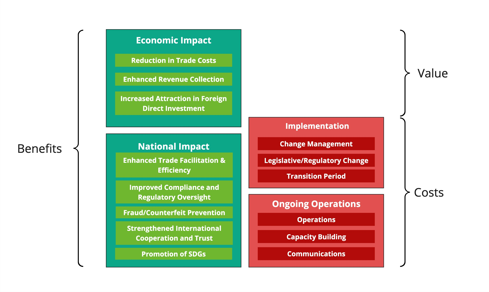

import Disclaimer from '../\_disclaimer.mdx';

<Disclaimer />

## Purpose

The purpose of this page is to provide a structured framework for building a quantified business case for UNTP implementation at the national or agency level. The cost/benefit model, benchmark data, and template below are designed so that any government agency or national trade body can combine them with their own trade and economic data to produce a customised business case — including with the assistance of AI tools.

The UNTP is supported by UNECE policy [Recommendation 49 — Transparency at Scale](https://unece.org/trade/documents/2024/07/session-documents/draft-recommendation-no-49-transparency-scale) that defines specific recommendations for member states that wish to reap the economic benefits of increased supply chain traceability, transparency, and trust.

We also provide a separate [cost/benefit model and business case template for industry](BusinessCaseIndustry.md).

Note: The economic impacts described in this document are projections based on available data and economic models. Actual results will vary depending on existing trade infrastructure, regulatory environment, and level of digitalisation. Regular monitoring through the UNTP [Impact Assessment Framework (IAF)](ImpactAssessmentFramework.md) is recommended.

## Government Cost Benefit Model

The high level model shown below breaks benefits into two categories (economic impact and national impact) and costs into two categories (implementation and ongoing operations).

- Benefits accrue through direct economic gains (trade cost reduction, improved revenue collection, increased investment) and broader national impacts (trade facilitation, compliance outcomes, fraud prevention, international cooperation, and SDG advancement).
- Costs are incurred through one-off implementation activities (change management, legislative reform, transition period) and ongoing operational expenditure (IT infrastructure, capacity building, communications).

## Benefits — Economic Impact

### Trade Cost Reduction

**Description** — Trade transaction costs — including documentation, border procedures, inspections, and administrative compliance — represent a significant drag on trade, particularly for developing countries where they can reach 10–15% of trade value. Digitalisation and standardisation of trade data can substantially reduce these costs, making domestic producers more competitive in international markets.

**How UNTP helps** — UNTP standardises the digital credentials (DPPs, DCCs, DTEs) that accompany goods across borders. Machine-readable, verifiable data replaces paper documentation and manual verification. This enables automated risk assessment, faster clearance, and reduced administrative overhead for both traders and customs authorities.

**Quantification** — Trade costs in developing countries average 10–15% of trade value; digitalisation through UNTP can reduce this by 2–5 percentage points. For a country with $10B in trade, this represents $200M–$500M in annual savings distributed across all trading entities. References: [WTO Trade Facilitation Agreement](https://www.wto.org/english/tratop_e/tradfa_e/tradfa_e.htm), [OECD trade cost estimates](https://www.oecd.org/trade/topics/trade-costs-and-trade-facilitation/).

**Key variables**

- Current trade costs as percentage of trade value
- Volume of international trade (imports + exports)
- Existing level of trade digitalisation
- Number and complexity of border agencies involved in clearance

### Enhanced Revenue Collection

**Description** — Customs revenue leakage through fraud, misclassification, and undervaluation is a significant fiscal challenge, particularly in developing countries where customs duties represent a major share of government revenue. Estimates suggest 5–10% of customs revenue is lost to various forms of non-compliance.

**How UNTP helps** — Verifiable Digital Product Passports provide customs authorities with trusted product data (origin, composition, value, classification) that can be cross-referenced against declarations. Digital Conformity Credentials from accredited bodies provide independent verification of claimed product attributes. This makes fraud detection more systematic and less reliant on physical inspection.

**Quantification** — 5–10% customs revenue leakage in developing countries; verifiable credentials can reduce leakage by 20–40%. Net improvement: 1–3% of total customs revenue. References: [WCO Revenue Package](https://www.wcoomd.org/), [IMF revenue mobilisation studies](https://www.imf.org/en/Topics/fiscal-policies/revenue-mobilization).

**Key variables**

- Total customs revenue (duties, taxes, fees)
- Estimated leakage rate (fraud, misclassification, undervaluation)
- Current inspection and verification capabilities
- Proportion of trade subject to preferential tariff arrangements

### Foreign Direct Investment

**Description** — Countries with transparent, predictable, and digitally enabled trade environments are more attractive to foreign investors. A well-functioning digital trade infrastructure signals regulatory maturity, reduced corruption risk, and lower cost of doing business — all factors that influence FDI decisions.

**How UNTP helps** — National UNTP implementation demonstrates commitment to international standards, transparent governance, and digital trade facilitation. This positions the country favourably in investment climate assessments such as the World Bank B-READY rankings. The verifiable nature of UNTP credentials also reduces due diligence costs for foreign investors evaluating local supply chains.

**Quantification** — Countries with advanced digital trade infrastructure attract 10–20% more FDI than comparable peers. The effect is strongest for manufacturing and agricultural FDI where supply chain transparency directly affects investment decisions. References: [World Bank B-READY](https://www.worldbank.org/en/programs/business-enabling-environment/b-ready), [UNCTAD World Investment Report](https://unctad.org/topic/investment/world-investment-report).

**Key variables**

- Current FDI inflows and trends
- Target sectors for FDI attraction
- Existing digital trade infrastructure maturity
- Regional competitive positioning

## Benefits — National Impact

### Trade Facilitation and Efficiency

**Description** — Border clearance times and inspection rates directly affect trade competitiveness and cost. Lengthy clearance procedures create delays, increase storage costs, damage perishable goods, and reduce the predictability that modern supply chains require. Risk-based targeting — focusing inspections on high-risk consignments — is more effective and less disruptive than blanket physical inspection.

**How UNTP helps** — UNTP credentials enable customs authorities to implement more effective risk-based targeting. Consignments accompanied by verifiable DPPs and DCCs can be assessed automatically, allowing pre-clearance for low-risk shipments and focusing inspection resources on genuinely high-risk consignments. Digital Traceability Events provide chain of custody evidence that supports origin verification.

**Quantification** — 10–15% reduction in average clearance times. 20–30% reduction in physical inspection rates through improved risk-based targeting — without reducing compliance effectiveness. References: [WTO TFA implementation studies](https://www.wto.org/english/tratop_e/tradfa_e/tradfa_e.htm), [WCO time release studies](https://www.wcoomd.org/).

**Key variables**

- Current average clearance times (hours/days)
- Current physical inspection rate
- Volume of border transactions per year
- Existing IT infrastructure at border posts

### Compliance and Regulatory Oversight

**Description** — Governments face an increasing burden of verifying that imported goods comply with sustainability regulations, product safety standards, and trade rules. Paper-based verification is slow, unreliable, and difficult to scale. Detection rates for non-conforming imports remain low in most jurisdictions.

**How UNTP helps** — Digital Conformity Credentials provide machine-verifiable evidence of compliance from accredited conformity assessment bodies. This enables automated screening of consignments against regulatory requirements, flagging non-conforming goods for inspection while clearing compliant goods faster. The verifiable nature of credentials makes document fraud significantly more difficult.

**Quantification** — 20–40% improvement in detection rates for non-conforming imports when using digital verification vs paper-based processes. This translates to better protection of domestic consumers, industries, and the environment. References: [WCO compliance studies](https://www.wcoomd.org/), EU customs risk management frameworks.

**Key variables**

- Volume and diversity of imports subject to regulatory requirements
- Current detection rates for non-conforming goods
- Number of regulatory requirements that apply at the border
- Existing capability for digital verification

### Fraud and Counterfeit Prevention

**Description** — Counterfeit and illicit goods represent an estimated 2–5% of imports globally, causing economic harm through lost tax revenue, unfair competition with legitimate producers, and risks to consumer health and safety. Certain product categories (pharmaceuticals, electronics, luxury goods) are disproportionately affected.

**How UNTP helps** — UNTP's verifiable product identity, linked through identity resolvers to Digital Product Passports issued by the legitimate manufacturer, enables customs authorities to verify product authenticity at the border. Digital Traceability Events provide chain of custody evidence that is difficult to forge. This makes it significantly harder for counterfeit goods to enter through legitimate trade channels.

**Quantification** — Counterfeit imports estimated at 2–5% of import value. Digital verification can reduce counterfeit penetration by 30–50% for product categories where verification is applied. Net benefit: 0.5–2% of import value for targeted product categories. References: [OECD/EUIPO counterfeit reports](https://www.oecd.org/en/topics/sub-issues/illicit-trade-in-counterfeit-goods.html).

**Key variables**

- Import value and composition (proportion in high-counterfeit categories)
- Current counterfeit detection capabilities
- Revenue loss from counterfeit imports (duties, taxes, legitimate market displacement)
- Consumer safety risk profile

### International Cooperation and Trust

**Description** — Mutual recognition of testing, inspection, and certification results between trading partners reduces duplicative compliance costs and trade friction. However, mutual recognition requires a foundation of trust in the integrity and verifiability of partner country credentials.

**How UNTP helps** — UNTP provides a common standard for digital credentials that enables mutual recognition without requiring bilateral negotiation of every credential type. Digital Conformity Credentials from accredited bodies in one country can be automatically verified and accepted by authorities in another, provided both operate within the UNTP framework. This strengthens bilateral and multilateral trade relationships.

**Quantification** — Qualitative: reduced trade friction, strengthened bilateral and multilateral relationships, improved positioning in trade negotiations. Mutual recognition agreements typically reduce compliance costs by 10–20% for affected product categories.

**Key variables**

- Number and value of existing mutual recognition agreements
- Key trading partner relationships and negotiation priorities
- Current duplication in compliance requirements across markets
- Participation in regional trade facilitation initiatives

### SDG Advancement

**Description** — The Sustainable Development Goals (SDGs) provide a shared framework for national development priorities. Transparent, verifiable supply chain data enables governments to measure and demonstrate progress toward SDG targets — particularly those related to responsible production and consumption, climate action, and decent work.

**How UNTP helps** — UNTP metrics and credentials map directly to SDG indicators, enabling data-driven measurement of national progress. Digital Product Passports contain sustainability metrics (emissions, labour practices, environmental impacts) that can be aggregated to national level. This moves SDG reporting from estimates to evidence-based measurement.

**Quantification** — UNTP metrics map to SDG indicators across goals 8 (decent work), 9 (industry and infrastructure), 12 (responsible production and consumption), 13 (climate action), 15 (life on land), and 17 (partnerships). Verifiable data enables more credible national SDG reporting. References: [UN SDG indicator framework](https://sdgs.un.org/goals).

**Key variables**

- National SDG priorities and targets
- Current SDG reporting maturity and data availability
- Alignment between trade sectors and priority SDG indicators
- International reporting commitments

## Costs — Implementation

### Change Management

**Description** — UNTP implementation requires coordination across multiple government agencies (customs, trade, environment, health, agriculture), stakeholder engagement with industry, and training of government personnel. The complexity depends on the number of agencies involved and the existing level of inter-agency coordination.

**How UNTP helps** — UNTP's modular design allows phased implementation, starting with a single agency or product category and expanding over time. The open standards approach reduces vendor lock-in and enables incremental capability building.

**Quantification** — $500K–$2M depending on government complexity, number of agencies involved, and existing coordination mechanisms. Includes stakeholder consultation, project management, and initial training programs.

**Key variables**

- Number of government agencies involved in border management
- Existing level of inter-agency coordination and shared IT systems
- Scale and complexity of the trading environment
- Availability of technical expertise within government

### Legislative and Regulatory Change

**Description** — Recognising digital credentials as legally equivalent to paper documents may require legislative or regulatory reform. Customs procedures, product safety regulations, and trade facilitation laws may need updating to accommodate digital verification. The timeline for legislative change varies significantly by jurisdiction.

**How UNTP helps** — UNTP aligns with existing international frameworks (WTO TFA, WCO data model, UN/CEFACT standards) which many countries have already committed to implement. This provides a policy foundation that can accelerate legislative change. Model regulatory language and implementation guides from UNECE reduce the policy development burden.

**Quantification** — 12–24 months legislative timeline depending on jurisdiction. $200K–$500K in policy development, legal drafting, and consultation costs. Can be reduced where existing e-commerce or digital trade legislation provides a foundation.

**Key variables**

- Existing legal framework for digital documents and e-signatures
- Legislative process complexity and timeline
- Political will and priority for digital trade reform
- Alignment with existing international commitments

### Transition Period

**Description** — During the transition from paper-based to digital verification, parallel systems must operate to accommodate trading partners at different levels of digital maturity. This creates a temporary cost premium as both old and new systems run simultaneously.

**How UNTP helps** — UNTP's design supports graceful degradation — digital credentials can coexist with paper processes during transition. The phased implementation approach means the transition period can be managed by product category or trading partner, reducing the scope of parallel operations at any given time.

**Quantification** — 12–36 months transition period. 10–20% premium over steady-state operational costs during transition due to parallel system operation and additional support requirements.

**Key variables**

- Trading partner digital readiness
- Scope of initial implementation (all trade vs specific categories)
- Existing IT infrastructure and modernisation plans
- Available support from international development partners

## Costs — Ongoing Operations

### Operations

**Description** — Ongoing operational costs include IT infrastructure for credential verification, identity resolver hosting, system maintenance, software licensing, and technical support. Scale depends on trade volume and the number of connected systems.

**How UNTP helps** — UNTP's open standards approach avoids proprietary platform lock-in and enables competitive procurement. Shared infrastructure (e.g. regional identity resolvers) can reduce per-country costs. Cloud-based deployment options reduce the need for on-premises infrastructure.

**Quantification** — $200K–$1M/year depending on trade volume, number of connected systems, and whether infrastructure is national or shared regionally. Typically decreases as a percentage of trade value as volumes increase.

**Key variables**

- Annual trade volume and transaction count
- Number of connected government and private sector systems
- Choice of infrastructure model (national vs regional/shared)
- Existing government IT operations budget

### Capacity Building

**Description** — Customs officers, trade compliance staff, and industry partners need ongoing training to effectively use digital verification tools and interpret UNTP credentials. Capacity building is highest in the first 3 years and declines as competencies become embedded.

**How UNTP helps** — UNTP provides standardised training materials and certification programs. The consistent credential format across all product categories means that training is transferable — officers trained on one product category can apply the same verification approach to others.

**Quantification** — 15–25% of initial implementation cost annually for the first 3 years, declining to 5–10% thereafter as competencies become embedded and training becomes part of standard onboarding.

**Key variables**

- Size of the customs and trade compliance workforce
- Existing digital skills baseline
- Staff turnover rate
- Availability of train-the-trainer programs

### Communications

**Description** — Public awareness campaigns, industry guidance documents, international reporting, and ongoing stakeholder engagement are necessary to drive adoption and maintain momentum. Effective communication is particularly important during the early adoption phase to build industry confidence.

**How UNTP helps** — UNTP provides template communications materials and case studies from early adopter countries. The [Community Activation Program (CAP)](CommunityActivationProgram.md) methodology provides a structured approach to industry engagement that governments can leverage.

**Quantification** — $100K–$300K/year for communications, industry guidance, and international reporting. Higher in the first 2–3 years during active adoption promotion, declining as UNTP becomes standard practice.

**Key variables**

- Size and diversity of the trading community
- Number of languages required
- Existing government communications infrastructure
- Level of industry awareness and readiness

## Government Business Case Template

A downloadable [business case template](../assets/files/UNTP-Business-Case-Template-Government.docx) with quantification summary table and narrative structure is available as a Word document. The template is designed to be populated using the benchmark ranges above combined with national trade and economic data — including with the assistance of AI tools as described below.

## Generate Your Own Business Case

You can use a frontier AI model (such as ChatGPT, Claude, or Gemini) to generate a first-draft business case for your country or agency. Upload your agency's annual report or strategic plan (PDF) alongside the prompt below. The AI will extract relevant trade and economic data, apply the UNTP benchmark ranges weighted to your country's specific profile, and produce a complete draft business case using the template above.

**Prerequisites:** This prompt requires a frontier AI model with a large context window (100K+ tokens) and the ability to process PDF attachments and fetch web content. You will likely need a professional-tier subscription (e.g. ChatGPT Plus/Pro, Claude Pro, Gemini Advanced) to handle the combined size of the agency report, country-level data, the UNTP cost/benefit framework, and the business case template in a single session.

**Important disclaimer:** The generated business case is only an initial draft. AI models may misinterpret economic data, apply benchmark ranges inappropriately, or make unfounded assumptions about your country's regulatory environment, institutional readiness, or trading partner dynamics. Trade statistics, customs revenue figures, and FDI data should be verified against official national sources. The output should be thoroughly reviewed and adjusted by trade policy experts and relevant agency officials before being used for any decision-making purpose.

**How to use:** Copy the prompt below, open your preferred AI assistant, attach your agency report or national trade strategy PDF, paste the prompt, and submit.

:::info[Business Case Generation AI Prompt]

You are preparing a first-draft UNTP business case for a national government. The agency report or national trade strategy attached provides institutional context. You should also draw on publicly available country-level data (trade statistics, customs revenue, FDI, World Bank indicators) to populate the financial model.

**Input documents**

1. **Agency report or national trade strategy** — attached PDF. Extract: country name, institutional structure, trade volumes, customs revenue, key export/import sectors, existing trade facilitation measures, digital infrastructure maturity, international commitments, and any mentions of sustainability regulations affecting national trade.

2. **Country-level public data** — use your knowledge and, where possible, fetch current data for the country from these sources:

   - Trade statistics (imports + exports by sector) from national statistics or [UN Comtrade](https://comtradeplus.un.org/)
   - Customs revenue from national budget or IMF data
   - FDI inflows from [UNCTAD](https://unctad.org/topic/investment/world-investment-report)
   - World Bank [B-READY](https://www.worldbank.org/en/programs/business-enabling-environment/b-ready) or Doing Business ranking
   - WTO [Trade Facilitation Agreement](https://www.wto.org/english/tratop_e/tradfa_e/tradfa_e.htm) implementation status
   - [OECD trade cost](https://www.oecd.org/trade/topics/trade-costs-and-trade-facilitation/) estimates for the country or region

3. **UNTP cost/benefit framework** — fetch from https://untp.unece.org/business-case/BusinessCaseGovernment and use the benchmark ranges for each benefit and cost category.

4. **Business case template** — fetch from https://untp.unece.org/assets/files/UNTP-Business-Case-Template-Government.docx and use this as the output structure. Fill in every section and every bracketed placeholder.

**How to weight each benefit category**

IMPORTANT: Always err on the side of conservatism. Use the lower end of each benchmark range unless there is strong, country-specific evidence to justify a higher figure. A credible business case with conservative estimates is far more useful than an optimistic one that loses credibility under scrutiny. When in doubt, round down. If evidence for a benefit category is weak or absent, use the minimum of the range or exclude it entirely.

Weight each benefit category based on the country's specific economic profile, institutional maturity, and trade structure:

- **Trade cost reduction** — weight HIGH for developing countries with trade costs above 10% of trade value, paper-based border processes, and low WTO TFA implementation. Weight LOW for developed countries with mature single windows and high TFA scores.
- **Revenue collection** — weight HIGH for countries where customs duties represent a significant share of government revenue (common in developing countries), and where audit data suggests material leakage. Weight LOW for developed countries with established compliance frameworks.
- **FDI uplift** — weight HIGH for countries actively competing for manufacturing or agricultural FDI, particularly where peer countries in the region are investing in digital trade infrastructure. Weight LOW for countries where FDI decisions are driven primarily by other factors (resource endowment, market size, labour costs).
- **Border efficiency** — weight HIGH for countries with long clearance times (days rather than hours), high physical inspection rates (>20%), and multiple uncoordinated border agencies. Weight LOW for countries with efficient, digitally enabled border processes.
- **Counterfeit prevention** — weight HIGH for countries with significant pharmaceutical, electronics, or luxury goods imports and limited detection capability. Weight LOW for countries with strong existing enforcement.
- **Compliance and regulatory oversight** — weight HIGH for countries facing new sustainability verification requirements (e.g. need to verify CBAM certificates, EUDR due diligence from trading partners). Weight MEDIUM for most trading nations.
- **Mutual recognition** — weight HIGH for countries actively negotiating trade agreements or regional integration. Weight LOW for relatively isolated trading economies.
- **SDG advancement** — weight HIGH for countries with strong SDG commitments and current data gaps. Weight LOW if SDG reporting is already mature.

For costs, adjust based on:

- **Country income level** — LDCs and developing countries typically face lower absolute costs (smaller workforce, fewer border posts) but may have less existing infrastructure to build on.
- **Existing digital infrastructure** — reduce costs significantly if the country already has a functioning single window, modern customs IT system (e.g. ASYCUDA World), or national identity infrastructure.
- **Development partner support** — reduce net costs if international development partners (World Bank, regional development banks, bilateral donors) are likely to provide technical and financial support.
- **Regional approach** — reduce costs if shared infrastructure (e.g. regional identity resolvers, shared verification platforms) is available or planned through regional integration bodies.

**Output requirements**

1. Populate the full template — every section, every table, every placeholder. Use actual data from the agency report and public sources where available; use informed estimates (with reasoning) where not.
2. In section 2.2 (Regulatory and Policy Context), map specific international regulations affecting the country's trade, with estimated trade values at risk. Also identify domestic policy alignment (WTO TFA status, UNECE Rec 49, regional agreements, national strategies).
3. In section 4.4 (Estimation Assumptions), assign a confidence level (H/M/L) to each benefit and explain your reasoning based on the country's specific data availability and institutional context.
4. In section 4.3 (Net Value and Payback), provide conservative, base case, and optimistic scenarios. Use benefit-cost ratio (not ROI) as the primary metric — this is standard for public sector investment appraisal.
5. In section 6 (Dependencies), assess the actual readiness of the country's institutions, trading partners, and domestic industry. Name specific agencies, systems, and international development partners.
6. In section 7 (Risk Analysis), pay particular attention to institutional and political risks (legislative reform delays, inter-agency coordination, political continuity, funding) — these typically outweigh technical risks in government implementations.
7. In Appendix A (Regulatory Alignment Matrix), map UNTP capabilities to the specific international agreements and frameworks the country is party to.
8. Throughout, show your working — explain why you chose a particular point in a benchmark range, citing specific evidence from the agency report, public data, or your knowledge of the country's economic context.

**Output format**

Download the business case template from https://untp.unece.org/assets/files/UNTP-Business-Case-Template-Government.docx and produce the output as a completed version of that Word document. Fill in every bracketed placeholder, populate every table, and replace all instructional text with country-specific content. The output should be a ready-to-review Word document that can be presented to a minister or budget authority without further formatting.

:::
