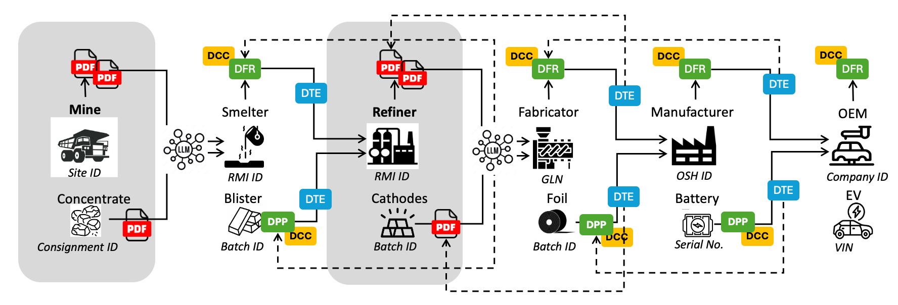
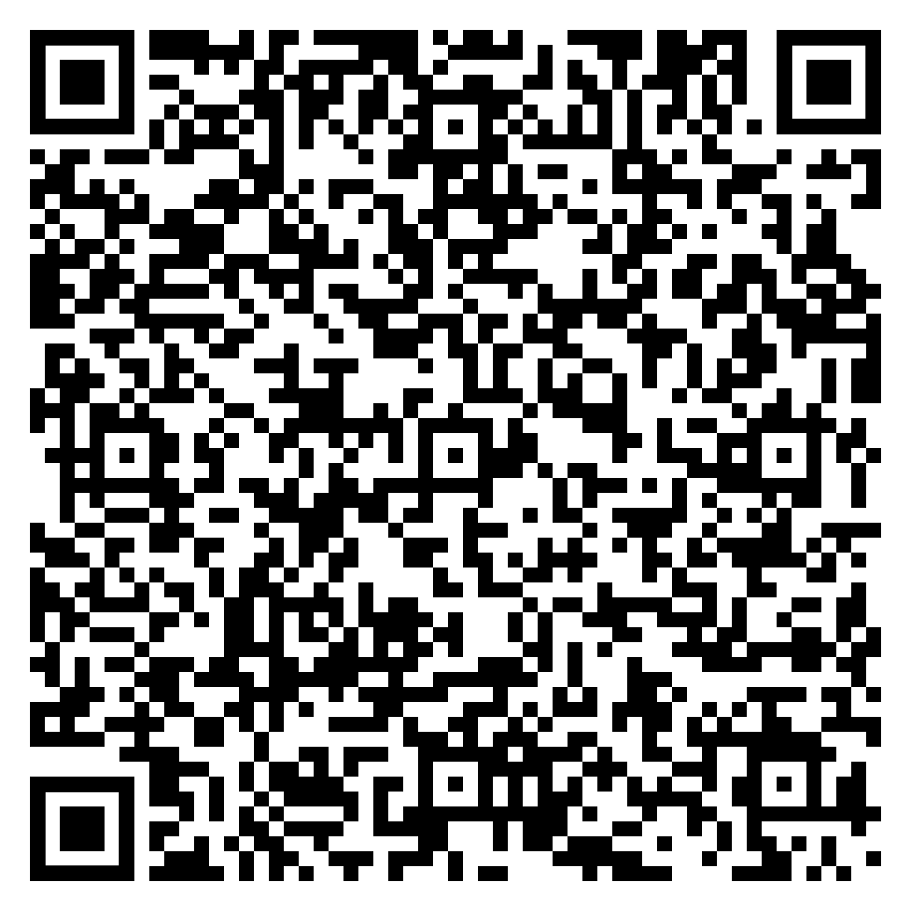

import Disclaimer from '../\_disclaimer.mdx';

<Disclaimer />

## Overview

The world will not transition from paper to digital overnight. For years — possibly decades — supply chains will operate with a mix of PDF documents, paper certificates, and digitally verifiable credentials. Every UNTP implementer faces the same reality: some upstream suppliers are not yet issuing verifiable digital data, and some downstream customers are not yet equipped to consume it. This page describes the challenges of this transition period and the UNTP design patterns that address them.

## Challenges

### Upstream: Unstructured Input Data

Most supply chain actors will encounter upstream suppliers that have not yet implemented UNTP. Their product and facility data arrives as PDF documents, scanned certificates, spreadsheets, or even paper records. This creates several problems for an implementer trying to build a [transparency graph](./TrustGraphs.md):

- **No machine-readable structure** — the data cannot be automatically loaded into a graph database or validated against business rules.
- **No cryptographic integrity** — PDF documents and paper certificates are trivially easy to fake with modern AI tools. There is no digital signature to verify authenticity.
- **No consistent discovery** — unlike UNTP credentials that are discoverable via [identity resolvers](../specification/IdentityResolver.md), unstructured data arrives through ad-hoc channels (email, portals, physical mail) with no standardised way to check for updates.
- **No entity linking** — a PDF certificate might refer to "Copper mining facility seven" while the graph knows the same facility as ID `https://someregister/facilities/5558880000030`. Without structured identifiers, linking data across credentials is manual and error-prone.

### Downstream: Customers Not Ready for Digital

At the other end, an implementer that issues UNTP digital credentials may find that some customers cannot process them. A small retailer scanning a QR code on a product expects to see something human-readable — not a JSON-LD document. If digital credentials are only machine-readable, they create a barrier to adoption rather than removing one. The challenge is to issue credentials that serve both technically advanced verifiers running automated compliance checks and less technical actors who need a simple, readable document.

## Solution

### Ingesting Unstructured Data with AI

For upstream suppliers that have not yet implemented UNTP, the recommended approach is to use AI (Large Language Models) to transform unstructured data into graph-compatible linked data — but to **flag that data as unverified**.

The diagram shows a case where the mine-site and the refiner have not implemented UNTP and are producing PDF documentation. The smelter and fabricator use an LLM to transform the PDF data into UNTP-structured linked data before loading it into their transparency graph. This means the same algorithmic assessments and validation rules can run across the entire graph, but portions derived from unstructured sources will be marked as lower integrity — warranting sample-based human review or traditional auditing.

There are important considerations for this approach:

- **Entity matching** — UNTP depends on globally unique identifiers to link data. A PDF document might refer to a facility by a different name than the graph uses. LLMs are well suited to matching similar entities, so implementers should follow [GraphRAG](https://en.wikipedia.org/wiki/Retrieval-augmented_generation) best practices: first ask the LLM to extract and match entities against existing graph nodes, then transform the data using matched identifiers.
- **Discovery** — The [Identity Resolver](../specification/IdentityResolver.md) need not be limited to discovering UNTP credentials. It can also make PDF product or facility data consistently discoverable. Even before implementing UNTP credentials, there is value in making existing data discoverable via an identity resolver — this standardises how downstream actors find and refresh your data.
- **Integrity** — AI cannot generate valid cryptographic signatures. Unstructured data ingested via LLM should be treated as unverified and clearly flagged in the graph. Implementers should plan to transition suppliers from PDF documents to digitally signed credentials over time.

In the diagram above, the mine-site passes unstructured data to the smelter via an unmanaged channel, so the smelter must manually request updates and cannot be sure the data is genuine. However the refiner, although still exchanging unstructured data, publishes it through an identity resolver — so the fabricator can be confident it is genuine refiner data and can automate the discovery and update process.

### Human and Machine Readable Credentials

The solution to the downstream challenge is straightforward: **every UNTP credential is designed to be both human-readable and machine-readable**. This is achieved through two mechanisms built into the [Verifiable Credentials Profile](../specification/VerifiableCredentials.md):

- **Render templates** — Every UNTP credential SHOULD include a `renderMethod` property that defines an HTML template for human-readable rendering. When a person scans a QR code on a product, the credential can be displayed as a nicely formatted document — complete with logos, claims, and assessment results — without any specialised software.
- **Hosted verifier links** — Credentials can include a link to a hosted verification service. A low-maturity actor simply clicks the link and sees a verified, human-readable document in their browser. A high-maturity actor processes the raw credential data programmatically.

A good analogy is the modern passport. It is a paper document with a photo page that humans inspect — but it also contains an embedded chip that smart gates read automatically. Both the border officer and the automated gate use the same passport; they just consume it differently. UNTP credentials follow exactly the same pattern — a consumer with a phone sees a rendered, human-readable product passport, while a compliance system ingests the structured JSON-LD data and loads it into a transparency graph for automated verification. There is no need for separate "paper" and "digital" versions. A single credential serves all maturity levels.

Related design patterns cover other aspects of data sharing that are not specific to the paper-to-digital transition: [Variant-Based Disclosure](./VariantBasedDisclosure.md) addresses how to serve different data to different consumer roles (regulators, buyers, public), and [Mass Balance](./MassBalance.md) covers upstream confidentiality and audited transparency for supply chain traceability.

### Transition Maturity Levels

The table below illustrates how a single product (a battery) might be represented at different stages of the paper-to-digital transition.

| Maturity Level                              | Upstream Data                                             | Downstream Output                             | Graph Quality                                       |
| ------------------------------------------- | --------------------------------------------------------- | --------------------------------------------- | --------------------------------------------------- |
| **Level 1** — Paper only                    | PDF certificates from mine and refiner, received by email | Paper certificate shipped with goods          | No graph — manual review only                       |
| **Level 2** — Discoverable but unstructured | PDFs published behind identity resolvers                  | PDF discoverable via QR code on product       | Partial graph — AI-ingested, flagged as unverified  |
| **Level 3** — Mixed credentials             | UNTP credentials from refiner, PDFs from mine             | UNTP credential with render template          | Mostly verified graph — unverified portions flagged |
| **Level 4** — Fully digital                 | UNTP credentials from all upstream suppliers              | UNTP credential consumed by automated systems | Fully verified transparency graph                   |

Most implementers will operate at Level 2 or 3 for an extended period. The key insight is that **every level is useful** — even AI-ingested unstructured data in a graph provides more actionable compliance intelligence than unconnected PDF files in email inboxes.

## Examples

### Human and Machine Readable Credential

The sample below is a UNTP Digital Product Passport issued as a verifiable credential. The URL (or QR scan) resolves to a hosted verifier that displays a human-readable version. Raw JSON data can be viewed via the `JSON` tab and the full credential can be downloaded via the download button.

| URL                                                                                                                                                                                                                             | QR                                             | Description                                                                                                                                                                                                                                             |
| ------------------------------------------------------------------------------------------------------------------------------------------------------------------------------------------------------------------------------- | ---------------------------------------------- | ------------------------------------------------------------------------------------------------------------------------------------------------------------------------------------------------------------------------------------------------------- |
| [Sample Digital Battery Passport](https://untp.showthething.com/verify/?q=%7B%22payload%22%3A%7B%22uri%22%3A%22https%3A%2F%2Funtp-verifiable-credentials.s3.amazonaws.com%2Fbc075c5f-2304-4b3f-bb24-46d9fa9a8e60.json%22%7D%7D) |  | A sample digital battery passport as a JWT-signed Verifiable Credential. Scanning the QR code or clicking the link opens the same credential in a hosted verifier — a human sees a rendered passport, while a machine can consume the raw JSON-LD data. |

### AI-Assisted Mapping of Unstructured Data

Given a well-documented UNTP vocabulary, credential schema, conformity topic taxonomy, and identifier scheme register, it is feasible to produce fully compliant UNTP data from unstructured sources and add it to a transparency graph. There are a number of commercial products that specialise in this kind of structured data extraction, but anyone can test the feasibility for themselves. Simply find a publicly available independent audit report (to map to a UNTP conformity credential) or a product brochure with an environmental product declaration (to map to a UNTP product passport), and use a prompt similar to the following in your preferred AI assistant:

> _"Using the attached audit report, create a UNTP Digital Conformity Credential JSON instance that complies with the guidance and JSON schema at https://untp.unece.org/docs/specification/ConformityCredential and the conformity topic taxonomy at https://untp.unece.org/docs/specification/CoreTaxonomies. Map any identifiers found in the document to well-structured globally unique identifiers using the identifier scheme guidance at https://untp.unece.org/docs/implementations/Registers"_

The results are typically surprisingly good — demonstrating that the barrier to transforming existing unstructured supply chain data into graph-compatible UNTP credentials is lower than most implementers expect. The identifier mapping step is particularly important because it ensures that entities extracted from unstructured sources can be linked to existing nodes in the transparency graph rather than creating disconnected duplicates.
