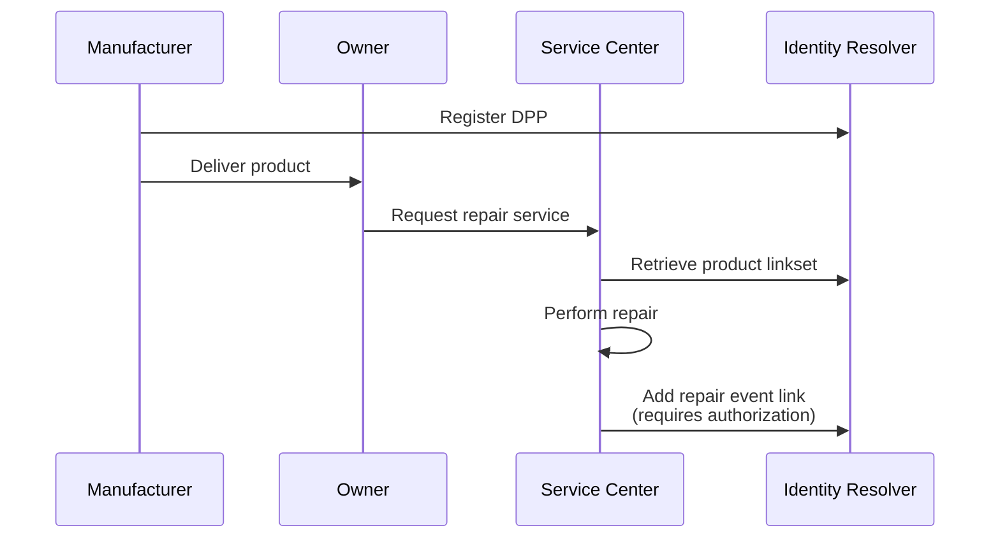

import Disclaimer from '../\_disclaimer.mdx';

<Disclaimer />

## Overview

[Digital Product Passports (DPPs)](../specification/DigitalProductPassport.md) are typically issued at the point of manufacture, capturing critical information about materials, provenance, and sustainability attributes. However, a product's lifecycle extends far beyond the factory gate - through retail, consumer use, repairs, maintenance, refurbishment, and eventual end-of-life processing. This design pattern addresses how to add verifiable post-sale lifecycle data to products without modifying the original DPP.

## Challenges

Consider a battery manufactured in 2026 with an accompanying DPP issued by the manufacturer. Nine years later in 2034:

- The battery requires repair at an authorized service center
- The original manufacturer may have been acquired, restructured, or ceased operations
- The current owner needs to document the repair event for warranty, compliance, or resale purposes
- Downstream buyers need access to the complete maintenance history

The approach of re-issuing DPPs creates problems:

- **Loss of provenance:** Original manufacturing data becomes disconnected or suspect
- **Authorization challenges:** Who has the authority to re-issue credentials for products they didn't manufacture?
- **Fragmentation:** Multiple competing "versions" of a products history may emerge
- **Verification complexity:** How do verifiers know which version is authoritative?

## Solution

UNTP solves this problem through the **[Identity Resolver](../specification/IdentityResolver.md) pattern**: maintain an **immutable original [DPP](../specification/DigitalProductPassport.md)** while enabling multiple authorized parties to add lifecycle events as new linked credentials. This approach:

- Preserves integrity and verifiability of the original DPP
- Enables distributor custody (different parties contribute data through various lifecycle stages)
- Maintains a complete, verifiable audit trail
- Works even when the original manufacturer is no longer operating

### Key Design Principles

#### Never Modify the Original DPP

The DPP issued by the manufacturer represents a cryptographically signed statement about the product at a specific point in time. Modifying it would:

- Invalidate the original signature
- Undermine trust in the manufacturing data
- Create ambiguity about what changed and when

**Principle:** The original DPP remains immutable and always accessible as the canonical manufacturing record.

#### Use Identity Resolver for Link Management

The [Identity Resolver](../specification/IdentityResolver.md) serves as the discovery mechanism for all credentials related to a product identifier. Instead of modifying the DPP, authorized parties add new links to the resolver.

##### Example linkset structure

```json
{
  "identifier": "01/09520123456788/21/12345",
  "linkset": [
    {
      "anchor": "01/09520123456788/21/12345",
      "itemDescription": "Industrial Battery Model X-200",
      "links": [
        {
          "type": "application/vc+ld+json",
          "linkType": "verifiableCredential",
          "rel": "productPassport",
          "href": "https://manufacturer.example/dpp/abc123",
          "title": "Original Digital Product Passport",
          "hash": "sha256-a8f7d...",
          "controlParty": "did:web:manufacturer.example",
          "created": "2025-03-15T10:00:00Z"
        },
        {
          "type": "application/vc+ld+json",
          "linkType": "verifiableCredential",
          "rel": "traceabilityEvent",
          "href": "https://retailer.example/dte/sale-456",
          "title": "Sale to End Customer",
          "hash": "sha256-b9e8c...",
          "controlParty": "did:web:retailer.example",
          "created": "2025-06-20T14:30:00Z"
        },
        {
          "type": "application/vc+ld+json",
          "linkType": "verifiableCredential",
          "rel": "traceabilityEvent",
          "href": "https://service-center.example/dte/repair-789",
          "title": "Battery Cell Replacement - 2034-01-15",
          "hash": "sha256-c1f9d...",
          "controlParty": "did:web:service-center.example",
          "created": "2034-01-15T11:00:00Z",
          "previousEvent": "https://retailer.example/dte/sale-456"
        }
      ]
    }
  ]
}
```

#### Enable Clear Authorization Roles

Not everyone should be able to add lifecycle events to a product. The Identity Resolver must enforce policies to ensure only authorized parties can add links.

**For detailed information on authorization and authentication mechanisms for adding links, see the [Decentralised Access Control](../specification/DecentralisedAccessControl.md) specification.** This specification describes how parties can prove their authorization to add lifecycle events through mechanisms such as shared secrets, DID authentication, and role-based access control.

## Examples

**Scenario:** Battery repair after 9 years

**Actors**:

- **Manufacturer:** (`did:web:battery-corp.example`) - Originally produced the battery in 2025
- **Retailer:** (`did:web:electronics-store.example`) - Sold battery to end customer in 2025
- **Owner:** (`did:web:owner.example`) - Purchased battery in 2025, uses it for 9 years
- **Service Center:** (`did:web:service-center.example`) - Performs repair in 2034
- **[Identity Resolver](../specification/IdentityResolver.md):** (`https://id.example/01/09520123456788/21/12345`) - Discovery service

**Workflow:**



:::info Authorization and Authentication
When adding lifecycle event links to the Identity Resolver, parties must prove their authorization. The [Decentralised Access Control](../specification/DecentralisedAccessControl.md) specification defines the mechanisms for authentication and authorization, including shared secrets, DID authentication, and role-based access control. Implementers should refer to that specification for detailed guidance on how to authorize parties to add links.
:::

### Roadmap

- Explore the use of cryptographic links between lifecycle events to create a verifiable chain.
- Document how archival of [Identity Resolver](../specification/IdentityResolver.md) operators can be handled.
