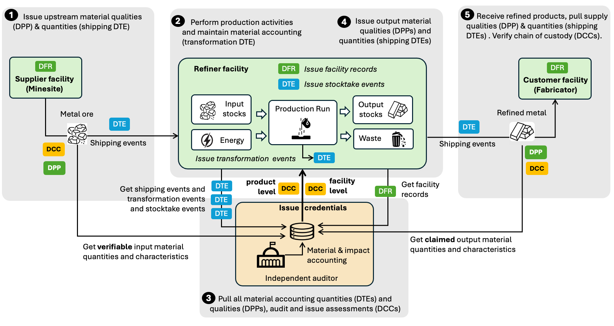

import Disclaimer from '../\_disclaimer.mdx';

<Disclaimer />

## Overview

Chain of custody refers to the documented, end-to-end record of how a product or material moves and is transformed from origin to final use. Its purpose is to provide traceability and integrity, proving where something came from, what happened to it, and who was responsible at each step. There are several well-understood chain of custody models, each balancing operational practicality against assurance strength:

| Model              | Physical Separation     | Claim Strength | Description                                                                                                 |
| ------------------ | ----------------------- | -------------- | ----------------------------------------------------------------------------------------------------------- |
| Identity Preserved | Strict (single source)  | Strongest      | Exact certified source remains unblended throughout the chain                                               |
| Segregated         | Strict (certified only) | Strong         | Certified materials from multiple sources may be combined but never mixed with non-certified                |
| Mass Balance       | Mixing allowed          | Moderate       | Qualifying and non-qualifying materials may be mixed; output claims limited to qualifying input proportions |
| Book and Claim     | Fully decoupled         | Market-driven  | Sustainability attributes traded as credits, independent of physical product flow                           |

This page focuses on the **mass balance** model, which is the most common approach for bulk commodities and complex supply chains where physical segregation is impractical or cost-prohibitive. Book and Claim is covered in a separate page.

## Challenges

The [transparency graphs](TrustGraphs.md) page describes how data in UNTP credentials can be assembled to construct a verifiable digital twin of a supply chain — linking products to the facilities that made them and, via traceability events, to the upstream materials used in manufacturing. However, it does not address how to verify that the sustainability claims on output products are actually supported by the input materials and production processes. This is the domain of mass balance chain of custody.

### Are Output Claims Matched by Inputs?

Consider these concrete scenarios:

- **Organic cotton fabric** — A buyer purchases certified organic and fair-work cotton fabric from a weaver. The weaver can show evidence of some upstream purchases of certified raw cotton. But how can the buyer be sure that the fabric does not include mixed non-compliant cotton? If the weaver buys 40% certified organic cotton and 60% conventional, only 40% of output fabric should carry the organic claim.
- **Low-carbon steel** — A buyer of low-carbon steel products needs confidence that the claimed emissions intensity is matched by purchases of low-emissions ore by the refiner. If the refiner blends ore from multiple sources with different carbon footprints, the output emissions claim must reflect the weighted average of actual inputs, not a cherry-picked best case.
- **Certified mineral sourcing** — A copper smelter claims that its refined copper comes from 100% certified mines. But does the smelter actually source sufficient certified copper concentrate to back that claim across all its output, or is it re-using certificates from a small certified supply to cover a much larger uncertified volume?

More generally, the challenge is to verify that the **totality of output performance claims from a facility are matched by input material and production process performance metrics**. Mass balance fraud happens when actors buy small quantities of high-integrity inputs but claim much larger volumes of sustainable outputs. Without facility-level material accounting, this is undetectable.

### Commercial Confidentiality

A further and very important constraint is that, for a buyer to satisfy themselves that their supplier has appropriate mass balance controls, the buyer would need full visibility of **all** facility inputs, outputs, and production processes — including supply volumetrics, yield rates, and stock levels. This data is almost always commercially sensitive. Facilities will not publish their production volumes, supplier relationships, or material accounting ledgers for competitors to see.

This creates a fundamental tension: mass balance verification requires comprehensive facility-level data, but that data is too commercially sensitive to share openly. Any viable solution must resolve this tension — enabling trustworthy verification without requiring public disclosure of commercial secrets.

## Solution

UNTP addresses the mass balance challenge through facility-level material accounting anchored in the same credentials used for transparency graphs, combined with privacy-preserving audit mechanisms that resolve the confidentiality tension.

### Facility-Level Material Accounting

UNTP material accounting follows the same fundamental logic as financial accounting:

| Financial Accounting | UNTP Material Accounting                                                                                                 |
| -------------------- | ------------------------------------------------------------------------------------------------------------------------ |
| Chart of accounts    | Digital Product Passports (DPPs) describe characteristics and intensity metrics of identified input and output materials |
| Balance sheet        | Digital Traceability Events (DTEs) with bizStep "stocktake" record material stocks at a point in time                    |
| Ledger transactions  | DTEs with bizStep "shipping" or "transformation" account for input/output flows and production runs                      |
| Audited accounts     | Digital Conformity Credentials (DCCs) carry independently audited conformance and verified intensity metrics             |
| Facility conformity  | Digital Facility Records (DFRs) carry facility-level conformity claims, certifications, and quality metrics              |

The core principle is **conservation**:

```
Opening stock
  + inbound flows
  - outbound flows
  ± production transformations
= closing stock
```

This applies to mass, volume, or count and forms the foundation for all higher-level sustainability claims. Just as double-entry accounting makes financial fraud difficult by requiring transactions to balance, material accounting makes greenwashing difficult by requiring physical quantities to reconcile.

It is worth noting that the accounting analogy, whilst valuable, may imply an accuracy that exists in financial accounting but does not in material accounting, and even less in impact accounting. Material stocks and flows must allow for waste and losses, and emissions intensity calculations must allow for inaccuracies in reported intensities. UNTP allows for claims and assessments to report metrics together with an estimate of accuracy.

### Supporting All Production Models

Industrial processes fall into three broad categories, each producing a different but conceptually equivalent type of production record:

- **Discrete Manufacturing** produces individually serialised items (vehicles, machinery, electronics). The canonical record is the **as-built record** documenting actual components and processes for a specific serialised product.
- **Batch Manufacturing** processes identified inputs to produce identified outputs via discrete production batches (food processing, chemicals, refining). The canonical record is the **batch record**.
- **Continuous Production** produces a stream of output materials from a continuous stream of inputs (mining, oil production, bulk chemicals). The boundary is typically a time period, and the canonical record is the **production run record**.

All three record types are specialisations of a production record and differ only in how boundaries are defined (serial number, batch ID, or time window). All are represented as transformation event DTEs with quantity inputs and outputs.

### Separating Facts from Policy Claims

This approach separates **underlying material accounting** (facts about what physically happened) from **policy-driven claims** (assertions about sustainability attributes). This separation allows the same material accounting facts to support different chain of custody assessments. For example, when a facility records input material identity and quantity for every production run, the same records support:

- **Segregated chain of custody** — if all inputs for a given run meet the policy criteria claimed for the output
- **Mass balance chain of custody** — if the average of all inputs to multiple production runs matches the average of all outputs over a given period

The same separation facilitates multiple impact assessments from the same data. For example, given a shipment of 100 tonnes of copper ore with a DPP stating 2 tCO₂e/tonne ore and 25% copper concentration, the emissions intensity per tonne of contained copper is 2 ÷ 0.25 = 8 tCO₂e/tonne Cu.

### Aligning with Natural Industrial Processes

UNTP does not require facilities to change their manufacturing processes or record-keeping systems. No UNTP credential should carry information not reasonably available in production management systems at the time of issue:

- **Material flows** between facilities are recorded using shipping manifests — logistics-level flow records that production management systems already create.
- **Production runs** record consumption of inputs and creation of outputs — data that all production management systems maintain.
- **Facility stocks** record point-in-time inventory — running balances verified via periodic physical stock-takes.
- **Product records** define characteristics and intensity metrics of identified material types.

UNTP credentials map naturally to these records: DTEs carry flow information (shipping, transformation, stocktake events), DPPs carry material characteristics and intensity metrics, and DFRs carry facility-level conformity claims.

### Privacy-Preserving Verification

Most facilities will not provide public transparency into their internal production stocks and flows. Yet all facilities should operate on a level playing field where genuine commercial confidentiality concerns cannot be used to hide non-compliant behaviour. The answer is that facilities share their material accounting information with at least one trusted independent party, but not necessarily with everyone.

A key advantage of digital and verifiable source data is reduced auditing cost through increasingly automated algorithmic auditing. This permits every actor to choose an appropriate level of transparency vs confidentiality:

- **Random sample-based audits** — A facility maintains internal records using UNTP DTEs. All relevant material accounting data for a production period is grouped and signed as an evidence bundle, and only the hash is shared to support self-assessed claims. External auditors can request random bundles, verify the hash, and confirm claims via a DCC.
- **Outsourced continuous audit** — A facility streams all internal DTEs to a trusted external auditor who issues DCCs to back claims in DPPs and DFRs.
- **One-up-one-down verification** — Facilities share material accounting data only with direct customers, who do not share it further downstream.
- **Full public transparency** — Some businesses may choose full openness as a competitive advantage.

In all these models, the actual material accounting data and how it is embedded into credentials is the same. The only difference is **who** it is shared with.

### How Credentials Work Together

The diagram shows an overview of credential flows for a refiner facility seeking to provide chain of custody compliance assurance to its customers without revealing commercial sensitivities.



**Process flow:**

1. A supplier facility (e.g., a mine-site) ships material with a shipping manifest (DTE) listing material identifiers and quantities. The mine has also issued a DPP for each material and may include conformity assessments (DCCs). Following the UNTP identity resolver standard, the DPPs and DCCs are discoverable from material identifiers in the shipping manifest.
2. The refiner receives the inbound shipment. The inbound material may be mixed with other supplies of different qualities. The facility performs production runs and records quantities of input materials consumed and output materials produced as transformation event DTEs. The facility also performs periodic stock-takes recorded as stocktake event DTEs.
3. An external auditor (which, if all source data is digital, could be an algorithmic service) receives all stock and flow data (DTEs), pulls the DPPs for each identified material, verifies material accounting (balancing material mass), calculates impacts (e.g., emissions intensity), and issues DCCs at product and facility level.
4. The facility issues DPPs with declared product characteristics and intensity metrics and DFRs with facility-level conformity claims. The facility adds the DCCs from the independent auditor as verifiable support. A shipment of refined product is prepared for a customer with a shipping manifest listing identifiers and quantities.
5. The customer receives the shipment and can pull DPPs, DCCs, and DFRs that provide verifiable confidence in the qualities claimed — without needing to see the facility's internal production data. The receiving facility is now in the same position as step 1, and the process repeats.

**Criterion alignment:** Each assessment criterion in DPPs and DFRs has a unique `criterion.id`. When an auditor issues a DCC, the DCC's assessment criteria reference these same IDs, creating a verifiable link between facility claims and auditor verification.

### Fraud Resistance

Fraud in chain of custody claims will disadvantage legitimate actors and lead to a collapse in trust. When there is material value (higher prices or reduced taxes) attached to performance claims, there will be incentives to make fraudulent claims.

If all stocks and flows are digitally signed by responsible parties, time-ordered and immutable, and counterparty-anchored (suppliers sign outbound, receivers sign inbound), then mass-balance assurance becomes an **algorithmic audit problem** rather than requiring constant physical site inspections. An independent audit service can collect stock positions, gather all signed inbound and outbound flows, collect production records, apply conservation rules, and check for temporal consistency, counterparty consistency, impossible negative balances, and outputs exceeding possible inputs.

Key fraud countermeasures include:

- **Multi-party reconciliation** — Collusion is easiest pairwise but becomes fragile when third parties are involved. If A and B collude, they must ensure downstream buyer C's records also reconcile, scaling collusion to many actors.
- **Time-based plausibility constraints** — Material moves and transforms at finite rates. Fabricated flows often violate equipment capacity, transport time, or yield constraints.
- **Statistical anomaly detection** — Analysis of yield variance vs peers, suspiciously consistent loss rates, perfect reconciliation over long periods (real operations have noise), and sudden step changes aligned across facilities.
- **Independent anchoring points** — Transport operators signing manifests, weighbridge operators issuing signed weights, port intake records, and utility-based production constraints all break closed-loop fabrication.
- **Randomised physical audits** — Algorithmic audit runs continuously; facilities are randomly selected for spot checks weighted by anomaly scores. This is exactly how tax audits work.
- **Liability and counterparty risk linkage** — Audit failures propagate risk flags to connected parties; certifications or market access can be suspended.

The goal is not to make collusion impossible but to make it expensive, risky, fragile, and commercially dangerous. This is the same standard financial systems operate under.

## Examples

This section provides UNTP v0.7.0 credential examples for a copper supply chain demonstrating mass balance material accounting. The actors are:

- **Copper Mine** (`did:web:sample-mine.example.com`) — produces copper ore concentrate in Zambia
- **Refinery** (`did:web:sample-refinery.example.com`) — smelts and refines to LME Grade A copper cathode in Japan
- **Battery Factory** (`did:web:sample-battery.example.com`) — manufactures battery components in Germany

### Example 1: DPP for Input Ore

**Purpose:** Identity and characteristics (accounting analogy: chart of accounts)

A DPP identifies a product or material and declares intrinsic properties and performance claims — it does **not** assert quantity or location. DPPs are reusable references across facilities, shipments, and production records.

```json
{
  "@context": [
    "https://www.w3.org/ns/credentials/v2",
    "https://vocabulary.uncefact.org/untp/0.7.0/context/"
  ],
  "type": ["DigitalProductPassport", "VerifiableCredential"],
  "id": "https://credentials.sample-mine.example.com/dpp/cu-conc-2025",
  "issuer": {
    "type": ["CredentialIssuer"],
    "id": "did:web:sample-mine.example.com",
    "name": "Sample Copper Mine Pty Ltd"
  },
  "validFrom": "2025-03-01T00:00:00Z",
  "name": "Digital Product Passport — Copper Concentrate (Cu 30%)",
  "credentialSubject": {
    "type": ["Product"],
    "id": "https://id.sample-mine.example.com/product/cu-conc-2025",
    "name": "Copper Concentrate (Cu 30%)",
    "idGranularity": "model",
    "modelNumber": "SM-CU-CONC-30",
    "batchNumber": "2025-Q1-4501",
    "producedAtFacility": {
      "id": "https://facility-register.example.com/fac-001",
      "name": "Sample Copper Mine"
    },
    "countryOfProduction": {
      "countryCode": "ZM",
      "countryName": "Zambia"
    },
    "materialProvenance": [
      {
        "name": "Copper ore",
        "originCountry": {
          "countryCode": "ZM",
          "countryName": "Zambia"
        },
        "massFraction": 0.3,
        "recycledMassFraction": 0
      }
    ],
    "performanceClaim": [
      {
        "type": ["Claim"],
        "id": "https://sample-mine.example.com/claims/product-carbon-2025",
        "name": "Product Carbon Footprint — Copper Concentrate",
        "conformityTopic": {
          "type": ["ConformityTopic"],
          "id": "https://vocabulary.uncefact.org/conformity-topic/greenhouse-gas-emissions",
          "name": "Greenhouse Gas Emissions"
        },
        "claimedPerformance": [
          {
            "metric": {
              "id": "https://vocabulary.uncefact.org/performance-metric/product-carbon-footprint",
              "name": "Product Carbon Footprint"
            },
            "measure": {"value": 2.1, "unit": "KGM"}
          }
        ]
      }
    ]
  }
}
```

**Key observations:** The `credentialSubject` is a `Product` (not a wrapper). Uses `performanceClaim` with `claimedPerformance` containing metric references from the UNTP performance metrics vocabulary. Declares intensities, not absolute quantities.

### Example 2: DFR for Facility Conformity

**Purpose:** Facility-level certifications, material usage, and performance claims (accounting analogy: corporate certifications)

A DFR identifies a facility and declares certifications, material usage, and performance claims. The `materialUsage` property records aggregate material consumption over a reporting period — this is the facility-level "balance sheet" data that supports mass balance verification.

```json
{
  "@context": [
    "https://www.w3.org/ns/credentials/v2",
    "https://vocabulary.uncefact.org/untp/0.7.0/context/"
  ],
  "type": ["DigitalFacilityRecord", "VerifiableCredential"],
  "id": "https://credentials.sample-refinery.example.com/dfr/smelter-002",
  "issuer": {
    "type": ["CredentialIssuer"],
    "id": "did:web:sample-refinery.example.com",
    "name": "Sample Copper Refinery Co. Ltd"
  },
  "validFrom": "2025-01-15T00:00:00Z",
  "validUntil": "2028-01-15T00:00:00Z",
  "name": "Digital Facility Record — Sample Copper Refinery",
  "credentialSubject": {
    "type": ["Facility"],
    "id": "https://facility-register.example.com/fac-002",
    "name": "Sample Copper Refinery",
    "countryOfOperation": {
      "countryCode": "JP",
      "countryName": "Japan"
    },
    "processCategory": [
      {
        "code": "41521",
        "name": "Unwrought copper",
        "schemeID": "https://unstats.un.org/unsd/classifications/Econ/cpc/",
        "schemeName": "UN Central Product Classification (CPC)"
      }
    ],
    "relatedParty": [
      {
        "role": "owner",
        "party": {
          "type": ["Party"],
          "id": "did:web:sample-refinery.example.com",
          "name": "Sample Copper Refinery Co. Ltd"
        }
      }
    ],
    "materialUsage": {
      "applicablePeriod": {
        "startDate": "2024-01-01",
        "endDate": "2024-12-31"
      },
      "materialConsumed": [
        {
          "name": "Copper concentrate",
          "originCountry": {
            "countryCode": "ZM",
            "countryName": "Zambia"
          },
          "massFraction": 0.85,
          "mass": {"value": 420000000, "unit": "KGM"},
          "recycledMassFraction": 0
        }
      ]
    },
    "performanceClaim": [
      {
        "type": ["Claim"],
        "id": "https://sample-refinery.example.com/claims/ghg-2024",
        "name": "GHG Emissions — Scope 1",
        "conformityTopic": {
          "type": ["ConformityTopic"],
          "id": "https://vocabulary.uncefact.org/conformity-topic/greenhouse-gas-emissions",
          "name": "Greenhouse Gas Emissions"
        },
        "claimedPerformance": [
          {
            "metric": {
              "id": "https://vocabulary.uncefact.org/performance-metric/scope-1-ghg-emissions",
              "name": "Scope 1 GHG Emissions"
            },
            "measure": {"value": 120000, "unit": "TNE"}
          }
        ]
      }
    ]
  }
}
```

**Key observations:** The `credentialSubject` is a `Facility` directly. Uses `materialUsage` to report aggregate material consumption for the reporting period. Uses `performanceClaim` with `claimedPerformance` for facility-level metrics. The `relatedDocument` array (not shown) links to the Coppermark DCC.

### Example 3: DTE Move Event (Shipping)

**Purpose:** Material flows between facilities (accounting analogy: ledger transactions)

A `MoveEvent` records the physical movement of materials between facilities. It uses `movedProduct`, `fromFacility`, and `toFacility` to describe what moved and where.

```json
{
  "@context": [
    "https://www.w3.org/ns/credentials/v2",
    "https://vocabulary.uncefact.org/untp/0.7.0/context/"
  ],
  "type": ["DigitalTraceabilityEvent", "VerifiableCredential"],
  "id": "https://credentials.sample-refinery.example.com/dte/move-cathode-2025-0310",
  "issuer": {
    "type": ["CredentialIssuer"],
    "id": "did:web:sample-refinery.example.com",
    "name": "Sample Copper Refinery Co. Ltd"
  },
  "validFrom": "2025-03-10T00:00:00Z",
  "name": "Shipment of Copper Cathode — Sample Refinery to Sample Battery Factory",
  "credentialSubject": [
    {
      "type": ["MoveEvent", "LifecycleEvent"],
      "id": "https://sample-refinery.example.com/events/move-cathode-2025-0310",
      "name": "Copper cathode shipment to Sample Battery Factory",
      "eventDate": "2025-03-10T14:00:00Z",
      "activityType": {
        "code": "shipping",
        "name": "Shipping",
        "schemeID": "https://ref.gs1.org/cbv/BizStep",
        "schemeName": "GS1 CBV Business Step"
      },
      "movedProduct": [
        {
          "product": {
            "id": "https://id.sample-refinery.example.com/product/cu-cathode-2025",
            "name": "LME Grade A Copper Cathode",
            "modelNumber": "SR-CU-CATH-9999",
            "batchNumber": "2025-Q1-0812",
            "idGranularity": "model"
          },
          "quantity": {"value": 2000, "unit": "KGM"},
          "disposition": "new"
        }
      ],
      "fromFacility": {
        "id": "https://facility-register.example.com/fac-002",
        "name": "Sample Copper Refinery"
      },
      "toFacility": {
        "id": "https://facility-register.example.com/fac-003",
        "name": "Sample Battery Factory"
      },
      "consignmentId": "urn:carrier:sea-freight:BL-2025-SG-BG-0310",
      "relatedParty": [
        {
          "role": "consignor",
          "party": {
            "type": ["Party"],
            "id": "did:web:sample-refinery.example.com",
            "name": "Sample Copper Refinery Co. Ltd"
          }
        },
        {
          "role": "consignee",
          "party": {
            "type": ["Party"],
            "id": "did:web:sample-battery.example.com",
            "name": "Sample Battery Mfg GmbH"
          }
        }
      ]
    }
  ]
}
```

**Key observations:** Uses `MoveEvent` (replacing the old `TransactionEvent` with bizStep "shipping"). The `movedProduct` array describes what was shipped with product identity, quantity, and disposition. `fromFacility` and `toFacility` replace `sourceParty`/`destinationParty`. The `credentialSubject` is an array (can carry multiple events). The counterparty (battery factory) would issue a corresponding receiving move event.

### Example 4: DTE Make Event (Production Run)

**Purpose:** Material transformation (accounting analogy: ledger transactions)

A `MakeEvent` records a production process that consumes input materials and creates output products. It uses `inputProduct`, `outputProduct`, and `madeAtFacility`.

```json
{
  "@context": [
    "https://www.w3.org/ns/credentials/v2",
    "https://vocabulary.uncefact.org/untp/0.7.0/context/"
  ],
  "type": ["DigitalTraceabilityEvent", "VerifiableCredential"],
  "id": "https://credentials.sample-refinery.example.com/dte/make-cathode-2025-0305",
  "issuer": {
    "type": ["CredentialIssuer"],
    "id": "did:web:sample-refinery.example.com",
    "name": "Sample Copper Refinery Co. Ltd"
  },
  "validFrom": "2025-03-05T00:00:00Z",
  "name": "Smelting of Copper Concentrate into Copper Cathode",
  "credentialSubject": [
    {
      "type": ["MakeEvent", "LifecycleEvent"],
      "id": "https://sample-refinery.example.com/events/make-cathode-2025-0305",
      "name": "Copper smelting and electrolytic refining batch",
      "description": "Processing of 30 tonnes of copper concentrate (Cu 30%) through smelting and electrolytic refining to produce 10 tonnes of LME Grade A copper cathode (Cu 99.99%).",
      "eventDate": "2025-03-05T06:00:00Z",
      "activityType": {
        "code": "commissioning",
        "name": "Commissioning",
        "schemeID": "https://ref.gs1.org/cbv/BizStep",
        "schemeName": "GS1 CBV Business Step"
      },
      "inputProduct": [
        {
          "product": {
            "id": "https://id.sample-mine.example.com/product/cu-conc-2025",
            "name": "Copper Concentrate (Cu 30%)",
            "modelNumber": "SM-CU-CONC-30",
            "batchNumber": "2025-Q1-4501",
            "idGranularity": "model"
          },
          "quantity": {"value": 30000, "unit": "KGM"},
          "disposition": "consumed"
        }
      ],
      "outputProduct": [
        {
          "product": {
            "id": "https://id.sample-refinery.example.com/product/cu-cathode-2025",
            "name": "LME Grade A Copper Cathode",
            "modelNumber": "SR-CU-CATH-9999",
            "batchNumber": "2025-Q1-0812",
            "idGranularity": "model"
          },
          "quantity": {"value": 10000, "unit": "KGM"},
          "disposition": "new"
        }
      ],
      "madeAtFacility": {
        "id": "https://facility-register.example.com/fac-002",
        "name": "Sample Copper Refinery"
      },
      "relatedParty": [
        {
          "role": "manufacturer",
          "party": {
            "type": ["Party"],
            "id": "did:web:sample-refinery.example.com",
            "name": "Sample Copper Refinery Co. Ltd"
          }
        }
      ],
      "relatedDocument": [
        {
          "linkURL": "https://credentials.sample-refinery.example.com/dpp/cu-cathode-2025",
          "linkName": "Digital Product Passport — LME Grade A Copper Cathode",
          "linkType": "https://test.uncefact.org/vocabulary/linkTypes/dpp"
        }
      ]
    }
  ]
}
```

**Key observations:** Uses `MakeEvent` (replacing the old `TransformationEvent`). `inputProduct` lists materials consumed with disposition "consumed"; `outputProduct` lists materials created with disposition "new". `madeAtFacility` identifies where the production occurred. The input-to-output ratio (30t concentrate → 10t cathode at 30% Cu grade) provides the mass balance data an auditor needs to verify material conservation. `relatedDocument` links to the output product's DPP and the facility's DCC.

### Example 5: DCC for Independent Mass Balance Assurance

**Purpose:** Verified conformance and assessed performance metrics (accounting analogy: audited accounts)

The DCC is issued by an independent auditor after verifying the facility's material accounting. It communicates assessed conformance and performance metrics WITHOUT revealing commercially sensitive stock and flow data.

```json
{
  "@context": [
    "https://www.w3.org/ns/credentials/v2",
    "https://vocabulary.uncefact.org/untp/0.7.0/context/"
  ],
  "type": ["DigitalConformityCredential", "VerifiableCredential"],
  "id": "https://credentials.sample-cab.example.com/dcc/smelter-002",
  "issuer": {
    "type": ["CredentialIssuer"],
    "id": "did:web:sample-cab.example.com",
    "name": "Sample Conformity Assessment Body"
  },
  "validFrom": "2025-01-15T00:00:00Z",
  "validUntil": "2028-01-15T00:00:00Z",
  "name": "Responsible Metals Certification — Sample Copper Refinery",
  "credentialSubject": {
    "type": ["ConformityAttestation"],
    "id": "https://sample-cab.example.com/attestation/RM-2025-002",
    "name": "Responsible Metals Scheme Certificate — Sample Refinery",
    "assessorLevel": "3rdParty",
    "assessmentLevel": "authority-benchmark",
    "attestationType": "certification",
    "issuedToParty": {
      "id": "did:web:sample-refinery.example.com",
      "name": "Sample Copper Refinery Co. Ltd"
    },
    "referenceScheme": {
      "id": "https://responsible-metals-scheme.example.org",
      "name": "Sample Responsible Metals Scheme"
    },
    "referenceProfile": {
      "id": "https://responsible-metals-scheme.example.org/rra/v3.0",
      "name": "Responsible Metals Risk Assessment v3.0"
    },
    "authorisation": [
      {
        "name": "Accreditation as Approved Assessment Firm",
        "issuingAuthority": {
          "id": "https://responsible-metals-scheme.example.org",
          "name": "Sample Responsible Metals Authority"
        }
      }
    ],
    "conformityAssessment": [
      {
        "type": ["ConformityAssessment"],
        "id": "https://sample-cab.example.com/assessment/RM-2025-002-GHG",
        "name": "GHG Emissions Assessment",
        "assessmentDate": "2025-01-12",
        "conformance": true,
        "conformityTopic": {
          "type": ["ConformityTopic"],
          "id": "https://vocabulary.uncefact.org/conformity-topic/greenhouse-gas-emissions",
          "name": "Greenhouse Gas Emissions"
        },
        "assessedPerformance": [
          {
            "metric": {
              "id": "https://vocabulary.uncefact.org/performance-metric/scope-1-ghg-emissions",
              "name": "Scope 1 GHG Emissions"
            },
            "measure": {"value": 120000, "unit": "TNE"}
          }
        ],
        "assessedFacility": [
          {
            "facility": {
              "id": "https://facility-register.example.com/fac-002",
              "name": "Sample Copper Refinery"
            },
            "idVerifiedByCAB": true
          }
        ],
        "assessedOrganisation": {
          "id": "did:web:sample-refinery.example.com",
          "name": "Sample Copper Refinery Co. Ltd"
        }
      },
      {
        "type": ["ConformityAssessment"],
        "id": "https://sample-cab.example.com/assessment/RM-2025-002-WM",
        "name": "Waste Management Assessment",
        "assessmentDate": "2025-01-12",
        "conformance": true,
        "conformityTopic": {
          "type": ["ConformityTopic"],
          "id": "https://vocabulary.uncefact.org/conformity-topic/waste-minimization",
          "name": "Waste Minimization"
        },
        "assessedPerformance": [
          {
            "metric": {
              "id": "https://vocabulary.uncefact.org/performance-metric/waste-diversion-rate",
              "name": "Waste Diversion Rate"
            },
            "measure": {"value": 78, "unit": "P1"}
          }
        ],
        "assessedFacility": [
          {
            "facility": {
              "id": "https://facility-register.example.com/fac-002",
              "name": "Sample Copper Refinery"
            },
            "idVerifiedByCAB": true
          }
        ]
      }
    ]
  }
}
```

**Key observations:**

- Uses `ConformityAttestation` as the credential subject (not `Attestation`)
- Uses `conformityAssessment` array (not `assessment`)
- Uses `assessedPerformance` with metric references from the UNTP performance metrics vocabulary (not `declaredValue`/`assessmentCriteria`)
- Includes `assessmentLevel` ("authority-benchmark") and `authorisation` chain linking to the scheme authority
- Each assessment has `assessedFacility` with `idVerifiedByCAB: true` confirming the auditor verified facility identity
- Hides commercially sensitive information (stock levels, flow quantities, supplier identities) while providing verified performance metrics
- Downstream buyers can use the `conformityTopic` and `assessedPerformance` to match against corresponding `performanceClaim` entries in DPPs and DFRs
