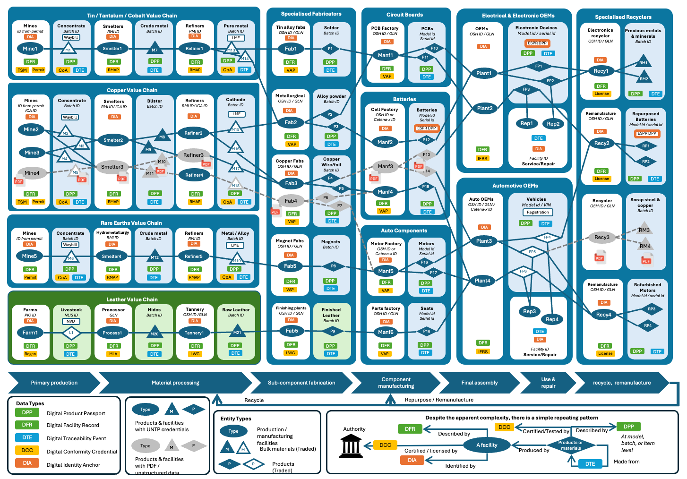
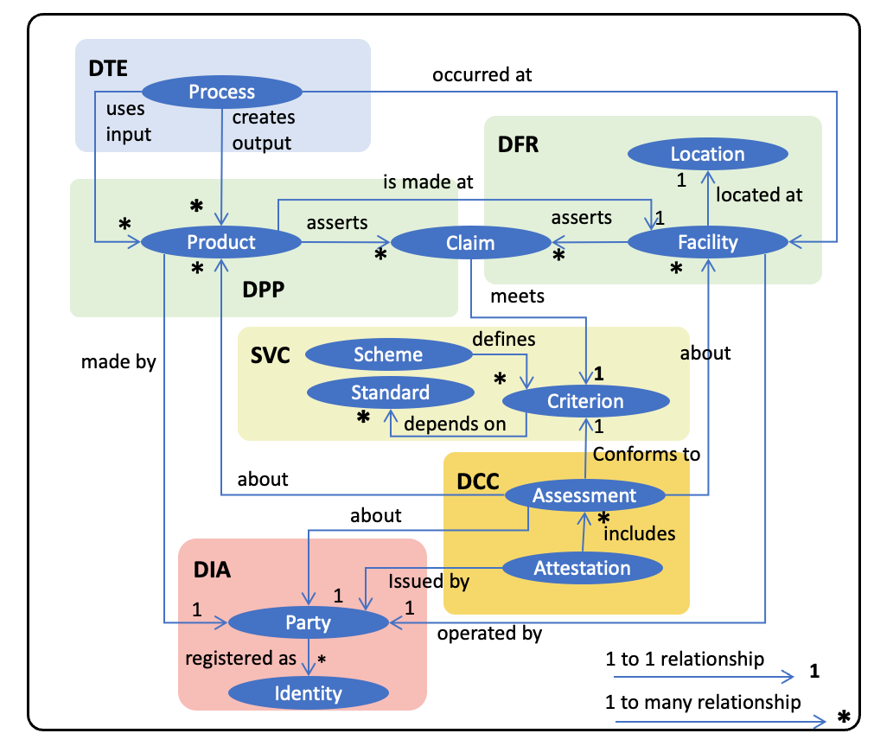
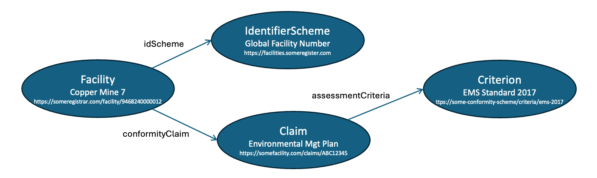

import Disclaimer from '../\_disclaimer.mdx';

<Disclaimer />

## Overview

A transparency graph is a digital twin of your value chain. It comprises a set of facilities (eg manufacturing plants, mine-sites, farms, etc) linked by the exchange of products and materials. The output products and materials of one facility are the input of others, building a "graph" of relationships that represents your supply chain. Each facility and product carries conformity claims — product safety, carbon footprint, waste management, labour rights — some backed by independent assessments that add trust.



The illustration above shows a simplified critical minerals to electric vehicle / data centre transparency graph. Each facility transforms input products and materials to make outputs that are shipped to the next facility. It also shows (in green) how UNTP works across sectors with the example of leather as an agricultural by-product making its way into automotive upholstery. In the real world, your graph will be much larger and more dynamic — most facilities have many more suppliers and customers than can be shown here. This is a key reason why all this must be digitalised if it is to work at scale.

This page explains the challenges that transparency graphs address, the UNTP solution for building and verifying them, and examples of graph verification in practice.

## Challenges

Verifying a single credential proves that it hasn't been tampered with and was issued by the stated issuer. But it says nothing about whether the _graph_ of linked claims across many credentials is trustworthy. Real compliance verification requires following chains of evidence across multiple credentials issued by different parties. Below are concrete scenarios that illustrate why graph-level verification matters.

### Issuer Trust

"Is the issuer of this product passport really the producer of this product?" A manufacturer publishes a Digital Product Passport (DPP) claiming low emissions for a battery. But how does a buyer know the DPP was actually issued by the operator of the facility that made the battery? Answering this requires linking the DPP issuer's identity to a facility record and verifying via a Digital Identity Anchor (DIA) from an authoritative business register. No single credential can answer this alone — it requires traversing from DPP to DFR to DIA.

### Accreditation Verification

"Is the Conformity Assessment Body (CAB) that certified this product actually accredited to make this attestation?" A DCC claims that a product meets a sustainability standard, but verifiers need to confirm the issuing CAB holds valid accreditation. This requires following the chain: DCC issuer → DIA from an accreditation authority → trust anchor (e.g. an [ILAC](https://ilac.org/) member). With thousands of CABs worldwide, automated verification of this chain is essential.

### Regulatory Compliance

"Does the farm that produced this beef meet EU deforestation regulation requirements?" Answering this means tracing product origin through Digital Traceability Events (DTEs) back to source facilities, checking facility geo-coordinates against deforestation risk maps, and confirming conformity claims against regulation criteria. The evidence spans DTEs, DFRs, DCCs, and DIAs — all issued by different parties.

### Conflict Minerals and Mass Balance

"Are there conflict minerals in this refined metal, and can the smelter back that up with verifiable mass-balance proof of sourcing?" Verifying this requires following transformation events to trace inputs back to source mines, checking facility locations against conflict zone data, and verifying that input-output mass-balance claims are consistent with auditable evidence. See the [Mass Balance](./MassBalance.md) design pattern for more detail.

### Completeness and Quality

Even when individual credentials verify correctly, the graph may reveal gaps that undermine confidence:

- Where are the gaps in my transparency graph (eg non-participating suppliers) — so I can request that they adopt UNTP and publish credentials?
- Where are there important conformity claims that do not have evidence of reliable independent assessments?
- Where is there an excess of unstructured and unverifiable data that I should push for uplift to UNTP credentials?
- Which parties have not attached verifiable evidence of identity from an authoritative source?
- Which parts of my supply chain include conflict zones or locations at risk of political disruption?

In essence, there are an almost unlimited number of business rules for which automated verification requires cryptographically verifiable links between data in many credentials. This is what transparency graphs enable — a compliance and risk assessment tool that allows organisations to focus their limited resources on the parts that matter.

## Solution

UNTP solves these challenges through three capabilities: **discovering** credentials across the value chain, **building** a linked-data graph from their contents, and **verifying** the graph against business rules.

### Discovering Credentials

The approach to finding the UNTP credentials that carry the information for the transparency graph is simply stated — **just follow the product and facility identifiers** to find relevant UNTP credentials like Product Passports (DPP), Facility Records (DFR), Conformity Credentials (DCC), and Traceability Events (DTE).

The core mechanism for building a transparency graph is a simple recursive process: **find an identifier, resolve it to credentials, extract new identifiers from those credentials, and repeat**. The technical details are described in the [Identity Resolver](../specification/IdentityResolver.md) specification but the essence is straightforward:

1. **Find an identifier** — a barcode on a box, a QR code, or an ID in a document. Any identifier can be turned into a URL that points to an [identity resolver](../specification/IdentityResolver.md).
2. **Resolve to credentials** — the resolver returns a list of available data about the identified thing, including UNTP credentials.
3. **Extract linked identifiers** — each credential contains identifiers of related entities (facilities, products, parties, schemes). These become the starting point for the next resolution cycle.
4. **Repeat** — follow each new identifier to discover more credentials, progressively building out the graph.

This process is independent of identifier scheme (GS1, national registers, DIDs) and works the same way for all four UNTP credential types:

| Credential                                                                        | Description                                                                 | Key identifiers to follow                                     |
| --------------------------------------------------------------------------------- | --------------------------------------------------------------------------- | ------------------------------------------------------------- |
| [Digital Product Passport (DPP)](../specification/DigitalProductPassport.md)      | Product/material claims issued by the manufacturer                          | Facility ID (where produced), material/component IDs          |
| [Digital Facility Record (DFR)](../specification/DigitalFacilityRecord.md)        | Facility performance claims issued by the operator                          | Party ID (operator), scheme IDs (conformity schemes)          |
| [Digital Conformity Credential (DCC)](../specification/ConformityCredential.md)   | Independent assessments issued by a conformity assessment body              | Product/facility IDs (assessed subjects), party ID (assessor) |
| [Digital Traceability Event (DTE)](../specification/DigitalTraceabilityEvents.md) | Process events (transformation, shipment, repair) linking inputs to outputs | Input product/material IDs, source/destination facility IDs   |

The DTE is particularly important for graph construction because it **links** supply chain tiers — a transformation event lists the input materials consumed to produce an output product, allowing the graph to be traced upstream through successive production steps. Because DTEs reveal upstream supply information, they can be commercially sensitive. The [Different Digital Maturities](./DigitalMaturities.md) design pattern describes ways to handle upstream supplier confidentiality.

### Building the Graph

Having discovered a bunch of credentials that describe your value chain as described in previous sections, the next step is to use them to create your linked-data transparency graph as a digital twin of your value chain. In reality this is an ongoing process as new or updated credentials are found, they are added to the graph.

UNTP is designed with this task front-of-mind so it is actually very simple. Every UNTP credential is built using JSON-LD (the "LD" stands for "Linked Data") so the credentials are already natively graph ready. Just load them to your preferred graph database and the linked data model will emerge.

#### Entity linking model

One very important concept to grasp is that the transparency graph is not a graph of linked credentials like DPPs and DCCs. It is a linked-data graph of the identified entities found **inside** the credentials. So, in the diagram below, the graph is created from the entities (dark blue ellipses) and relationships between them. The UNTP credentials are just containers for these entities and are shown as lighter coloured shading around the key entities. Please note that the diagram below is a conceptual model designed to facilitate understanding, not a rigorous UNTP ontology, which is a little more complex.



The diagram illustrates many of the key ideas in UNTP. For example:

- That **products** are made at **facilities** and assert a number of performance **claims** which are made against **criteria** defined by recognised conformity **schemes**.
- That an **attestation** is issued by an authorised **party** and includes a number of conformity **assessments** about either **products** or **facilities**. The **assessments** are also made against **criteria** defined by authoritative **schemes** that depend on recognised **standards**.
- That all **parties** have one or more authoritative registered **identities** governed by a registrar such as a national business register.
- That a manufacturing or service **process** happens at a **facility** and may consume input **products** to create output **products**.

These are the types of entities and relationships that will appear in your transparency graph when you load UNTP credentials.

#### Loading credentials to the graph

As stated earlier, UNTP credentials are graph-ready by design so loading them into your graph database is simple. That's because every entity that will become a node on the graph always has a "type" (from a controlled UNTP list — like "assessment"), a globally unique "id", and a human readable "name". And the entity will always be in a context that defines its relationship to other entities.

This is best explained via a small snippet of a UNTP digital facility record credential.

```
...
"facility": {
      "type": ["Facility"],
      "id": "https://someregistrar.com/facility/9468240000012",
      "name": "Copper Mine 7",
      "registeredId": "9468240000012",
      "idScheme": {
        "type": ["IdentifierScheme"],
        "id": "https://facilities.someregister.com",
        "name": "Global Facility Number"
        }
      },
      "conformityClaim": [
         {
           "type": ["Claim"],
           "id": "https://somefacility.com/claims/ABC12345",
           "name":"environmental mgt system",
           "assessmentDate": "2025-07-15",
           "assessmentCriteria": [
             {
               "type": ["Criterion"],
               "id": "https://some-conformity-scheme/criteria/ems-2017",
               "name": "EMS Standard 2017",
               "description": "Participants shall minimize environmental impact through compliance with regulations, effective management of resources, and reduction of emissions and waste.",
               "conformityTopic": "environment",
               "status": "active"
             }
             ],
           "conformance": true
         }
        ]
...
```

There are four typed entities in the snippet and so it would create four nodes in a graph with defined relationships between them:

- A **facility** node with ID `https://someregistrar.com/facility/9468240000012` and name `Copper Mine 7`. The facility has two relationships:
  - an `idScheme` relationship to an **identifierScheme** node with ID `https://facilities.someregister.com` and name `Global Facility Number`
  - a `conformityClaim` relationship to a **claim** node with ID `https://somefacility.com/claims/ABC12345` and name `environmental mgt system`
- The **claim** would also have an `assessmentCriteria` relationship to a **Criterion** node with id `https://some-conformity-scheme/criteria/ems-2017` and name `EMS Standard 2017`

Which might render on your graph something like this



The more credentials you add to your graph, the more it starts to provide a meaningful digital twin of your real supply chain. Since all UNTP data is digital and graph native, the entire process of discovery, load and analyse can be automated.

A couple of important notes:

- Often a credential will contain an entity that is already a node in the graph. For example you load a DFR, which creates a facility node (eg with id `https://someregister/facilities/5558880000030`). Then you upload a DPP that has a "producedAtFacility" property which is of type facility and has the same id `https://someregister/facilities/5558880000030`. In this case of course you do not create a new facility, you just create a link from the "product" node to the "facility" node with name "producedAtFacility".
- Sometimes a relatively empty new node is created — for example because you find a "assessedFacility" in the "assessment" object of a DCC — so you create a new node with that facility id (assuming it doesn't exist already). Then later on you find a DFR for that same facility. In this case you have new data about an existing node — so you create a new relationship AND update that existing node with all the new data.

So the general rule is — when you find a typed and identified entity anywhere in a credential:

1. If the entity does not already exist, create it.
2. If the entity already exists, add any new properties.
3. Create a link from the containing entity to the referenced entity using the property name of the contained entity.

All this means that no dedicated code is needed to process each version of each UNTP credential. They can just be uploaded to the graph with the same simple logic.

### Verifying the Graph

Although transparency graphs are constructed from data in verifiable credentials, it does not follow that if every individual credential is valid then the graph is verified.

#### Trust chains

Consider the scenario where GHG emissions of a product result in a carbon border adjustment that must be paid. In such cases, the potential for fraud is significant, as some manufacturers might falsely claim low GHG emissions in their digital product passport. To combat this, verifiers must be able to construct a **chain of trust**. For example

- A manufacturer issues a declaration in a UNTP Digital Product Passport (DPP) that states an emissions footprint for a given product ID. If the verifier trusts the manufacturer then this may be sufficient. But often a third party attestation is needed.
- A third party Conformity Assessment Body (CAB) issues an attestation as a UNTP Digital Conformity Credential (DCC) about the same product ID that confirms the emissions footprint. If the verifier knows and trusts the CAB then this may be sufficient. But there are thousands of CABs and so it is very possible that the verifier does not know or trust the specific CAB.
- A national accreditation authority issues an endorsement as a UNTP Digital Identity Anchor (DIA) which states that the CAB is accredited to issue certifications under a recognised scheme such as the [GHG Protocol](https://ghgprotocol.org/). The number of accreditation authorities is only a little larger than the number of countries, so verifiers only need a short list of accreditation authorities ("trust anchors") in order to trust the chain from product manufacturer -> CAB -> national authority.
- Most national accreditation authorities are members of a global association such as [ILAC](https://ilac.org/). If ILAC were to issue a credential attesting that national authority is a member then there is a chain of trust from manufacturer -> CAB -> national authority -> ILAC.

Ultimately, verifiers need only maintain a very short list of ultimate **trust anchors**. In general, all these actors in the trust chain already exist and have well managed governance frameworks. The verifiable credential and transparency graph technologies are not creating new trust models, they are just making existing ones digital and verifiable at scale.

#### Validation rule tiers

The validation rules for a given transparency graph that represents a specific actor's value chain are of course up to the specific actor. However there is likely to be a tiered set of re-usable rules that would make life easier for each actor.

- **UNTP core validation rules.** There is a core subset of rules (eg that claims are verified by assessments, that identities are anchored, etc) that will be common to all industry sectors and all geographies.
- **Industry specific rules.** On top of the UNTP core rules, there will be industry specific rules that apply to specific [UNTP extensions](../extensions/index.md) such as which specific sustainability schemes are trusted, what identity schemes and anchors are preferred, etc.
- **Geography specific rules.** As well as industry level common rules, there will be geography specific rules that will typically map to national regulations. These could usefully be defined consistently by each regulator.
- **Organisation specific rules.** Finally there will be rules that reflect the specific requirements of individual organisations.

UNTP and extensions will make these validation rules public and re-usable so that specific implementers need only consider whether they wish to add any organisation specific rules.

## Examples

### Trust Chain Verification

Consider verifying a GHG emissions claim on a battery Digital Product Passport. A border authority receives a battery shipment and needs to verify the claimed carbon footprint of 45 kg CO2e per kWh. The graph-level verification proceeds as follows:

1. **Resolve the battery DPP** — The battery identifier resolves to a DPP issued by the battery manufacturer, containing the emissions claim.
2. **Find the supporting DCC** — The DPP references (or the identity resolver returns) a DCC issued by a CAB that assessed the emissions footprint and confirmed the 45 kg CO2e figure.
3. **Verify CAB accreditation** — The CAB's identifier resolves to a DIA issued by the national accreditation authority, confirming the CAB is accredited under the [GHG Protocol](https://ghgprotocol.org/) scheme.
4. **Check the trust anchor** — The national accreditation authority is on the verifier's list of trusted anchors (or is attested as an [ILAC](https://ilac.org/) member).

This chain — DPP → DCC → DIA → trust anchor — addresses the [issuer trust](#issuer-trust) and [accreditation verification](#accreditation-verification) challenges described above. If any link in the chain is missing or invalid, the graph verification flags it for human review.

### Graph Validation Rules

The following pseudo-code illustrates the kind of rules that can be applied to a transparency graph. These are indicative examples — actual rule definitions will be formalised as UNTP matures.

```
# UNTP Core Rules

FOR each Product with conformityClaims
  CHECK that at least one matching DCC assessment exists
    for the same product ID and conformity topic
  FLAG "unverified claim" if no matching assessment found

FOR each DCC issuer (ConformityAssessmentBody)
  CHECK that a DIA exists confirming accreditation
    issued by a recognised accreditation authority
  FLAG "unaccredited assessor" if no DIA found

FOR each Facility operator (Party)
  CHECK that a DIA exists anchoring the party identity
    issued by an authoritative business register
  FLAG "unanchored identity" if no DIA found

FOR each transformation DTE
  CHECK that input product quantities and output product quantities
    are consistent within acceptable mass-balance tolerances
  FLAG "mass-balance inconsistency" if tolerance exceeded

# Industry Extension Rules (example: critical minerals)

FOR each Facility with conformityTopic = "mineral sourcing"
  CHECK that facility geoLocation is not within
    a designated conflict zone
  FLAG "conflict zone risk" if location matches

# Geography Specific Rules (example: EU CBAM)

FOR each imported Product with conformityTopic = "emissions"
  CHECK that emissions claim value exists AND
    a matching DCC assessment with scheme = "GHG Protocol" exists
  FLAG "CBAM non-compliant" if missing
```
