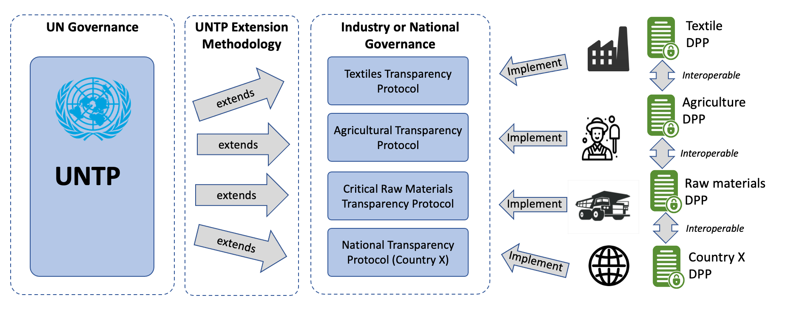
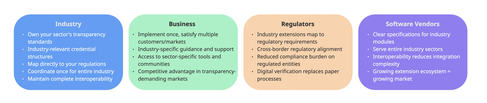

import Disclaimer from '../\_disclaimer.mdx';

<Disclaimer />

**_Informative_**

# Overview

## Why UNTP Extensions: Scaling Transparency Across Industries

UNTP is designed as a common core that is usable by any industry sector or in any regulatory jurisdiction. This extensions methodology describes how to extend UNTP to meet the specific needs of any industry sector or regulated market in such a way that the extension maintains core interoperability with any other extension. This cross-industry and cross-border interoperability is a core value of UNTP because almost every value chain will cross industry and/or national borders.

### The Challenge: Industry Specificity vs. Global Interoperability

Every industry has unique transparency needs:

|             | Agriculture                                   | Mining & Batteries                                                    | Construction                                                    |
| ----------- | --------------------------------------------- | --------------------------------------------------------------------- | --------------------------------------------------------------- |
| Products    | Livestock, grains, horticulture               | Raw materials, processed minerals, battery cells                      | Building materials, components, assemblies                      |
| Key metrics | Water usage, deforestation, animal welfare    | Carbon intensity, responsible sourcing, recycled content              | Embodied carbon, circularity, toxicity                          |
| Identifiers | National Livestock Identification (RFID tags) | Mine identifiers, batch numbers, serial numbers                       | Product codes, permit numbers, certification IDs                |
| Regulations | EUDR, biosecurity, organic certification      | EU Battery Regulation, Critical Raw Materials Act, OECD Due Diligence | Building codes, green building standards, circular economy laws |

**The Traditional Problem**: Each industry creates separate, incompatible systems. A textile manufacturer exporting to battery manufacturers can't share data because systems don't interoperate.

### The UNTP Solution: Interoperable Extensions

**UNTP Extensions Architecture**:



**Key Principle**: Extensions ADD industry specifics WITHOUT breaking interoperability.

**Result**:

- Agricultural product passport readable by battery manufacturers
- Mining credentials usable by construction companies
- Industry-specific data with universal compatibility

### Extension Benefits



### The Network Effect

As more extensions are created:

- **First extension**: Value to one industry
- **Second extension in related industry**: Value multiplies (data flows between industries)
- **N extensions**: Exponential value growth across interconnected supply chains

**This is how UNTP achieves scale**: Industry adoption through extensions → Growing network value → More industries join → Stronger network effects.

---

# The Details

## Why Extension Interoperability Matters

### Traditional Approach: Fragmentation

**Without interoperable extensions, each industry creates isolated solutions:**

```
[Agriculture Platform] ← No connection → [Mining Platform] ← No connection → [Manufacturing Platform]
```

**Problems**:

- Battery manufacturer can't read sustainability data from mining operations
- Food processor can't access agricultural production data
- Consumer at end of chain sees ZERO upstream transparency
- Each platform switch requires manual data re-entry
- Compliance verification must be duplicated at every step

### UNTP Approach: Interoperable Ecosystem

**With UNTP extensions, all industries share a common core:**

```
[Agriculture Extension] ←→ [UNTP CORE] ←→ [Mining Extension] ←→ [Manufacturing Extension]
                                ↕
                    [ALL EXTENSIONS INTEROPERABLE]
```

**Benefits**:

- Credentials issued in one industry are readable in all others
- Supply chain data flows seamlessly from raw materials to finished products
- Verification happens once, accepted everywhere
- Each industry has specifics, but ALL maintain compatibility

### Real Supply Chain Example

| **Traditional Approach (Fragmented)**                                                                                                                                                                                                                                                                                                                                                                                                                                                                                                                                                                                                                                                                                                               | **UNTP Approach (Interoperable)**                                                                                                                                                                                                                                                                                                                                                                                                                                                                                                                                                                                                                                                                                                                                                                                                                                                                                                                                                                                                                                                                                                                                      |
| :-------------------------------------------------------------------------------------------------------------------------------------------------------------------------------------------------------------------------------------------------------------------------------------------------------------------------------------------------------------------------------------------------------------------------------------------------------------------------------------------------------------------------------------------------------------------------------------------------------------------------------------------------------------------------------------------------------------------------------------------------- | ---------------------------------------------------------------------------------------------------------------------------------------------------------------------------------------------------------------------------------------------------------------------------------------------------------------------------------------------------------------------------------------------------------------------------------------------------------------------------------------------------------------------------------------------------------------------------------------------------------------------------------------------------------------------------------------------------------------------------------------------------------------------------------------------------------------------------------------------------------------------------------------------------------------------------------------------------------------------------------------------------------------------------------------------------------------------------------------------------------------------------------------------------------------------- |
| 1. **Mine** (Chile): Uses proprietary system to track copper extraction<br /> - Data format: Custom database schema<br /> <br />2. **Smelter** (Japan): Different system, cannot read mine data<br /> - Manual data re-entry required<br /> - Verification re-starts from zero<br /> <br />3. **Battery Cell Manufacturer** (South Korea): Third system<br /> - Cannot trace back to original mine<br /> - Relying on smelter's manual attestations<br /> <br />4. **Battery Pack Assembler** (Germany): Yet another system<br /> - No visibility to cell origin<br /> - Cannot prove EUDR compliance<br /> <br />5. **Vehicle OEM** (USA): Cannot prove battery sustainability<br /> - Customer skepticism<br /> - Regulatory compliance uncertain | 1. **Mine** (Chile): Implements UNTP Core + Critical Minerals Extension<br /> - Issues Digital Product Passport for copper concentrate<br /> - Includes: Origin coordinates, ESG metrics, conformity credentials<br /> <br />2. **Smelter** (Japan): Implements UNTP Core + Critical Minerals Extension<br /> - Reads DPP from Chilean mine automatically<br /> - Issues DPP for refined copper<br /> - Links to upstream DPP via traceability events<br /> <br />3. **Battery Cell Manufacturer** (South Korea): Implements UNTP Core + Electronics Extension<br /> - Reads DPPs from multiple smelters (copper, lithium, cobalt)<br /> - Issues battery cell DPP<br /> - Full traceability to all source mines<br /> <br />4. **Battery Pack Assembler** (Germany): Implements UNTP Core + Electronics Extension<br /> - Reads cell DPPs from multiple manufacturers<br /> - Issues battery pack DPP<br /> - Automatic EUDR compliance verification<br /> <br />5. **Vehicle OEM** (USA): Implements UNTP Core + Automotive Extension<br /> - Reads battery pack DPP<br /> - Complete supply chain visibility<br /> - Verifiable sustainability claims for marketing |
| **Result**: Chain broken. No traceability. Compliance uncertain. High cost duplicating verification.                                                                                                                                                                                                                                                                                                                                                                                                                                                                                                                                                                                                                                                | **Result**: Unbroken digital chain from mine to vehicle. Full traceability. Verified compliance. Implement once, satisfy all partners.                                                                                                                                                                                                                                                                                                                                                                                                                                                                                                                                                                                                                                                                                                                                                                                                                                                                                                                                                                                                                                 |

### Interoperability = Network Effects

**As more extensions are created and implemented**:

- First extension: Value to implementing industry
- Second extension in related industry: Value increases (data can flow between them)
- Third, fourth, fifth extensions: Exponential value growth
- At scale: Complete supply chain transparency from raw materials to consumers

**Formula**: Extension Value = (Number of Implementations) × (Number of Connected Extensions)²

This is why UNTP focuses on **interoperability** rather than creating one-size-fits-all monolithic standards.

---

## Understanding Core vs. Extensions

### What's in UNTP Core?

**Universal capabilities available to all industries**:

- Digital Product Passport structure
- Digital Conformity Credential structure
- Digital Traceability Event structure
- Digital Facility Record structure
- Verifiable Credentials technology
- Identity Resolution protocol
- Decentralized Access Control

### What Do Extensions Add?

**Industry-specific additions**:

- Product type variants (livestock passport, battery passport, building material passport)
- Industry-specific properties (battery capacity, animal breed, embodied carbon)
- Industry vocabularies (agricultural terms, electrical standards, construction specifications)
- Relevant identifier schemes (livestock RFID, battery serial numbers, product certifications)
- Conformity criteria mappings (which standards/regulations matter for this industry)

### The Relationship

```
UNTP Core = Foundation (universal structure)
    +
Extension = Industry Layer (sector-specific details)
    =
Industry-Ready Credential (interoperable with all other industries)
```

# Extension Ecosystem Momentum

## Registered Extensions Across Industries

| Industry Sector              | Extension Name                                         | Owner                                            | Status                    | Geographic Scope |
| ---------------------------- | ------------------------------------------------------ | ------------------------------------------------ | ------------------------- | ---------------- |
| **Electronics & Automotive** | Responsible Business Transparency Protocol             | Responsible Business Alliance (RBA)              | Pilot (Nov 2024)          | Global           |
| **Construction**             | Universal Data Protocol for Built Environment          | Standards Australia + International Code Council | Pilot (Nov 2024)          | Global           |
| **Agriculture**              | Australian Agriculture Traceability Protocol (AATP)    | Food Agility CRC                                 | Pilot (Feb 2024)          | Australia        |
| **Critical Minerals**        | Critical Raw Materials Transparency Protocol           | UN/CEFACT                                        | Pilot (Jan 2024)          | Global           |
| **Batteries**                | Global Battery Alliance Transparency Protocol          | Global Battery Alliance (GBA)                    | In Development (Jun 2025) | Global           |
| **Copper**                   | International Copper Association Transparency Protocol | International Copper Association (ICA)           | In Development (Jun 2025) | Global           |

---

## Industry Coverage Status

**Covered Industries** (extension exists):

- ✓ Agriculture (livestock, horticulture, grains)
- ✓ Mining & Minerals (copper, lithium, cobalt, rare earths)
- ✓ Batteries & Energy Storage
- ✓ Electronics & Electrical Goods
- ✓ Automotive Parts
- ✓ Construction Materials & Built Environment

**Industries in Development**:

- Textiles & Fashion (expected Q2 2026)

**Coverage Gaps** (opportunities for new extensions):

- Seafood & Aquaculture
- Forestry & Wood Products
- Food & Beverage Processing
- Chemicals & Petrochemicals
- Plastics & Packaging
- Pharmaceuticals & Healthcare
- Energy (renewable & conventional)
- Transportation & Logistics Services

### By the Numbers

- **6 registered extensions** across diverse industries
- **Major global organizations leading** (RBA, GBA, Standards Australia, UN/CEFACT)
- **Geographic diversity**: Australia + Global coverage
- **Industry diversity**: Agriculture, mining, batteries, electronics, automotive, construction
- **Timeline**: Consistent growth from Jan 2024 → Nov 2024 → Jun 2025

### Leading Organizations as Extension Owners

**Responsible Business Alliance (RBA)**

- Coalition of 200+ electronics/automotive companies
- $7 trillion in combined revenue
- Leading electronics extension

**Global Battery Alliance (GBA)**

- 140+ members across battery value chain
- World Economic Forum initiative
- Leading battery passport standards

**Standards Australia + International Code Council**

- Leading technical standards organizations
- Representing construction and built environment sectors
- Driving global built environment transparency

**UN/CEFACT**

- United Nations trade facilitation body
- Leading critical minerals extension
- Textiles Pilot
- Leveraging UN convening power

### More Extensions Coming

Industries actively developing extensions:

- Seafood & Aquaculture
- Forestry & Wood Products
- Additional sectors in scoping phase

**The extension ecosystem is growing. Is your industry next?**

---

# Find Your Starting Point

## Quick Guide: Do I Need an Extension?

### Decision Tree

**Question 1: Does your industry have a registered extension?**

[Check the Extensions Register](/implementations/ExtensionsRegister.md)

**IF YES - Extension Exists:**

✓ **Recommended Path**: Implement UNTP Core + your industry extension

- **Benefits**: Industry-relevant credentials, sector-specific guidance, community support
- **Timeline**: Immediate start possible
- **Next Step**: Review your extension's specification and implementation guide

**IF NO - No Extension Yet:**

**Option A: Implement UNTP Core Now**

- **Use when**: Facing immediate regulatory/customer pressure
- **Benefits**: Start building transparency capability immediately
- **Approach**: Use generic UNTP credentials
- **Future**: When extension arrives, it's an incremental addition (not a rebuild)
- **Timeline**: Start immediately

**Option B: Create Industry Extension**

- **Use when**: Strong industry association exists, common needs across sector
- **Benefits**: Define specifics perfect for your industry, lead sector standards
- **Approach**: Engage industry association, follow extensions methodology
- **Timeline**: 4-8 months to develop extension
- **Investment**: $200-500K (association-level investment returning 10-30x through member savings)

**Option C: Adapt Related Extension**

- **Use when**: Similar supply chain structure to existing extension
- **Benefits**: Leverage existing work with minor modifications
- **Example**: Fashion adapting textile extension, cobalt adapting copper extension
- **Timeline**: 2-4 months

### Extension Decision Matrix

| Your Situation                                 | Recommended Path                         | Timeline          | Next Step                      |
| ---------------------------------------------- | ---------------------------------------- | ----------------- | ------------------------------ |
| Industry extension exists, you're a member     | Use existing extension                   | Immediate         | Review extension spec          |
| Industry extension exists, you're not a member | Join association OR implement compatible | 1-2 weeks         | Contact extension owner        |
| No extension, industry association active      | Initiate extension via association       | 4-8 months        | Contact UNTP team              |
| No extension, no strong association            | Implement core OR form working group     | 6-12 months       | Start with core                |
| Related industry has extension                 | Adapt or extend existing                 | 2-4 months        | Contact related extension team |
| Facing immediate compliance deadlines          | Implement core now, add extension later  | Start immediately | Begin with core                |

### Key Principle

**Don't wait if you're facing pressure.** Implementing UNTP core now provides immediate value. Extensions add industry specificity but aren't required to start.

**Do initiate extension development if you're an industry association.** Leading your sector's extension creates member value and positions your association as the authoritative transparency standard-setter.

### Run Community Activation in Parallel

**Don’t wait to build momentum.** While you scope or evolve your extension, launch a **90-Day Coalition Sprint** to recruit vendors, run pilots, and feed real-world data into your schemas and conformance assertions.

**Do this now**

- Start the **Community Activation Program (CAP)** → `/docs/business-case/CommunityActivationProgram`
- Download the **Activation Asset Pack** (templates, charter/MOU, validator how-to, KPI tracker)
- Open a **Community Activation** issue in GitLab (template in the pack)

**Why parallel?** Pilot feedback (sample data, validation results) directly improves extension design; updated schemas and validator outputs de-risk community rollout.

## I'm looking to...

- **Check if my industry has an extension**
  → [View Extensions Register](/implementations/ExtensionsRegister.md) - See all 6 registered extensions covering agriculture, mining, batteries, electronics, and construction

- **Understand extension requirements and process**
  → [Read Extensions Methodology](/tools-and-support/ExtensionsMethodology.md) - Technical specification for creating interoperable extensions

- **Implement an existing extension**
  → Find your extension in the [Register](/implementations/ExtensionsRegister.md), then follow its implementation guide

- **Understand how extensions relate to UNTP implementation**
  → [Implementation Guidance](../tools-and-support/ImplementationPlans.md) - See how extensions fit into the five-step implementation framework

- **Get support for extension questions**
  → [Join community Slack Channel](https://join.slack.com/t/uncefact/shared_invite/zt-36yan5ezl-gFgWgckgKlZ5lIR4m_lVWg)
