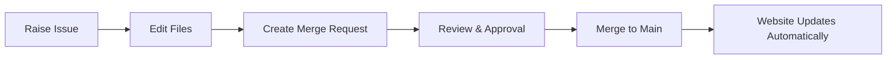

import Disclaimer from '../\_disclaimer.mdx';
import YouTube from '@site/components/YouTube';

<Disclaimer />

We use a UN hosted GitLab instance as our main platform for hosting and collaborating on the UNTP Specification. GitLab is powered by Git, a version control system that tracks changes to files (like specifications) over time, allowing multiple people to work together.

This setup ensures a collaborative workflow:



### Issues

Issues (tickets) are raised to discuss ideas, collaboration and consensus are achieved through comments and discussions.

### Merge Requests

Peer review occurs via merge requests (MRs), and approved changes are incorporated into the specification before going live on the UNTP website.

No advanced technical knowledge is needed to make contribution to the specification, we'll guide you through the web-based tools.

## Registration Process

If you don't have a UN GitLab account yet, self-service registration is available.

1. **Register**: Go to the registration page [here](https://opensource.unicc.org/users/sign_up) and create an account.

2. **Approval**: [UNICC](https://www.unicc.org/) will review and approve your registration. Allow at least **three business days**.

3. **Activate**: You'll receive an email with an activation link. Click it promptly (links expire). If it expires, enter your email on the activation page and click "Resend" to get a new one.

4. **Two-Factor Authentication (2FA)**: Once activated, set up 2FA [here](https://opensource.unicc.org/-/profile/account) (it's mandatory).

5. **Access the Repository**: Navigate to the **spec-untp** repository [here](https://opensource.unicc.org/un/unece/uncefact/spec-untp). Your initial GitLab role lets you raise issues, comment on issues and merge requests, but not edit files directly.

**To Contribute Edits**: We encourage active contributions to the specification! Contact the appropriate Working Group (WG) lead to request edit access. Please only request edit access if you plan to contribute regularly.

:::info

- If no approval after three days, email UNICC support at email.example.com (TODO: Add support email).
- All contributions (comments, issues, or edits) become UN intellectual property as outlined in the Intellectual Property Rights (IPR) Agreement (TODO: Add link to agreement when available).
- For other issues, use the UNTP Slack channel [here](https://join.slack.com/t/uncefact/shared_invite/zt-36yan5ezl-gFgWgckgKlZ5lIR4m_lVWg) or mailing list [here](https://gaggle.email/join/untp@gaggle.email).
  :::

## Markdown

All content on the UNTP website is written [using the Markdown notation](https://handbook.gitlab.com/docs/markdown-guide/). If unfamiliar with markdown, we suggest you experiment with it on a [markdown playground](https://kip2.github.io/MarkdownToHTML/) so that you understand how to create headings, bulleted lists, tables, and so on.

## Getting Started

The following instructions assume you have access to the UN's GitLab instance and are logged in. If you need help logging in or permissions, reachout to the appropriate working group lead.

## How to find the repository

<YouTube id="GcuZz1yYO0Q" />

1. Go to your GitLab homepage (the main dashboard after [signing in](https://opensource.unicc.org/users/sign_in)).

2. Click on "Projects" in the left menu.

3. Click "Explore projects" on the top right of the screen.

4. Click the "All" tab.

5. Search for "spec-untp" or browse the [groups/projects](https://opensource.unicc.org/explore/projects).

6. Click on UNCEFACT's **spec-untp** repository to open it.

## How to Raise an Issue

Issues are like tickets for discussing problems, ideas, or tasks related to the specification. Use them to raise issues or collaborate on ideas before making changes.

<YouTube id="tUBFTqnMT1s" />

1. In the [spec-untp repository](https://opensource.unicc.org/un/unece/uncefact/spec-untp), click on "Issues" in the left menu. Note that you may need to open the menu on mobile devices by clicking the menu icon on the top left of the page.

2. Click the blue "New issue" button at the top right.

3. Add a short, clear title (e.g., "Update section on user requirements").

4. Select the **General_Issue** template from the dropdown below the **Description** section (it auto-fills a basic structure).

5. Fill in the description:

   - **Impacted Sections**: List the sections of the specification webiste that is impacted (e.g. https://untp.unece.org/docs/specification/DigitalProductPassport).
   - **Description**: Explain the details. Use markdown, simple text, or add images if needed (click the paperclip icon to attach files).
   - **Assignee** (optional): Pick someone to handle it.
   - **Labels** (required): Add **one** appropriate WG label based on the topic:
     - **WG-Adoption** for adoption/implementation
     - **WG-Conformity** for conformity/compliance
     - **WG-Steering** for steering/high-level
     - **WG-SupplyChain** for supply chain
     - **WG-Technical** for technical details

6. Click "Create issue" at the bottom.

Your issue is now live, and others can see it in the [Issues list](https://opensource.unicc.org/un/unece/uncefact/spec-untp/-/issues).

## How to Comment on an Issue

Comments let you discuss or add more info to an existing issue.

<YouTube id="z28tPtGAuQs" />

1. In the [spec-untp repository](https://opensource.unicc.org/un/unece/uncefact/spec-untp), click on "Issues" in the left menu. Note that you may need to open the menu on mobile devices by clicking the menu icon on the top left of the page.

2. Find the issue in the list (use search if needed) and click on it to open.

3. Scroll to the bottom of the page.

4. In the comment box, type your message. Use markdown, simple text, or add images if needed (click the paperclip icon to attach files).

5. Click "Comment" to post it.

Everyone participating in the issue will get notified.

## How to Make Changes Within the Repository

**Overall Flow for Making Changes**:

1. (Optional but recommended) Raise an issue first to discuss your idea and get feedback.

2. Edit the file(s) using the tools below. This creates a copy of your changes in a "branch" (like a draft).

3. Raise a merge request (MR) to propose your changes for review.

4. The community reviews, approves, and merges. Changes go live on the website.

**Important Tip**: When making changes, keep them focused on **one concept or topic** (e.g., updating a specific section or fixing related typos). Don't lump multiple unrelated changes into a single merge request. Create separate ones for easier review and collaboration.

For non-tech users, use GitLab's built-in tools to edit files directly in your browser. This doesn't require downloading anything.

### Simple Single File Edits

Use this for quick changes to one file, like fixing a typo or updating a section.

<YouTube id="7OHIhunjWXU" />

1. In the [spec-untp repository](https://opensource.unicc.org/un/unece/uncefact/spec-untp), click on "Repository" in the left menu to see the file list. Note that you may need to open the menu on mobile devices by clicking the menu icon on the top left of the page.

2. Navigate to the file you want to change (the specification files live in the [website/docs directory](https://opensource.unicc.org/un/unece/uncefact/spec-untp/-/tree/main/website/docs)).

3. Click on the file name to view it.

4. Click the blue "Edit" button at the top right and then click the "Edit single file" option.

5. Make your changes in the editor:

   - It's like editing a document. Type or paste text.
   - Use Markdown where it makes sense like # for headings or - for bullets.

6. Click the "Preview" button on the top left of the page to review your changes. Click the "Write" button on the top left of the page to make additional changes.

7. At the bottom:

   - Add a short "Commit message" describing the change (e.g., "Fixed typo in section 2").
   - **Must select**: "Start a new merge request with these changes" (this proposes your edit for review).

8. Click "Commit changes."

This will automatically create a draft merge request. Follow the [How to Raise a Merge Request](#how-to-raise-a-merge-request) section to finalise it.

### Multiple File Edits (via Web IDE)

Use this for changes across several files, like updating related sections in different files. The Web Integrated Development Environment (IDE) is a online code editor.

<YouTube id="7Hu7Xi-uNr8" />

1. In the [spec-untp repository](https://opensource.unicc.org/un/unece/uncefact/spec-untp), click the **Edit** button on the top right and select **Web IDE**. This opens GitLab’s Web IDE.

2. In the Web IDE:

   - Use the **left-hand file tree** to navigate to the specification files, which are located in the `website/docs` directory.
   - Expand folders by clicking the folders name.

3. Open and edit the files you need:

   - Click a file to open it in the editor panel.
   - Make your changes directly in the editor (type or paste).
   - Use Markdown formatting if needed (`#` for headings, `-` for bullets, etc.).

4. When you are done editing:

   - Click the **Source Control** icon in the left panel.
   - Review your changes in the list.
   - In the **Commit message** box, write a short description of the overall change (e.g., _“Updated supply chain examples across docs”_).
   - Click the dropdown arrow next to the **Commit and push to 'main'** and select **Create a new branch and commit**, and enter a simple branch name (e.g., `update-supply-chain`).
   - Press the 'return' or 'enter' key on your keyboard. This saves your work on the new branch.

5. After committing:

   - A popup will appear — click **Create MR** directly from there.
   - Alternatively, you can return to the repository page and GitLab will prompt you to open a merge request from your new branch.

6. Follow the [How to Raise a Merge Request](#how-to-raise-a-merge-request) instructions to finish creating and submitting the MR for review.

:::caution
You must commit your changes for them to be saved in the web-based IDE. You will lose your work if you don't commit the changes and close the window. A warning will be displayed if you attempt to close the window with uncommitted changes.
:::

:::info
If uploading and commiting large files it may take some time for the popup to appear. Please be patient.
:::

## How to Raise a Merge Request

A merge request (MR) is like proposing changes for review before they're added to the UNTP Specification Website. It's required for all changes.

<YouTube id="1Y6zftzmUbg" />

1. In the [spec-untp repository](https://opensource.unicc.org/un/unece/uncefact/spec-untp), click on "Merge requests" in the left menu. Note that you may need to open the menu on mobile devices by clicking the menu icon on the top left of the page.

2. Click the blue "New merge request" button.

3. Select the source branch (the branch you've committed your changes to) and target branch (**should be "main"**).

4. Click "Compare branches and continue."

5. Fill in the form:

   - **Title**: Short description (e.g., "Add new feature spec").
   - **Description**: Explain what you changed and why. Mention related issues if any (e.g., Closes #123). Attach files or link to issues if needed.
   - **Assignee** (optional): Pick someone to review it.
   - **Labels** (required): Add **one** appropriate WG label based on the topic:
     - **Labels** (required): Add **one** appropriate WG label based on the topic:
     - **WG-Adoption** for adoption/implementation
     - **WG-Conformity** for conformity/compliance
     - **WG-Steering** for steering/high-level
     - **WG-SupplyChain** for supply chain
     - **WG-Technical** for technical details

6. Click the "Changes" tab at the bottom of the page to review the changes made.

7. Click "Create merge request."

Your merge request is now live, and others can see it in the [Merge Requests list](https://opensource.unicc.org/un/unece/uncefact/spec-untp/-/merge_requests).

:::info
After Creating the MR:

- The pipeline automatically runs to check if the website builds correctly.
- A WG lead must approve the MR before it can be merged.
- Once approved, anyone with permission can merge it.
- Another pipeline will automatically publish the updates to the spec-untp website via GitLab Pages.
  :::

## How to Comment on a Merge Request

Comments help discuss proposed changes.

### General Comment

<YouTube id="2tq8OKYhuSs" />

1. In the [spec-untp repository](https://opensource.unicc.org/un/unece/uncefact/spec-untp), click on **Merge requests** in the left menu. On mobile devices, you may need to open the menu by clicking the menu icon in the top left corner.

2. Find the merge request in the list (use search or filters if needed) and click to open it.

3. Scroll to the bottom of the page and use the comment box. Type your feedback, then click **Comment**.

### Comment on a Specific Line

<YouTube id="6AhJtVR9LRM" />

1. Open the merge request and go to the **Changes** tab.

2. Hover over the line of changed text you want to comment on.

3. Click the **speech bubble icon** that appears.

4. Type your feedback, then click **Add comment now**.

## More Complex Changes

For more advanced workflows like running the website locally or making extensive changes, you'll need to clone the repository to your local machine using Git. This requires:

1. Installing Git on your computer
2. Cloning the spec-untp repository
3. Making changes locally and pushing them back to GitLab

This is recommended for contributors who need to:

- Test changes locally before submitting
- Work with multiple files extensively
- Run the documentation website on their own machine

## Running a local UNTP website

The UNTP website is built using [Docusaurus 3](https://docusaurus.io/), a modern static website generator.

> _Note: You can copy code snippets below and paste them to your terminal_

To run it locally:

1. if you don't already have node.js and NPM installed then install them using the [Node Installer](https://nodejs.org/en/download/prebuilt-installer) - select the "prebuilt installer" and chose the right options for your mac or pc.
2. Open your command line / terminal window. On Mac you'll find it in `Applications`->`Utilities`->`Terminal`.
3. Find the GitHub folder that has the cloned UNTP repository you created as described in the [more complex changes](#more-complex-changes) section. Hint `ls` command will list the files in the current folder and `cd someFolder` will move you to that folder. `cd ..` will move you back up a folder level. Use `ls` and `cd` till you are in the `website` folder of the UNTP repository.

```
cd ~/GitHub/spec-untp/website/
```

4. If you don't already have Yarn installed then type `npm install --global yarn`. Yarn is a dependency manager that will keep all your local bits and pieces of website software up to date.

```
npm install --global yarn
```

5. Type `yarn install --frozen-lockfile` to install the dependencies needed for the website (which includes docusaurus).

```
yarn install --frozen-lockfile
```

6. Type `yarn start`. This will launch the website and open it in a browser window on your local machine at `http://localhost:3000`. Whenever you make changes to UNTP Markdown files, you'll see the change on your local website.

```
yarn start
```

7. To stop the website, enter "Ctrl+C" in the terminal window. You can start it again anytime by navigating to the `website` folder as described above and typing `yarn start`. You don't need to re-install node or yarn or docusaurus.
