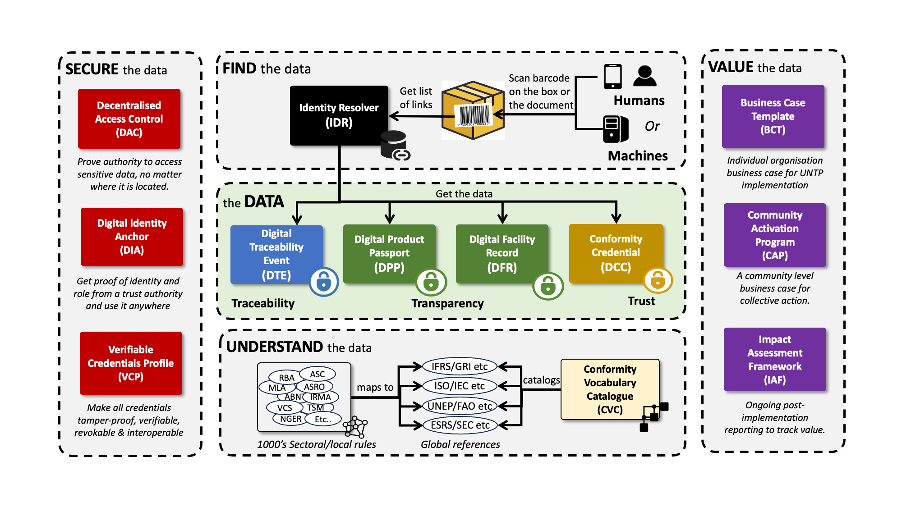
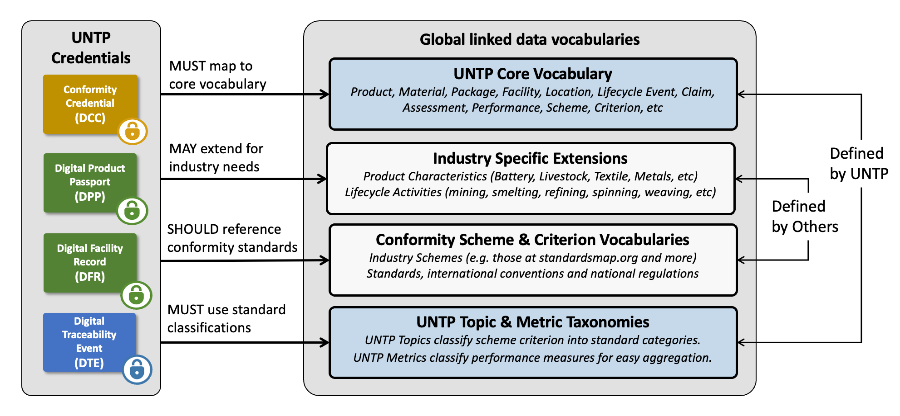
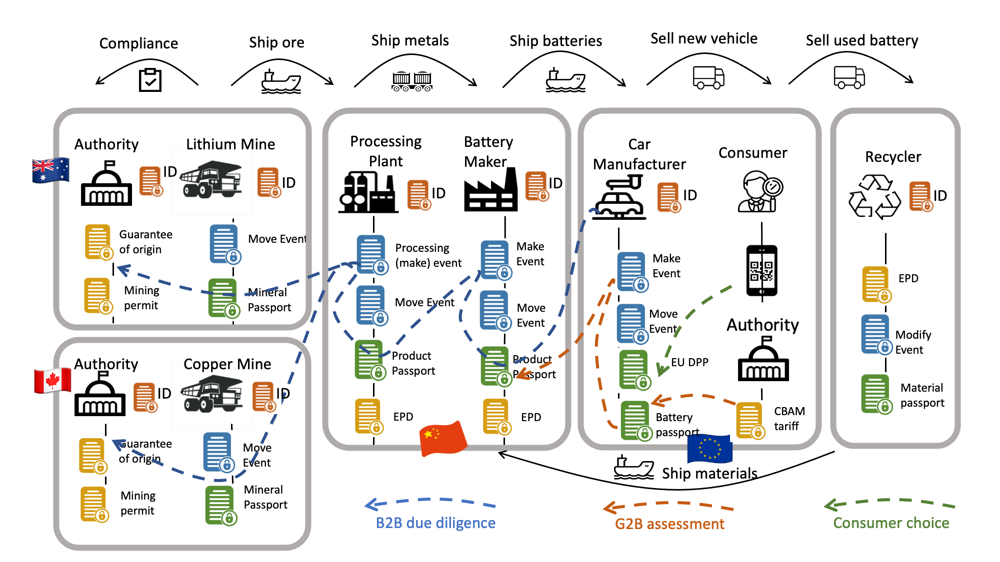
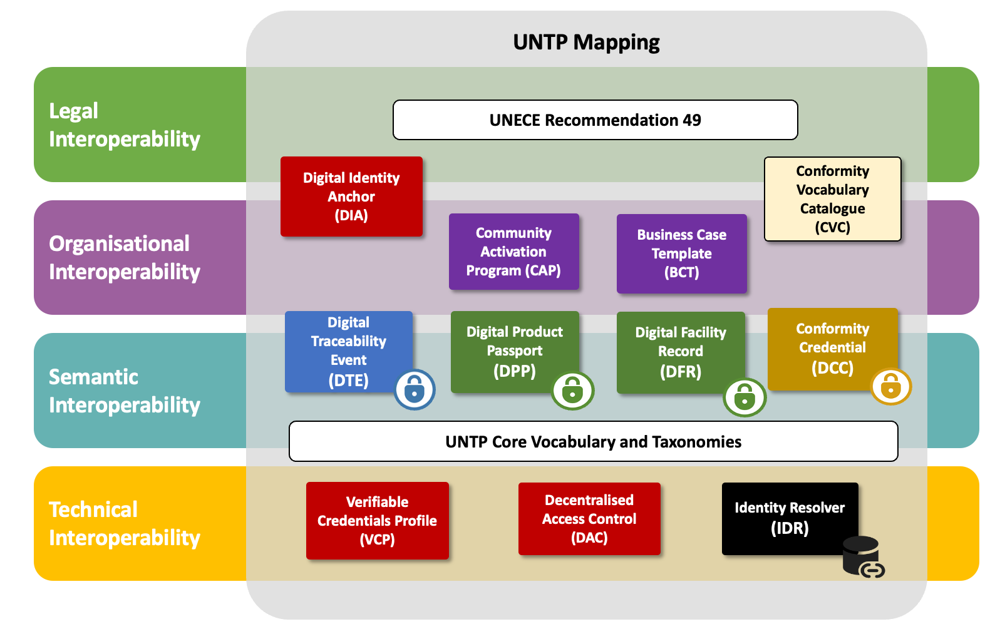

import Disclaimer from '../\_disclaimer.mdx';

<Disclaimer />

## Overview

The architecture is the blueprint for all the components of the specification and how they work together. It defines the **design principles** which underpin the UNTP and shows the components working together from the perspective of a **single actor** and across the **entire value-chain**. The UNTP is a fundamentally **decentralised architecture** with no central store of data.

## Principles

The architecture principles that guide the UNTP design are

| Name                  | Principle                                                                                                                                                    | Rationale                                                                                                                                                                                                         |
| --------------------- | ------------------------------------------------------------------------------------------------------------------------------------------------------------ | ----------------------------------------------------------------------------------------------------------------------------------------------------------------------------------------------------------------- |
| No dependency         | UNTP should not require any collaboration or dependency between issuers, consumers and verifiers of DPPs                                                     | Imposing such collaboration as a pre-requisite for action in a complex many-to-many ecosystem would essentially stall progress                                                                                    |
| Unknown verifier      | UNTP should not assume that that the consumer / verifier of UNTP data is known to the issuer, even when confidential data access is required                 | In a decentralised architecture with thousands of issuers, it would be impractical to register every authorised verifier with every issuer.                                                                       |
| Any maturity          | UNTP should not assume any technical maturity for verifiers                                                                                                  | DPPs and other credentials must work equally for human and machine verifiers - otherwise an insurmountable complexity of knowing which customer has what capability would be required                             |
| Legacy data carriers  | UNTP should work with any carrier of a product identifier including 1D barcodes, RFID tags, 2D codes and digital documents                                   | 1D barcodes and RFID tags are ubiquitous and will only be replaced slowly. Uptake should not require manufacturers to re-instrument their production lines and printing processes                                 |
| Verifiability         | UNTP should provide confidence in the integrity and trustworthiness of the data                                                                              | Without trustworthy data, the value of sustainability claims is reduced - possibly to the extent that the business case for adoption is non viable.                                                               |
| Any criteria          | UNTP should not dictate any specific sustainability criteria but make the criteria transparent and allow criteria to be mapped (to achieve interoperability) | Costs will explode if every exporter must provide certification to every export market criteria. Where criteria are equivalent, mutual recognition provides a much more cost effective sustainability trajectory. |
| Action requires value | The benefits of UNTP implementation must exceed the costs.                                                                                                   | If not then there will be no implementation                                                                                                                                                                       |

## UNTP Conceptual Architecture

Our mission is to support global traceability and transparency **at scale**. To achieve that mission we must not only define the **data** standards but also solve all the barriers to adoption at scale. That includes how to **find** the data, how to **secure** the data, how to **understand** the data, and most critically, how to realise enduring business **value** from the data. These are the five pillars of UNTP.

Small-scale tests are possible with any of these pillars missing but scalability to full production volumes is not.

### The Data

The data is the heart of the UNTP. Four credential types work together to create a digital twin of a verifiable value chain of any complexity.

- The **[Digital Product Passport (DPP)](DigitalProductPassport.md)** is issued by a product manufacturer and carries basic product data together with a set of conformity "claims" that specify product performance against defined criteria. The DPP is essentially a bundle of differentiated value that a buyer can use to choose a preferred supplier. It also provides a statement of material provenance — what materials the product is made from and where they were sourced — to assist with local-content rules and sanctions compliance.
- The **[Digital Facility Record (DFR)](DigitalFacilityRecord.md)** is issued by the owner or operator of a facility such as a mine, farm, processing plant, or recycling centre. It provides facility-level information including geolocation, bulk material and product types, and conformity claims such as emissions footprint and deforestation status.
- The **[Conformity Credential (DCC)](ConformityCredential.md)** is issued by an independent auditor or certifier and carries one or more assessments of a product or facility against well-defined criteria. When the product ID and criteria in a DCC assessment match a DPP claim, the claim's value is enhanced through independent verification.
- The **[Digital Traceability Event (DTE)](DigitalTraceabilityEvents.md)** links input products to output products at batch level, enabling provenance tracing through manufacturing processes to discover an entire value chain.

All four credential types are designed to be extensible to meet the needs of specific industry sectors or jurisdictions.

**Implements principles:** _Any criteria_ — data structures carry claims against any standard or regulation without dictating which to use. _No dependency_ — each actor independently issues their own credentials without requiring coordination with consumers or verifiers.

### Finding the Data

We deliberately say "finding" the data rather than "exchanging" the data because a critical principle is that the issuer usually will not know who will ultimately consume it. If you know the identifier of a product, you should be able to get the data about that product — even years after it was created.

- The **[Identity Resolver (IDR)](IdentityResolver.md)** implements ISO/IEC 18975, providing a standardised way to resolve an identifier (of a product, batch, item, facility, or entity) to a set of links to further information. The IDR works with simple identifiers encoded as 1D barcodes and complex identifiers encoded as QR codes, returning a rich variety of information tailored to the requestor's needs.
- The **[Verifiable Credentials Profile (VCP)](VerifiableCredentials.md)** includes a human-readable rendering template so that every UNTP credential is understandable by both humans and machines. The same product scan returns a nicely formatted passport to a person using their phone — or a structured data set to an automated scanner at the factory door.

**Implements principles:** _Unknown verifier_ — IDR allows anyone with an identifier to find the data without the issuer knowing who will consume it. _Legacy data carriers_ — IDR works with 1D barcodes, RFID tags, QR codes, and digital documents. _Any maturity_ — VCP rendering templates make every credential readable by humans with no technology, as well as by machines.

### Securing the Data

As the value of sustainability attributes increases, so does the temptation to make fake claims. Without confidence in data integrity, value is diminished. Without confidence that sensitive data is accessible only to authorised parties, businesses will be less likely to participate. UNTP addresses both challenges through tamper-evident, revocable, identity-linked credentials that each actor can disclose according to their own balance of transparency and confidentiality.

- The **[Verifiable Credentials Profile (VCP)](VerifiableCredentials.md)** ensures that all UNTP data objects are issued as W3C Verifiable Credentials — tamper-evident, issuer-identifiable, and revocable. The VCP defines a simple, interoperable subset of the broader W3C specifications.
- The **[Digital Identity Anchor (DIA)](DigitalIdentityAnchor.md)** links a self-issued W3C Decentralised Identifier (DID) to a known public identity (such as a VAT registration number) through a credential issued by a trusted authority. This gives verifiers confidence that the issuer is who they claim to be.
- The **[Decentralised Access Control (DAC)](DecentralisedAccessControl.md)** provides a way to encrypt sensitive data with a unique key per item and distribute decryption keys to authorised roles without any advance knowledge of who holds which role. Even if a key is leaked, exposure is limited to a single item. The DAC also allows verified purchasers to update a DPP with post-sale events such as consumption, repair, or recycling.

**Implements principles:** _Verifiability_ — VCP ensures tamper-evident, issuer-identifiable, revocable credentials. _Unknown verifier_ — DAC distributes decryption keys without advance knowledge of who holds which role. _No dependency_ — no pre-registration between issuers and verifiers is required.

### Understanding the Data

The UNTP credentials are deliberately simple, but that simplicity hides a world of complexity. In a world of thousands of standards and regulations, each with dozens or hundreds of criteria, how can one claim about social welfare or biodiversity be meaningfully compared to another? The UNTP does not dictate which standards any claim must reference, but it provides the tools to digitalise, unambiguously reference, and harmonise them.

- The **[Conformity Vocabulary Catalog (CVC)](ConformityVocabularyCatalog.md)** provides a framework to digitalise and unambiguously reference all standards, regulations, and conformity schemes worldwide. It maps sustainability and compliance criteria across different regulatory frameworks and industry practices so that equivalent criteria can be recognised across jurisdictions.
- The **[Core Vocabulary](CoreVocabulary.md)** and **[Core Taxonomies](CoreTaxonomies.md)** provide the shared semantic foundation. UN-standard conformity topics classify _what_ is being assessed; performance metrics define _how_ performance is measured. Together they enable alignment and comparability across industries and economies.

**Implements principles:** _Any criteria_ — CVC maps criteria across standards and regulations without dictating which to use, enabling mutual recognition where criteria are equivalent.

### Valuing the Data

Without sufficient commercial incentive, businesses will not act. Regulatory compliance provides one driver, but broader incentives — corporate sustainability disclosures, reputational risk management, and preferential financial terms — are equally important. UNTP provides tools to quantify these incentives and drive voluntary adoption.

- The **[Business Case Template (BCT)](../business-case/BusinessCaseIndustry.md)** is a simple template for each role (buyer, supplier, certifier, software vendor, regulator) to build a business case for UNTP investment. Continuously updated with lessons from early implementations.
- The **[Community Activation Program (CAP)](../business-case/CommunityActivationProgram.md)** is a business template for community-level UNTP adoption, including financial cost/benefit modelling. Industry-wide coordination unlocks interoperability benefits, shared software costs, and potential funding from governments or development banks.

**Implements principles:** _Action requires value_ — BCT and CAP exist to quantify the business value of implementation and ensure benefits exceed costs. _No dependency_ — each actor or community can independently build their own case for adoption.

## Vocabulary Architecture

UNTP credentials must be semantically interoperable with global standards (W3C VCDM, schema.org, GS1) and with the regulatory rulebooks of every jurisdiction. The vocabulary architecture is designed to achieve this through layered integration.

At the foundation, the **[Core Vocabulary](CoreVocabulary.md)** defines the shared data model for all UNTP credentials, extending W3C and schema.org concepts rather than reinventing them. The **[Core Taxonomies](CoreTaxonomies.md)** provide standardised classification schemes — conformity topics and performance metrics — that give consistent meaning to claims and assessments. Above this shared foundation, the **[Conformity Vocabulary Catalog (CVC)](ConformityVocabularyCatalog.md)** maps the criteria from thousands of industry standards, national regulations, and conformity schemes into a harmonised framework. Industry extensions can add sector-specific vocabulary without breaking core interoperability, because they build on rather than replace the shared semantic layer.

## Emergent Value Chain Transparency

UNTP is designed for gradual, independent adoption. There is no need for a coordinated rollout — each actor implements for their own reasons, at their own pace.

When a manufacturer publishes a product passport, value is created immediately: buyers can access verified sustainability data and make informed purchasing decisions. As more actors across the value chain participate — miners, refiners, component makers, assemblers — a verifiable digital twin of the entire supply chain emerges. Critically, this cross-industry traceability does not require collaboration between sectors. A copper miner implementing UNTP for their own regulatory reasons automatically makes provenance data available to a battery manufacturer in a completely different industry. The architecture crosses industry boundaries without requiring coordination between them.

## Interoperability Layers

The UNTP architecture maps to the [European Interoperability Framework (EIF)](https://ec.europa.eu/isa2/eif_en/) four-layer model, ensuring that every layer of interoperability is addressed.

| EIF Layer              | UNTP Components                                        | Role                                                                                 |
| ---------------------- | ------------------------------------------------------ | ------------------------------------------------------------------------------------ |
| Technical              | VCP, DAC, IDR                                          | Secure credential exchange, access control, identifier resolution                    |
| Semantic               | DPP, DFR, DTE, DCC + Core Vocabulary + Core Taxonomies | Consistent meaning of exchanged data                                                 |
| Organisational         | BCT, CAP                                               | Industry-specific needs, incentives, community activation                            |
| Legal / Organisational | DIA, CVC                                               | Identity recognition across legal boundaries; alignment between conformity rulebooks |

The **technical layer** ensures that credentials can be exchanged, verified, and discovered regardless of the platforms involved. The **semantic layer** ensures that the data means the same thing to every party. The **organisational layer** provides the business case and community structures that drive adoption. The **legal / organisational layer** bridges identity trust and regulatory alignment across jurisdictions. Together, these layers deliver end-to-end interoperability from technical plumbing to legal recognition.
