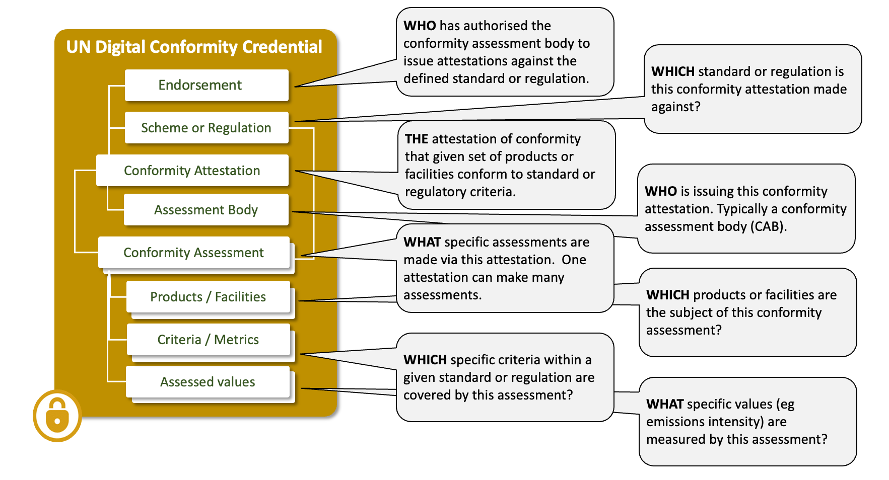
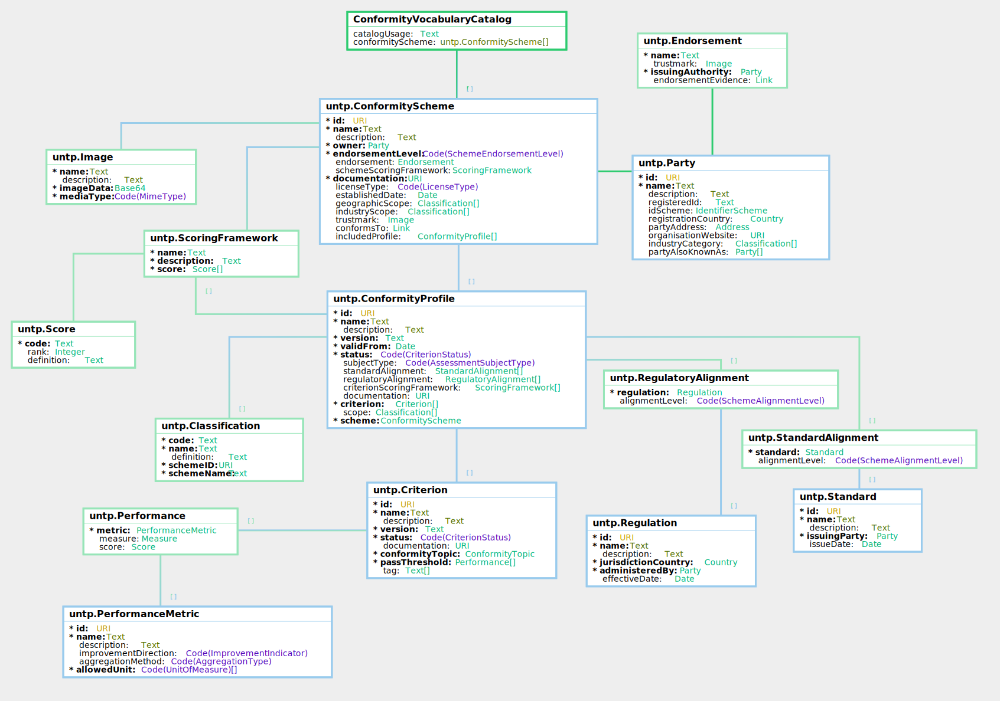

import Disclaimer from '../\_disclaimer.mdx';

<Disclaimer />

## Artifacts

### V0.7.0 Schema and Samples

The JSON schema and sample credential instances for the Conformity Credential are maintained in this repository.

- **JSON Schema:**

| Schema                                                                                           | Description                                                                            |
| ------------------------------------------------------------------------------------------------ | -------------------------------------------------------------------------------------- |
| [ConformityCredential.json](pathname:///artefacts/schema/v0.7.0/dcc/ConformityCredential.json)   | Full credential schema including the W3C VC envelope and ConformityAttestation subject |
| [ConformityAttestation.json](pathname:///artefacts/schema/v0.7.0/dcc/ConformityAttestation.json) | Standalone schema for the ConformityAttestation credential subject                     |

- **Sample Instances:**

| Sample                                                                                                                            | Description                                              |
| --------------------------------------------------------------------------------------------------------------------------------- | -------------------------------------------------------- |
| [ConformityCredential_instance.json](pathname:///artefacts/samples/v0.7.0/dcc/ConformityCredential_instance.json)                 | Conformity certification of a copper mine in Zambia      |
| [ConformityCredential_smelter_instance.json](pathname:///artefacts/samples/v0.7.0/dcc/ConformityCredential_smelter_instance.json) | Conformity certification of a copper refinery in Japan   |
| [ConformityCredential_battery_instance.json](pathname:///artefacts/samples/v0.7.0/dcc/ConformityCredential_battery_instance.json) | Conformity certification of a battery factory in Germany |

The three samples represent conformity assessments at successive stages of a copper-to-battery supply chain.

### Vocabulary and Context

The Conformity Credential is built on the [UNTP Core Vocabulary](CoreVocabulary.md), which defines the shared classes and properties used across all UNTP credential types. The machine-readable vocabulary and JSON-LD context files are published at [https://vocabulary.uncefact.org/untp/](https://vocabulary.uncefact.org/untp/).

## Overview

A product passport may make various separate claims (eg emissions intensity, deforestation free, fair work, etc), each of which may be linked to a specific conformity credential As well as providing details of assessment standards used to substantiate a claim, the conformity credential may also reference an assurance credential that attests to the authority of the party to perform the specific ESG assessments.

Conformity assessment bodies (CABs) undertake assessments for the purpose of determining whether products, processes or organisations meet specified requirements. The joint UNIDO/ISO publication Building Trust - The [Conformity Assessment Toolbox](https://www.unido.org/sites/default/files/2009-10/building_trust_FINAL_0.pdf) represents a useful resource for understanding conformity assessment and its role in international trade.

The conformity credential data model was originally developed by a separate [UN/CEFACT project on digital conformity.](https://unece.org/sites/default/files/2023-10/WhitePaper_DigitalProductConformityCertificateExchange.pdf)

## Conceptual Model



## Requirements

The conformity credential is designed to meet the following detailed requirements as well as the more general [UNTP Requirements](https://untp.unece.org/docs/about/Requirements).

| ID    | Name                             | Requirement Statement                                                                                                                                                                                                                                                                                                                                  | Solution Mapping                                                                                                                 |
| ----- | -------------------------------- | ------------------------------------------------------------------------------------------------------------------------------------------------------------------------------------------------------------------------------------------------------------------------------------------------------------------------------------------------------ | -------------------------------------------------------------------------------------------------------------------------------- |
| CC-01 | Signed                           | The issuer of the CC, typically a conformity assessment body (CAB), MUST be verifiable                                                                                                                                                                                                                                                                 | CC MUST be issued as a digital [verifiable credential](VerifiableCredentials.md) signed by the CAB                               |
| CC-02 | Assurance level                  | The CC MUST identify the nature of assurance over the assessment process, , such as formal recognition by a Governmental authority or an Accreditation Body                                                                                                                                                                                            | `ConformityAttestation.assessorLevel`, `ConformityAttestation.assessmentLevel`, and `ConformityAttestation.authorisation`        |
| CC-03 | Object of conformity             | The CC MUST unambiguously identify the object of the conformity assessment, whether a product, facility or organisation.                                                                                                                                                                                                                               | `ConformityAssessment.assessedProduct`, `ConformityAssessment.assessedFacility`, `ConformityAssessment.assessedOrganisation`     |
| CC-04 | Reference standard or regulation | The CC MUST identify the reference standard(s) and/or regulation(s) that specify the criteria against which the conformity assessment is made. If appropriate this must include specific measurable thresholds (eg minimum tensile strength)                                                                                                           | `ConformityAttestation.referenceScheme`, `ConformityAttestation.referenceProfile`, and `ConformityAssessment.assessmentCriteria` |
| CC-05 | Conformity Attestation           | The CC MUST unambiguously state whether or not the object of the assessment is conformant to the reference standard or regulation criteria                                                                                                                                                                                                             | `ConformityAssessment.conformance`                                                                                               |
| CC-06 | Measured metrics                 | The CC SHOULD include actual measured values (eg emissions intensity, tensile strength, etc) with the conformity assessment                                                                                                                                                                                                                            | `ConformityAssessment.assessedPerformance`                                                                                       |
| CC-07 | Evidence                         | The CC MAY include references to audit-able evidence (eg instrument recordings, satellite images, etc) to support the assessment. If so then the hash of the evidence file-set SHOULD be included (so that an auditor can be sure that the evidence data has not changed). The evidence data MAY be encrypted with decryption keys provided on request | `ConformityAttestation.auditableEvidence`                                                                                        |

## Logical Model

The Conformity Credential is an assembly of re-usable components from the UNTP core vocabulary.



For detailed class and property definitions, see the [Core Vocabulary](CoreVocabulary.md) reference. Conformity topic and performance metric classifications are defined in the [Core Taxonomies](CoreTaxonomies.md). For implementation details and sample JSON-LD snippets, see [The Components of a Conformity Credential](#the-components-of-a-conformity-credential) below.

## Assessment Assurance

Formal processes for substantiating claims made about products, processes or services represent a fundamental concept within [UNECE Recommendation No.49](https://unece.org/trade/documents/2025/07/session-documents/revised-recommendation-no-49-transparency-scale-fostering) and within UNTP. However, for such processes to be reliable, it is essential to define the basis for confidence in such processes.

The UNTP approach embraces the objectives and design principles of UNECE Recommendation No. 49, by emphasising the concepts of verifiability, independence, international standards and the role of recognised authorities.

In this context, three categories of assurance have been defined, as follows.

| Assurance Category               | Description                                                                                                                                                                                                                                                                                           |
| -------------------------------- | ----------------------------------------------------------------------------------------------------------------------------------------------------------------------------------------------------------------------------------------------------------------------------------------------------- |
| **Authority-derived assurance**  | Assurance is available via one of the listed pathways that assessment credibility has been established and maintained in alignment with the objectives and design principles of UECE Rec. 49 and international conformity norms.                                                                      |
| **Scheme-derived assurance**     | Care is recommended as credibility derives from assurances provided by the referenced scheme, which may not represent suitable assurance that assessment credibility has been established in alignment with the objectives and design principles of UNECE Rec. 49 and international conformity norms. |
| **No UNTP-recognised assurance** | Available assurances are not recognised as representing suitable assurance that assessment credibility has been established in alignment with the objectives and design principles of UNECE Rec. 49 and international conformity norms.                                                               |

Describing assurance over the conformity assessment chain of results necessarily requires consideration of both the CAB processes and the scheme (or program) under which the assessment is delivered. However, assurance over a scheme and assurance over the conformity assessment processes (relating to that scheme) may, in some cases, be established by different processes and by different parties and it is the combination of these that provides a more complete understanding of assessment assurance.

Defined assessment assurance levels are summarised below. Note that these relate to assurances over a scheme and the scheme processes implemented by CABs. They do NOT relate to assurances that arise from a scheme, for example, approval or certification of manufacturers, suppliers or products/processes/services covered by a scheme.

Eligibility for a given assessment assurance level can be digitally verified through data points linked to a conformity credential and/or scheme representation. Any recognitions indicated are to be maintained as current, with currency defined by the party providing such recognition.

#

<table style={{borderCollapse: "collapse", width: "100%", fontSize: "0.85em"}}>
  <tr>
    <td rowspan="4" style={{backgroundColor: "#4472C4", color: "white", fontWeight: "bold", padding: "8px", verticalAlign: "middle", minWidth: "100px"}}>
      SCHEME<br/>EVALUATION<br/>ALTERNATIVES
    </td>
    <td colspan="2" style={{padding: "8px", backgroundColor: "#FDF5D8", border: "1px solid #aaa"}}>
      <strong>Self-declaration by scheme owner</strong><br/><em>See Note 1</em>
    </td>
    <td colspan="5" style={{padding: "8px", border: "1px solid #aaa"}}>
    </td>
  </tr>
  <tr>
    <td colspan="2" style={{padding: "8px", border: "1px solid #aaa", textAlign: "right"}}>Or</td>
    <td colspan="4" style={{backgroundColor: "#E4F1D1", padding: "8px", border: "1px solid #aaa"}}>
      <strong>Evaluation of scheme suitability by a recognised authority</strong><br/><em>See Note 2</em>
    </td>
    <td colspan="1" style={{padding: "8px", border: "1px solid #aaa"}}>
    </td>
  </tr>
  <tr>
    <td colspan="3" style={{padding: "8px", border: "1px solid #aaa", textAlign: "right"}}>Or</td>
    <td colspan="3" style={{backgroundColor: "#E4F1D1", padding: "8px", border: "1px solid #aaa"}}>
      <strong>Government-owned scheme or government-mandated scheme</strong><br/><em>See Note 3</em>
    </td>
    <td colspan="1" style={{padding: "8px", border: "1px solid #aaa"}}>
    </td>
  </tr>
  <tr>
    <td colspan="5" style={{padding: "8px", border: "1px solid #aaa", textAlign: "right"}}>Or</td>
    <td colspan="2" style={{backgroundColor: "#E4F1D1", padding: "8px", border: "1px solid #aaa"}}>
      <strong>Benchmarking of scheme</strong><br/><em>See Note 4</em>
    </td>
  </tr>

  <tr>
    <td colspan="8" style={{textAlign: "center", fontSize: "1.5em", fontWeight: "bold", padding: "8px", border: "none"}}>+</td>
  </tr>

  <tr>
    <td style={{backgroundColor: "#4472C4", color: "white", fontWeight: "bold", padding: "8px", verticalAlign: "middle"}}>
      CONFORMITY<br/>ASSESSMENT<br/>ASSURANCE<br/>TYPE<br/><br/><em style={{fontWeight: "normal"}}>See Note 5</em>
    </td>
    <td style={{padding: "8px", backgroundColor: "#FDF5D8", border: "1px solid #aaa", verticalAlign: "top"}}>
      Scheme owner recognition of other parties assessing against the scheme standards<br/><br/><em>See Notes 6 &amp; 7</em>
    </td>
    <td style={{padding: "8px", backgroundColor: "#FDF5D8", border: "1px solid #aaa", verticalAlign: "top"}}>
      Scheme owner directly conducting conformity assessment activities<br/><br/><em>See Note 6</em>
    </td>
    <td style={{backgroundColor: "#E4F1D1", padding: "8px", border: "1px solid #aaa", verticalAlign: "top"}}>
      Independent peer assessment for accredited CAB<br/><br/><em>See Notes 8 &amp; 9</em>
    </td>
    <td style={{backgroundColor: "#E4F1D1", padding: "8px", border: "1px solid #aaa", verticalAlign: "top"}}>
      Peer assessment process managed by government<br/><br/><em>See Note 3</em>
    </td>
    <td style={{backgroundColor: "#E4F1D1", padding: "8px", border: "1px solid #aaa", verticalAlign: "top"}}>
      Accreditation of CAB under global mutual recognition arrangement by a body peer-evaluated to ISO/IEC 17011<br/><br/><em>See Note 10</em>
    </td>
    <td style={{backgroundColor: "#E4F1D1", padding: "8px", border: "1px solid #aaa", verticalAlign: "top"}}>
      Government mandate for conformity assessment activity<br/><br/><em>See Note 3</em>
    </td>
    <td style={{backgroundColor: "#E4F1D1", padding: "8px", border: "1px solid #aaa", verticalAlign: "top"}}>
      Benchmarking of scheme by an organization approved to UNIDO benchmarking principles and process<br/><br/><em>See Note 11</em>
    </td>
  </tr>

  <tr>
    <td colspan="8" style={{textAlign: "center", fontSize: "1.5em", fontWeight: "bold", padding: "8px", border: "none"}}>=</td>
  </tr>

  <tr>
    <td style={{backgroundColor: "#4472C4", color: "white", fontWeight: "bold", padding: "8px", verticalAlign: "middle"}}>
      RESULT:<br/>ASSESSMENT<br/>ASSURANCE<br/>LEVEL
    </td>
    <td style={{backgroundColor: "#F4A142", padding: "8px", border: "1px solid #aaa", verticalAlign: "top"}}>
      <strong>Scheme-derived assurance:</strong> Recognition of CAB by registered scheme
    </td>
    <td style={{backgroundColor: "#F4A142", padding: "8px", border: "1px solid #aaa", verticalAlign: "top"}}>
      <strong>Scheme-derived assurance:</strong> Self-declaration by registered scheme
    </td>
    <td style={{backgroundColor: "#70AD47", color: "white", padding: "8px", border: "1px solid #aaa", verticalAlign: "top"}}>
      <strong>Authority-derived assurance:</strong> Peer assessment body recognition for accredited CAB
    </td>
    <td style={{backgroundColor: "#70AD47", color: "white", padding: "8px", border: "1px solid #aaa", verticalAlign: "top"}}>
      <strong>Authority-derived assurance:</strong> Recognition by a governmental peer assessment authority
    </td>
    <td style={{backgroundColor: "#70AD47", color: "white", padding: "8px", border: "1px solid #aaa", verticalAlign: "top"}}>
      <strong>Authority-derived assurance:</strong> Global accreditation mutual recognition arrangement
    </td>
    <td style={{backgroundColor: "#70AD47", color: "white", padding: "8px", border: "1px solid #aaa", verticalAlign: "top"}}>
      <strong>Authority-derived assurance:</strong> Recognition by government mandate
    </td>
    <td style={{backgroundColor: "#70AD47", color: "white", padding: "8px", border: "1px solid #aaa", verticalAlign: "top"}}>
      <strong>Authority-derived assurance:</strong> Recognition by approved benchmarking organisation
    </td>
  </tr>
</table>

**Notes to Table:**

1. The form of the self-declaration will be in accordance with a UNTP template reflecting relevant international standards.
2. This refers to evaluation of a scheme by the Global Accreditation Cooperation Incorporated or through this body’s regional accreditation cooperation members or member bodies of its Mutual Recognition Arrangement for such scope - this supersedes the role of the former International Accreditation Forum (refer [www.globalaccreditationcooperationincorporated.org](https://www.globalaccreditationcooperationincorporated.org)).
3. Ownership or mandate provided by national government or intergovernmental entity.
4. Scheme benchmarking organisations shall ensure that a scheme suitability assessment has been conducted for the candidate scheme.
5. A CAB issuing UNTP conformity credentials may also be the scheme owner.
6. The linked scheme self-declaration can be used to assist in judging credibility of the scheme.
7. Users of conformity credentials issued by a CAB recognised under a scheme may refer to the linked scheme self-declaration for details of the CAB-approval process used by the scheme owner.
8. This pathway applies to CABs acccredited under the Mutual Recognition Arrangement of the Global Accreditation Cooperation Incorporated
9. Schemes used by CABs may be owned by the peer assessment body but the CAB itself shall not be owned by or otherwise related to the peer assessment body.
10. Scheme evaluation is a prerequisite for accreditation of CABs by bodies that are signatories to the Global Accreditation Cooperation Incorporated Mutual Recognition Arrangement.
11. UNIDO Global Best Practice Framework for Organisations Performing Benchmarking Activities for Certification-related Conformity Assessment Schemes 2026. The process for approval of benchmarking organisations to the UNIDO principles is still to be defined.

In terms of the processes that must be applied for the listed assurance pathways, it is important to recognise that all of the following need to be addressed (except in the case of government-owned schemes, or direct government approval of CABs).

1.  **Scheme Governance**

    Meet applicable international standards\* which address scheme governance and integrity.

2.  **Development of scheme**

    Meet applicable international standards\* which address scheme development.

3.  **Standards Development**

    Meet applicable international standards\* which address the development of scheme standards.

4.  **Competency of personnel**

    Demonstrate that personnel are trained and/or certified as competent in the following activities:

    -     Development of standards and schemes
    - Governance, management, design, development, validation of the scheme, implementation and monitoring the integrity of the conformity assessment scheme through ethical and impartial requirements for those engaging in the process

5.  **Conformity assessment**

    Meet applicable international standards\* for management of conformity assessment processes.

\*All references to ’international standards’ in the above list mean standards that are globally accepted and published for the purpose of standardising the management and delivery of conformity assessment schemes (or programs) of relevance to the product/process/organisation attributes for which assurance is to be demonstrated. Refer to the ‘International Standards’ table in the next section for examples of relevant standards.

Examples of international standards supporting assurance pathways are provided in the table below.

| Name                                 | Description                                                                                                                                                                                                                                                                                                                                                                                                                                                                                                                                                                                                                                              |
| ------------------------------------ | -------------------------------------------------------------------------------------------------------------------------------------------------------------------------------------------------------------------------------------------------------------------------------------------------------------------------------------------------------------------------------------------------------------------------------------------------------------------------------------------------------------------------------------------------------------------------------------------------------------------------------------------------------- |
| **Scheme - Governance**              | Example standards: IAF MD-25, ISEAL Good Practice Guide for Sustainability Systems (GPGSS), ISEAL Credibility Principles, ISSA 5000, ICVCM CCP Assessment Framework, ICROA, UNFCCC – CDM, ISO 14030 , SBTi, ISO/IEC 17060, ISO/IEC 17067, ISO/IEC 17026, ISO/IEC 17032, ISO/IEC 17028, ISO /IEC17029, GFSI, SSCI, GSSI, ASC, PEFC, MSC, RSPO, SAC , FSC, RJC, ICMM, GEN, GLOBALG.A.P, ISO 14065, ISO/IEC 17020, ISO/IEC 17021-1, ISO 19011, GSTC, ISO 21401, ISO 21621, ISO 21902, IMDRF, ITU Conformity assessment and interoperability program, Global Certification Forum (GCF), PTCRB, CTIA, GSMA, IRMA, ICROA, ISSB, Cloud Security Alliance (CSA). |
| **Scheme - Development of scheme**   | Example standards: IAF MD-25, ISO/IEC 17007, ISO/IEC 17060, ISO/IEC 17065, ISO/IEC 17067, ISEAL GPGSS, ISO Guide 82, ISO 14019- Parts I, 2 and 4, ISO 14020, ISO 14021, ISO 14024, ISO/IEC 14025, ISO 14067, ISO 14068, ISO 14064 - Parts I, 2 and 3, GHG Protocol: <br/><span style={{display:'block', paddingLeft:'2em'}}>Note: In the case of peer assessment or benchmarking pathways, alternative standards may be nominated (such as WRI, GRI, IFRS/ISSB, FAO- CODEX Alimentarius, USGBC) for use within the specific context of the peer assessment or benchmarking program</span>                                                                |
| **Scheme - Standards Development**   | Example standards: ISO/IEC 17007, ISEAL GPGSS, ISO Guide 2, ,ISO Guide 59, ISO Guide 78, ISO Guide 64, ISO Guide 76, ISO Guide 82                                                                                                                                                                                                                                                                                                                                                                                                                                                                                                                        |
| **Scheme - Competency of personnel** | Principles for defining competence of personnel may be found in ISO/IEC 17024 as well as supplementary references such as IAF MD 25, ISO/IEC 17021-1, ISSA 5000, ISEAL GPGSS, ISO Guide 82, ISO IWA 48, ISO 14019- Parts I, 2 and 4, ISO 14020, ISO 14021, ISO 14024, ISO/IEC 14025, ISO 14030, ISO 14067, ISO 14064 - Parts I, 2 and 3, ISO 14065, ISO 14068, IPC VVB Verifier/validator, SBTi, UNFCCC Article 6 - CDM                                                                                                                                                                                                                                  |
| **Conformity assessment**            | Example standards: ISO CASCO toolbox of standards. <br/><span style={{display:'block', paddingLeft:'2em'}}>Note: In the case of peer assessment or benchmarking pathways, alternative standards may be nominated (such as ISEAL, IECEE Conformity Assessment Systems, GRI, The International EPD System, ICVCM CCP Assessment Framework, ICROA, ISO 14030, SBTi, GEN, UNFCC&IPCC, OECD, FAO&WHO, GSSI or SSCI standards, IFOAN, SMIIC, UNFCCC Article 6 - CDM, UNIDO, WRI) for use within the specific context of the overall peer assessment or benchmarking program.</span>                                                                            |

## The Components of a Conformity Credential

This section provides sample JSON-LD snippets for each Conformity Credential component, drawn from the [copper mine sample credential](pathname:///artefacts/samples/v0.7.0/dcc/ConformityCredential_instance.json).

### Credential Envelope

All Conformity Credentials are issued as [W3C Verifiable Credentials (VCDM 2.0)](https://www.w3.org/TR/vc-data-model-2.0/). The credential `type` includes both `VerifiableCredential` and `DigitalConformityCredential`, and the `@context` references both the W3C VCDM and UNTP context URIs. The issuer `id` SHOULD be a DID using a supported [DID method](VerifiableCredentials.md#did-methods), with `issuerAlsoKnownAs` linking to authoritative business register identifiers. The issuing party should be the conformity assessment body (CAB). Please refer to [DPP VC Guidance](DigitalProductPassport.md#verifiable-credential) for further information about the use of the verifiable credentials data model for UNTP.

```json
{
  "type": ["DigitalConformityCredential", "VerifiableCredential"],
  "@context": [
    "https://www.w3.org/ns/credentials/v2",
    "https://vocabulary.uncefact.org/untp/"
  ],
  "id": "https://credentials.sample-cab.example.com/dcc/mine-001",
  "issuer": {
    "type": ["CredentialIssuer"],
    "id": "did:web:sample-cab.example.com",
    "name": "Sample Conformity Assessment Body",
    "issuerAlsoKnownAs": [
      {
        "id": "https://sample-register.example.com/companies/CAB-001",
        "name": "Sample Conformity Assessment Services Pty Ltd",
        "registeredId": "CAB-001",
        "idScheme": {
          "id": "https://sample-register.example.com",
          "name": "Swiss Central Business Name Index (ZEFIX)"
        }
      }
    ]
  },
  "validFrom": "2025-01-15T00:00:00Z",
  "validUntil": "2028-01-15T00:00:00Z",
  "name": "Coppermark Certification — Sample Copper Mine",
  "credentialSubject": {
    "type": ["ConformityAttestation"],
    "...": "..."
  }
}
```

### Conformity Attestation

The `ConformityAttestation` is the `credentialSubject` of the Conformity Credential. It is best thought of as the digital version of the paper product or facility conformity certificate.

- The `id` MUST be a globally unique identifier (URI) for the attestation. Typically a certificate number with the CAB web domain as a prefix.
- `assessorLevel` classifies the independence of the party performing the assessment (e.g. `3rdParty`, `2ndParty`, `1stParty`).
- `assessmentLevel` classifies the assurance over the assessment process (e.g. `authority-benchmark`, `scheme-owner`, `unspecified`).
- `attestationType` indicates the type of attestation (e.g. `certification`, `inspection`, `testing`).
- `issuedToParty` identifies the entity to whom the attestation is issued — usually the product manufacturer or facility operator.
- `referenceScheme` and `referenceProfile` link this attestation to a published [Conformity Vocabulary Catalog](ConformityVocabularyCatalog.md), identifying the scheme and the specific profile under which the assessment was conducted.
- `profileScore` records the overall assessment outcome against the scheme’s scoring framework.
- `authorisation` lists accreditations that a competent authority has issued to the CAB, providing trust that the certifier is properly accredited.
- `conformityCertificate` links to the full certificate document (e.g. a PDF), with optional integrity verification via `digestMultibase`.
- `auditableEvidence` links to the evidence files that informed the assessments. These are usually commercially sensitive but important for audits.
- `conformityAssessment` is an array of detailed assessments made about identified products or facilities against specific criteria.

```json
"credentialSubject": {
  "type": ["ConformityAttestation"],
  "id": "https://coppermark-cab.example.com/attestation/CM-KM-2025-001",
  "name": "Coppermark Responsible Production Certificate — Sample Mine",
  "description": "Third-party conformity assessment of Sample Copper Mine against Coppermark Responsible Risk Assessment (RRA) v3.0, covering environmental, social, and governance criteria for responsible copper production.",
  "assessorLevel": "3rdParty",
  "assessmentLevel": "authority-benchmark",
  "attestationType": "certification",
  "issuedToParty": {
    "id": "did:web:sample-mine.example.com",
    "name": "Sample Copper Mine Pty Ltd",
    "registeredId": "MINE-001",
    "idScheme": {
      "id": "https://sample-register.example.com",
      "name": "Patents and Companies Registration Agency (Zambia)"
    }
  },
  "authorisation": ["..."],
  "referenceScheme": {"..."},
  "referenceProfile": {"..."},
  "profileScore": {"..."},
  "conformityCertificate": {"..."},
  "auditableEvidence": {"..."},
  "conformityAssessment": ["..."]
}
```

### Authorisation

Authorisations are endorsements issued by a competent authority (such as a government agency, a national accreditation authority, or a scheme owner) to the conformity assessment body. They provide trust that the CAB is properly accredited to issue certificates under the referenced scheme.

- `name` describes the accreditation.
- `trustmark` is a base64-encoded image typically shown on paper accreditations.
- `issuingAuthority` identifies the competent authority that granted the endorsement.
- `endorsementEvidence` is a `Link` to the actual accreditation details. This SHOULD point to a trusted source such as a web page on the accreditation authority site or a digital verifiable credential.

Note that the `authorisation` structure is part of the attestation issued by the CAB. As such it is only an unverified claim until confirmed via the `endorsementEvidence` link.

```json
"authorisation": [
  {
    "name": "Accreditation of Sample Conformity Assessment Body as a Coppermark Approved Assessment Firm.",
    "trustmark": {
      "name": "Coppermark Approved Assessor",
      "description": "Trust mark issued by The Copper Mark Company to accredited assessment firms.",
      "imageData": "Y29wcGVybWFyay1sb2dv",
      "mediaType": "image/png"
    },
    "issuingAuthority": {
      "id": "https://coppermark.org",
      "name": "The Copper Mark Company",
      "registeredId": "CM-AUTH-001",
      "idScheme": {
        "id": "https://coppermark.org",
        "name": "Coppermark Registry"
      }
    },
    "endorsementEvidence": {
      "linkURL": "https://coppermark.org/approved-assessors/sgs",
      "linkName": "Sample CAB Coppermark Accreditation",
      "mediaType": "text/html",
      "linkType": "https://test.uncefact.org/vocabulary/linkTypes/dcc"
    }
  }
]
```

### Reference Scheme, Profile, and Profile Score

The `referenceScheme` and `referenceProfile` properties link the attestation to a published [Conformity Vocabulary Catalog](ConformityVocabularyCatalog.md) (CVC). The scheme identifies the overarching conformity program; the profile identifies the specific versioned set of criteria under which this assessment was conducted. The `profileScore` records the overall outcome using the scoring framework defined by the scheme.

- `referenceScheme` identifies the conformity scheme by its `id` and `name`.
- `referenceProfile` identifies the specific versioned profile within the scheme.
- `profileScore` carries the overall result using a `code`, `rank`, and `definition` drawn from the scheme’s scoring framework.

```json
"referenceScheme": {
  "id": "https://coppermark.org",
  "name": "Coppermark"
},
"referenceProfile": {
  "id": "https://coppermark.org/rra/v3.0",
  "name": "Coppermark Responsible Risk Assessment (RRA) v3.0"
},
"profileScore": {
  "code": "fully-meets",
  "rank": 3,
  "definition": "The site fully meets all applicable Coppermark criteria with no significant non-conformances."
}
```

### Conformity Certificate and Auditable Evidence

The `conformityCertificate` and `auditableEvidence` properties are both `Link` objects. The certificate links to the full version of the conformity attestation (e.g. a PDF or web page); the auditable evidence links to the underlying evidence files that informed the assessments.

- `linkURL` points to the external resource.
- `linkName` provides a human-readable description.
- `mediaType` specifies the content type of the linked resource.
- `linkType` classifies the link using a controlled vocabulary.
- `digestMultibase` may optionally be included to ensure content integrity — the hash of the target content at the time the credential was issued.

```json
"conformityCertificate": {
  "linkURL": "https://coppermark.org/participants/kansanshi-mining",
  "linkName": "Coppermark Public Certificate — Sample Copper Mine Pty Ltd",
  "mediaType": "text/html",
  "linkType": "https://test.uncefact.org/vocabulary/linkTypes/dcc"
},
"auditableEvidence": {
  "linkURL": "https://coppermark-cab.example.com/reports/CM-KM-2025-001-full.pdf",
  "linkName": "Full Assessment Report — Sample Mine (Restricted)",
  "mediaType": "application/pdf",
  "linkType": "https://test.uncefact.org/vocabulary/linkTypes/dcc"
}
```

### Conformity Assessment

One Conformity Credential may include many assessments in the `conformityAssessment` array. Each assessment represents the evaluation of an identified product, facility, or organisation against one or more specific criteria. A single assessment includes:

- A unique `id` and human-readable `name` and `description`.
- `assessmentCriteria` — one or more criteria from a standard, regulation, or scheme, each classified by a `conformityTopic`.
- `assessmentDate` — when the assessment was conducted.
- `assessedPerformance` — measured values quantifying the assessment outcome.
- `assessedFacility`, `assessedProduct`, or `assessedOrganisation` — the subject of the assessment, with `idVerifiedByCAB` indicating whether the CAB verified the subject’s identity.
- `conformance` — a boolean indicating whether the assessed subject conforms to the referenced criteria.

```json
"conformityAssessment": [
  {
    "type": ["ConformityAssessment"],
    "id": "https://coppermark-cab.example.com/assessment/CM-KM-2025-001-GHG",
    "name": "GHG Emissions Assessment (Criteria 26, 27)",
    "description": "Assessment of greenhouse gas emissions management, measurement, and reduction initiatives at Sample Copper Mine against Coppermark criteria 26 and 27.",
    "assessmentCriteria": ["..."],
    "assessmentDate": "2025-01-10",
    "assessedPerformance": ["..."],
    "assessedFacility": [
      {
        "facility": {
          "id": "https://facility-register.example.com/fac-001",
          "name": "Sample Copper Mine",
          "registeredId": "fac-001"
        },
        "idVerifiedByCAB": true
      }
    ],
    "assessedOrganisation": {
      "organisation": {
        "id": "did:web:sample-mine.example.com",
        "name": "Sample Copper Mine Pty Ltd",
        "registeredId": "MINE-001"
      },
      "idVerifiedByCAB": true
    },
    "conformance": true
  }
]
```

### Assessment Criteria and Conformity Topic

Each assessment references one or more criteria via the `assessmentCriteria` array. A criterion identifies a specific auditable requirement within a scheme, and MUST be classified by a `conformityTopic` drawn from the UNTP [Conformity Topics](CoreTaxonomies.md) taxonomy. The criterion `id` SHOULD be a URI published by the scheme owner via the [Conformity Vocabulary Catalog](ConformityVocabularyCatalog.md), so that the same criterion can be referenced unambiguously across Conformity Credentials, DPPs, and DFRs.

```json
"assessmentCriteria": [
  {
    "id": "https://coppermark.org/rra/v3.0/criterion/26",
    "name": "GHG Emissions — Coppermark Criterion 26",
    "conformityTopic": [
      {
        "type": ["ConformityTopic"],
        "id": "https://vocabulary.uncefact.org/conformity-topic/greenhouse-gas-emissions",
        "name": "Greenhouse Gas Emissions",
        "definition": "Assessment of direct and indirect greenhouse gas emissions across scopes 1, 2, and 3, including measurement, reporting, and reduction targets aligned with climate science."
      }
    ]
  },
  {
    "id": "https://coppermark.org/rra/v3.0/criterion/27",
    "name": "Energy Use and Efficiency — Coppermark Criterion 27",
    "conformityTopic": [
      {
        "type": ["ConformityTopic"],
        "id": "https://vocabulary.uncefact.org/conformity-topic/renewable-energy-use",
        "name": "Renewable Energy Use",
        "definition": "Adoption and integration of renewable energy sources to reduce reliance on fossil fuels and lower the carbon footprint of operations and products."
      }
    ]
  }
]
```

### Assessed Performance

The `assessedPerformance` array carries the measured values from the assessment. Each entry references a `metric` from the UNTP [Performance Metrics](CoreTaxonomies.md) taxonomy and provides either a numeric `measure` (value and unit), a categorical `score` (code and rank), or both.

```json
"assessedPerformance": [
  {
    "metric": {
      "id": "https://vocabulary.uncefact.org/performance-metric/scope-1-ghg-emissions",
      "name": "Scope 1 GHG Emissions"
    },
    "measure": {
      "value": 45000,
      "unit": "TNE"
    }
  }
]
```
