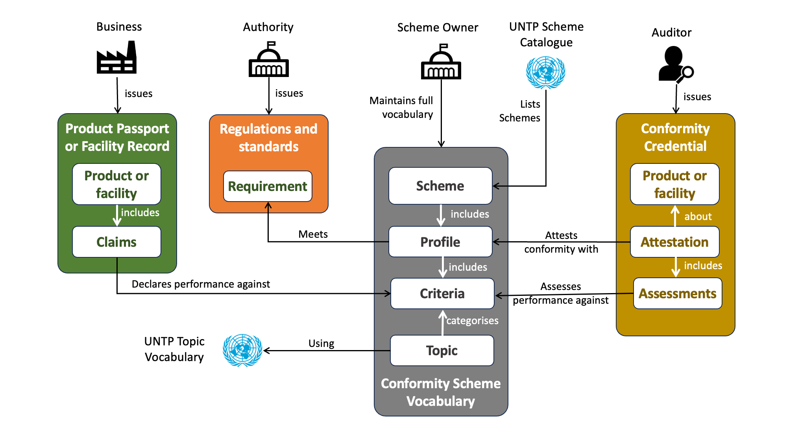
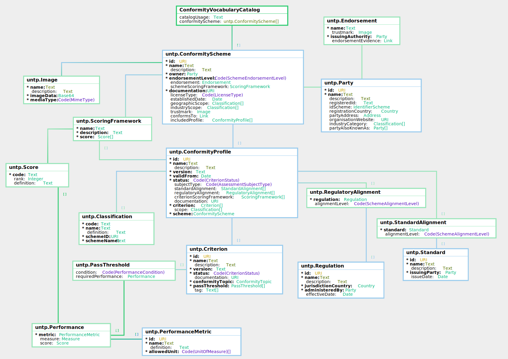

import Disclaimer from '../\_disclaimer.mdx';

<Disclaimer />

## Artifacts

### V0.7.0 Schema and Samples

A complete conformity vocabulary is a collection of linked Schemes, Profiles, and Criterion. The JSON schema and sample instances are maintained in this repository.

- **JSON Schema:**

| Schema                                                                                   | Description                                                                                           |
| ---------------------------------------------------------------------------------------- | ----------------------------------------------------------------------------------------------------- |
| [ConformityScheme.json](pathname:///artefacts/schema/v0.7.0/cvc/ConformityScheme.json)   | Schema for a conformity scheme including owner, endorsement, scoring framework, and included profiles |
| [ConformityProfile.json](pathname:///artefacts/schema/v0.7.0/cvc/ConformityProfile.json) | Schema for a versioned profile composing multiple criterion with standard and regulatory alignment    |
| [Criterion.json](pathname:///artefacts/schema/v0.7.0/cvc/Criterion.json)                 | Schema for an individual assessment criterion with conformity topic and pass threshold                |

- **Sample Instances:**

| Sample                                                                                                                    | Description                                                                     |
| ------------------------------------------------------------------------------------------------------------------------- | ------------------------------------------------------------------------------- |
| [ConformityScheme_instance.json](pathname:///artefacts/samples/v0.7.0/cvc/ConformityScheme_instance.json)                 | Minerals Assurance Scheme — endorsed scheme with three included profiles        |
| [ConformityProfile_instance.json](pathname:///artefacts/samples/v0.7.0/cvc/ConformityProfile_instance.json)               | Tantalum Processor Standard — profile with 12 criteria and regulatory alignment |
| [Criterion_due_diligence_instance.json](pathname:///artefacts/samples/v0.7.0/cvc/Criterion_due_diligence_instance.json)   | Supply chain due diligence criterion with score-based pass threshold            |
| [Criterion_mass_balance_instance.json](pathname:///artefacts/samples/v0.7.0/cvc/Criterion_mass_balance_instance.json)     | Mass balance controls criterion with numeric variance threshold                 |
| [Criterion_input_controls_instance.json](pathname:///artefacts/samples/v0.7.0/cvc/Criterion_input_controls_instance.json) | Processor input controls criterion with numeric verification rate threshold     |

The samples represent a minerals assurance scheme for responsible sourcing, with a tantalum processor profile and three representative criterion types.

## Overview

Web vocabularies are a means to bring consistent meaning to conformity claims and assessments throughout transparent value chains, by ensuring that the standards used in claims and assessments are referenced as unique digital objects. Different participants will reference the same documentation in an identical, machine-recognisable, manner. Critically, this enables DPP claims to be verified against corresponding conformity credentials and to facilitate comparison among different conformity credentials

To achieve these outcomes, not only must these digital objects be discoverable from a URI but the URI link itself must be version-specific and be persistent. This specification provides guidance for conformity scheme owners about how to publish their schemes and detailed criterion as linked data vocabularies so that they can be referenced by CABs in conformity credentials and by manufacturers in their DPP and DFR claims.

A key design principle is to keep the work of CABs and Manufacturers simple by pushing re-usable complexity to the scheme. For example, when a scheme owner is responsible for the deconstruction of their scheme into fine grained and categorised criterion then the criteria against which assessments are undertaken by CABs are made transparent through references within conformity credentials to the scheme vocabulary. Similarly, when scheme owners clearly reference all standards and regulations that their scheme is designed to meet then verifiers can easily assess whether a given conformity credential is sufficient to meet their regulatory compliance needs.

## Conformity Vocabulary Catalog

UNTP will maintain a catalogue of schemes that are registered with UNTP by scheme owners and have implemented this specification. This provides an entry point for discovery of rich scheme data maintained consistently by multiple scheme owners.

- The first (current) version is the current [Scheme Owners](../implementations/SchemeOwners.md) registration page.
- Before the first stable release of UNTP, the various registers (conformity schemes, identifier schemes, etc) will be published as machine readable and human readable structured linked data.

The scheme register is also a useful source of examples as each scheme publishes it's conformity vocabulary.

## Standards and Regulations

Some conformity schemes generate their own standards internally and these may be formally referenced according to the Logical Model defined for the scheme vocabulary. It is also common for conformity schemes to reference formal standards (eg from ISO,national standards bodies or other institutions), often with the intention to meet legal requirements of national regulators or international treaties.

Therefore part of this specification also includes mechanisms to reference both internally-generated standards and relevant externally-published standards and regulations. In either case, for these references to be stable, meaningful and consistent across schemes, the standards and regulations themselves also need globally unique URI identifiers.

- Most regulations are already published by nation states in a digitally referenceable way as stable URLs. For example the Australian National Greenhouse and Energy Reporting (NGER) regulation measurement standards are permanently referenceable at https://www.legislation.gov.au/F2008L02309
- However, it is less common for Standards Development Organisations (SDOs) to maintain their catalogue of standards as digitally referenceable objects with appropriate version control. However, where it can be established that an SDO does produce viable digital references then these will be used for the purposes of UNTP.

## Conceptual Model

Diagram 1 shows how the CVC works with UNTP credentials, such as DPPs, facility records and conformity credentials, to bring unambiguous meaning to sustainability claims and assessments.

**Diagram 1:**

- Conformity Schemes (Grey) include one or more versioned profiles that are themselves composed from independently versioned criterion.
  - A criterion is a versioned set of auditable requirements related to a specific conformity topic such as Forced Labour. It is identified and referenced by a URI such as `myscheme.org/criterion/forced-labour/1.0.0`
  - A profile is essentially a versioned description of the scheme, or subset of a scheme, in terms of a broad conformity outcome elements, without including details of the auditable criteria. It is identified and referenced by a URI such as `myscheme.org/profiles/mine-site/1.0.0` It composes one or more versioned criterion (which containing the auditable criteria) to construct a higher level set of requirements against which a conformity attestation might be issued. A CVC profile may additionally link to any external national regulations, international conventions, voluntary standards etc, to which it is aligned and for which it aims to assist compliance.
  - Criterion and profiles are independently versioned. That's because a profile (v1.0.0) might compose 20 criterion. An update to the profile (eg v1.1.0) might only change a couple of criterion with the rest unchanged.
- DPP / DFR (green): Manufacturer or brand owners issue Product Passports and Facility Records that include a series of performance claims. Each claim should reference one or more criterion published by a scheme owner so that the claim is unambiguously understood. Note that a single DPP/DFR may make claims that reference criterion from multiple different schemes.
- Conformity Credential (brown): The UNTP conformity credential provides a means for a conformity assessment body to list assessment outcomes for specific products or facilities against defined criteria. A Conformity Credential (DCC) includes one `attestation` that maps to a CVC `profile` and multiple `assessments`, ech of which map to a CVC `criterion`
- A CVC profile should list the external national regulations, international conventions, and voluntary standards to which it is aligned and which it aims to assist compliance.

For a credential to verifiably support a claim contained in a DPP or DFR, there must be matching of the criteria referenced in the DPP/DFR and the supporting credential. Where assessments are undertaken in accordance with a scheme for which a scheme vocabulary exists, the mechanism for achieving such matching is to use the same identifier for the scheme criteria within both the DPP/DFR and the conformity credential.

Any conformity scheme is associated with a unique versioned set of participation rules and other scheme-level information established by the scheme owner, meaning that concurrently-delivered schemes or profiles involving rule variants or other differences (such as endorsement coverage) need to be registered as separate scheme vocabularies, even if owned and/or operated by the same entity. This is a different situation from where scheme rules may be updated but a transition period permitted, such that the validity of both versions may overlap for a period.

## Requirements

| ID     | Requirement Statement                                                                                                                                                                                                                                                                                                                                 | Solution Mapping                                                        |
| ------ | ----------------------------------------------------------------------------------------------------------------------------------------------------------------------------------------------------------------------------------------------------------------------------------------------------------------------------------------------------- | ----------------------------------------------------------------------- |
| CVC-01 | Scheme owners publish the granular scheme criteria, potentially reflecting different sustainability attributes recognised within my scheme and potentially at varying performance levels, which in such a way that each scheme criteria can be unambiguously referenced by issuers of conformity credentials, facility records, and product passports | [Conformity Vocabulary Schema](#conformity-vocabulary-schema)           |
| CVC-02 | Scheme owners need to manage versions of schemes to reflect changes in the criteria within a scheme so that claims and assessments can be understood within a specific version context                                                                                                                                                                | [Conformity Vocabulary Schema](#conformity-vocabulary-schema)           |
| CVC-03 | Scheme owners require guidance in establishing their vocabulary in accordance with the prescribed UNTP Schema.                                                                                                                                                                                                                                        | [Conformity Vocabulary Publishing Guide](#conformity-vocabulary-schema) |
| CVC-04 | Scheme owner tag scheme criteria with context labels such as commodity type or facility type so that a relevant assessment can be identified for a given context.                                                                                                                                                                                     | [Conformity Vocabulary Schema](#conformity-vocabulary-schema)           |
| CVC-05 | Conformity Assessment Bodies (CABs) are able to easily find the URI associated with any scheme criteria so that these can be correctly referenced in the assessments recorded in digital conformity credentials.                                                                                                                                      | [Conformity Scheme Register](#conformity-scheme-register)               |
| CVC-06 | Product suppliers or facility operators need to be able to easily find the URI associated with any scheme criteria so that these can be correctly referenced them in the claims recorded within product passports and facility records.                                                                                                               | [Conformity Scheme Register](#conformity-scheme-register)               |
| CVC-07 | Given that there are hundreds of sustainability schemes, each with potentially hundreds of scheme criteria, consumers of digital credentials need a classification for sustainability attributes to more easily compare assessments for a given sustainability attribute across different schemes.                                                    | [Conformity Criteria Topic Classification](#conformity-topic-codes)     |

## Conformity Vocabulary Schema

This conformity vocabulary publishing guide provides scheme owners with a best practice framework that can be used to publish their schemes as a hierarchy of criteria, each with a unique identifier (URI) and with rich metadata about each criteria (eg topic classification, regulatory alignment, performance thresholds, etc). This is a critical activity so that issuers of product passports, conformity credentials, and facility records, can unambiguously reference a scheme and it's criteria.

### Implementation Maturity Levels

This specification defines a very rich model for conformity schemes that will maximise the value that schemes can offer to their users. Full implementation may take scheme owners some time and so UNTP facilitates a phased implementation by defining a maturity model that allows implementers to start simple.

- **Level 1** - Scheme only: At a minimum, scheme owners need to specify a permanent ID (As a URL) for each scheme version that they manage (eg `scheme.company.com/standard-a/1.8.0`) including scheme level metadata such as assessment level and endorsement. This provides DCC issuers with an unambiguous scheme reference but does not break down the scheme into meaningful components.
- **Level 2** - Scheme & criteria : Scheme owners publish both their versioned schemes and versioned criterion as permanent URLs. Each criterion is also classified by UNTP conformity topic code. This provides supply chain actors facing multiple claims against multiple schemes with an easy way to make sense of the scope of conformity claims and assessments.
- **Level 3** - Full vocabulary: Scheme and criteria with full metadata as well as performance thresholds and standard / regulatory alignment mappings. Assessments based on such schemes provide supply chain actors with the most complete and comparable compliance map.

### Logical Model

This section describes the detailed logical data model of a conformity scheme vocabulary in more detail.

The key ideas in the logical model of a published conformity vocabulary are

- A conformity scheme has a unique ID, validity period, an owner, endorsement, and references one or more versioned scheme profiles.
- The conformity scheme may define performance levels against which criteria can be categorised. It may also define an allowed set of tags which can be assigned to criteria for the purposes of filtering or sorting.
- Scheme profile matches the scope of an audit under the scheme. Many schemes maintain different scoped profiles for different facility types (eg smelter, mine-site, etc), commodity types (eg cotton, copper, etc), or conformity topic (forced labour, emissions, etc). Each profile composes multiple versioned assessment criterion.
- Conformity profiles may define alignment (partial, meets, exceeds) against any regulations or standards.
- A criterion has a unique ID (a URI) which is the key reference for any claims or assessments of product or facilities made in product passports or conformity credentials.
- Each criterion must be classified according to the applicable UNTP [Conformity Topic Code](#conformity-topic-codes).
- A scheme criterion may specify a required performance threshold as a numeric (eg 300Mpa tensile strength) or a score (eg "B") which an assessed product or facility much achieve in order to be considered conformant.
- A scheme criterion may be classified according to formal classification schemes (eg applicable industry sector or commodity type).
- A given scheme criterion ID may be re-used by multiple Profile ID (for example a Scheme version increments but most of the conformity criteria don't change from one version to the next).

## Conformity Topic Codes

UNTP defines a standard taxonomy of conformity topics which should be used to classify criterion so that criterion across multiple schemes can be aligned around common topics such as forced labour, emissions, water usage, safety, etc. Please refer to [conformity topics](CoreTaxonomies.md) for further details.
