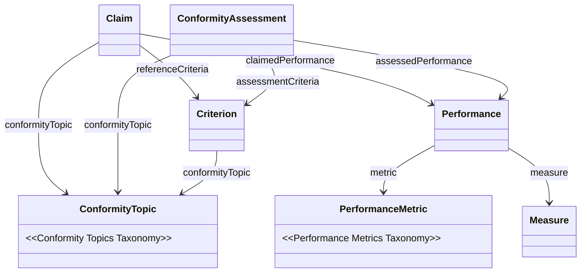

import Disclaimer from '../\_disclaimer.mdx';

<Disclaimer />

# Core Taxonomies

## Artifacts

### Published Taxonomies

The UNTP core taxonomies are published as linked data SKOS vocabularies.

| Taxonomy            | URL                                                                                                                                      |
| ------------------- | ---------------------------------------------------------------------------------------------------------------------------------------- |
| Conformity Topics   | [https://vocabulary.uncefact.org/conformity-topics/concepts](https://vocabulary.uncefact.org/conformity-topics/concepts)                 |
| Performance Metrics | [https://vocabulary.uncefact.org/performance-metrics/concepts-about](https://vocabulary.uncefact.org/performance-metrics/concepts-about) |

Each taxonomy is a [SKOS ConceptScheme](https://www.w3.org/TR/skos-reference/) with hierarchical concepts. The published URLs return human-readable HTML by default and machine-readable JSON-LD when requested with `Accept: application/ld+json`. The source files are maintained in this repository at `artefacts/vocabularies/untp-topics/` and `artefacts/vocabularies/untp-metrics/`.

## Taxonomy Overview

UNTP defines two complementary taxonomies that bring consistent meaning to the claims and assessments exchanged across supply chains.

### Conformity Topics

Hundreds of conformity schemes worldwide each publish their own criteria — covering everything from greenhouse gas emissions to labour rights to product safety. Without a common classification, a buyer receiving claims and assessments from dozens of suppliers across a complex value chain has no way to consistently understand what each criterion is about. The **Conformity Topics** taxonomy solves this by providing a standard hierarchical classification of conformity subject areas. Every `Criterion` in a claim or assessment is tagged with one or more topics from this taxonomy, so that criteria from different schemes can be understood, compared, and aggregated around common themes such as "Greenhouse Gas Emissions" or "Waste Minimisation". The topics are also mapped to key international frameworks including the [UN Sustainable Development Goals](https://sdgs.un.org/goals), the [OECD Guidelines for Multinational Enterprises](https://www.oecd.org/en/topics/responsible-business-conduct.html), and significant regulatory acts such as the [EU Deforestation Regulation](https://environment.ec.europa.eu/topics/forests/deforestation/regulation-deforestation-free-products_en) and the [EU Corporate Sustainability Due Diligence Directive](https://commission.europa.eu/business-economy-euro/doing-business-eu/sustainability-due-diligence-responsible-business/corporate-sustainability-due-diligence_en).

### Performance Metrics

Claims and assessments often include numerical performance measures — but without classification, a value like "10 Kg" is meaningless on its own. The **Performance Metrics** taxonomy provides a standard classification of quantitative measures such as "Scope 1 GHG Emissions" or "Recycled Content Percentage", giving consistent meaning to the numbers attached to claims and assessments. Each metric defines the recommended unit, aggregation method, and improvement direction, so that performance data can be correctly interpreted regardless of who issued the claim. Critically, the performance metrics are mapped to major international corporate disclosure frameworks including [IFRS Sustainability Disclosure Standards](https://www.ifrs.org/issued-standards/ifrs-sustainability-standards-navigator/) and [GRI Standards](https://www.globalreporting.org/standards/), so that consumers of product and facility-level performance data can consistently roll up supply chain measures into corporate-level sustainability disclosures.

### How the taxonomies connect to claims and assessments

The diagram below shows how the two taxonomies integrate with the UNTP vocabulary classes for claims and assessments. A supplier's `Claim` (carried on a product passport or facility record) and an independent `ConformityAssessment` (carried on a conformity credential) both reference the same `Criterion` — and both carry `Performance` data. The **Conformity Topics** taxonomy classifies the subject matter at the claim, assessment, and criterion level, ensuring consistent understanding of _what_ is being assessed. The **Performance Metrics** taxonomy classifies the quantitative `Measure` attached to each performance result, ensuring consistent understanding of _what was measured and how_. Because both supplier-issued claims and independently-issued assessments reference the same taxonomy-classified criteria and metrics, a downstream buyer can meaningfully compare self-declared performance against third-party verified results.



The reference tables below are **auto-generated** from the machine-readable vocabularies. Re-generate by running:

```bash
node scripts/generate-taxonomy-docs.js \
  website/docs/specification/CoreTaxonomies.md \
  --title "Core Taxonomies" --sidebar-position 42 \
  --vocab artefacts/vocabularies/untp-topics/untp-topics.jsonld \
    --section-title "Conformity Topics" \
  --vocab artefacts/vocabularies/untp-metrics/untp-metrics.jsonld \
    --section-title "Performance Metrics"
```

<!-- GENERATED:BEGIN conformity-topics -->

## Conformity Topics

A hierarchical classification scheme for conformity topics used to categorise conformity criteria published by scheme owners. Encompasses sustainability (environmental, social, governance), product integrity, trade compliance, technical conformity, and information security domains. Designed as a common reference taxonomy for interoperable conformity assessments across regulatory frameworks and voluntary standards.

**Version:** 0.2.0-working

**Top-level categories:** 11 | **Total concepts:** 101

### 01 Ecological Resilience

Environmental protection, resource conservation, and climate resilience. Covers emissions reduction, energy transition, water stewardship, waste prevention, biodiversity, and circular design.

> UN SDGs 6, 7, 12, 13, 14, 15; OECD Guidelines Chapter VI: Environment; EU ESPR Art. 5-8 and Annex I.

| Code  | Topic                         | Definition                                                                                                                                                                |
| ----- | ----------------------------- | ------------------------------------------------------------------------------------------------------------------------------------------------------------------------- |
| 01.01 | Greenhouse Gas Emissions      | Measuring, reporting, and reducing greenhouse gas emissions (CO2, methane, N2O, F-gases) across production, transport, and supply chain activities.                       |
| 01.02 | Renewable Energy Use          | Transition to sustainable energy sources including solar, wind, hydro, and other renewables in production and operations.                                                 |
| 01.03 | Water Conservation            | Sustainable water management including efficient use, pollution prevention, and watershed protection throughout operations and supply chains.                             |
| 01.04 | Waste Minimization            | Reducing waste generation through prevention, reuse, and improved production processes across the product lifecycle.                                                      |
| 01.05 | Ecosystem Preservation        | Protecting biodiversity, natural habitats, and ecosystem services from degradation caused by production and extraction activities.                                        |
| 01.06 | Forest Conservation           | Preventing deforestation and promoting sustainable forestry practices in raw material sourcing and land use.                                                              |
| 01.07 | Recycled Material Integration | Incorporation of secondary and recycled materials into production processes, reducing dependence on virgin resources.                                                     |
| 01.08 | Sustainable Product Design    | Designing products for durability, repairability, recyclability, and minimal environmental impact throughout their lifecycle.                                             |
| 01.09 | Chemical Safety               | Restriction and responsible management of hazardous substances in materials, products, and production processes.                                                          |
| 01.10 | Air Quality Management        | Controlling and reducing non-GHG air pollutant emissions including SOx, NOx, VOCs, particulates, and ozone-depleting substances from operations and production processes. |

### 02 Human Equity and Welfare

Protection of human rights, promotion of fair labor practices, and support for community wellbeing across operations and supply chains.

> UN SDGs 1, 3, 4, 5, 8, 10; OECD Guidelines Chapter IV: Human Rights and Chapter V: Employment and Industrial Relations; EU ESPR Art. 10.

| Code  | Topic                    | Definition                                                                                                                            |
| ----- | ------------------------ | ------------------------------------------------------------------------------------------------------------------------------------- |
| 02.01 | Rights and Equality      | Ensuring non-discrimination and equal treatment regardless of race, gender, religion, disability, or other protected characteristics. |
| 02.02 | Decent Work Conditions   | Provision of fair wages, reasonable working hours, and dignified employment conditions throughout the supply chain.                   |
| 02.03 | Workplace Safety         | Protecting worker health and safety through hazard prevention, protective equipment, and safe working environments.                   |
| 02.04 | Community Empowerment    | Supporting local community development, livelihoods, and participation in decisions that affect their wellbeing.                      |
| 02.05 | Worker Representation    | Respecting freedom of association, collective bargaining rights, and worker participation in workplace governance.                    |
| 02.06 | Forced Labor Elimination | Preventing all forms of forced, bonded, or compulsory labor including debt bondage and human trafficking in supply chains.            |
| 02.07 | Youth Protection         | Safeguarding young workers from hazardous conditions and eliminating child labor in all forms across supply chains.                   |
| 02.08 | Gender Equity            | Promoting gender diversity, equal opportunity, and elimination of gender-based discrimination in employment and business practices.   |

### 03 Ethical Governance

Promoting organizational integrity, accountability, and transparent practices in business operations and decision-making.

> UN SDG 16; OECD Guidelines Chapter II: General Policies and Chapter VII: Combating Bribery; EU ESPR Art. 11-12.

| Code  | Topic                            | Definition                                                                                                                     |
| ----- | -------------------------------- | ------------------------------------------------------------------------------------------------------------------------------ |
| 03.01 | Anti-Corruption Measures         | Preventing bribery, extortion, and corrupt practices through policies, controls, and organizational culture.                   |
| 03.02 | Open Reporting                   | Transparent disclosure of environmental, social, and governance performance to stakeholders and the public.                    |
| 03.03 | Legal Compliance                 | Adherence to applicable laws, regulations, and legal obligations in all jurisdictions of operation.                            |
| 03.04 | Responsible Procurement          | Ethical sourcing and purchasing practices that consider environmental, social, and governance factors in supplier selection.   |
| 03.05 | Stakeholder Inclusion            | Meaningful engagement with affected parties including workers, communities, and civil society in governance processes.         |
| 03.06 | Data Privacy                     | Protection of personal information and responsible data handling in compliance with privacy regulations and ethical standards. |
| 03.07 | Intellectual Property Protection | Respecting intellectual property rights including patents, trademarks, copyrights, and trade secrets.                          |
| 03.08 | Competitive Fairness             | Ensuring fair market practices, preventing anti-competitive behavior, and maintaining a level playing field.                   |

### 04 Product Integrity

Ensuring products are safe, reliable, and meet quality and sustainability standards throughout their lifecycle.

> UN SDGs 9, 12; OECD Guidelines Chapter VIII: Consumer Interests; EU ESPR Art. 4-7 and Annex I.

| Code  | Topic                     | Definition                                                                                                                       |
| ----- | ------------------------- | -------------------------------------------------------------------------------------------------------------------------------- |
| 04.01 | Product Safety Standards  | Ensuring consumer safety through compliance with product safety requirements, testing, and hazard prevention.                    |
| 04.02 | Quality Performance       | Meeting defined performance specifications, functional requirements, and quality benchmarks for products and services.           |
| 04.03 | Substance Control         | Banning or restricting harmful materials and substances of concern in product composition and manufacturing.                     |
| 04.04 | Product Longevity         | Enhancing product durability, repairability, and lifespan to reduce premature obsolescence and waste.                            |
| 04.05 | Standards Adherence       | Compliance with applicable product certifications, industry standards, and regulatory requirements.                              |
| 04.06 | Supply Chain Traceability | Tracking product origins, components, and transformations throughout the supply chain to enable transparency and accountability. |
| 04.07 | Consumer Information      | Providing clear, accurate, and accessible product labeling and information to enable informed consumer choices.                  |
| 04.08 | End-of-Life Management    | Effective collection, recycling, and disposal processes for products at end of useful life, minimizing environmental impact.     |

### 05 Circular Value Chains

Advancing sustainability, circularity, and responsible practices throughout supply and production networks.

> UN SDGs 8, 12, 17; OECD Guidelines Chapter II: General Policies and Chapter VI: Environment; EU ESPR Art. 8, 10.

| Code  | Topic                       | Definition                                                                                                                                    |
| ----- | --------------------------- | --------------------------------------------------------------------------------------------------------------------------------------------- |
| 05.01 | Ethical Material Sourcing   | Procuring raw materials through sustainable and responsible practices, avoiding conflict minerals and environmentally destructive extraction. |
| 05.02 | Supplier Sustainability     | Ensuring suppliers meet environmental, social, and governance requirements through assessment, monitoring, and collaboration.                 |
| 05.03 | Resource Circularity        | Promoting reuse, remanufacturing, and recycling of materials to create closed-loop resource flows.                                            |
| 05.04 | Energy Optimization         | Improving energy efficiency across supply chain operations including manufacturing, logistics, and warehousing.                               |
| 05.05 | Supply Chain Labor Rights   | Ensuring fair treatment of workers throughout the supply chain including subcontractors and informal workers.                                 |
| 05.06 | Origin Tracking             | Transparent documentation and verification of material and product origins throughout the supply chain.                                       |
| 05.07 | Supplier Development        | Building supplier capacity and capability to meet sustainability requirements through training, support, and partnership.                     |
| 05.08 | Supply Chain Risk Reduction | Identifying, assessing, and mitigating environmental, social, and operational vulnerabilities in supply networks.                             |

### 06 Economic Sustainability

Balancing profitability with sustainable economic practices that create shared value for businesses and communities.

> UN SDGs 8, 9; OECD Guidelines Chapter II: General Policies; EU ESPR Art. 5, 7, 10, 11.

| Code  | Topic                    | Definition                                                                                                                          |
| ----- | ------------------------ | ----------------------------------------------------------------------------------------------------------------------------------- |
| 06.01 | Business Resilience      | Building long-term profitability and organizational resilience through sustainable business models and practices.                   |
| 06.02 | Sustainable Investment   | Directing capital toward green initiatives, sustainable technologies, and projects with positive environmental and social outcomes. |
| 06.03 | Green Innovation         | Developing sustainable technologies, processes, and business models that reduce environmental impact while creating economic value. |
| 06.04 | Employment Opportunities | Creating decent jobs and fostering inclusive economic participation through sustainable business growth.                            |
| 06.05 | Regional Economic Growth | Supporting local economic development and equitable distribution of economic benefits in communities of operation.                  |
| 06.06 | Resource Efficiency      | Optimizing resource utilization to reduce costs and environmental impact while maintaining productivity.                            |
| 06.07 | Economic Risk Management | Assessing and managing financial risks arising from environmental, social, and governance factors.                                  |
| 06.08 | Supply Network Strength  | Enhancing the stability, diversity, and resilience of value chain networks against disruption.                                      |

### 07 Health and Safety Assurance

Prioritizing the health and safety of workers and communities through hazard prevention, preparedness, and wellbeing support.

> UN SDG 3; OECD Guidelines Chapter V: Employment and Industrial Relations; EU ESPR Art. 5, 10 and Annex I.

| Code  | Topic                    | Definition                                                                                                                                                                           |
| ----- | ------------------------ | ------------------------------------------------------------------------------------------------------------------------------------------------------------------------------------ |
| 07.01 | Workplace Hazard Control | Systematic identification, assessment, and mitigation of workplace hazards to reduce risk of injury and illness, including incident reporting, investigation, and corrective action. |
| 07.02 | Emergency Readiness      | Preparedness planning, training, and response capabilities for workplace emergencies including fire, chemical spills, and natural disasters.                                         |
| 07.03 | Exposure Management      | Controlling worker exposure to harmful chemical, biological, and physical agents through monitoring and protective measures.                                                         |
| 07.04 | Living Conditions        | Ensuring safe, sanitary, and dignified accommodation for workers where employer-provided housing is applicable.                                                                      |
| 07.05 | Healthcare Access        | Providing access to medical support, occupational health services, and health insurance for workers.                                                                                 |
| 07.06 | Wellbeing Support        | Addressing worker mental health, stress management, and overall wellbeing through support programs and workplace culture.                                                            |
| 07.07 | Nutrition Standards      | Ensuring safe, adequate, and nutritious food provisions for workers where employer-provided meals are applicable.                                                                    |
| 07.08 | Ergonomic Design         | Designing safe physical work environments that minimize musculoskeletal strain and support worker comfort and productivity.                                                          |

### 08 Systemic Sustainability

Establishing management frameworks, policies, and processes for systematic improvement of environmental, social, and governance outcomes.

> UN SDGs 12, 16; OECD Guidelines Chapter II: General Policies; EU ESPR Art. 4, 5, 10-12.

| Code  | Topic                     | Definition                                                                                                                                                                 |
| ----- | ------------------------- | -------------------------------------------------------------------------------------------------------------------------------------------------------------------------- |
| 08.01 | Sustainability Policies   | Formal organizational commitments, policies, and targets for environmental, social, and governance performance.                                                            |
| 08.02 | Risk Identification       | Systematic assessment and prioritization of environmental, social, and governance risks across operations and supply chains.                                               |
| 08.03 | Outcome Tracking          | Monitoring, measuring, and reporting on sustainability performance against defined targets and indicators.                                                                 |
| 08.04 | Capacity Building         | Training and developing stakeholder knowledge and skills to implement and maintain sustainability practices.                                                               |
| 08.05 | Process Enhancement       | Continuous improvement of operational processes to achieve better sustainability outcomes over time.                                                                       |
| 08.06 | Feedback Channels         | Accessible grievance mechanisms, whistleblower protections, and feedback systems for workers, communities, and stakeholders to raise concerns without fear of retaliation. |
| 08.07 | Compliance Verification   | Independent audits, inspections, and verification processes to confirm adherence to sustainability standards and regulations.                                              |
| 08.08 | Transparent Communication | Public disclosure and reporting of sustainability policies, performance, and progress to stakeholders.                                                                     |

### 09 Trade and Market Access

Adherence to trade regulations, customs requirements, market access rules, and cross-border compliance frameworks.

> WTO TBT and SPS Agreements; UNECE Trade Facilitation Recommendations; WCO Harmonized System.

| Code  | Topic                      | Definition                                                                                                                                |
| ----- | -------------------------- | ----------------------------------------------------------------------------------------------------------------------------------------- |
| 09.01 | Import and Export Controls | Compliance with cross-border trade restrictions, licensing requirements, and controlled goods regulations.                                |
| 09.02 | Customs Classification     | Accurate tariff classification and customs valuation of goods in accordance with the Harmonized System and national schedules.            |
| 09.03 | Rules of Origin            | Verification of product origin to determine eligibility for preferential tariff treatment under trade agreements.                         |
| 09.04 | Sanctions Compliance       | Adherence to international trade sanctions, embargoes, and restricted party screening requirements.                                       |
| 09.05 | Market Authorization       | Meeting regulatory requirements for market entry including product registration, type approval, and pre-market conformity assessment.     |
| 09.06 | Trade Documentation        | Accuracy, completeness, and digital exchange of trade and customs documentation including certificates, invoices, and declarations.       |
| 09.07 | Tariff and Duty Compliance | Correct assessment, declaration, and payment of applicable customs duties, taxes, and fees.                                               |
| 09.08 | Mutual Recognition         | Acceptance of conformity assessment results, certifications, and test reports across jurisdictions through mutual recognition agreements. |

### 10 Technical Conformity

Adherence to technical regulations, voluntary standards, and conformity assessment procedures that ensure product and process fitness for purpose.

> WTO TBT Agreement; ISO/IEC 17000 series conformity assessment standards; Codex Alimentarius.

| Code  | Topic                               | Definition                                                                                                                               |
| ----- | ----------------------------------- | ---------------------------------------------------------------------------------------------------------------------------------------- |
| 10.01 | Technical Regulations               | Compliance with mandatory government-imposed technical requirements for products, processes, and production methods.                     |
| 10.02 | Voluntary Standards                 | Adherence to consensus-based standards developed by recognized standards bodies for products, services, and management systems.          |
| 10.03 | Metrology and Measurement           | Accuracy and traceability of measurements and calibrations to national and international measurement standards.                          |
| 10.04 | Testing and Certification           | Third-party conformity assessment including laboratory testing, product certification, and inspection by accredited bodies.              |
| 10.05 | Sanitary and Phytosanitary Measures | Compliance with food safety, animal health, and plant health standards designed to protect human, animal, and plant life.                |
| 10.06 | Interoperability Standards          | Conformity with standards ensuring compatibility, data exchange, and seamless interaction between systems, components, and services.     |
| 10.07 | Accessibility Requirements          | Compliance with inclusive design and accessibility standards ensuring products and services are usable by people with diverse abilities. |
| 10.08 | Performance Specifications          | Meeting defined functional, reliability, and performance benchmarks established by regulations, standards, or contractual requirements.  |

### 11 Information Security and Digital Trust

Protection of data, digital systems, and information assets, and the establishment of trust frameworks for digital interactions.

> ISO/IEC 27001 Information Security; GDPR; eIDAS; NIST Cybersecurity Framework.

| Code  | Topic                             | Definition                                                                                                                                   |
| ----- | --------------------------------- | -------------------------------------------------------------------------------------------------------------------------------------------- |
| 11.01 | Data Protection and Privacy       | Safeguarding personal and sensitive data in compliance with privacy regulations, consent requirements, and ethical data handling principles. |
| 11.02 | Cybersecurity Controls            | Implementation of technical and organizational security measures to protect digital infrastructure from threats and vulnerabilities.         |
| 11.03 | Digital Identity and Trust        | Verification and assurance of digital identities, credentials, and trust relationships in electronic transactions and communications.        |
| 11.04 | Access Management                 | Controls for authentication, authorization, and system access ensuring only authorized parties can access resources and data.                |
| 11.05 | Incident Response and Recovery    | Preparedness planning, detection, response procedures, and recovery capabilities for security breaches and system failures.                  |
| 11.06 | System Integrity and Availability | Ensuring reliability, uptime, and integrity of digital systems through resilient architecture and continuity planning.                       |
| 11.07 | Encryption and Data Security      | Protection of data confidentiality and integrity in transit and at rest through cryptographic controls and key management.                   |
| 11.08 | Audit Trail and Accountability    | Logging, monitoring, and accountability mechanisms for digital activities to support compliance verification and forensic analysis.          |

<!-- GENERATED:END conformity-topics -->

<!-- GENERATED:BEGIN performance-metrics -->

## Performance Metrics

A hierarchical vocabulary of standardised performance metrics for tagging fine-grained product and facility-level sustainability claims. Enables automatic roll-up to enterprise-level disclosures aligned with IFRS S1/S2, GRI, ESRS, and EU Battery Regulation. Counterpart to the UNTP Conformity Topic Classification — topics classify what is being assessed, metrics define what is measured.

**Version:** 0.1.0-working

**Top-level categories:** 10 | **Total concepts:** 79

### 01 Greenhouse Gas Emissions

Metrics for measuring, reporting, and reducing greenhouse gas emissions across all scopes, including absolute values, intensities, and reduction progress.

> IFRS S2 paras 29–36; ESRS E1; GRI 305; GHG Protocol Corporate Standard.

| Code  | Metric                        | Definition                                                                                                                                               | Unit | Aggregation      | Direction |
| ----- | ----------------------------- | -------------------------------------------------------------------------------------------------------------------------------------------------------- | ---- | ---------------- | --------- |
| 01.01 | Scope 1 GHG Emissions         | Absolute GHG emissions from sources owned or controlled by the reporting entity, in tonnes CO2 equivalent.                                               | TNE  | sum              | lower     |
| 01.02 | Scope 2 GHG Emissions         | Indirect GHG emissions from purchased electricity, steam, heating, and cooling consumed by the reporting entity, in tonnes CO2 equivalent.               | TNE  | sum              | lower     |
| 01.03 | Scope 3 Upstream Emissions    | Indirect GHG emissions occurring in the upstream value chain including purchased goods, transportation, and business travel, in tonnes CO2 equivalent.   | TNE  | sum              | lower     |
| 01.04 | Scope 3 Downstream Emissions  | Indirect GHG emissions occurring in the downstream value chain including product use, end-of-life treatment, and distribution, in tonnes CO2 equivalent. | TNE  | sum              | lower     |
| 01.05 | Total GHG Emissions           | Sum of Scope 1, Scope 2, and Scope 3 greenhouse gas emissions, in tonnes CO2 equivalent.                                                                 | TNE  | sum              | lower     |
| 01.06 | GHG Emissions Intensity       | Greenhouse gas emissions per unit of economic output or physical activity, expressed as kg CO2e per unit of measure.                                     | KGM  | weighted-average | lower     |
| 01.07 | Product Carbon Footprint      | Total lifecycle greenhouse gas emissions attributable to a single product unit, from raw material extraction through end-of-life, in kg CO2 equivalent.  | KGM  | weighted-average | lower     |
| 01.08 | Biogenic Emissions            | CO2 emissions from the combustion or biodegradation of biomass, reported separately from fossil-fuel emissions, in tonnes CO2.                           | TNE  | sum              | lower     |
| 01.09 | GHG Reduction Target Progress | Percentage of committed GHG reduction target achieved, measured against a declared baseline year.                                                        | P1   | latest           | higher    |

### 02 Energy

Metrics for measuring energy consumption, renewable energy share, and energy efficiency across operations and supply chains.

> IFRS S2 para 29; ESRS E1; GRI 302; EU Energy Efficiency Directive.

| Code  | Metric                           | Definition                                                                                                          | Unit | Aggregation      | Direction |
| ----- | -------------------------------- | ------------------------------------------------------------------------------------------------------------------- | ---- | ---------------- | --------- |
| 02.01 | Total Energy Consumption         | Total energy consumed from all sources including fuel, electricity, heating, cooling, and steam, in megawatt hours. | MWH  | sum              | lower     |
| 02.02 | Renewable Energy Percentage      | Share of total energy consumption sourced from renewable sources such as solar, wind, hydro, and geothermal.        | P1   | weighted-average | higher    |
| 02.03 | Energy Intensity                 | Energy consumed per unit of economic output or physical activity, expressed as MWh per unit of measure.             | MWH  | weighted-average | lower     |
| 02.04 | On-site Renewable Generation     | Total renewable energy generated on-site from owned or controlled installations, in megawatt hours.                 | MWH  | sum              | higher    |
| 02.05 | Non-Renewable Energy Consumption | Energy consumed from non-renewable sources including fossil fuels and nuclear, in megawatt hours.                   | MWH  | sum              | lower     |

### 03 Water

Metrics for measuring water withdrawal, consumption, discharge, recycling, and usage intensity across operations.

> ESRS E3; GRI 303; CEO Water Mandate; Alliance for Water Stewardship.

| Code  | Metric                       | Definition                                                                                                                                   | Unit | Aggregation      | Direction |
| ----- | ---------------------------- | -------------------------------------------------------------------------------------------------------------------------------------------- | ---- | ---------------- | --------- |
| 03.01 | Total Water Withdrawal       | Total volume of water drawn from surface, ground, sea, produced, or third-party sources, in cubic metres.                                    | MTQ  | sum              | lower     |
| 03.02 | Water Consumption            | Volume of water withdrawn that is not returned to the original source, representing net water removed from the environment, in cubic metres. | MTQ  | sum              | lower     |
| 03.03 | Water Recycling Rate         | Percentage of total water use that is recycled or reused within operations.                                                                  | P1   | weighted-average | higher    |
| 03.04 | Water Discharge              | Total volume of effluent water discharged to surface water, groundwater, or third-party treatment, in cubic metres.                          | MTQ  | sum              | lower     |
| 03.05 | Water Intensity              | Water consumed per unit of economic output or physical activity, expressed as litres per unit of measure.                                    | LTR  | weighted-average | lower     |
| 03.06 | Water Stress Area Withdrawal | Volume of water withdrawn from areas classified as high or extremely-high baseline water stress, in cubic metres.                            | MTQ  | sum              | lower     |

### 04 Waste and Circularity

Metrics for measuring waste generation, diversion, recycled content, recyclability, and circular economy performance.

> ESRS E5; GRI 306; EU ESPR Art. 5–8; EU Waste Framework Directive.

| Code  | Metric                         | Definition                                                                                                                  | Unit | Aggregation      | Direction |
| ----- | ------------------------------ | --------------------------------------------------------------------------------------------------------------------------- | ---- | ---------------- | --------- |
| 04.01 | Total Waste Generated          | Total weight of hazardous and non-hazardous waste generated by operations, in tonnes.                                       | TNE  | sum              | lower     |
| 04.02 | Hazardous Waste Generated      | Total weight of waste classified as hazardous under applicable regulations, in tonnes.                                      | TNE  | sum              | lower     |
| 04.03 | Waste Diversion Rate           | Percentage of total waste diverted from landfill and incineration through recycling, composting, or other recovery methods. | P1   | weighted-average | higher    |
| 04.04 | Recycled Content Percentage    | Share of pre-consumer and post-consumer recycled material in the total weight of a product or material input.               | P1   | weighted-average | higher    |
| 04.05 | Recyclability Rate             | Percentage of product weight that is technically recyclable at end of life under available infrastructure.                  | P1   | weighted-average | higher    |
| 04.06 | Material Recovery Rate         | Percentage of end-of-life product mass actually recovered through recycling, remanufacturing, or refurbishment processes.   | P1   | weighted-average | higher    |
| 04.07 | Waste to Landfill              | Total weight of waste disposed via landfill, in tonnes.                                                                     | TNE  | sum              | lower     |
| 04.08 | Product Durability Index       | Expected useful life of a product under normal conditions of use, expressed in years or cycles as applicable.               | ANN  | average          | higher    |
| 04.09 | Reuse and Remanufacturing Rate | Percentage of product units or components returned to service through reuse, refurbishment, or remanufacturing.             | P1   | weighted-average | higher    |

### 05 Biodiversity and Land Use

Metrics for measuring deforestation-free sourcing, land-use change, biodiversity impact, and protection of sensitive areas.

> ESRS E4; GRI 304; TNFD; EU Deforestation Regulation; Kunming-Montreal Global Biodiversity Framework.

| Code  | Metric                      | Definition                                                                                                                                                    | Unit | Aggregation      | Direction |
| ----- | --------------------------- | ------------------------------------------------------------------------------------------------------------------------------------------------------------- | ---- | ---------------- | --------- |
| 05.01 | Deforestation-Free Sourcing | Percentage of raw material inputs verified as sourced without associated deforestation or forest degradation after a declared cut-off date.                   | P1   | weighted-average | higher    |
| 05.02 | Land Use Change             | Area of natural ecosystems converted to managed land for production or extraction activities, in hectares.                                                    | HAR  | sum              | lower     |
| 05.03 | Biodiversity Impact Score   | Composite index quantifying the impact of operations on species diversity and ecosystem integrity, using a recognised assessment framework (e.g., STAR, BII). | C62  | average          | lower     |
| 05.04 | Protected Area Impact       | Area of operations, sourcing, or infrastructure footprint located within or adjacent to legally protected or high-biodiversity-value areas, in hectares.      | HAR  | sum              | lower     |

### 06 Pollution

Metrics for measuring air pollutant emissions, hazardous substance releases, and chemical safety performance beyond GHG emissions.

> ESRS E2; GRI 305 (non-GHG); EU Industrial Emissions Directive; Stockholm Convention; Montreal Protocol.

| Code  | Metric                              | Definition                                                                                                                                     | Unit | Aggregation | Direction |
| ----- | ----------------------------------- | ---------------------------------------------------------------------------------------------------------------------------------------------- | ---- | ----------- | --------- |
| 06.01 | SOx Emissions                       | Total mass of sulphur oxides released to air from stationary and mobile sources, in tonnes.                                                    | TNE  | sum         | lower     |
| 06.02 | NOx Emissions                       | Total mass of nitrogen oxides released to air from combustion and industrial processes, in tonnes.                                             | TNE  | sum         | lower     |
| 06.03 | VOC Emissions                       | Total mass of volatile organic compounds released to air from solvents, coatings, and industrial processes, in tonnes.                         | TNE  | sum         | lower     |
| 06.04 | Particulate Matter Emissions        | Total mass of fine particulate matter (PM2.5 and PM10) released to air from operations, in tonnes.                                             | TNE  | sum         | lower     |
| 06.05 | Substances of Concern               | Total mass of substances of concern or substances of very high concern (SVHC) present in products or released during production, in kilograms. | KGM  | sum         | lower     |
| 06.06 | Ozone-Depleting Substance Emissions | Total mass of ozone-depleting substances released, measured in kg CFC-11 equivalent.                                                           | KGM  | sum         | lower     |

### 07 Workforce

Metrics for measuring labour practices, workplace safety, diversity, equity, and human rights performance across operations and supply chains.

> ESRS S1, S2; GRI 401–409; IFRS S1; ILO Core Conventions; UN Guiding Principles on Business and Human Rights.

| Code  | Metric                          | Definition                                                                                                                                                                   | Unit | Aggregation      | Direction |
| ----- | ------------------------------- | ---------------------------------------------------------------------------------------------------------------------------------------------------------------------------- | ---- | ---------------- | --------- |
| 07.01 | Living Wage Coverage            | Percentage of workers (including contractor and supply-chain workers in scope) receiving at least a verified living wage.                                                    | P1   | weighted-average | higher    |
| 07.02 | Lost Time Injury Frequency Rate | Number of lost-time injuries per one million hours worked, measuring workplace safety performance.                                                                           | C62  | average          | lower     |
| 07.03 | Gender Pay Gap                  | Difference in average compensation between male and female employees as a percentage of male average compensation.                                                           | P1   | weighted-average | lower     |
| 07.04 | Women in Management             | Percentage of management and leadership positions held by women.                                                                                                             | P1   | weighted-average | higher    |
| 07.05 | Training Hours per Employee     | Average number of hours of training and professional development provided per employee per year.                                                                             | HUR  | average          | higher    |
| 07.06 | Collective Bargaining Coverage  | Percentage of employees covered by collective bargaining agreements.                                                                                                         | P1   | weighted-average | higher    |
| 07.07 | Employee Turnover Rate          | Percentage of employees who leave the organisation voluntarily or involuntarily during the reporting period.                                                                 | P1   | average          | lower     |
| 07.08 | Child Labor Incidents           | Number of confirmed incidents of child labor identified in own operations and supply chain during the reporting period.                                                      | C62  | count            | lower     |
| 07.09 | Forced Labor Incidents          | Number of confirmed incidents of forced, bonded, or compulsory labor identified in own operations and supply chain during the reporting period.                              | C62  | count            | lower     |
| 07.10 | Workforce Diversity Ratio       | Representation of under-represented groups in the workforce as a percentage of total headcount, covering gender, ethnicity, disability, and other protected characteristics. | P1   | weighted-average | higher    |

### 08 Governance

Metrics for measuring anti-corruption practices, supply chain due diligence, ESG disclosure quality, and grievance mechanism effectiveness.

> ESRS G1; GRI 205, 308, 414; IFRS S1; OECD Guidelines Chapter VII.

| Code  | Metric                            | Definition                                                                                                                              | Unit | Aggregation      | Direction |
| ----- | --------------------------------- | --------------------------------------------------------------------------------------------------------------------------------------- | ---- | ---------------- | --------- |
| 08.01 | Anti-Corruption Training Coverage | Percentage of employees and governance body members who have received anti-corruption training during the reporting period.             | P1   | weighted-average | higher    |
| 08.02 | Supplier Due Diligence Coverage   | Percentage of significant suppliers assessed against environmental and social due diligence criteria during the reporting period.       | P1   | weighted-average | higher    |
| 08.03 | ESG Disclosure Score              | Composite score measuring the completeness, accuracy, and timeliness of environmental, social, and governance public disclosures.       | P1   | latest           | higher    |
| 08.04 | Grievance Response Rate           | Percentage of grievances received through formal mechanisms that were acknowledged and addressed within the defined response timeframe. | P1   | average          | higher    |

### 09 Product Safety and Quality

Metrics for measuring physical, mechanical, thermal, electrical, chemical, and fire safety properties of products and materials against applicable safety standards and performance requirements.

> EU General Product Safety Regulation (EU) 2023/988; ICC International Building Code; ISO/IEC product safety standards; EU Construction Products Regulation.

| Code  | Metric                           | Definition                                                                                                                                                | Unit | Aggregation      | Direction |
| ----- | -------------------------------- | --------------------------------------------------------------------------------------------------------------------------------------------------------- | ---- | ---------------- | --------- |
| 09.01 | Mechanical Strength              | Tensile, compressive, or flexural strength of a material or product under specified test conditions, in megapascals.                                      | MPA  | minimum          | higher    |
| 09.02 | Impact Resistance                | Energy absorbed by a material or product before fracture under impact loading, in joules.                                                                 | JOU  | minimum          | higher    |
| 09.03 | Thermal Performance              | Thermal resistance (R-value) or thermal conductivity of a material or assembly, indicating its ability to insulate against heat transfer.                 | C62  | weighted-average | higher    |
| 09.04 | Fire Resistance Rating           | Duration a material or assembly maintains structural integrity, insulation, and limits heat transfer under standard fire exposure conditions, in minutes. | MIN  | minimum          | higher    |
| 09.05 | Electrical Safety Rating         | Composite test result or classification for electrical insulation, shock protection, and fault tolerance under applicable safety standards.               | C62  | minimum          | higher    |
| 09.06 | Flammability Rating              | Classification of a material's reaction to fire, covering ignitability, flame spread, heat release, and smoke generation under standard test conditions.  | C62  | minimum          | higher    |
| 09.07 | Chemical Substance Concentration | Concentration of a specified regulated or restricted substance present in a product, in milligrams per kilogram.                                          | MK   | maximum          | lower     |
| 09.08 | Noise Emission Level             | Sound power or sound pressure level emitted by a product during normal operation, in decibels.                                                            | C62  | maximum          | lower     |

### 10 Food Safety and Quality

Metrics for measuring microbiological safety, chemical contaminant levels, pesticide and veterinary drug residues, food additive levels, nutritional content, and allergen presence in food products.

> Codex Alimentarius (FAO/WHO); EU General Food Law Regulation (EC) 178/2002; EU food safety regulations; ISO 22000.

| Code  | Metric                        | Definition                                                                                                                                                      | Unit | Aggregation | Direction         |
| ----- | ----------------------------- | --------------------------------------------------------------------------------------------------------------------------------------------------------------- | ---- | ----------- | ----------------- |
| 10.01 | Microbiological Count         | Colony-forming units of a specified microorganism per unit of food, measuring microbiological safety and hygiene performance.                                   | C62  | maximum     | lower             |
| 10.02 | Chemical Contaminant Level    | Concentration of a specified chemical contaminant (heavy metals, mycotoxins, dioxins, etc.) in food, in milligrams per kilogram.                                | MK   | maximum     | lower             |
| 10.03 | Pesticide Residue Level       | Concentration of a specified pesticide residue in food, measured against the applicable maximum residue limit, in milligrams per kilogram.                      | MK   | maximum     | lower             |
| 10.04 | Veterinary Drug Residue Level | Concentration of a specified veterinary drug residue in animal-derived food, measured against the applicable maximum residue limit, in micrograms per kilogram. | MK   | maximum     | lower             |
| 10.05 | Food Additive Level           | Concentration of a specified food additive in the final product, measured against the applicable maximum permitted level, in milligrams per kilogram.           | MK   | maximum     | lower             |
| 10.06 | Nutritional Content           | Amount of a specified nutrient (energy, protein, fat, carbohydrate, sugar, sodium, fibre, vitamins, minerals) per standard serving or per 100 grams of food.    | GRM  | average     | context-dependent |
| 10.07 | Allergen Presence             | Declared presence or measured concentration of a specified allergen in a food product, supporting consumer safety and regulatory labelling requirements.        | MK   | maximum     | lower             |
| 10.08 | Shelf Life Duration           | Expected period during which a food product maintains safety and quality under stated storage conditions, in days.                                              | DAY  | minimum     | higher            |

<!-- GENERATED:END performance-metrics -->
