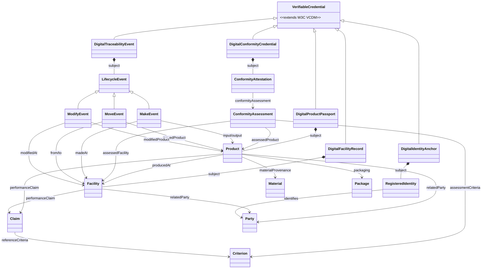

import Disclaimer from '../\_disclaimer.mdx';

<Disclaimer />

## Artifacts

### Published Vocabulary and Context

The UNTP Core Vocabulary and versioned JSON-LD context files are published as linked data at [https://vocabulary.uncefact.org/untp/](https://vocabulary.uncefact.org/untp/about).

| Artefact               | URL                                                                                                        |
| ---------------------- | ---------------------------------------------------------------------------------------------------------- |
| Core Vocabulary        | [https://vocabulary.uncefact.org/untp/about](https://vocabulary.uncefact.org/untp/about)                   |
| V0.7.0 JSON-LD Context | [https://vocabulary.uncefact.org/untp/0.7.0/context/](https://vocabulary.uncefact.org/untp/0.7.0/context/) |

The vocabulary defines persistent linked data URIs for all UNTP classes and properties and is not versioned — terms are stable once published. The JSON-LD context files, which map credential properties to vocabulary URIs, are versioned with each specification release.

## Vocabulary Overview

The UNTP core vocabulary defines the classes and properties that underpin all five UNTP credential types: Digital Product Passport (DPP), Digital Facility Record (DFR), Digital Conformity Credential (DCC), Digital Traceability Event (DTE), and Digital Identity Anchor (DIA). Each credential type is a specialisation of `VerifiableCredential` that wraps a specific domain subject — for example, a DPP wraps a `Product`, while a DCC wraps a `ConformityAttestation`.

The vocabulary is designed to **extend, not duplicate**, established external vocabularies. The credential envelope inherits from the [W3C Verifiable Credentials Data Model v2.0](https://www.w3.org/TR/vc-data-model-2.0/), and the `Address` class extends [schema:PostalAddress](https://schema.org/PostalAddress). UNTP only defines properties that are specific to supply chain transparency — all inherited properties from W3C VCDM and Schema.org are referenced, not redefined.

The diagram below shows the high-level structure of the vocabulary. Five credential types each compose a domain subject class. A central design principle is **verifiable performance claims** — both products (via DPP) and facilities (via DFR) carry `Claim` objects that reference specific `Criterion` definitions. Independent conformity assessments (via DCC) evaluate the same criteria, providing third-party verification of the supplier's own claims. This shared reference to common criteria is what makes UNTP claims verifiable: a buyer can match a product's self-declared claims against independent assessment results for the same criteria. Traceability events (via DTE) record product lifecycle activities — manufacturing, movement, and modification — linking products to the facilities where these activities occur. `Party` is a shared class referenced across all subjects to identify the organisations involved.



The reference tables below are **auto-generated** from the machine-readable ontology at [`untp-ontology.jsonld`](https://vocabulary.uncefact.org/untp/). Re-generate by running:

```bash
node .claude/scripts/generate-ontology-docs.js
```

<!-- GENERATED:BEGIN ontology -->

## Credential Types

### VerifiableCredential

A verifiable credential is a digital and verifiable version of everyday credentials such as certificates and licenses. It conforms to the W3C Verifiable Credentials Data Model v2.0 (VCDM).

**Extends:** [`VerifiableCredential`](https://www.w3.org/2018/credentials#VerifiableCredential) — inherited properties from the external vocabulary are not repeated here.

### DigitalProductPassport

A digital Product Passport (DPP) credential.

**Credential Subject:** [Product](#product)

**Sub-class of:** [VerifiableCredential](#verifiablecredential)

### DigitalFacilityRecord

A digital Facility Record (DFR) credential.

**Credential Subject:** [Facility](#facility)

**Sub-class of:** [VerifiableCredential](#verifiablecredential)

### DigitalConformityCredential

A Digital Conformity Credential (DCC) credential.

**Credential Subject:** [ConformityAttestation](#conformityattestation)

**Sub-class of:** [VerifiableCredential](#verifiablecredential)

### DigitalTraceabilityEvent

A Digital Traceability Event (DTE) credential.

**Credential Subject:** [LifecycleEvent](#lifecycleevent)

**Sub-class of:** [VerifiableCredential](#verifiablecredential)

### DigitalIdentityAnchor

The Digital Identity Anchor (DIA) is a very simple credential that is issued by a trusted authority and asserts an equivalence between a member identity as known to the authority (eg a VAT number) and one or more decentralised identifiers (DIDs) held by the member.

**Credential Subject:** [RegisteredIdentity](#registeredidentity)

**Sub-class of:** [VerifiableCredential](#verifiablecredential)

## Domain Classes

### Address

A postal address. Reuses streetAddress, postalCode, addressLocality, and addressRegion from schema.org PostalAddress. Extends with addressCountry (an ISO-3166 country code/name structure).

**Extends:** [`PostalAddress`](https://schema.org/PostalAddress) — inherited properties from the external vocabulary are not repeated here.

| Property       | Type                | Description                                                          |
| -------------- | ------------------- | -------------------------------------------------------------------- |
| addressCountry | [Country](#country) | The address country as an ISO-3166 two letter country code and name. |

### BitstringStatusListEntry

A privacy-preserving, space-efficient, and high-performance mechanism for publishing status information such as suspension or revocation of Verifiable Credentials through use of bitstrings. See https://www.w3.org/TR/vc-bitstring-status-list/ for full details.

| Property             | Type                                  | Description                                                                                                                                                                                                                  |
| -------------------- | ------------------------------------- | ---------------------------------------------------------------------------------------------------------------------------------------------------------------------------------------------------------------------------- |
| id                   | URI                                   | optional identifer of this status list entry.                                                                                                                                                                                |
| type                 | string                                | The type of status list - must be set to "The type property MUST be BitstringStatusListEntry."                                                                                                                               |
| statusPurpose        | [CredentialStatus](#credentialstatus) | Status purpose drawn from a standard list but extensible as per w3c bitstring status list specification.                                                                                                                     |
| statusListIndex      | integer                               | The statusListIndex property MUST be an arbitrary size integer greater than or equal to 0, expressed as a string in base 10. The value identifies the position of the status of the verifiable credential.                   |
| statusListCredential | URI                                   | The statusListCredential property MUST be a URL to a verifiable credential. When the URL is dereferenced, the resulting verifiable credential MUST have type property that includes the BitstringStatusListCredential value. |

### Characteristics

A declaration of conformance with one or more criteria from a specific standard or regulation.

### Claim

A performance claim about a product, facility, or organisation that is made against a well defined criterion.

| Property            | Type                                | Description                                                                                                        |
| ------------------- | ----------------------------------- | ------------------------------------------------------------------------------------------------------------------ |
| id                  | URI                                 | Globally unique identifier of this claim. Typically represented as a URI companyURL/claimID URI or a UUID          |
| name                | string                              | Name of this claim - typically similar or the same as the referenced criterion name.                               |
| description         | string                              | Description of this conformity claim                                                                               |
| applicablePeriod    | [Period](#period)                   | The applicable reporting period for this facility record.                                                          |
| referenceCriteria   | [Criterion](#criterion)             | The criterion against which the claim is made.                                                                     |
| referenceRegulation | [Regulation](#regulation)           | List of references to regulation to which conformity is claimed claimed for this product                           |
| referenceStandard   | [Standard](#standard)               | List of references to standards to which conformity is claimed claimed for this product                            |
| claimDate           | date                                | That date on which the claimed performance is applicable.                                                          |
| claimedPerformance  | [Performance](#performance)         | The claimed performance level                                                                                      |
| evidence            | [Link](#link)                       | A URI pointing to the evidence supporting the claim. SHOULD be a URL to a UNTP Digital Conformity Credential (DCC) |
| conformityTopic     | [ConformityTopic](#conformitytopic) | The conformity topic category for this assessment                                                                  |

### Classification

A classification scheme and code / name representing a category value for a product, entity, or facility.

| Property   | Type   | Description                                        |
| ---------- | ------ | -------------------------------------------------- |
| name       | string | Name of the classification represented by the code |
| code       | string | classification code within the scheme              |
| definition | string | A rich definition of this classification code.     |
| schemeId   | URI    | Classification scheme ID                           |
| schemeName | string | The name of the classification scheme              |

### ConformityAssessment

A specific assessment about the product or facility against a specific specification. Eg the carbon intensity of a given product or batch.

| Property             | Type                                          | Description                                                                                                                                  |
| -------------------- | --------------------------------------------- | -------------------------------------------------------------------------------------------------------------------------------------------- |
| id                   | URI                                           | Globally unique identifier of this assessment. Typically represented as a URI AssessmentBody/Assessment URI or a UUID                        |
| name                 | string                                        | Name of this assessment - typically similar or the same as the referenced criterion name.                                                    |
| description          | string                                        | Description of this conformity assessment                                                                                                    |
| referenceRegulation  | [Regulation](#regulation)                     | The reference to the regulation that defines the assessment criteria                                                                         |
| referenceStandard    | [Standard](#standard)                         | The reference to the standard that defines the specification / criteria                                                                      |
| evidence             | [Link](#link)                                 | Evidence to support this specific assessment.                                                                                                |
| conformityTopic      | [ConformityTopic](#conformitytopic)           | The UNTP conformity topic used to categorise this assessment. Should match the topic defined by the scheme criterion.                        |
| assessmentCriteria   | [Criterion](#criterion)                       | The specification against which the assessment is made.                                                                                      |
| assessmentDate       | date                                          | The date on which this assessment was made.                                                                                                  |
| assessedPerformance  | [Performance](#performance)                   | The assessed performance against criteria.                                                                                                   |
| assessedProduct      | [ProductVerification](#productverification)   | The product which is the subject of this assessment.                                                                                         |
| assessedFacility     | [FacilityVerification](#facilityverification) | The facility which is the subject of this assessment.                                                                                        |
| assessedOrganisation | [Party](#party)                               | An organisation that is the subject of this assessment.                                                                                      |
| specifiedCondition   | string                                        | A list of specific conditions that constrain this conformity assessment. For example a specific jurisdiction, material type, or test method. |
| conformance          | boolean                                       | An indicator (true / false) whether the outcome of this assessment is conformant to the requirements defined by the standard or criterion.   |

### ConformityAttestation

A conformity attestation issued by a competent body that defines one or more assessments (eg carbon intensity) about a product (eg battery) against a specification (eg LCA method) defined in a standard or regulation.

| Property              | Type                                          | Description                                                                                                                                                                                                |
| --------------------- | --------------------------------------------- | ---------------------------------------------------------------------------------------------------------------------------------------------------------------------------------------------------------- |
| id                    | URI                                           | Globally unique identifier of this attestation. Typically represented as a URI AssessmentBody/CertificateID URI or a UUID                                                                                  |
| name                  | string                                        | Name of this attestation - typically the title of the certificate.                                                                                                                                         |
| description           | string                                        | Description of this attestation.                                                                                                                                                                           |
| assessorLevel         | [AssessorLevel](#assessorlevel)               | Assurance code pertaining to assessor (relation to the object under assessment)                                                                                                                            |
| assessmentLevel       | [AssessmentLevel](#assessmentlevel)           | Assurance pertaining to assessment (any authority or support for the assessment process)                                                                                                                   |
| attestationType       | [AttestationType](#attestationtype)           | The type of criterion (optional or mandatory).                                                                                                                                                             |
| issuedToParty         | [Party](#party)                               | The party to whom the conformity attestation was issued.                                                                                                                                                   |
| authorisation         | [Endorsement](#endorsement)                   | The authority under which a conformity claim is issued. For example a national accreditation authority may authorise a test lab to issue test certificates about a product against a standard.             |
| referenceScheme       | [ConformityScheme](#conformityscheme)         | The conformity scheme under which this attestation is made.                                                                                                                                                |
| referenceProfile      | [ConformityProfile](#conformityprofile)       | The specific versioned conformity profile (comprising a set of versioned criteria) against which this conformity attestation is made.                                                                      |
| profileScore          | [Score](#score)                               | The overall performance against a scheme level performance measurement framework for the referenced profile or scheme.                                                                                     |
| conformityCertificate | [Link](#link)                                 | A reference to the human / printable version of this conformity attestation - typically represented as a PDF document. The document may have more details than are represented in the digital attestation. |
| auditableEvidence     | [Link](#link)                                 | Auditable evidence supporting this assessment such as raw measurements, supporting documents. This is usually private data and would normally be encrypted.                                                |
| trustmark             | [Image](#image)                               | A trust mark as a small binary image encoded as base64 with a description. Maye be displayed on the conformity credential rendering.                                                                       |
| conformityAssessment  | [ConformityAssessment](#conformityassessment) | A list of individual assessment made under this attestation.                                                                                                                                               |

### ConformityProfile

A versioned conformity profile, managed under a scheme, which includes a specific list of versioned criteria. A conformity profile represents the precise scope of a conformity attestation.

| Property                  | Type                                            | Description                                                                                                                                                                                   |
| ------------------------- | ----------------------------------------------- | --------------------------------------------------------------------------------------------------------------------------------------------------------------------------------------------- |
| id                        | URI                                             | Globally unique identifier of this context specific conformity profile. Typically represented as a URI SchemeOwner/profileID URI                                                              |
| name                      | string                                          | Name of this conformity profile as defined by the scheme owner.                                                                                                                               |
| description               | string                                          | The description of this versioned and context specific conformity profile.                                                                                                                    |
| version                   | string                                          | Version of this scheme following SemVer best practice (major.minor.patch).                                                                                                                    |
| status                    | [CriterionStatus](#criterionstatus)             | The status of this conformity profile (draft, active, deprecated)                                                                                                                             |
| documentation             | URI                                             | A web page that describes this entity in detail.                                                                                                                                              |
| validFrom                 | date                                            | The data from which this scheme version is valid.                                                                                                                                             |
| subjectType               | [AssessmentSubjectType](#assessmentsubjecttype) | The type of the subject of assessments made under this conformity profile (eg product, facility, organisation)                                                                                |
| standardAlignment         | [StandardAlignment](#standardalignment)         | A list of voluntary standards referenced by this conformity profile and against which some level of compliance can be inferred for subjects that pass an assessment.                          |
| regulatoryAlignment       | [RegulatoryAlignment](#regulatoryalignment)     | A list of regulations or legally binding conventions referenced by this conformity profile and against which some level of compliance can be inferred for subjects that pass an assessment.   |
| criterionScoringFramework | [ScoringFramework](#scoringframework)           | A list of named scoring frameworks that are applied by criterion within this profile.                                                                                                         |
| criterion                 | [Criterion](#criterion)                         | A list of criterion that are included in this conformity profile.                                                                                                                             |
| scope                     | [Classification](#classification)               | A set of classification codes that may be used to categorize the applicability of this criteria - for example industry sector, jurisdiction or commodity type - based on a formal vocabulary. |
| scheme                    | [ConformityScheme](#conformityscheme)           | The conformity scheme under which this versioned profile is maintained.                                                                                                                       |

### ConformityScheme

A formal governance scheme under which an attestation is issued (eg ACRS structural steel certification)

| Property               | Type                                              | Description                                                                                                                                                                          |
| ---------------------- | ------------------------------------------------- | ------------------------------------------------------------------------------------------------------------------------------------------------------------------------------------ |
| id                     | URI                                               | Globally unique identifier of this conformity scheme. Typically represented as a URI SchemeOwner/SchemeName URI                                                                      |
| name                   | string                                            | Name of this scheme as defined by the scheme owner.                                                                                                                                  |
| description            | string                                            | Description of this conformity scheme                                                                                                                                                |
| documentation          | URI                                               | A web page providing full documentation of this scheme.                                                                                                                              |
| trustmark              | [Image](#image)                                   | The trust mark or seal used by this conformity scheme.                                                                                                                               |
| owner                  | [Party](#party)                                   | The party that is the owner / maintainer of this conformity scheme.                                                                                                                  |
| endorsementLevel       | [SchemeEndorsementLevel](#schemeendorsementlevel) | The scheme assurance type.                                                                                                                                                           |
| endorsement            | [Endorsement](#endorsement)                       | The endorsement provided to the scheme by an external authority such as a regulator, an accreditaiton authority, or a benchmarking scheme.                                           |
| schemeScoringFramework | [ScoringFramework](#scoringframework)             | The scheme level overall scoring framework that represents the achievement levels (AA, A, B etc) that maybe be awarded to the subject of an independent assessment under the scheme. |
| licenseType            | [LicenseType](#licensetype)                       | Descriptive name and URL link to the license conditions associated with this scheme.                                                                                                 |
| establishedDate        | date                                              | The date when this scheme was first established.                                                                                                                                     |
| geographicScope        | [Classification](#classification)                 | The geographic scope of this scheme as a list of ISO-3166 countries, regions, or code=001, name=Worldwide to indicate global coverage.                                               |
| industryScope          | [Classification](#classification)                 | A list of UN ISIC code & name indicating the industry scope for this scheme.                                                                                                         |
| conformsTo             | [Link](#link)                                     | The name and URI of the vocabulary standard (eg UNTP CVC) that the machine readable version of this sceme conforms to.                                                               |
| includedProfile        | [ConformityProfile](#conformityprofile)           | The list of versioned conformity profiles included in this scheme                                                                                                                    |

### ConformityTopic

The UNTP standard classification scheme for conformity topic. see http://vocabulary.uncefact.org/ConformityTopic

| Property   | Type   | Description                                        |
| ---------- | ------ | -------------------------------------------------- |
| id         | URI    | The unique identifier for this conformity topic    |
| name       | string | The human readable name for this conformity topic. |
| definition | string | The rich definition of this conformity topic.      |

### Coordinate

A geographic point defined by latitude and longitude using the WGS84 geodetic coordinate reference system (EPSG:4326). Latitude and longitude are expressed in decimal degrees as floating-point numbers. Coordinates follow the conventional order (latitude, longitude) and represent a point on the Earth’s surface.

| Property  | Type   | Description                                                                                                                 |
| --------- | ------ | --------------------------------------------------------------------------------------------------------------------------- |
| latitude  | number | latitude: Angular distance north or south of the equator, expressed in decimal degrees.Valid range: −90.0 to +90.0.         |
| longitude | number | longitude: Angular distance east or west of the Prime Meridian, expressed in decimal degrees.Valid range: −180.0 to +180.0. |

### Country

Country Code and Name from ISO 3166

| Property    | Type                        | Description                         |
| ----------- | --------------------------- | ----------------------------------- |
| countryCode | [CountryCode](#countrycode) | ISO 3166 country code               |
| countryName | string                      | Country Name as defined in ISO 3166 |

### CredentialIssuer

The issuer party (person or organisation) of a verifiable credential.

| Property          | Type            | Description                                                                 |
| ----------------- | --------------- | --------------------------------------------------------------------------- |
| id                | URI             | The W3C DID of the issuer - should be a did:web or did:webvh                |
| name              | string          | The name of the issuer person or organisation                               |
| issuerAlsoKnownAs | [Party](#party) | An optional list of other registered identifiers for this credential issuer |

### Criterion

A specific rule or criterion within a standard or regulation. eg a carbon intensity calculation rule within an emissions standard.

| Property        | Type                                | Description                                                                                                                                           |
| --------------- | ----------------------------------- | ----------------------------------------------------------------------------------------------------------------------------------------------------- |
| id              | URI                                 | Globally unique identifier of this conformity criterion. Typically represented as a URI SchemeOwner/CriterionID URI                                   |
| name            | string                              | Name of this criterion as defined by the scheme owner.                                                                                                |
| description     | string                              | Descriptoin of this criterion                                                                                                                         |
| conformityTopic | [ConformityTopic](#conformitytopic) | A global UN/CEFACT standard conformity topic code.                                                                                                    |
| version         | string                              | The major.minor version of the the criterion. Minor versions represent changes that would not invalidate an assessment made under a previous version. |
| status          | [CriterionStatus](#criterionstatus) | The lifecycle status of this criterion.                                                                                                               |
| documentation   | URI                                 | A web page carrying detailed information about this criterion.                                                                                        |
| passThreshold   | [Performance](#performance)         | The assessed performance level (either a score or a measured metric) that represents compliance against the criteria (ie a passing score).            |
| tag             | string                              | A set of tags that can be used by the scheme owner to be able to filter or group criterion in a large vocabulary for specific use cases.              |

### Dimension

Overall (length, width, height) dimensions and weight/volume of an item.

| Property | Type                | Description                                                              |
| -------- | ------------------- | ------------------------------------------------------------------------ |
| weight   | [Measure](#measure) | the weight of the product. EG \{"value":10, "unit":"KGM"\}               |
| length   | [Measure](#measure) | The length of the product or packaging eg \{"value":840, "unit":"MMT"\}  |
| width    | [Measure](#measure) | The width of the product or packaging. eg \{"value":150, "unit":"MMT"\}  |
| height   | [Measure](#measure) | The height of the product or packaging. eg \{"value":220, "unit":"MMT"\} |
| volume   | [Measure](#measure) | The displacement volume of the product. eg \{"value":7.5, "unit":"LTR"\} |

### Endorsement

The authority under which a conformity claim is issued. For example a national accreditation authority may authorise a test lab to issue test certificates about a product against a standard.

| Property            | Type            | Description                                                                                                                   |
| ------------------- | --------------- | ----------------------------------------------------------------------------------------------------------------------------- |
| name                | string          | The name of the accreditation.                                                                                                |
| trustmark           | [Image](#image) | The trust mark image awarded by the AB to the CAB to indicate accreditation.                                                  |
| issuingAuthority    | [Party](#party) | The competent authority that issued the accreditation.                                                                        |
| endorsementEvidence | [Link](#link)   | The evidence that supports the authority under which the attestation is issued - for an example an accreditation certificate. |

### Entity

A uniquely identified entity

| Property    | Type   | Description                                    |
| ----------- | ------ | ---------------------------------------------- |
| id          | URI    | The globally unique identifier of this entity. |
| name        | string | The name of this entity.                       |
| description | string | A rich descrition of this identified entity.   |

### EventProduct

A quantity of products or materials involved in a lifecycle event.

| Property    | Type                            | Description                                                                               |
| ----------- | ------------------------------- | ----------------------------------------------------------------------------------------- |
| product     | [Product](#product)             | The product item / model / batch subject to this lifecycle event.                         |
| quantity    | [Measure](#measure)             | The quantity of product subject to this lifecycle event. Not needed for serialised items. |
| disposition | [ProductStatus](#productstatus) | The status of the product after the event has happened.                                   |

### Facility

The physical site (eg farm or factory) where the product or materials was produced.

| Property            | Type                                  | Description                                                                                                                                                                                               |
| ------------------- | ------------------------------------- | --------------------------------------------------------------------------------------------------------------------------------------------------------------------------------------------------------- |
| id                  | URI                                   | Globally unique identifier of this facility. Typically represented as a URI identifierScheme/Identifier URI                                                                                               |
| name                | string                                | Name of this facility as defined the location register.                                                                                                                                                   |
| description         | string                                | Description of the facility including function and other names.                                                                                                                                           |
| registeredId        | string                                | The registration number (alphanumeric) of the facility within the identifier scheme. Unique within the register.                                                                                          |
| idScheme            | [IdentifierScheme](#identifierscheme) | The ID scheme of the facility. eg a GS1 GLN or a National land registry scheme. If self issued then use the party ID of the facility owner.                                                               |
| countryOfOperation  | [Country](#country)                   | The country in which this facility is operating.using ISO-3166 code and name.                                                                                                                             |
| processCategory     | [Classification](#classification)     | The industrial or production processes performed by this facility. Example unstats.un.org/isic/1030.                                                                                                      |
| relatedParty        | [PartyRole](#partyrole)               | A list of parties with a specified role relationship to this facility                                                                                                                                     |
| relatedDocument     | [Link](#link)                         | A list of links to documents providing additional facility information. Documents that support a conformity claim (e.g. permits or certificates) SHOULD be referenced as claim evidence rather than here. |
| facilityAlsoKnownAs | [Facility](#facility)                 | An optional list of other registered identifiers for this facility - eg GLNs or other schemes.                                                                                                            |
| locationInformation | [Location](#location)                 | Geo-location information for this facility as a resolvable geographic area (a Plus Code), and/or a geo-located point (latitude / longitude), and/or a defined boundary (GeoJSON Polygon).                 |
| address             | [Address](#address)                   | The Postal address of the location.                                                                                                                                                                       |
| materialUsage       | [MaterialUsage](#materialusage)       | The type and provenance of materials consumed by the facility during the reporting period.                                                                                                                |
| performanceClaim    | [Claim](#claim)                       | A list of performance claims (eg deforestation status) for this facility.                                                                                                                                 |

### FacilityVerification

The facility which is the subject of this conformity assessment

| Property        | Type                  | Description                                                                                                                        |
| --------------- | --------------------- | ---------------------------------------------------------------------------------------------------------------------------------- |
| idVerifiedByCAB | boolean               | Indicates whether the conformity assessment body has verified the identity of the facility which is the subject of the assessment. |
| facility        | [Facility](#facility) | The facility which is the subject of this assessment                                                                               |

### IdentifierScheme

An identifier registration scheme for products, facilities, or organisations. Typically operated by a state, national or global authority.

| Property | Type   | Description                        |
| -------- | ------ | ---------------------------------- |
| id       | URI    | The URI of this identifier scheme  |
| name     | string | The name of the identifier scheme. |

### Image

A binary image encoded as base64 text and embedded into the data. Use this for small images like certification trust marks or regulated labels. Large impages should be external links.

| Property    | Type   | Description                                                       |
| ----------- | ------ | ----------------------------------------------------------------- |
| name        | string | the display name for this image                                   |
| description | string | The detailed description / supporting information for this image. |
| mediaType   | string | The media type of this image (eg image/png)                       |
| imageData   | string | The image data encoded as a base64 string.                        |

### LifecycleEvent

This abstract event structure provides a common language to describe product lifecycle events such as shipments, inspections, manufacturing processes, etc.

| Property        | Type                              | Description                                                                                                                                                                                                                                                             |
| --------------- | --------------------------------- | ----------------------------------------------------------------------------------------------------------------------------------------------------------------------------------------------------------------------------------------------------------------------- |
| id              | URI                               | Globally unique ID for this lifecycle event. Should be a URI. Can be a UUID.                                                                                                                                                                                            |
| name            | string                            | The name for this lifecycle event                                                                                                                                                                                                                                       |
| description     | string                            | The description of this lifecycle event.                                                                                                                                                                                                                                |
| relatedParty    | [PartyRole](#partyrole)           | Any related parties and their roles involved in this event (eg the carrier for a shipment event)                                                                                                                                                                        |
| relatedDocument | [Link](#link)                     | A list of links to documentary evidence that supports this event.                                                                                                                                                                                                       |
| eventDate       | dateTime                          | The date and time at which this lifecycle event occurs. use 00:00 for time if only a date is required.                                                                                                                                                                  |
| sensorData      | [SensorData](#sensordata)         | A sensor data set associated with this lifecycle event.                                                                                                                                                                                                                 |
| activityType    | [Classification](#classification) | The business activity that this event represents (eg shipping, repair, etc) using a standard classification scheme - eg https://ref.gs1.org/cbv/BizStep. This may be replaced with industry specific vocabularies (ginning, spinning, weaving, dyeing, etc in textiles) |

### Link

A structure to provide a URL link plus metadata associated with the link.

| Property        | Type   | Description                                                                                                                                                                    |
| --------------- | ------ | ------------------------------------------------------------------------------------------------------------------------------------------------------------------------------ |
| mediaType       | string | The media type of the target resource.                                                                                                                                         |
| digestMultibase | string | An optional multi-base encoded digest to ensure the content of the link has not changed. See https://www.w3.org/TR/vc-data-integrity/#resource-integrity for more information. |
| linkURL         | URI    | The URL of the target resource.                                                                                                                                                |
| linkName        | string | Display name for this link.                                                                                                                                                    |
| linkType        | string | The type of the target resource - drawn from a controlled vocabulary                                                                                                           |

### Location

Location information including address and geo-location of points, areas, and boundaries. At least one of plusCode, geoLocation, or geoBoundary are required.

| Property    | Type                      | Description                                                                                                                                                                                                                                   |
| ----------- | ------------------------- | --------------------------------------------------------------------------------------------------------------------------------------------------------------------------------------------------------------------------------------------- |
| plusCode    | URI                       | An open location code (https://maps.google.com/pluscodes/) representing this geographic location or region. Open location codes can represent any sized area from a point to a large region and are easily resolved to a visual map location. |
| geoLocation | [Coordinate](#coordinate) | The latitude and longitude coordinates that best represent the specified location.                                                                                                                                                            |
| geoBoundary | [Coordinate](#coordinate) | The list of ordered coordinates that define a closed area polygon as a location boundary. The first and last coordinates in the array must match - thereby defining a closed boundary.                                                        |

### MakeEvent

Transformation (manufacture/ production) of input products to output products at a given facility.

**Sub-class of:** [LifecycleEvent](#lifecycleevent)

| Property        | Type                              | Description                                                                                                                                                                                                                                                             |
| --------------- | --------------------------------- | ----------------------------------------------------------------------------------------------------------------------------------------------------------------------------------------------------------------------------------------------------------------------- |
| id              | URI                               | Globally unique ID for this lifecycle event. Should be a URI. Can be a UUID.                                                                                                                                                                                            |
| name            | string                            | The name for this lifecycle event                                                                                                                                                                                                                                       |
| description     | string                            | The description of this lifecycle event.                                                                                                                                                                                                                                |
| relatedParty    | [PartyRole](#partyrole)           | Any related parties and their roles involved in this event (eg the carrier for a shipment event)                                                                                                                                                                        |
| relatedDocument | [Link](#link)                     | A list of links to documentary evidence that supports this event.                                                                                                                                                                                                       |
| eventDate       | dateTime                          | The date and time at which this lifecycle event occurs. use 00:00 for time if only a date is required.                                                                                                                                                                  |
| sensorData      | [SensorData](#sensordata)         | A sensor data set associated with this lifecycle event.                                                                                                                                                                                                                 |
| activityType    | [Classification](#classification) | The business activity that this event represents (eg shipping, repair, etc) using a standard classification scheme - eg https://ref.gs1.org/cbv/BizStep. This may be replaced with industry specific vocabularies (ginning, spinning, weaving, dyeing, etc in textiles) |
| inputProduct    | [EventProduct](#eventproduct)     | An array of input products and quantities for this production or manufacturing process                                                                                                                                                                                  |
| outputProduct   | [EventProduct](#eventproduct)     | An array of output products and quantities for this produciton or manufacturing process                                                                                                                                                                                 |
| madeAtFacility  | [Facility](#facility)             | The facility at which this production / manufacturing event happens.                                                                                                                                                                                                    |

### Material

The material class encapsulates details about the origin or source of raw materials in a product, including the country of origin and the mass fraction.

| Property                  | Type                              | Description                                                                                                                          |
| ------------------------- | --------------------------------- | ------------------------------------------------------------------------------------------------------------------------------------ |
| name                      | string                            | Name of this material (eg "Egyptian Cotton")                                                                                         |
| originCountry             | [Country](#country)               | A ISO 3166-1 code representing the country of origin of the component or ingredient.                                                 |
| materialType              | [Classification](#classification) | The type of this material - as a value drawn from a controlled vocabulary eg from UN Framework Classification for Resources (UNFC).  |
| massFraction              | number                            | The mass fraction as a decimal of the product (or facility reporting period) represented by this material.                           |
| mass                      | [Measure](#measure)               | The mass of the material component.                                                                                                  |
| recycledMassFraction      | number                            | Mass fraction of this material that is recycled (eg 50% recycled Lithium)                                                            |
| hazardous                 | boolean                           | Indicates whether this material is hazardous. If true then the materialSafetyInformation property must be present                    |
| symbol                    | [Image](#image)                   | Based 64 encoded binary used to represent a visual symbol for a given material.                                                      |
| materialSafetyInformation | [Link](#link)                     | Reference to further information about safe handling of this hazardous material (for example a link to a material safety data sheet) |

### MaterialUsage

A material usage record defining the consumption of materials for a given period, typically at an operating facility. Used to specify volumetric consumption and country of origin without specifying specific suppliers.

| Property         | Type                  | Description                                                 |
| ---------------- | --------------------- | ----------------------------------------------------------- |
| applicablePeriod | [Period](#period)     | The period over which this material consumption is reported |
| materialConsumed | [Material](#material) | An list of materials consumed during the usage period.      |

### Measure

The measure class defines a numeric measured value (eg 10) and a coded unit of measure (eg KG). There is an optional upper and lower tolerance which can be used to specify uncertainty in the measure.

| Property       | Type                            | Description                                                                                                                                                                                  |
| -------------- | ------------------------------- | -------------------------------------------------------------------------------------------------------------------------------------------------------------------------------------------- |
| value          | number                          | The numeric value of the measure                                                                                                                                                             |
| upperTolerance | number                          | The upper tolerance associated with this measure expressed in the same units as the measure. For example value=10, upperTolerance=0.1, unit=KGM would mean that this measure is 10kg + 0.1kg |
| lowerTolerance | number                          | The lower tolerance associated with this measure expressed in the same units as the measure. For example value=10, lowerTolerance=0.1, unit=KGM would mean that this measure is 10kg - 0.1kg |
| unit           | [UnitOfMeasure](#unitofmeasure) | Unit of measure drawn from the UNECE Rec20 measure code list.                                                                                                                                |

### ModifyEvent

Intervention (eg repair) on a product without changing it's identity at a given facility.

**Sub-class of:** [LifecycleEvent](#lifecycleevent)

| Property           | Type                              | Description                                                                                                                                                                                                                                                             |
| ------------------ | --------------------------------- | ----------------------------------------------------------------------------------------------------------------------------------------------------------------------------------------------------------------------------------------------------------------------- |
| id                 | URI                               | Globally unique ID for this lifecycle event. Should be a URI. Can be a UUID.                                                                                                                                                                                            |
| name               | string                            | The name for this lifecycle event                                                                                                                                                                                                                                       |
| description        | string                            | The description of this lifecycle event.                                                                                                                                                                                                                                |
| relatedParty       | [PartyRole](#partyrole)           | Any related parties and their roles involved in this event (eg the carrier for a shipment event)                                                                                                                                                                        |
| relatedDocument    | [Link](#link)                     | A list of links to documentary evidence that supports this event.                                                                                                                                                                                                       |
| eventDate          | dateTime                          | The date and time at which this lifecycle event occurs. use 00:00 for time if only a date is required.                                                                                                                                                                  |
| sensorData         | [SensorData](#sensordata)         | A sensor data set associated with this lifecycle event.                                                                                                                                                                                                                 |
| activityType       | [Classification](#classification) | The business activity that this event represents (eg shipping, repair, etc) using a standard classification scheme - eg https://ref.gs1.org/cbv/BizStep. This may be replaced with industry specific vocabularies (ginning, spinning, weaving, dyeing, etc in textiles) |
| modifiedProduct    | [EventProduct](#eventproduct)     | An array of products and quantities for this intervention (repair, inspection, etc)                                                                                                                                                                                     |
| modifiedAtFacility | [Facility](#facility)             | The facility at which this intervention event happens.                                                                                                                                                                                                                  |

### MoveEvent

Transfer (shipment) of products from one facility to another.

**Sub-class of:** [LifecycleEvent](#lifecycleevent)

| Property        | Type                              | Description                                                                                                                                                                                                                                                             |
| --------------- | --------------------------------- | ----------------------------------------------------------------------------------------------------------------------------------------------------------------------------------------------------------------------------------------------------------------------- |
| id              | URI                               | Globally unique ID for this lifecycle event. Should be a URI. Can be a UUID.                                                                                                                                                                                            |
| name            | string                            | The name for this lifecycle event                                                                                                                                                                                                                                       |
| description     | string                            | The description of this lifecycle event.                                                                                                                                                                                                                                |
| relatedParty    | [PartyRole](#partyrole)           | Any related parties and their roles involved in this event (eg the carrier for a shipment event)                                                                                                                                                                        |
| relatedDocument | [Link](#link)                     | A list of links to documentary evidence that supports this event.                                                                                                                                                                                                       |
| eventDate       | dateTime                          | The date and time at which this lifecycle event occurs. use 00:00 for time if only a date is required.                                                                                                                                                                  |
| sensorData      | [SensorData](#sensordata)         | A sensor data set associated with this lifecycle event.                                                                                                                                                                                                                 |
| activityType    | [Classification](#classification) | The business activity that this event represents (eg shipping, repair, etc) using a standard classification scheme - eg https://ref.gs1.org/cbv/BizStep. This may be replaced with industry specific vocabularies (ginning, spinning, weaving, dyeing, etc in textiles) |
| movedProduct    | [EventProduct](#eventproduct)     | An array of products and quantities for this movement / shipment process                                                                                                                                                                                                |
| fromFacility    | [Facility](#facility)             | The source facility for this movement / shipment of products                                                                                                                                                                                                            |
| toFacility      | [Facility](#facility)             | The destination facility for this movement / shipment of products                                                                                                                                                                                                       |
| consignmentId   | URI                               | The consignment ID related to this movement of products. Ideally this is a resolvable URL but if not available then use a URN notation such as urn:carrier:waybillNumber.                                                                                               |

### Package

Details of product packaging

| Property         | Type                    | Description                                                                                                                                                                                                                       |
| ---------------- | ----------------------- | --------------------------------------------------------------------------------------------------------------------------------------------------------------------------------------------------------------------------------- |
| description      | string                  | Description of the packaging.                                                                                                                                                                                                     |
| performanceClaim | [Claim](#claim)         | conformity claims made about the packaging.                                                                                                                                                                                       |
| dimensions       | [Dimension](#dimension) | dimensions of the packaging                                                                                                                                                                                                       |
| materialUsed     | [Material](#material)   | materials used for the packaging.                                                                                                                                                                                                 |
| packageLabel     | [Image](#image)         | An array of package labels that may appear on the packaging together with their meaning. Use for small images that represent certification marks or regulatory requirements. Large images should be linked as evidence to claims. |

### Party

An organisation. May be a supply chain actor, a certifier, a government agency.

| Property            | Type                                  | Description                                                                                                                          |
| ------------------- | ------------------------------------- | ------------------------------------------------------------------------------------------------------------------------------------ |
| id                  | URI                                   | Globally unique identifier of this party. Typically represented as a URI identifierScheme/Identifier URI                             |
| name                | string                                | Legal registered name of this party.                                                                                                 |
| description         | string                                | Description of the party including function and other names.                                                                         |
| registeredId        | string                                | The registration number (alphanumeric) of the Party within the register. Unique within the register.                                 |
| idScheme            | [IdentifierScheme](#identifierscheme) | The identifier scheme of the party. Typically a national business register or a global scheme such as GLEIF.                         |
| registrationCountry | [Country](#country)                   | the country in which this organisation is registered - using ISO-3166 code and name.                                                 |
| partyAddress        | [Address](#address)                   | The address of the party                                                                                                             |
| organisationWebsite | URI                                   | Website for this organisation                                                                                                        |
| industryCategory    | [Classification](#classification)     | The industry categories for this organisation. Recommend use of UNCPC as the category scheme. for example - unstats.un.org/isic/1030 |
| partyAlsoKnownAs    | [Party](#party)                       | An optional list of other registered identifiers for this organisation. For example DUNS, GLN, LEI, etc                              |

### PartyRole

A party with a defined relationship to the referencing entity

| Property | Type                    | Description                                       |
| -------- | ----------------------- | ------------------------------------------------- |
| role     | [PartyRole](#partyrole) | The role played by the party in this relationship |
| party    | [Party](#party)         | The party that has the specified role.            |

### Performance

A claimed, assessed, or required performance level defined either by a scoring system or a numeric measure.

| Property | Type                                    | Description                                                                                           |
| -------- | --------------------------------------- | ----------------------------------------------------------------------------------------------------- |
| metric   | [PerformanceMetric](#performancemetric) | The metric (eg material emissions intensity CO2e/Kg or percentage of young workers) that is measured. |
| measure  | [Measure](#measure)                     | The measured performance value                                                                        |
| score    | [Score](#score)                         | A performance score (eg "AA") drawn from a scoring framework defined by the scheme or criterion.      |

### PerformanceMetric

A standardised data point for performance reporting (eg product carbon footprint)

| Property             | Type                                          | Description                                                                                     |
| -------------------- | --------------------------------------------- | ----------------------------------------------------------------------------------------------- |
| id                   | URI                                           | Globally unique identifier of this reporting metric.                                            |
| name                 | string                                        | A human readable name for this metric (for example "water usage per Kg of material")            |
| description          | string                                        | A rich description of this reporting metric.                                                    |
| improvementDirection | [ImprovementIndicator](#improvementindicator) | Indicator of whether conforming performance is greater than or less than the defined threshold. |
| aggregationMethod    | [AggregationType](#aggregationtype)           | Indicates how to aggregate multiple values to report a single performance metric.               |
| allowedUnit          | [UnitOfMeasure](#unitofmeasure)               | The allowed units for value reporting against this metric (eg cubic meters)                     |

### Period

A period of time, typically a month, quarter or a year, which defines the context boundary for reported facts.

| Property          | Type   | Description                                              |
| ----------------- | ------ | -------------------------------------------------------- |
| startDate         | date   | The period start date                                    |
| endDate           | date   | The period end date                                      |
| periodInformation | string | Additional information relevant to this reporting period |

### Product

The ProductInformation class encapsulates detailed information regarding a specific product, including its identification details, manufacturer, and other pertinent details.

| Property            | Type                                          | Description                                                                                                                                                                                                             |
| ------------------- | --------------------------------------------- | ----------------------------------------------------------------------------------------------------------------------------------------------------------------------------------------------------------------------- |
| id                  | URI                                           | Globally unique identifier of this product. Typically represented as a URI identifierScheme/Identifier URI or, if self-issued, as a did.                                                                                |
| name                | string                                        | The product name as known to the market.                                                                                                                                                                                |
| description         | string                                        | Description of the product.                                                                                                                                                                                             |
| idScheme            | [IdentifierScheme](#identifierscheme)         | The identifier scheme for this product. Eg a GS1 GTIN or an AU Livestock NLIS, or similar. If self issued then use the party ID of the issuer.                                                                          |
| relatedParty        | [PartyRole](#partyrole)                       | A list of parties with a defined relationship to this product                                                                                                                                                           |
| relatedDocument     | [Link](#link)                                 | A list of links to documents providing additional product information. Documents that support a conformity claim (e.g. permits or certificates) SHOULD be referenced as claim evidence rather than here.                |
| performanceClaim    | [Claim](#claim)                               | A list of performance claims (eg emissions intensity) for this product.                                                                                                                                                 |
| modelNumber         | string                                        | Where available, the model number (for manufactured products) or material identification (for bulk materials)                                                                                                           |
| batchNumber         | string                                        | Identifier of the specific production batch of the product. Unique within the product class.                                                                                                                            |
| itemNumber          | string                                        | A number or code representing a specific serialised item of the product. Unique within product class.                                                                                                                   |
| idGranularity       | [ProductIDGranularity](#productidgranularity) | The identification granularity for this product (item, batch, model)                                                                                                                                                    |
| productImage        | [Link](#link)                                 | Reference information (location, type, name) of an image of the product.                                                                                                                                                |
| characteristics     | [Characteristics](#characteristics)           | A set of indusutry specific product information.                                                                                                                                                                        |
| productCategory     | [Classification](#classification)             | A code representing the product's class, typically using the UN CPC (United Nations Central Product Classification) https://unstats.un.org/unsd/classifications/Econ/cpc                                                |
| producedAtFacility  | [Facility](#facility)                         | The Facility where the product batch was produced / manufactured.                                                                                                                                                       |
| productionDate      | date                                          | The ISO 8601 date on which the product batch or individual serialised item was manufactured.                                                                                                                            |
| countryOfProduction | [Country](#country)                           | The country in which this item was produced / manufactured.using ISO-3166 code and name.                                                                                                                                |
| dimensions          | [Dimension](#dimension)                       | The physical dimensions of the product. Not every dimension is relevant to every products. For example bulk materials may have weight and volume but not length, width, or height."weight":\{"value":10, "unit":"KGM"\} |
| materialProvenance  | [Material](#material)                         | A list of materials provenance objects providing details on the origin and mass fraction of materials of the product or batch.                                                                                          |
| packaging           | [Package](#package)                           | The packaging for this product.                                                                                                                                                                                         |
| productLabel        | [Image](#image)                               | An array of labels that may appear on the product such as certification marks or regulatory labels.                                                                                                                     |

### ProductVerification

The product which is the subject of this conformity assessment

| Property        | Type                | Description                                                                                                               |
| --------------- | ------------------- | ------------------------------------------------------------------------------------------------------------------------- |
| product         | [Product](#product) | The product, serial or batch that is the subject of this assessment                                                       |
| idVerifiedByCAB | boolean             | Indicates whether the conformity assessment body has verified the identity product that is the subject of the assessment. |

### RegisteredIdentity

The identity anchor is a mapping between a registry member identity and one or more decentralised identifiers owned by the member. It may also list a set of membership scopes.

| Property          | Type                                  | Description                                                                                                                                                                  |
| ----------------- | ------------------------------------- | ---------------------------------------------------------------------------------------------------------------------------------------------------------------------------- |
| id                | URI                                   | The DID that is controlled by the registered member and is linked to the registeredID through this Identity Anchor credential                                                |
| registeredId      | string                                | The registration number (alphanumeric) of the entity within the register. Unique within the register.                                                                        |
| idScheme          | [IdentifierScheme](#identifierscheme) | The identifier scheme for this registered entity ID.                                                                                                                         |
| registeredName    | string                                | The registered name of the entity within the identifier scheme. Examples: product - EV battery 300Ah, Party - Sample Company Pty Ltd, Facility - Green Acres battery factory |
| registeredDate    | date                                  | The date on which this identity was first registered with the registrar.                                                                                                     |
| publicInformation | URI                                   | A link to further information about the registered entity on the authoritative registrar site.                                                                               |
| registrar         | [Party](#party)                       | The registrar party that operates the register.                                                                                                                              |
| registerType      | [RegistryType](#registrytype)         | The thematic purpose of the register - organisations, facilities, products, trademarks, etc                                                                                  |
| registrationScope | URI                                   | List of URIs that represent the roles or scopes of membership. For example ["https://abr.business.gov.au/Help/EntityTypeDescription?Id=19"]                                  |

### Regulation

A regulation (eg EU deforestation regulation) that defines the criteria for assessment.

| Property            | Type                | Description                                                                                                                           |
| ------------------- | ------------------- | ------------------------------------------------------------------------------------------------------------------------------------- |
| id                  | URI                 | Globally unique identifier of this standard. Typically represented as a URI government/regulation URI                                 |
| name                | string              | Name of this regulation as defined by the regulator.                                                                                  |
| description         | string              | Description of this regulation.                                                                                                       |
| jurisdictionCountry | [Country](#country) | The legal jurisdiction (country) under which the regulation is issued.                                                                |
| administeredBy      | [Party](#party)     | the issuing body of the regulation. For example Australian Government Department of Climate Change, Energy, the Environment and Water |
| effectiveDate       | date                | the date at which the regulation came into effect.                                                                                    |

### RegulatoryAlignment

A national regulation or international treaty and an alignment level (exceeds, meets, partial).

| Property       | Type                                          | Description                                                                    |
| -------------- | --------------------------------------------- | ------------------------------------------------------------------------------ |
| alignmentLevel | [SchemeAlignmentLevel](#schemealignmentlevel) | A level of alignment with the referenced standard (exceeds, meets, partial,..) |
| regulation     | [Regulation](#regulation)                     | The regulation against which this alignment assessment is made.                |

### RenderTemplate2024

A single template format focused render method where the content/media type decision becomes secondary (and is expressed separately).See https://github.com/w3c-ccg/vc-render-method/issues/9

| Property        | Type   | Description                                                                                    |
| --------------- | ------ | ---------------------------------------------------------------------------------------------- |
| name            | string | Human facing display name for selection                                                        |
| mediaQuery      | string | Media query as defined in https://www.w3.org/TR/mediaqueries-4/                                |
| template        | string | An inline template field for use cases where remote retrieval of a render method is suboptimal |
| url             | URI    | URL for remotely hosted template                                                               |
| mediaType       | string | media type of the rendered output (eg text/html)                                               |
| digestMultibase | string | Used for resource integrity and/or validation of the inline `template`                         |

### Score

A single score within a scoring framework.

| Property   | Type    | Description                                                                                              |
| ---------- | ------- | -------------------------------------------------------------------------------------------------------- |
| code       | string  | The coded value for this score (eg "AAA")                                                                |
| definition | string  | A description of the meaning of this score.                                                              |
| rank       | integer | The ranking of this score within the scoring framework - using an integer where "1" is the highest rank. |

### ScoringFramework

A scoring framework used for performance level assessments against a criteria or scheme. For example forced labour performance might score A to D depending on the percentage of workforce subject to recruitment fees.

| Property    | Type            | Description                                                                                              |
| ----------- | --------------- | -------------------------------------------------------------------------------------------------------- |
| name        | string          | A name for this scoring framework. Must be unique within a scheme.                                       |
| description | string          | A full text description of the criterion that clearly specifies how compliance is achieved and measured. |
| score       | [Score](#score) | A list of scores and ranks associated with this scoring framework.                                       |

### SensorData

A sensor data recording associated with this event

| Property    | Type                                    | Description                                                              |
| ----------- | --------------------------------------- | ------------------------------------------------------------------------ |
| geoLocation | [Coordinate](#coordinate)               | The geolocation of this sensor data recording event.                     |
| metric      | [PerformanceMetric](#performancemetric) | The type of measurement recorded in this sensor data event.              |
| measure     | [Measure](#measure)                     | The value measured by this sensor measurement event.                     |
| rawData     | [Link](#link)                           | Link to raw data file associated with this sensor reading (eg an image). |
| sensor      | [Product](#product)                     | The sensor device used for this sensor measurement                       |

### Standard

A standard (eg ISO 14000) that specifies the criteria for conformance.

| Property     | Type            | Description                                                                                     |
| ------------ | --------------- | ----------------------------------------------------------------------------------------------- |
| id           | URI             | Globally unique identifier of this standard. Typically represented as a URI issuer/standard URI |
| name         | string          | Name for this standard                                                                          |
| description  | string          | Description of this standard.                                                                   |
| issuingParty | [Party](#party) | The party that issued the standard                                                              |
| issueDate    | date            | The date when the standard was issued.                                                          |

### StandardAlignment

A voluntary standard and an alignment level (exceeds, meets, partial).

| Property       | Type                                          | Description                                                                    |
| -------------- | --------------------------------------------- | ------------------------------------------------------------------------------ |
| standard       | [Standard](#standard)                         | The standard against which this alignment assessment is made.                  |
| alignmentLevel | [SchemeAlignmentLevel](#schemealignmentlevel) | A level of alignment with the referenced standard (exceeds, meets, partial,..) |

## Code Lists

### AggregationType

Indicates how to aggregate multiple values to report a single performance metric.

| Value            | Name             | Description                                                                                                          |
| ---------------- | ---------------- | -------------------------------------------------------------------------------------------------------------------- |
| sum              | sum              | Values add up (e.g. total GHG emissions across all facilities = sum of each facility's emissions)                    |
| weighted-average | weighted-average | Values must be averaged weighted by volume/output (e.g. emissions intensity per kg across suppliers)                 |
| latest           | latest           | Only the most recent value is meaningful (e.g. a biodiversity assessment score where only the current state matters) |

### AssessmentLevel

Type of authority endorsement of the assessment process

| Value                  | Name                                                                                 | Description                                                                                                                                                                                                                                                                                                                                                                 |
| ---------------------- | ------------------------------------------------------------------------------------ | --------------------------------------------------------------------------------------------------------------------------------------------------------------------------------------------------------------------------------------------------------------------------------------------------------------------------------------------------------------------------- |
| authority-benchmark    | Authority-derived assurance: Recognition by approved benchmarking organisation       | Benchmarking of scheme by an organization approved to UNIDO benchmarking principles and process. UNIDO Global Best Practice Framework for Organisations Performing Benchmarking Activities for Certification-related Conformity Assessment Schemes 2026                                                                                                                     |
| authority-mandate      | Authority-derived assurance: Recognition by government mandate                       | Government mandate for conformity assessment activity. Ownership or mandate provided by national government or intergovernmental entity.                                                                                                                                                                                                                                    |
| authority-globalmra    | Authority-derived assurance:Global accreditation mutual recognition arrangement      | Accreditation of CAB under global mutual recognition arrangement by a body peer-evaluated to ISO/IEC 17011. Scheme evaluation is a prerequisite for accreditation of CABs by bodies that are signatories to the Global Accreditation Cooperation Incorporated Mutual Recognition Arrangement.                                                                               |
| authority-peer         | Authority-derived assurance: Recognition by a governmental peer assessment authority | Peer assessment process managed by government. Ownership or mandate provided by national government or intergovernmental entity.                                                                                                                                                                                                                                            |
| authority-extended-mra | Authority- derived assurance: Peer assessment body recognition for accredited CAB    | Independent peer assessment for accredited CAB. This pathway applies to CABs accredited under the Mutual Recognition Arrangement of the Global Accreditation Cooperation Incorporated. Schemes used by CABs may be owned by the peer assessment body but the CAB itself shall not be owned by or otherwise related to the peer assessment body.                             |
| scheme-self            | Scheme-derived assurance: Self-declaration by registered scheme                      | Scheme owner directly conducting conformity assessment activities. The linked scheme self-declaration can be used to assist in judging credibility of the scheme.                                                                                                                                                                                                           |
| scheme-cab             | Scheme-derived assurance: Recognition of CAB by registered scheme                    | Scheme owner recognition of other parties assessing against the scheme standards. The linked scheme self-declaration can be used to assist in judging credibility of the scheme. Users of conformity credentials issued by a CAB recognised under a scheme may refer to the linked scheme self-declaration for details of the CAB-approval process used by the scheme owner |
| no-endorsement         | No endorsement.                                                                      | conformity assessment claiming no external authority or else unspecified                                                                                                                                                                                                                                                                                                    |

### AssessmentSubjectType

The type of entity being assessed.

| Value        | Name         | Description                                                                                                                                              |
| ------------ | ------------ | -------------------------------------------------------------------------------------------------------------------------------------------------------- |
| product      | Product      | The conformity profile targets products — assessing characteristics, composition, performance, or safety of manufactured goods.                          |
| facility     | Facility     | The conformity profile targets facilities — assessing the operational practices, environmental performance, or working conditions at a specific site.    |
| organisation | Organisation | The conformity profile targets organisations — assessing entity-level governance, policies, management systems, or corporate sustainability performance. |

### AssessorLevel

Code that describes the level of independent assurance of the specific assessment

| Value       | Name                               | Description                                                                                                                |
| ----------- | ---------------------------------- | -------------------------------------------------------------------------------------------------------------------------- |
| self        | Self assessed                      | self-assessment                                                                                                            |
| commercial  | Commercial assessment              | conformity assessment by related body or under commercial contract                                                         |
| buyer       | Buyer assessment                   | conformity assessment by potential purchaser                                                                               |
| membership  | Industry body assessment           | conformity assessment by industry representative body or membership body                                                   |
| unspecified | No independent assessment          | conformity assessment by party with unspecified relationship                                                               |
| 3rdParty    | Independent third party assessment | 3rd party (independent) conformity assessment                                                                              |
| hybrid      | Input from self-declaring parties  | 2nd or 3rd party conformity assessment that is dependent on the accuracy of information provided by self-declaring parties |

### AttestationType

A code for the type of the attestation credential

| Value         | Name          | Description                                      |
| ------------- | ------------- | ------------------------------------------------ |
| certification | certification | A formal third party certification of conformity |
| declaration   | declaration   | A self assessed declaration of conformity        |
| inspection    | inspection    | An Inspection report                             |
| testing       | testing       | A test report                                    |
| verification  | verification  | A verification report                            |
| validation    | validation    | A validation report                              |
| calibration   | calibration   | An equipment calibration report                  |

### CredentialStatus

The status purpose of a credential status entry within a W3C Verifiable Credential, indicating the type of status check that can be performed (e.g. revocation, suspension, refresh, or message).

| Value      | Name       | Description                                                                                                                                                                                                                                                                     |
| ---------- | ---------- | ------------------------------------------------------------------------------------------------------------------------------------------------------------------------------------------------------------------------------------------------------------------------------- |
| refresh    | refresh    | Used to signal that an updated verifiable credential is available via the credential's refresh service feature. This status does not invalidate the verifiable credential and is not reversible.                                                                                |
| revocation | revocation | Used to cancel the validity of a verifiable credential. This status is not reversible.                                                                                                                                                                                          |
| suspension | suspension | Used to temporarily prevent the acceptance of a verifiable credential. This status is reversible.                                                                                                                                                                               |
| message    | message    | Used to indicate a ussuer specified flexible status message associated with a verifiable credential. The status message descriptions MUST be defined in credentialSubject.statusMessages. credentialSubject.statusSize MUST be specified when this statusPurpose value is used. |

### CriterionStatus

The status of the conformity profile or criterion

| Value      | Name       | Description                     |
| ---------- | ---------- | ------------------------------- |
| proposed   | Proposed   | The criterion is proposed       |
| active     | Active     | The criterion is in active use. |
| deprecated | Deprecated | The criterion is deprecated.    |

### ImprovementIndicator

Indicator of whether conforming performance is greater than or less than the defined threshold.

| Value  | Name   | Description                                       |
| ------ | ------ | ------------------------------------------------- |
| higher | higher | Performance improves with a higher measured value |
| lower  | lower  | Performance improves with a lower measured value  |

### LicenseType

The license type of the published vocabulary

| Value                 | Name                   | Description                                                     |
| --------------------- | ---------------------- | --------------------------------------------------------------- |
| proprietary-Code      | Proprietary            | Commercial software, internal docs. Restrictiveness - Very high |
| proprietary-Document  | Documentation licenses | Manuals, standards. Restrictiveness - Medium                    |
| permissive-OpenSource | Permissive open source | Libraries, frameworks. Restrictiveness - Low                    |
| copyleft              | Copyleft               | Platforms, infrastructure. Restrictiveness - Medium–high        |
| creative-Commons      | Creative Commons       | Media, publications. Restrictiveness - Variable                 |
| source-Available      | Source-available       | Commercial SaaS vendors. Restrictiveness - Medium–high          |
| public                | Public domain          | Data, examples. Restrictiveness - None                          |

### PartyRole

A party with a defined relationship to the referencing entity

| Value             | Name                                                     |
| ----------------- | -------------------------------------------------------- |
| owner             | Party that owns the product or asset                     |
| producer          | Party that extracts, grows, or produces raw materials    |
| manufacturer      | Party that manufactures or assembles the product         |
| processor         | Party that processes or transforms materials             |
| remanufacturer    | Party that remanufactures or refurbishes products        |
| recycler          | Party that recovers materials from products              |
| operator          | Party operating a facility or process                    |
| serviceProvider   | Party providing maintenance or servicing                 |
| inspector         | Party performing inspection or testing                   |
| certifier         | Party issuing certification or conformity assessment     |
| logisticsProvider | Party responsible for logistics operations               |
| carrier           | Party physically transporting the goods                  |
| consignor         | Party sending the goods                                  |
| consignee         | Party receiving the goods                                |
| importer          | Party importing the goods into a jurisdiction            |
| exporter          | Party exporting the goods from a jurisdiction            |
| distributor       | Party distributing goods in the supply chain             |
| retailer          | Party selling goods to end users                         |
| brandOwner        | Party responsible for the brand or product specification |
| regulator         | Authority responsible for regulatory oversight           |

### ProductIDGranularity

Product identification granularity

| Value | Name                                |
| ----- | ----------------------------------- |
| model | product model level ID              |
| batch | product manufactured batch level ID |
| item  | serialised item level ID            |

### ProductStatus

The lifecycle status of a product, describing its current state from initial production through to eventual disposal or recycling. Used as the value of the disposition property on EventProduct in traceability events.

| Value     | Name       | Description                                                                                                                                               |
| --------- | ---------- | --------------------------------------------------------------------------------------------------------------------------------------------------------- |
| new       | New        | Product has been newly manufactured or produced and has not yet entered service. Equivalent to GS1 CBV Disp-active.                                       |
| inTransit | In Transit | Product has been shipped and is in transit between facilities. Equivalent to GS1 CBV Disp-in_transit.                                                     |
| active    | Active     | Product is in active service or use by the end customer or a downstream manufacturer. Equivalent to GS1 CBV Disp-retail_sold.                             |
| repaired  | Repaired   | Product has been repaired or refurbished to restore functionality and returned to service. Equivalent to GS1 CBV Disp-available (after a repairing step). |
| recalled  | Recalled   | Product has been withdrawn from the market or service due to a safety, quality, or compliance issue. Equivalent to GS1 CBV Disp-recalled.                 |
| expired   | Expired    | Product has passed its use-by, certification, or regulatory expiration date. Equivalent to GS1 CBV Disp-expired.                                          |
| consumed  | Consumed   | Product has been consumed as an input to a manufacturing process and no longer exists as a separate item. No direct GS1 CBV equivalent.                   |
| recycled  | Recycled   | Product has been processed to recover constituent materials for reuse in new products. No direct GS1 CBV equivalent.                                      |
| disposed  | Disposed   | Product has reached end of life and has been disposed of or destroyed without material recovery. Equivalent to GS1 CBV Disp-disposed and Disp-destroyed.  |

### RegistryType

A registry category code.

| Value         | Name          | Description                                                                                                                                    |
| ------------- | ------------- | ---------------------------------------------------------------------------------------------------------------------------------------------- |
| product       | Product       | A register of products or product classes, such as a national product catalogue or a GS1 GTIN registry.                                        |
| facility      | Facility      | A register of facilities or sites, such as a mining cadastre, environmental permit register, or industrial facility directory.                 |
| business      | Business      | A register of business entities or legal persons, such as a national company register, VAT register, or LEI registry.                          |
| trademark     | Trademark     | A register of trademarks, certification marks, or other intellectual property identifiers maintained by a national or international IP office. |
| land          | Land          | A register of land titles, parcels, or cadastral boundaries, such as a national land registry or territorial cadastre.                         |
| accreditation | Accreditation | A register of accredited conformity assessment bodies, maintained by a national or regional accreditation authority.                           |

### SchemeAlignmentLevel

Alignment level of a scheme profile or criterion against a reference standard or regulation

| Value   | Name            | Description                                                                                                                                           |
| ------- | --------------- | ----------------------------------------------------------------------------------------------------------------------------------------------------- |
| meets   | Meets           | The scheme profile or criterion fully satisfies the requirements of the referenced standard or regulation.                                            |
| exceeds | Exceeds         | The scheme profile or criterion goes beyond the requirements of the referenced standard or regulation, imposing stricter thresholds or broader scope. |
| partial | Partially meets | The scheme profile or criterion addresses some but not all requirements of the referenced standard or regulation.                                     |

### SchemeEndorsementLevel

The level of endorsement or recognition that a conformity scheme has received from authoritative bodies, indicating the degree of independent assurance over the scheme's credibility and rigour.

| Value                  | Name                                                                                       | Description                                                                                                                                                                                                                                             |
| ---------------------- | ------------------------------------------------------------------------------------------ | ------------------------------------------------------------------------------------------------------------------------------------------------------------------------------------------------------------------------------------------------------- |
| endorsed_self          | Self-declaration by scheme owner                                                           | Scheme owner self-declaration using the UNTP scheme declaration template                                                                                                                                                                                |
| endorsed_mandate       | Government owned or mandated scheme                                                        | Ownership of scheme or mandate for adoption of scheme by national government or intergovernmental entity.                                                                                                                                               |
| endorsed_accreditation | Accreditation authority endorsement of scheme suitability                                  | Scheme evaluated for suitability by the Global Accreditation Cooperation Incorporated, or by an accreditation body member of the Global Mutual Recognition Arrangement for such scope, or by a Regional Accreditation Cooperation member.               |
| endorsed_benchmarked   | Scheme recognition by a benchmarking organisation approved to UNIDO principles and process | Benchmarking of scheme by an organization approved to UNIDO benchmarking principles and process. UNIDO Global Best Practice Framework for Organisations Performing Benchmarking Activities for Certification-related Conformity Assessment Schemes 2026 |

### CountryCode

ISO 2 letter country code

Values are drawn from an external vocabulary: [ISO 3166-1 alpha-2](https://www.iso.org/iso-3166-country-codes.html)

### MimeType

IANA multipart media encoding type

Values are drawn from an external vocabulary: [IANA Media Types](https://www.iana.org/assignments/media-types/media-types.xhtml)

### UnitOfMeasure

UNECE Recommendation 20 Unit of Measure codelist

Values are drawn from an external vocabulary: [UNECE Recommendation 20](https://unece.org/trade/uncefact/cl-recommendations)

## Property Index

Alphabetical listing of all properties defined in the UNTP core vocabulary.

| Property                  | Domain(s)                                                                                                                                                                                                                                                                                                                                                                                                                                                                                                                                                                                                                                                                                                                                                                                                                          | Range                                             | Description                                                                                                                                                                                                                                                                                                                                      |
| ------------------------- | ---------------------------------------------------------------------------------------------------------------------------------------------------------------------------------------------------------------------------------------------------------------------------------------------------------------------------------------------------------------------------------------------------------------------------------------------------------------------------------------------------------------------------------------------------------------------------------------------------------------------------------------------------------------------------------------------------------------------------------------------------------------------------------------------------------------------------------- | ------------------------------------------------- | ------------------------------------------------------------------------------------------------------------------------------------------------------------------------------------------------------------------------------------------------------------------------------------------------------------------------------------------------ |
| activityType              | [LifecycleEvent](#lifecycleevent), [MakeEvent](#makeevent), [MoveEvent](#moveevent), [ModifyEvent](#modifyevent)                                                                                                                                                                                                                                                                                                                                                                                                                                                                                                                                                                                                                                                                                                                   | [Classification](#classification)                 | The business activity that this event represents (eg shipping, repair, etc) using a standard classification scheme - eg https://ref.gs1.org/cbv/BizStep. This may be replaced with industry specific vocabularies (ginning, spinning, weaving, dyeing, etc in textiles)                                                                          |
| address                   | [Facility](#facility)                                                                                                                                                                                                                                                                                                                                                                                                                                                                                                                                                                                                                                                                                                                                                                                                              | [Address](#address)                               | The Postal address of the location.                                                                                                                                                                                                                                                                                                              |
| addressCountry            | [Address](#address)                                                                                                                                                                                                                                                                                                                                                                                                                                                                                                                                                                                                                                                                                                                                                                                                                | [Country](#country)                               | The address country as an ISO-3166 two letter country code and name.                                                                                                                                                                                                                                                                             |
| administeredBy            | [Regulation](#regulation)                                                                                                                                                                                                                                                                                                                                                                                                                                                                                                                                                                                                                                                                                                                                                                                                          | [Party](#party)                                   | the issuing body of the regulation. For example Australian Government Department of Climate Change, Energy, the Environment and Water                                                                                                                                                                                                            |
| aggregationMethod         | [PerformanceMetric](#performancemetric)                                                                                                                                                                                                                                                                                                                                                                                                                                                                                                                                                                                                                                                                                                                                                                                            | [AggregationType](#aggregationtype)               | Indicates how to aggregate multiple values to report a single performance metric.                                                                                                                                                                                                                                                                |
| alignmentLevel            | [StandardAlignment](#standardalignment), [RegulatoryAlignment](#regulatoryalignment)                                                                                                                                                                                                                                                                                                                                                                                                                                                                                                                                                                                                                                                                                                                                               | [SchemeAlignmentLevel](#schemealignmentlevel)     | A level of alignment with the referenced standard (exceeds, meets, partial,..)                                                                                                                                                                                                                                                                   |
| allowedUnit               | [PerformanceMetric](#performancemetric)                                                                                                                                                                                                                                                                                                                                                                                                                                                                                                                                                                                                                                                                                                                                                                                            | [UnitOfMeasure](#unitofmeasure)                   | The allowed units for value reporting against this metric (eg cubic meters)                                                                                                                                                                                                                                                                      |
| applicablePeriod          | [MaterialUsage](#materialusage), [Claim](#claim)                                                                                                                                                                                                                                                                                                                                                                                                                                                                                                                                                                                                                                                                                                                                                                                   | [Period](#period)                                 | The period over which this material consumption is reported                                                                                                                                                                                                                                                                                      |
| assessedFacility          | [ConformityAssessment](#conformityassessment)                                                                                                                                                                                                                                                                                                                                                                                                                                                                                                                                                                                                                                                                                                                                                                                      | [FacilityVerification](#facilityverification)     | The facility which is the subject of this assessment.                                                                                                                                                                                                                                                                                            |
| assessedOrganisation      | [ConformityAssessment](#conformityassessment)                                                                                                                                                                                                                                                                                                                                                                                                                                                                                                                                                                                                                                                                                                                                                                                      | [Party](#party)                                   | An organisation that is the subject of this assessment.                                                                                                                                                                                                                                                                                          |
| assessedPerformance       | [ConformityAssessment](#conformityassessment)                                                                                                                                                                                                                                                                                                                                                                                                                                                                                                                                                                                                                                                                                                                                                                                      | [Performance](#performance)                       | The assessed performance against criteria.                                                                                                                                                                                                                                                                                                       |
| assessedProduct           | [ConformityAssessment](#conformityassessment)                                                                                                                                                                                                                                                                                                                                                                                                                                                                                                                                                                                                                                                                                                                                                                                      | [ProductVerification](#productverification)       | The product which is the subject of this assessment.                                                                                                                                                                                                                                                                                             |
| assessmentCriteria        | [ConformityAssessment](#conformityassessment)                                                                                                                                                                                                                                                                                                                                                                                                                                                                                                                                                                                                                                                                                                                                                                                      | [Criterion](#criterion)                           | The specification against which the assessment is made.                                                                                                                                                                                                                                                                                          |
| assessmentDate            | [ConformityAssessment](#conformityassessment)                                                                                                                                                                                                                                                                                                                                                                                                                                                                                                                                                                                                                                                                                                                                                                                      | date                                              | The date on which this assessment was made.                                                                                                                                                                                                                                                                                                      |
| assessmentLevel           | [ConformityAttestation](#conformityattestation)                                                                                                                                                                                                                                                                                                                                                                                                                                                                                                                                                                                                                                                                                                                                                                                    | [AssessmentLevel](#assessmentlevel)               | Assurance pertaining to assessment (any authority or support for the assessment process)                                                                                                                                                                                                                                                         |
| assessorLevel             | [ConformityAttestation](#conformityattestation)                                                                                                                                                                                                                                                                                                                                                                                                                                                                                                                                                                                                                                                                                                                                                                                    | [AssessorLevel](#assessorlevel)                   | Assurance code pertaining to assessor (relation to the object under assessment)                                                                                                                                                                                                                                                                  |
| attestationType           | [ConformityAttestation](#conformityattestation)                                                                                                                                                                                                                                                                                                                                                                                                                                                                                                                                                                                                                                                                                                                                                                                    | [AttestationType](#attestationtype)               | The type of criterion (optional or mandatory).                                                                                                                                                                                                                                                                                                   |
| auditableEvidence         | [ConformityAttestation](#conformityattestation)                                                                                                                                                                                                                                                                                                                                                                                                                                                                                                                                                                                                                                                                                                                                                                                    | [Link](#link)                                     | Auditable evidence supporting this assessment such as raw measurements, supporting documents. This is usually private data and would normally be encrypted.                                                                                                                                                                                      |
| authorisation             | [ConformityAttestation](#conformityattestation)                                                                                                                                                                                                                                                                                                                                                                                                                                                                                                                                                                                                                                                                                                                                                                                    | [Endorsement](#endorsement)                       | The authority under which a conformity claim is issued. For example a national accreditation authority may authorise a test lab to issue test certificates about a product against a standard.                                                                                                                                                   |
| batchNumber               | [Product](#product)                                                                                                                                                                                                                                                                                                                                                                                                                                                                                                                                                                                                                                                                                                                                                                                                                | string                                            | Identifier of the specific production batch of the product. Unique within the product class.                                                                                                                                                                                                                                                     |
| characteristics           | [Product](#product)                                                                                                                                                                                                                                                                                                                                                                                                                                                                                                                                                                                                                                                                                                                                                                                                                | [Characteristics](#characteristics)               | A set of indusutry specific product information.                                                                                                                                                                                                                                                                                                 |
| claimDate                 | [Claim](#claim)                                                                                                                                                                                                                                                                                                                                                                                                                                                                                                                                                                                                                                                                                                                                                                                                                    | date                                              | That date on which the claimed performance is applicable.                                                                                                                                                                                                                                                                                        |
| claimedPerformance        | [Claim](#claim)                                                                                                                                                                                                                                                                                                                                                                                                                                                                                                                                                                                                                                                                                                                                                                                                                    | [Performance](#performance)                       | The claimed performance level                                                                                                                                                                                                                                                                                                                    |
| code                      | [Classification](#classification), [Score](#score)                                                                                                                                                                                                                                                                                                                                                                                                                                                                                                                                                                                                                                                                                                                                                                                 | string                                            | classification code within the scheme                                                                                                                                                                                                                                                                                                            |
| conformance               | [ConformityAssessment](#conformityassessment)                                                                                                                                                                                                                                                                                                                                                                                                                                                                                                                                                                                                                                                                                                                                                                                      | boolean                                           | An indicator (true / false) whether the outcome of this assessment is conformant to the requirements defined by the standard or criterion.                                                                                                                                                                                                       |
| conformityAssessment      | [ConformityAttestation](#conformityattestation)                                                                                                                                                                                                                                                                                                                                                                                                                                                                                                                                                                                                                                                                                                                                                                                    | [ConformityAssessment](#conformityassessment)     | A list of individual assessment made under this attestation.                                                                                                                                                                                                                                                                                     |
| conformityCertificate     | [ConformityAttestation](#conformityattestation)                                                                                                                                                                                                                                                                                                                                                                                                                                                                                                                                                                                                                                                                                                                                                                                    | [Link](#link)                                     | A reference to the human / printable version of this conformity attestation - typically represented as a PDF document. The document may have more details than are represented in the digital attestation.                                                                                                                                       |
| conformityTopic           | [Claim](#claim), [Criterion](#criterion), [ConformityAssessment](#conformityassessment)                                                                                                                                                                                                                                                                                                                                                                                                                                                                                                                                                                                                                                                                                                                                            | [ConformityTopic](#conformitytopic)               | The conformity topic category for this assessment                                                                                                                                                                                                                                                                                                |
| conformsTo                | [ConformityScheme](#conformityscheme)                                                                                                                                                                                                                                                                                                                                                                                                                                                                                                                                                                                                                                                                                                                                                                                              | [Link](#link)                                     | The name and URI of the vocabulary standard (eg UNTP CVC) that the machine readable version of this sceme conforms to.                                                                                                                                                                                                                           |
| consignmentId             | [MoveEvent](#moveevent)                                                                                                                                                                                                                                                                                                                                                                                                                                                                                                                                                                                                                                                                                                                                                                                                            | URI                                               | The consignment ID related to this movement of products. Ideally this is a resolvable URL but if not available then use a URN notation such as urn:carrier:waybillNumber.                                                                                                                                                                        |
| countryCode               | [Country](#country)                                                                                                                                                                                                                                                                                                                                                                                                                                                                                                                                                                                                                                                                                                                                                                                                                | [CountryCode](#countrycode)                       | ISO 3166 country code                                                                                                                                                                                                                                                                                                                            |
| countryName               | [Country](#country)                                                                                                                                                                                                                                                                                                                                                                                                                                                                                                                                                                                                                                                                                                                                                                                                                | string                                            | Country Name as defined in ISO 3166                                                                                                                                                                                                                                                                                                              |
| countryOfOperation        | [Facility](#facility)                                                                                                                                                                                                                                                                                                                                                                                                                                                                                                                                                                                                                                                                                                                                                                                                              | [Country](#country)                               | The country in which this facility is operating.using ISO-3166 code and name.                                                                                                                                                                                                                                                                    |
| countryOfProduction       | [Product](#product)                                                                                                                                                                                                                                                                                                                                                                                                                                                                                                                                                                                                                                                                                                                                                                                                                | [Country](#country)                               | The country in which this item was produced / manufactured.using ISO-3166 code and name.                                                                                                                                                                                                                                                         |
| credentialSubjectType     | [DigitalProductPassport](#digitalproductpassport), [DigitalFacilityRecord](#digitalfacilityrecord), [DigitalConformityCredential](#digitalconformitycredential), [DigitalTraceabilityEvent](#digitaltraceabilityevent), [DigitalIdentityAnchor](#digitalidentityanchor)                                                                                                                                                                                                                                                                                                                                                                                                                                                                                                                                                            | Class                                             | The expected type of the credentialSubject for this credential class. Used to connect UNTP credential types to the UNTP domain classes that populate the W3C VCDM credentialSubject property, without redefining the W3C property itself.                                                                                                        |
| criterion                 | [ConformityProfile](#conformityprofile)                                                                                                                                                                                                                                                                                                                                                                                                                                                                                                                                                                                                                                                                                                                                                                                            | [Criterion](#criterion)                           | A list of criterion that are included in this conformity profile.                                                                                                                                                                                                                                                                                |
| criterionScoringFramework | [ConformityProfile](#conformityprofile)                                                                                                                                                                                                                                                                                                                                                                                                                                                                                                                                                                                                                                                                                                                                                                                            | [ScoringFramework](#scoringframework)             | A list of named scoring frameworks that are applied by criterion within this profile.                                                                                                                                                                                                                                                            |
| definition                | [Classification](#classification), [ConformityTopic](#conformitytopic), [Score](#score)                                                                                                                                                                                                                                                                                                                                                                                                                                                                                                                                                                                                                                                                                                                                            | string                                            | A rich definition of this classification code.                                                                                                                                                                                                                                                                                                   |
| description               | [Party](#party), [Entity](#entity), [Facility](#facility), [Image](#image), [Claim](#claim), [Criterion](#criterion), [Regulation](#regulation), [Standard](#standard), [ConformityAttestation](#conformityattestation), [ConformityScheme](#conformityscheme), [ScoringFramework](#scoringframework), [ConformityProfile](#conformityprofile), [ConformityAssessment](#conformityassessment), [Product](#product), [Package](#package), [LifecycleEvent](#lifecycleevent), [MakeEvent](#makeevent), [MoveEvent](#moveevent), [ModifyEvent](#modifyevent), [PerformanceMetric](#performancemetric)                                                                                                                                                                                                                                 | string                                            | Description of the party including function and other names.                                                                                                                                                                                                                                                                                     |
| digestMultibase           | [RenderTemplate2024](#rendertemplate2024), [Link](#link)                                                                                                                                                                                                                                                                                                                                                                                                                                                                                                                                                                                                                                                                                                                                                                           | string                                            | Used for resource integrity and/or validation of the inline `template`                                                                                                                                                                                                                                                                           |
| dimensions                | [Product](#product), [Package](#package)                                                                                                                                                                                                                                                                                                                                                                                                                                                                                                                                                                                                                                                                                                                                                                                           | [Dimension](#dimension)                           | The physical dimensions of the product. Not every dimension is relevant to every products. For example bulk materials may have weight and volume but not length, width, or height."weight":\{"value":10, "unit":"KGM"\}                                                                                                                          |
| disposition               | [EventProduct](#eventproduct)                                                                                                                                                                                                                                                                                                                                                                                                                                                                                                                                                                                                                                                                                                                                                                                                      | [ProductStatus](#productstatus)                   | The status of the product after the event has happened.                                                                                                                                                                                                                                                                                          |
| documentation             | [Criterion](#criterion), [ConformityScheme](#conformityscheme), [ConformityProfile](#conformityprofile)                                                                                                                                                                                                                                                                                                                                                                                                                                                                                                                                                                                                                                                                                                                            | URI                                               | A web page carrying detailed information about this criterion.                                                                                                                                                                                                                                                                                   |
| effectiveDate             | [Regulation](#regulation)                                                                                                                                                                                                                                                                                                                                                                                                                                                                                                                                                                                                                                                                                                                                                                                                          | date                                              | the date at which the regulation came into effect.                                                                                                                                                                                                                                                                                               |
| endDate                   | [Period](#period)                                                                                                                                                                                                                                                                                                                                                                                                                                                                                                                                                                                                                                                                                                                                                                                                                  | date                                              | The period end date                                                                                                                                                                                                                                                                                                                              |
| endorsement               | [ConformityScheme](#conformityscheme)                                                                                                                                                                                                                                                                                                                                                                                                                                                                                                                                                                                                                                                                                                                                                                                              | [Endorsement](#endorsement)                       | The endorsement provided to the scheme by an external authority such as a regulator, an accreditaiton authority, or a benchmarking scheme.                                                                                                                                                                                                       |
| endorsementEvidence       | [Endorsement](#endorsement)                                                                                                                                                                                                                                                                                                                                                                                                                                                                                                                                                                                                                                                                                                                                                                                                        | [Link](#link)                                     | The evidence that supports the authority under which the attestation is issued - for an example an accreditation certificate.                                                                                                                                                                                                                    |
| endorsementLevel          | [ConformityScheme](#conformityscheme)                                                                                                                                                                                                                                                                                                                                                                                                                                                                                                                                                                                                                                                                                                                                                                                              | [SchemeEndorsementLevel](#schemeendorsementlevel) | The scheme assurance type.                                                                                                                                                                                                                                                                                                                       |
| establishedDate           | [ConformityScheme](#conformityscheme)                                                                                                                                                                                                                                                                                                                                                                                                                                                                                                                                                                                                                                                                                                                                                                                              | date                                              | The date when this scheme was first established.                                                                                                                                                                                                                                                                                                 |
| eventDate                 | [LifecycleEvent](#lifecycleevent), [MakeEvent](#makeevent), [MoveEvent](#moveevent), [ModifyEvent](#modifyevent)                                                                                                                                                                                                                                                                                                                                                                                                                                                                                                                                                                                                                                                                                                                   | dateTime                                          | The date and time at which this lifecycle event occurs. use 00:00 for time if only a date is required.                                                                                                                                                                                                                                           |
| evidence                  | [Claim](#claim), [ConformityAssessment](#conformityassessment)                                                                                                                                                                                                                                                                                                                                                                                                                                                                                                                                                                                                                                                                                                                                                                     | [Link](#link)                                     | A URI pointing to the evidence supporting the claim. SHOULD be a URL to a UNTP Digital Conformity Credential (DCC)                                                                                                                                                                                                                               |
| extendsModel              | [VerifiableCredential](#verifiablecredential), [Address](#address)                                                                                                                                                                                                                                                                                                                                                                                                                                                                                                                                                                                                                                                                                                                                                                 | Class                                             | Indicates that this UNTP class reuses and extends a class defined in an external vocabulary (e.g. W3C VCDM, schema.org). The external class defines the envelope or base properties; UNTP defines only the extensions. This annotation enables human-readable renderings to display or link to the inherited properties without redefining them. |
| facility                  | [FacilityVerification](#facilityverification)                                                                                                                                                                                                                                                                                                                                                                                                                                                                                                                                                                                                                                                                                                                                                                                      | [Facility](#facility)                             | The facility which is the subject of this assessment                                                                                                                                                                                                                                                                                             |
| facilityAlsoKnownAs       | [Facility](#facility)                                                                                                                                                                                                                                                                                                                                                                                                                                                                                                                                                                                                                                                                                                                                                                                                              | [Facility](#facility)                             | An optional list of other registered identifiers for this facility - eg GLNs or other schemes.                                                                                                                                                                                                                                                   |
| fromFacility              | [MoveEvent](#moveevent)                                                                                                                                                                                                                                                                                                                                                                                                                                                                                                                                                                                                                                                                                                                                                                                                            | [Facility](#facility)                             | The source facility for this movement / shipment of products                                                                                                                                                                                                                                                                                     |
| geoBoundary               | [Location](#location)                                                                                                                                                                                                                                                                                                                                                                                                                                                                                                                                                                                                                                                                                                                                                                                                              | [Coordinate](#coordinate)                         | The list of ordered coordinates that define a closed area polygon as a location boundary. The first and last coordinates in the array must match - thereby defining a closed boundary.                                                                                                                                                           |
| geographicScope           | [ConformityScheme](#conformityscheme)                                                                                                                                                                                                                                                                                                                                                                                                                                                                                                                                                                                                                                                                                                                                                                                              | [Classification](#classification)                 | The geographic scope of this scheme as a list of ISO-3166 countries, regions, or code=001, name=Worldwide to indicate global coverage.                                                                                                                                                                                                           |
| geoLocation               | [Location](#location), [SensorData](#sensordata)                                                                                                                                                                                                                                                                                                                                                                                                                                                                                                                                                                                                                                                                                                                                                                                   | [Coordinate](#coordinate)                         | The latitude and longitude coordinates that best represent the specified location.                                                                                                                                                                                                                                                               |
| hazardous                 | [Material](#material)                                                                                                                                                                                                                                                                                                                                                                                                                                                                                                                                                                                                                                                                                                                                                                                                              | boolean                                           | Indicates whether this material is hazardous. If true then the materialSafetyInformation property must be present                                                                                                                                                                                                                                |
| height                    | [Dimension](#dimension)                                                                                                                                                                                                                                                                                                                                                                                                                                                                                                                                                                                                                                                                                                                                                                                                            | [Measure](#measure)                               | The height of the product or packaging. eg \{"value":220, "unit":"MMT"\}                                                                                                                                                                                                                                                                         |
| id                        | [CredentialIssuer](#credentialissuer), [Party](#party), [Entity](#entity), [IdentifierScheme](#identifierscheme), [BitstringStatusListEntry](#bitstringstatuslistentry), [Facility](#facility), [Claim](#claim), [Criterion](#criterion), [ConformityTopic](#conformitytopic), [PerformanceMetric](#performancemetric), [Regulation](#regulation), [Standard](#standard), [ConformityAttestation](#conformityattestation), [ConformityScheme](#conformityscheme), [ConformityProfile](#conformityprofile), [ConformityAssessment](#conformityassessment), [Product](#product), [LifecycleEvent](#lifecycleevent), [MakeEvent](#makeevent), [MoveEvent](#moveevent), [ModifyEvent](#modifyevent), [RegisteredIdentity](#registeredidentity)                                                                                         | URI                                               | The W3C DID of the issuer - should be a did:web or did:webvh                                                                                                                                                                                                                                                                                     |
| idGranularity             | [Product](#product)                                                                                                                                                                                                                                                                                                                                                                                                                                                                                                                                                                                                                                                                                                                                                                                                                | [ProductIDGranularity](#productidgranularity)     | The identification granularity for this product (item, batch, model)                                                                                                                                                                                                                                                                             |
| idScheme                  | [Party](#party), [Facility](#facility), [Product](#product), [RegisteredIdentity](#registeredidentity)                                                                                                                                                                                                                                                                                                                                                                                                                                                                                                                                                                                                                                                                                                                             | [IdentifierScheme](#identifierscheme)             | The identifier scheme of the party. Typically a national business register or a global scheme such as GLEIF.                                                                                                                                                                                                                                     |
| idVerifiedByCAB           | [ProductVerification](#productverification), [FacilityVerification](#facilityverification)                                                                                                                                                                                                                                                                                                                                                                                                                                                                                                                                                                                                                                                                                                                                         | boolean                                           | Indicates whether the conformity assessment body has verified the identity product that is the subject of the assessment.                                                                                                                                                                                                                        |
| imageData                 | [Image](#image)                                                                                                                                                                                                                                                                                                                                                                                                                                                                                                                                                                                                                                                                                                                                                                                                                    | string                                            | The image data encoded as a base64 string.                                                                                                                                                                                                                                                                                                       |
| improvementDirection      | [PerformanceMetric](#performancemetric)                                                                                                                                                                                                                                                                                                                                                                                                                                                                                                                                                                                                                                                                                                                                                                                            | [ImprovementIndicator](#improvementindicator)     | Indicator of whether conforming performance is greater than or less than the defined threshold.                                                                                                                                                                                                                                                  |
| includedProfile           | [ConformityScheme](#conformityscheme)                                                                                                                                                                                                                                                                                                                                                                                                                                                                                                                                                                                                                                                                                                                                                                                              | [ConformityProfile](#conformityprofile)           | The list of versioned conformity profiles included in this scheme                                                                                                                                                                                                                                                                                |
| industryCategory          | [Party](#party)                                                                                                                                                                                                                                                                                                                                                                                                                                                                                                                                                                                                                                                                                                                                                                                                                    | [Classification](#classification)                 | The industry categories for this organisation. Recommend use of UNCPC as the category scheme. for example - unstats.un.org/isic/1030                                                                                                                                                                                                             |
| industryScope             | [ConformityScheme](#conformityscheme)                                                                                                                                                                                                                                                                                                                                                                                                                                                                                                                                                                                                                                                                                                                                                                                              | [Classification](#classification)                 | A list of UN ISIC code & name indicating the industry scope for this scheme.                                                                                                                                                                                                                                                                     |
| inputProduct              | [MakeEvent](#makeevent)                                                                                                                                                                                                                                                                                                                                                                                                                                                                                                                                                                                                                                                                                                                                                                                                            | [EventProduct](#eventproduct)                     | An array of input products and quantities for this production or manufacturing process                                                                                                                                                                                                                                                           |
| issueDate                 | [Standard](#standard)                                                                                                                                                                                                                                                                                                                                                                                                                                                                                                                                                                                                                                                                                                                                                                                                              | date                                              | The date when the standard was issued.                                                                                                                                                                                                                                                                                                           |
| issuedToParty             | [ConformityAttestation](#conformityattestation)                                                                                                                                                                                                                                                                                                                                                                                                                                                                                                                                                                                                                                                                                                                                                                                    | [Party](#party)                                   | The party to whom the conformity attestation was issued.                                                                                                                                                                                                                                                                                         |
| issuerAlsoKnownAs         | [CredentialIssuer](#credentialissuer)                                                                                                                                                                                                                                                                                                                                                                                                                                                                                                                                                                                                                                                                                                                                                                                              | [Party](#party)                                   | An optional list of other registered identifiers for this credential issuer                                                                                                                                                                                                                                                                      |
| issuingAuthority          | [Endorsement](#endorsement)                                                                                                                                                                                                                                                                                                                                                                                                                                                                                                                                                                                                                                                                                                                                                                                                        | [Party](#party)                                   | The competent authority that issued the accreditation.                                                                                                                                                                                                                                                                                           |
| issuingParty              | [Standard](#standard)                                                                                                                                                                                                                                                                                                                                                                                                                                                                                                                                                                                                                                                                                                                                                                                                              | [Party](#party)                                   | The party that issued the standard                                                                                                                                                                                                                                                                                                               |
| itemNumber                | [Product](#product)                                                                                                                                                                                                                                                                                                                                                                                                                                                                                                                                                                                                                                                                                                                                                                                                                | string                                            | A number or code representing a specific serialised item of the product. Unique within product class.                                                                                                                                                                                                                                            |
| jurisdictionCountry       | [Regulation](#regulation)                                                                                                                                                                                                                                                                                                                                                                                                                                                                                                                                                                                                                                                                                                                                                                                                          | [Country](#country)                               | The legal jurisdiction (country) under which the regulation is issued.                                                                                                                                                                                                                                                                           |
| latitude                  | [Coordinate](#coordinate)                                                                                                                                                                                                                                                                                                                                                                                                                                                                                                                                                                                                                                                                                                                                                                                                          | number                                            | latitude: Angular distance north or south of the equator, expressed in decimal degrees.Valid range: −90.0 to +90.0.                                                                                                                                                                                                                              |
| length                    | [Dimension](#dimension)                                                                                                                                                                                                                                                                                                                                                                                                                                                                                                                                                                                                                                                                                                                                                                                                            | [Measure](#measure)                               | The length of the product or packaging eg \{"value":840, "unit":"MMT"\}                                                                                                                                                                                                                                                                          |
| licenseType               | [ConformityScheme](#conformityscheme)                                                                                                                                                                                                                                                                                                                                                                                                                                                                                                                                                                                                                                                                                                                                                                                              | [LicenseType](#licensetype)                       | Descriptive name and URL link to the license conditions associated with this scheme.                                                                                                                                                                                                                                                             |
| linkName                  | [Link](#link)                                                                                                                                                                                                                                                                                                                                                                                                                                                                                                                                                                                                                                                                                                                                                                                                                      | string                                            | Display name for this link.                                                                                                                                                                                                                                                                                                                      |
| linkType                  | [Link](#link)                                                                                                                                                                                                                                                                                                                                                                                                                                                                                                                                                                                                                                                                                                                                                                                                                      | string                                            | The type of the target resource - drawn from a controlled vocabulary                                                                                                                                                                                                                                                                             |
| linkURL                   | [Link](#link)                                                                                                                                                                                                                                                                                                                                                                                                                                                                                                                                                                                                                                                                                                                                                                                                                      | URI                                               | The URL of the target resource.                                                                                                                                                                                                                                                                                                                  |
| locationInformation       | [Facility](#facility)                                                                                                                                                                                                                                                                                                                                                                                                                                                                                                                                                                                                                                                                                                                                                                                                              | [Location](#location)                             | Geo-location information for this facility as a resolvable geographic area (a Plus Code), and/or a geo-located point (latitude / longitude), and/or a defined boundary (GeoJSON Polygon).                                                                                                                                                        |
| longitude                 | [Coordinate](#coordinate)                                                                                                                                                                                                                                                                                                                                                                                                                                                                                                                                                                                                                                                                                                                                                                                                          | number                                            | longitude: Angular distance east or west of the Prime Meridian, expressed in decimal degrees.Valid range: −180.0 to +180.0.                                                                                                                                                                                                                      |
| lowerTolerance            | [Measure](#measure)                                                                                                                                                                                                                                                                                                                                                                                                                                                                                                                                                                                                                                                                                                                                                                                                                | number                                            | The lower tolerance associated with this measure expressed in the same units as the measure. For example value=10, lowerTolerance=0.1, unit=KGM would mean that this measure is 10kg - 0.1kg                                                                                                                                                     |
| madeAtFacility            | [MakeEvent](#makeevent)                                                                                                                                                                                                                                                                                                                                                                                                                                                                                                                                                                                                                                                                                                                                                                                                            | [Facility](#facility)                             | The facility at which this production / manufacturing event happens.                                                                                                                                                                                                                                                                             |
| mass                      | [Material](#material)                                                                                                                                                                                                                                                                                                                                                                                                                                                                                                                                                                                                                                                                                                                                                                                                              | [Measure](#measure)                               | The mass of the material component.                                                                                                                                                                                                                                                                                                              |
| massFraction              | [Material](#material)                                                                                                                                                                                                                                                                                                                                                                                                                                                                                                                                                                                                                                                                                                                                                                                                              | number                                            | The mass fraction as a decimal of the product (or facility reporting period) represented by this material.                                                                                                                                                                                                                                       |
| materialConsumed          | [MaterialUsage](#materialusage)                                                                                                                                                                                                                                                                                                                                                                                                                                                                                                                                                                                                                                                                                                                                                                                                    | [Material](#material)                             | An list of materials consumed during the usage period.                                                                                                                                                                                                                                                                                           |
| materialProvenance        | [Product](#product)                                                                                                                                                                                                                                                                                                                                                                                                                                                                                                                                                                                                                                                                                                                                                                                                                | [Material](#material)                             | A list of materials provenance objects providing details on the origin and mass fraction of materials of the product or batch.                                                                                                                                                                                                                   |
| materialSafetyInformation | [Material](#material)                                                                                                                                                                                                                                                                                                                                                                                                                                                                                                                                                                                                                                                                                                                                                                                                              | [Link](#link)                                     | Reference to further information about safe handling of this hazardous material (for example a link to a material safety data sheet)                                                                                                                                                                                                             |
| materialType              | [Material](#material)                                                                                                                                                                                                                                                                                                                                                                                                                                                                                                                                                                                                                                                                                                                                                                                                              | [Classification](#classification)                 | The type of this material - as a value drawn from a controlled vocabulary eg from UN Framework Classification for Resources (UNFC).                                                                                                                                                                                                              |
| materialUsage             | [Facility](#facility)                                                                                                                                                                                                                                                                                                                                                                                                                                                                                                                                                                                                                                                                                                                                                                                                              | [MaterialUsage](#materialusage)                   | The type and provenance of materials consumed by the facility during the reporting period.                                                                                                                                                                                                                                                       |
| materialUsed              | [Package](#package)                                                                                                                                                                                                                                                                                                                                                                                                                                                                                                                                                                                                                                                                                                                                                                                                                | [Material](#material)                             | materials used for the packaging.                                                                                                                                                                                                                                                                                                                |
| measure                   | [Performance](#performance), [SensorData](#sensordata)                                                                                                                                                                                                                                                                                                                                                                                                                                                                                                                                                                                                                                                                                                                                                                             | [Measure](#measure)                               | The measured performance value                                                                                                                                                                                                                                                                                                                   |
| mediaQuery                | [RenderTemplate2024](#rendertemplate2024)                                                                                                                                                                                                                                                                                                                                                                                                                                                                                                                                                                                                                                                                                                                                                                                          | string                                            | Media query as defined in https://www.w3.org/TR/mediaqueries-4/                                                                                                                                                                                                                                                                                  |
| mediaType                 | [RenderTemplate2024](#rendertemplate2024), [Link](#link), [Image](#image)                                                                                                                                                                                                                                                                                                                                                                                                                                                                                                                                                                                                                                                                                                                                                          | string                                            | media type of the rendered output (eg text/html)                                                                                                                                                                                                                                                                                                 |
| metric                    | [Performance](#performance), [SensorData](#sensordata)                                                                                                                                                                                                                                                                                                                                                                                                                                                                                                                                                                                                                                                                                                                                                                             | [PerformanceMetric](#performancemetric)           | The metric (eg material emissions intensity CO2e/Kg or percentage of young workers) that is measured.                                                                                                                                                                                                                                            |
| modelNumber               | [Product](#product)                                                                                                                                                                                                                                                                                                                                                                                                                                                                                                                                                                                                                                                                                                                                                                                                                | string                                            | Where available, the model number (for manufactured products) or material identification (for bulk materials)                                                                                                                                                                                                                                    |
| modifiedAtFacility        | [ModifyEvent](#modifyevent)                                                                                                                                                                                                                                                                                                                                                                                                                                                                                                                                                                                                                                                                                                                                                                                                        | [Facility](#facility)                             | The facility at which this intervention event happens.                                                                                                                                                                                                                                                                                           |
| modifiedProduct           | [ModifyEvent](#modifyevent)                                                                                                                                                                                                                                                                                                                                                                                                                                                                                                                                                                                                                                                                                                                                                                                                        | [EventProduct](#eventproduct)                     | An array of products and quantities for this intervention (repair, inspection, etc)                                                                                                                                                                                                                                                              |
| movedProduct              | [MoveEvent](#moveevent)                                                                                                                                                                                                                                                                                                                                                                                                                                                                                                                                                                                                                                                                                                                                                                                                            | [EventProduct](#eventproduct)                     | An array of products and quantities for this movement / shipment process                                                                                                                                                                                                                                                                         |
| name                      | [CredentialIssuer](#credentialissuer), [Party](#party), [Entity](#entity), [IdentifierScheme](#identifierscheme), [Classification](#classification), [RenderTemplate2024](#rendertemplate2024), [Facility](#facility), [Material](#material), [Image](#image), [Claim](#claim), [Criterion](#criterion), [ConformityTopic](#conformitytopic), [PerformanceMetric](#performancemetric), [Regulation](#regulation), [Standard](#standard), [ConformityAttestation](#conformityattestation), [Endorsement](#endorsement), [ConformityScheme](#conformityscheme), [ScoringFramework](#scoringframework), [ConformityProfile](#conformityprofile), [ConformityAssessment](#conformityassessment), [Product](#product), [LifecycleEvent](#lifecycleevent), [MakeEvent](#makeevent), [MoveEvent](#moveevent), [ModifyEvent](#modifyevent) | string                                            | The name of the issuer person or organisation                                                                                                                                                                                                                                                                                                    |
| organisationWebsite       | [Party](#party)                                                                                                                                                                                                                                                                                                                                                                                                                                                                                                                                                                                                                                                                                                                                                                                                                    | URI                                               | Website for this organisation                                                                                                                                                                                                                                                                                                                    |
| originCountry             | [Material](#material)                                                                                                                                                                                                                                                                                                                                                                                                                                                                                                                                                                                                                                                                                                                                                                                                              | [Country](#country)                               | A ISO 3166-1 code representing the country of origin of the component or ingredient.                                                                                                                                                                                                                                                             |
| outputProduct             | [MakeEvent](#makeevent)                                                                                                                                                                                                                                                                                                                                                                                                                                                                                                                                                                                                                                                                                                                                                                                                            | [EventProduct](#eventproduct)                     | An array of output products and quantities for this produciton or manufacturing process                                                                                                                                                                                                                                                          |
| owner                     | [ConformityScheme](#conformityscheme)                                                                                                                                                                                                                                                                                                                                                                                                                                                                                                                                                                                                                                                                                                                                                                                              | [Party](#party)                                   | The party that is the owner / maintainer of this conformity scheme.                                                                                                                                                                                                                                                                              |
| packageLabel              | [Package](#package)                                                                                                                                                                                                                                                                                                                                                                                                                                                                                                                                                                                                                                                                                                                                                                                                                | [Image](#image)                                   | An array of package labels that may appear on the packaging together with their meaning. Use for small images that represent certification marks or regulatory requirements. Large images should be linked as evidence to claims.                                                                                                                |
| packaging                 | [Product](#product)                                                                                                                                                                                                                                                                                                                                                                                                                                                                                                                                                                                                                                                                                                                                                                                                                | [Package](#package)                               | The packaging for this product.                                                                                                                                                                                                                                                                                                                  |
| party                     | [PartyRole](#partyrole)                                                                                                                                                                                                                                                                                                                                                                                                                                                                                                                                                                                                                                                                                                                                                                                                            | [Party](#party)                                   | The party that has the specified role.                                                                                                                                                                                                                                                                                                           |
| partyAddress              | [Party](#party)                                                                                                                                                                                                                                                                                                                                                                                                                                                                                                                                                                                                                                                                                                                                                                                                                    | [Address](#address)                               | The address of the party                                                                                                                                                                                                                                                                                                                         |
| partyAlsoKnownAs          | [Party](#party)                                                                                                                                                                                                                                                                                                                                                                                                                                                                                                                                                                                                                                                                                                                                                                                                                    | [Party](#party)                                   | An optional list of other registered identifiers for this organisation. For example DUNS, GLN, LEI, etc                                                                                                                                                                                                                                          |
| passThreshold             | [Criterion](#criterion)                                                                                                                                                                                                                                                                                                                                                                                                                                                                                                                                                                                                                                                                                                                                                                                                            | [Performance](#performance)                       | The assessed performance level (either a score or a measured metric) that represents compliance against the criteria (ie a passing score).                                                                                                                                                                                                       |
| performanceClaim          | [Facility](#facility), [Product](#product), [Package](#package)                                                                                                                                                                                                                                                                                                                                                                                                                                                                                                                                                                                                                                                                                                                                                                    | [Claim](#claim)                                   | A list of performance claims (eg deforestation status) for this facility.                                                                                                                                                                                                                                                                        |
| periodInformation         | [Period](#period)                                                                                                                                                                                                                                                                                                                                                                                                                                                                                                                                                                                                                                                                                                                                                                                                                  | string                                            | Additional information relevant to this reporting period                                                                                                                                                                                                                                                                                         |
| plusCode                  | [Location](#location)                                                                                                                                                                                                                                                                                                                                                                                                                                                                                                                                                                                                                                                                                                                                                                                                              | URI                                               | An open location code (https://maps.google.com/pluscodes/) representing this geographic location or region. Open location codes can represent any sized area from a point to a large region and are easily resolved to a visual map location.                                                                                                    |
| processCategory           | [Facility](#facility)                                                                                                                                                                                                                                                                                                                                                                                                                                                                                                                                                                                                                                                                                                                                                                                                              | [Classification](#classification)                 | The industrial or production processes performed by this facility. Example unstats.un.org/isic/1030.                                                                                                                                                                                                                                             |
| producedAtFacility        | [Product](#product)                                                                                                                                                                                                                                                                                                                                                                                                                                                                                                                                                                                                                                                                                                                                                                                                                | [Facility](#facility)                             | The Facility where the product batch was produced / manufactured.                                                                                                                                                                                                                                                                                |
| product                   | [ProductVerification](#productverification), [EventProduct](#eventproduct)                                                                                                                                                                                                                                                                                                                                                                                                                                                                                                                                                                                                                                                                                                                                                         | [Product](#product)                               | The product, serial or batch that is the subject of this assessment                                                                                                                                                                                                                                                                              |
| productCategory           | [Product](#product)                                                                                                                                                                                                                                                                                                                                                                                                                                                                                                                                                                                                                                                                                                                                                                                                                | [Classification](#classification)                 | A code representing the product's class, typically using the UN CPC (United Nations Central Product Classification) https://unstats.un.org/unsd/classifications/Econ/cpc                                                                                                                                                                         |
| productImage              | [Product](#product)                                                                                                                                                                                                                                                                                                                                                                                                                                                                                                                                                                                                                                                                                                                                                                                                                | [Link](#link)                                     | Reference information (location, type, name) of an image of the product.                                                                                                                                                                                                                                                                         |
| productionDate            | [Product](#product)                                                                                                                                                                                                                                                                                                                                                                                                                                                                                                                                                                                                                                                                                                                                                                                                                | date                                              | The ISO 8601 date on which the product batch or individual serialised item was manufactured.                                                                                                                                                                                                                                                     |
| productLabel              | [Product](#product)                                                                                                                                                                                                                                                                                                                                                                                                                                                                                                                                                                                                                                                                                                                                                                                                                | [Image](#image)                                   | An array of labels that may appear on the product such as certification marks or regulatory labels.                                                                                                                                                                                                                                              |
| profileScore              | [ConformityAttestation](#conformityattestation)                                                                                                                                                                                                                                                                                                                                                                                                                                                                                                                                                                                                                                                                                                                                                                                    | [Score](#score)                                   | The overall performance against a scheme level performance measurement framework for the referenced profile or scheme.                                                                                                                                                                                                                           |
| publicInformation         | [RegisteredIdentity](#registeredidentity)                                                                                                                                                                                                                                                                                                                                                                                                                                                                                                                                                                                                                                                                                                                                                                                          | URI                                               | A link to further information about the registered entity on the authoritative registrar site.                                                                                                                                                                                                                                                   |
| quantity                  | [EventProduct](#eventproduct)                                                                                                                                                                                                                                                                                                                                                                                                                                                                                                                                                                                                                                                                                                                                                                                                      | [Measure](#measure)                               | The quantity of product subject to this lifecycle event. Not needed for serialised items.                                                                                                                                                                                                                                                        |
| rank                      | [Score](#score)                                                                                                                                                                                                                                                                                                                                                                                                                                                                                                                                                                                                                                                                                                                                                                                                                    | integer                                           | The ranking of this score within the scoring framework - using an integer where "1" is the highest rank.                                                                                                                                                                                                                                         |
| rawData                   | [SensorData](#sensordata)                                                                                                                                                                                                                                                                                                                                                                                                                                                                                                                                                                                                                                                                                                                                                                                                          | [Link](#link)                                     | Link to raw data file associated with this sensor reading (eg an image).                                                                                                                                                                                                                                                                         |
| recycledMassFraction      | [Material](#material)                                                                                                                                                                                                                                                                                                                                                                                                                                                                                                                                                                                                                                                                                                                                                                                                              | number                                            | Mass fraction of this material that is recycled (eg 50% recycled Lithium)                                                                                                                                                                                                                                                                        |
| referenceCriteria         | [Claim](#claim)                                                                                                                                                                                                                                                                                                                                                                                                                                                                                                                                                                                                                                                                                                                                                                                                                    | [Criterion](#criterion)                           | The criterion against which the claim is made.                                                                                                                                                                                                                                                                                                   |
| referenceProfile          | [ConformityAttestation](#conformityattestation)                                                                                                                                                                                                                                                                                                                                                                                                                                                                                                                                                                                                                                                                                                                                                                                    | [ConformityProfile](#conformityprofile)           | The specific versioned conformity profile (comprising a set of versioned criteria) against which this conformity attestation is made.                                                                                                                                                                                                            |
| referenceRegulation       | [Claim](#claim), [ConformityAssessment](#conformityassessment)                                                                                                                                                                                                                                                                                                                                                                                                                                                                                                                                                                                                                                                                                                                                                                     | [Regulation](#regulation)                         | List of references to regulation to which conformity is claimed claimed for this product                                                                                                                                                                                                                                                         |
| referenceScheme           | [ConformityAttestation](#conformityattestation)                                                                                                                                                                                                                                                                                                                                                                                                                                                                                                                                                                                                                                                                                                                                                                                    | [ConformityScheme](#conformityscheme)             | The conformity scheme under which this attestation is made.                                                                                                                                                                                                                                                                                      |
| referenceStandard         | [Claim](#claim), [ConformityAssessment](#conformityassessment)                                                                                                                                                                                                                                                                                                                                                                                                                                                                                                                                                                                                                                                                                                                                                                     | [Standard](#standard)                             | List of references to standards to which conformity is claimed claimed for this product                                                                                                                                                                                                                                                          |
| registeredDate            | [RegisteredIdentity](#registeredidentity)                                                                                                                                                                                                                                                                                                                                                                                                                                                                                                                                                                                                                                                                                                                                                                                          | date                                              | The date on which this identity was first registered with the registrar.                                                                                                                                                                                                                                                                         |
| registeredId              | [Party](#party), [Facility](#facility), [RegisteredIdentity](#registeredidentity)                                                                                                                                                                                                                                                                                                                                                                                                                                                                                                                                                                                                                                                                                                                                                  | string                                            | The registration number (alphanumeric) of the Party within the register. Unique within the register.                                                                                                                                                                                                                                             |
| registeredName            | [RegisteredIdentity](#registeredidentity)                                                                                                                                                                                                                                                                                                                                                                                                                                                                                                                                                                                                                                                                                                                                                                                          | string                                            | The registered name of the entity within the identifier scheme. Examples: product - EV battery 300Ah, Party - Sample Company Pty Ltd, Facility - Green Acres battery factory                                                                                                                                                                     |
| registerType              | [RegisteredIdentity](#registeredidentity)                                                                                                                                                                                                                                                                                                                                                                                                                                                                                                                                                                                                                                                                                                                                                                                          | [RegistryType](#registrytype)                     | The thematic purpose of the register - organisations, facilities, products, trademarks, etc                                                                                                                                                                                                                                                      |
| registrar                 | [RegisteredIdentity](#registeredidentity)                                                                                                                                                                                                                                                                                                                                                                                                                                                                                                                                                                                                                                                                                                                                                                                          | [Party](#party)                                   | The registrar party that operates the register.                                                                                                                                                                                                                                                                                                  |
| registrationCountry       | [Party](#party)                                                                                                                                                                                                                                                                                                                                                                                                                                                                                                                                                                                                                                                                                                                                                                                                                    | [Country](#country)                               | the country in which this organisation is registered - using ISO-3166 code and name.                                                                                                                                                                                                                                                             |
| registrationScope         | [RegisteredIdentity](#registeredidentity)                                                                                                                                                                                                                                                                                                                                                                                                                                                                                                                                                                                                                                                                                                                                                                                          | URI                                               | List of URIs that represent the roles or scopes of membership. For example ["https://abr.business.gov.au/Help/EntityTypeDescription?Id=19"]                                                                                                                                                                                                      |
| regulation                | [RegulatoryAlignment](#regulatoryalignment)                                                                                                                                                                                                                                                                                                                                                                                                                                                                                                                                                                                                                                                                                                                                                                                        | [Regulation](#regulation)                         | The regulation against which this alignment assessment is made.                                                                                                                                                                                                                                                                                  |
| regulatoryAlignment       | [ConformityProfile](#conformityprofile)                                                                                                                                                                                                                                                                                                                                                                                                                                                                                                                                                                                                                                                                                                                                                                                            | [RegulatoryAlignment](#regulatoryalignment)       | A list of regulations or legally binding conventions referenced by this conformity profile and against which some level of compliance can be inferred for subjects that pass an assessment.                                                                                                                                                      |
| relatedDocument           | [Facility](#facility), [Product](#product), [LifecycleEvent](#lifecycleevent), [MakeEvent](#makeevent), [MoveEvent](#moveevent), [ModifyEvent](#modifyevent)                                                                                                                                                                                                                                                                                                                                                                                                                                                                                                                                                                                                                                                                       | [Link](#link)                                     | A list of links to documents providing additional facility information. Documents that support a conformity claim (e.g. permits or certificates) SHOULD be referenced as claim evidence rather than here.                                                                                                                                        |
| relatedParty              | [Facility](#facility), [Product](#product), [LifecycleEvent](#lifecycleevent), [MakeEvent](#makeevent), [MoveEvent](#moveevent), [ModifyEvent](#modifyevent)                                                                                                                                                                                                                                                                                                                                                                                                                                                                                                                                                                                                                                                                       | [PartyRole](#partyrole)                           | A list of parties with a specified role relationship to this facility                                                                                                                                                                                                                                                                            |
| role                      | [PartyRole](#partyrole)                                                                                                                                                                                                                                                                                                                                                                                                                                                                                                                                                                                                                                                                                                                                                                                                            | [PartyRole](#partyrole)                           | The role played by the party in this relationship                                                                                                                                                                                                                                                                                                |
| scheme                    | [ConformityProfile](#conformityprofile)                                                                                                                                                                                                                                                                                                                                                                                                                                                                                                                                                                                                                                                                                                                                                                                            | [ConformityScheme](#conformityscheme)             | The conformity scheme under which this versioned profile is maintained.                                                                                                                                                                                                                                                                          |
| schemeId                  | [Classification](#classification)                                                                                                                                                                                                                                                                                                                                                                                                                                                                                                                                                                                                                                                                                                                                                                                                  | URI                                               | Classification scheme ID                                                                                                                                                                                                                                                                                                                         |
| schemeName                | [Classification](#classification)                                                                                                                                                                                                                                                                                                                                                                                                                                                                                                                                                                                                                                                                                                                                                                                                  | string                                            | The name of the classification scheme                                                                                                                                                                                                                                                                                                            |
| schemeScoringFramework    | [ConformityScheme](#conformityscheme)                                                                                                                                                                                                                                                                                                                                                                                                                                                                                                                                                                                                                                                                                                                                                                                              | [ScoringFramework](#scoringframework)             | The scheme level overall scoring framework that represents the achievement levels (AA, A, B etc) that maybe be awarded to the subject of an independent assessment under the scheme.                                                                                                                                                             |
| scope                     | [ConformityProfile](#conformityprofile)                                                                                                                                                                                                                                                                                                                                                                                                                                                                                                                                                                                                                                                                                                                                                                                            | [Classification](#classification)                 | A set of classification codes that may be used to categorize the applicability of this criteria - for example industry sector, jurisdiction or commodity type - based on a formal vocabulary.                                                                                                                                                    |
| score                     | [Performance](#performance), [ScoringFramework](#scoringframework)                                                                                                                                                                                                                                                                                                                                                                                                                                                                                                                                                                                                                                                                                                                                                                 | [Score](#score)                                   | A performance score (eg "AA") drawn from a scoring framework defined by the scheme or criterion.                                                                                                                                                                                                                                                 |
| sensor                    | [SensorData](#sensordata)                                                                                                                                                                                                                                                                                                                                                                                                                                                                                                                                                                                                                                                                                                                                                                                                          | [Product](#product)                               | The sensor device used for this sensor measurement                                                                                                                                                                                                                                                                                               |
| sensorData                | [LifecycleEvent](#lifecycleevent), [MakeEvent](#makeevent), [MoveEvent](#moveevent), [ModifyEvent](#modifyevent)                                                                                                                                                                                                                                                                                                                                                                                                                                                                                                                                                                                                                                                                                                                   | [SensorData](#sensordata)                         | A sensor data set associated with this lifecycle event.                                                                                                                                                                                                                                                                                          |
| specifiedCondition        | [ConformityAssessment](#conformityassessment)                                                                                                                                                                                                                                                                                                                                                                                                                                                                                                                                                                                                                                                                                                                                                                                      | string                                            | A list of specific conditions that constrain this conformity assessment. For example a specific jurisdiction, material type, or test method.                                                                                                                                                                                                     |
| standard                  | [StandardAlignment](#standardalignment)                                                                                                                                                                                                                                                                                                                                                                                                                                                                                                                                                                                                                                                                                                                                                                                            | [Standard](#standard)                             | The standard against which this alignment assessment is made.                                                                                                                                                                                                                                                                                    |
| standardAlignment         | [ConformityProfile](#conformityprofile)                                                                                                                                                                                                                                                                                                                                                                                                                                                                                                                                                                                                                                                                                                                                                                                            | [StandardAlignment](#standardalignment)           | A list of voluntary standards referenced by this conformity profile and against which some level of compliance can be inferred for subjects that pass an assessment.                                                                                                                                                                             |
| startDate                 | [Period](#period)                                                                                                                                                                                                                                                                                                                                                                                                                                                                                                                                                                                                                                                                                                                                                                                                                  | date                                              | The period start date                                                                                                                                                                                                                                                                                                                            |
| status                    | [Criterion](#criterion), [ConformityProfile](#conformityprofile)                                                                                                                                                                                                                                                                                                                                                                                                                                                                                                                                                                                                                                                                                                                                                                   | [CriterionStatus](#criterionstatus)               | The lifecycle status of this criterion.                                                                                                                                                                                                                                                                                                          |
| statusListCredential      | [BitstringStatusListEntry](#bitstringstatuslistentry)                                                                                                                                                                                                                                                                                                                                                                                                                                                                                                                                                                                                                                                                                                                                                                              | URI                                               | The statusListCredential property MUST be a URL to a verifiable credential. When the URL is dereferenced, the resulting verifiable credential MUST have type property that includes the BitstringStatusListCredential value.                                                                                                                     |
| statusListIndex           | [BitstringStatusListEntry](#bitstringstatuslistentry)                                                                                                                                                                                                                                                                                                                                                                                                                                                                                                                                                                                                                                                                                                                                                                              | integer                                           | The statusListIndex property MUST be an arbitrary size integer greater than or equal to 0, expressed as a string in base 10. The value identifies the position of the status of the verifiable credential.                                                                                                                                       |
| statusPurpose             | [BitstringStatusListEntry](#bitstringstatuslistentry)                                                                                                                                                                                                                                                                                                                                                                                                                                                                                                                                                                                                                                                                                                                                                                              | [CredentialStatus](#credentialstatus)             | Status purpose drawn from a standard list but extensible as per w3c bitstring status list specification.                                                                                                                                                                                                                                         |
| subjectType               | [ConformityProfile](#conformityprofile)                                                                                                                                                                                                                                                                                                                                                                                                                                                                                                                                                                                                                                                                                                                                                                                            | [AssessmentSubjectType](#assessmentsubjecttype)   | The type of the subject of assessments made under this conformity profile (eg product, facility, organisation)                                                                                                                                                                                                                                   |
| symbol                    | [Material](#material)                                                                                                                                                                                                                                                                                                                                                                                                                                                                                                                                                                                                                                                                                                                                                                                                              | [Image](#image)                                   | Based 64 encoded binary used to represent a visual symbol for a given material.                                                                                                                                                                                                                                                                  |
| tag                       | [Criterion](#criterion)                                                                                                                                                                                                                                                                                                                                                                                                                                                                                                                                                                                                                                                                                                                                                                                                            | string                                            | A set of tags that can be used by the scheme owner to be able to filter or group criterion in a large vocabulary for specific use cases.                                                                                                                                                                                                         |
| template                  | [RenderTemplate2024](#rendertemplate2024)                                                                                                                                                                                                                                                                                                                                                                                                                                                                                                                                                                                                                                                                                                                                                                                          | string                                            | An inline template field for use cases where remote retrieval of a render method is suboptimal                                                                                                                                                                                                                                                   |
| toFacility                | [MoveEvent](#moveevent)                                                                                                                                                                                                                                                                                                                                                                                                                                                                                                                                                                                                                                                                                                                                                                                                            | [Facility](#facility)                             | The destination facility for this movement / shipment of products                                                                                                                                                                                                                                                                                |
| trustmark                 | [ConformityAttestation](#conformityattestation), [Endorsement](#endorsement), [ConformityScheme](#conformityscheme)                                                                                                                                                                                                                                                                                                                                                                                                                                                                                                                                                                                                                                                                                                                | [Image](#image)                                   | A trust mark as a small binary image encoded as base64 with a description. Maye be displayed on the conformity credential rendering.                                                                                                                                                                                                             |
| type                      | [BitstringStatusListEntry](#bitstringstatuslistentry)                                                                                                                                                                                                                                                                                                                                                                                                                                                                                                                                                                                                                                                                                                                                                                              | string                                            | The type of status list - must be set to "The type property MUST be BitstringStatusListEntry."                                                                                                                                                                                                                                                   |
| unit                      | [Measure](#measure)                                                                                                                                                                                                                                                                                                                                                                                                                                                                                                                                                                                                                                                                                                                                                                                                                | [UnitOfMeasure](#unitofmeasure)                   | Unit of measure drawn from the UNECE Rec20 measure code list.                                                                                                                                                                                                                                                                                    |
| upperTolerance            | [Measure](#measure)                                                                                                                                                                                                                                                                                                                                                                                                                                                                                                                                                                                                                                                                                                                                                                                                                | number                                            | The upper tolerance associated with this measure expressed in the same units as the measure. For example value=10, upperTolerance=0.1, unit=KGM would mean that this measure is 10kg + 0.1kg                                                                                                                                                     |
| url                       | [RenderTemplate2024](#rendertemplate2024)                                                                                                                                                                                                                                                                                                                                                                                                                                                                                                                                                                                                                                                                                                                                                                                          | URI                                               | URL for remotely hosted template                                                                                                                                                                                                                                                                                                                 |
| validFrom                 | [ConformityProfile](#conformityprofile)                                                                                                                                                                                                                                                                                                                                                                                                                                                                                                                                                                                                                                                                                                                                                                                            | date                                              | The data from which this scheme version is valid.                                                                                                                                                                                                                                                                                                |
| value                     | [Measure](#measure)                                                                                                                                                                                                                                                                                                                                                                                                                                                                                                                                                                                                                                                                                                                                                                                                                | number                                            | The numeric value of the measure                                                                                                                                                                                                                                                                                                                 |
| version                   | [Criterion](#criterion), [ConformityProfile](#conformityprofile)                                                                                                                                                                                                                                                                                                                                                                                                                                                                                                                                                                                                                                                                                                                                                                   | string                                            | The major.minor version of the the criterion. Minor versions represent changes that would not invalidate an assessment made under a previous version.                                                                                                                                                                                            |
| volume                    | [Dimension](#dimension)                                                                                                                                                                                                                                                                                                                                                                                                                                                                                                                                                                                                                                                                                                                                                                                                            | [Measure](#measure)                               | The displacement volume of the product. eg \{"value":7.5, "unit":"LTR"\}                                                                                                                                                                                                                                                                         |
| weight                    | [Dimension](#dimension)                                                                                                                                                                                                                                                                                                                                                                                                                                                                                                                                                                                                                                                                                                                                                                                                            | [Measure](#measure)                               | the weight of the product. EG \{"value":10, "unit":"KGM"\}                                                                                                                                                                                                                                                                                       |
| width                     | [Dimension](#dimension)                                                                                                                                                                                                                                                                                                                                                                                                                                                                                                                                                                                                                                                                                                                                                                                                            | [Measure](#measure)                               | The width of the product or packaging. eg \{"value":150, "unit":"MMT"\}                                                                                                                                                                                                                                                                          |

<!-- GENERATED:END ontology -->
