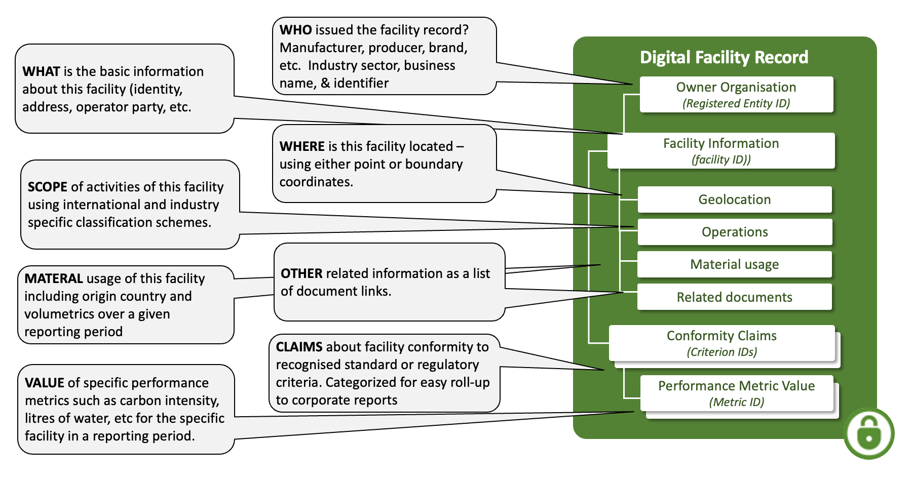
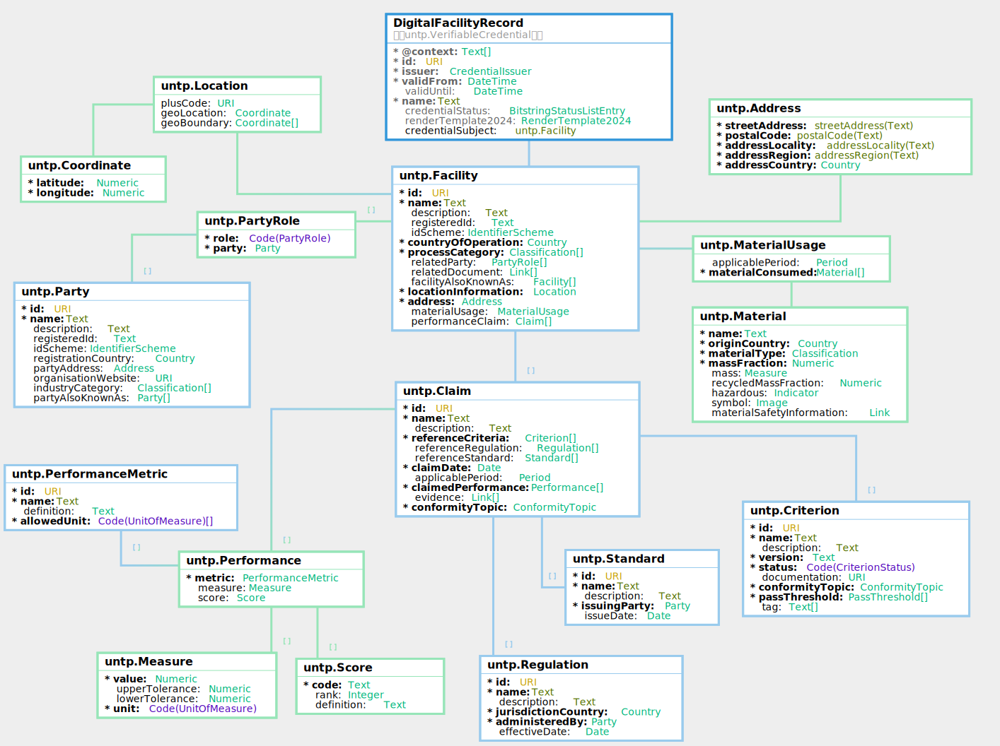

import Disclaimer from '../\_disclaimer.mdx';

<Disclaimer />

## Artifacts

### V0.7.0 Schema and Samples

The JSON schema and sample credential instances for the Digital Facility Record are maintained in this repository.

- **JSON Schema:**

| Schema                                                                                           | Description                                                               |
| ------------------------------------------------------------------------------------------------ | ------------------------------------------------------------------------- |
| [DigitalFacilityRecord.json](pathname:///artefacts/schema/v0.7.0/dfr/DigitalFacilityRecord.json) | Full credential schema including the W3C VC envelope and Facility subject |
| [Facility.json](pathname:///artefacts/schema/v0.7.0/dfr/Facility.json)                           | Standalone schema for the Facility credential subject                     |

- **Sample Instances:**

| Sample                                                                                                                              | Description                |
| ----------------------------------------------------------------------------------------------------------------------------------- | -------------------------- |
| [DigitalFacilityRecord_instance.json](pathname:///artefacts/samples/v0.7.0/dfr/DigitalFacilityRecord_instance.json)                 | Copper mine in Zambia      |
| [DigitalFacilityRecord_smelter_instance.json](pathname:///artefacts/samples/v0.7.0/dfr/DigitalFacilityRecord_smelter_instance.json) | Copper refinery in Japan   |
| [DigitalFacilityRecord_battery_instance.json](pathname:///artefacts/samples/v0.7.0/dfr/DigitalFacilityRecord_battery_instance.json) | Battery factory in Germany |

The three samples represent successive stages of a copper-to-battery supply chain.

### Vocabulary and Context

The DFR is built on the [UNTP Core Vocabulary](CoreVocabulary.md), which defines the shared classes and properties used across all UNTP credential types. The machine-readable vocabulary and JSON-LD context files are published at [https://vocabulary.uncefact.org/untp/](https://vocabulary.uncefact.org/untp/).

## Overview

The digital facility record (DFR) is issued by the owner or operator of a production or manufacturing facility and is the carrier of **facility data and sustainability information** for an identified facility in the value chain. It describes the facility's identity, location, ownership, material consumption, and sustainability performance over a defined reporting period. Because facilities are long-lived assets, DFRs are designed to be **re-issued periodically** (e.g. quarterly or annually) to provide an up-to-date picture of facility operations.

A facility typically has **multiple identifiers** issued by different organisations — a national environmental register, a mining cadastre, an industry membership number. The DFR architecture allows each of these identifiers to resolve to the **same facility record** maintained by the facility operator, restoring data ownership to the natural owner while enabling discovery from any register. The DFR is discoverable in the same way as a DPP — by resolving a facility identifier to an [Identity Resolver](IdentityResolver.md) service that returns links to the facility record.

The DFR tracks **material usage** — the raw materials consumed by the facility, their origin countries, mass fractions, recycled content, and hazardous indicators — as well as **performance claims** at the facility's annual total level (e.g. total Scope 1 emissions in tonnes) rather than at the per-product level. In many value chains, facility-level information may be sufficient to meet the due diligence requirements of buyers, and so the DFR can be used independently of product passports. However, product passports SHOULD reference the facility at which the product was produced. Where both facility and product information are available, verifiers can perform an approximate **mass-balance cross-check** — for example, the total emissions recorded across all products shipped from a facility should approximately equal the reported annual emissions of the facility.

## Conceptual Model



A Digital Facility Record answers six key questions about a production or manufacturing facility:

- **WHO** owns or operates the facility — identified by a registered business entity with a verifiable identifier.
- **WHAT** is the facility — its identity, name, address, and registration details.
- **WHERE** is it located — using point coordinates, boundary polygons, or Plus Codes.
- **SCOPE** of operations — classified by industry process categories (e.g. UN CPC).
- **MATERIAL** usage — what raw materials are consumed, their origin countries, volumes, and recycled content over a reporting period.
- **CLAIMS** about facility performance — conformity claims against recognised standards or regulations, each quantified by specific performance metrics such as GHG emissions intensity or water consumption.

## Requirements

The digital facility record is designed to meet the following detailed requirements as well as the more general [UNTP Requirements](https://untp.unece.org/docs/about/Requirements)

| ID     | Name                    | Requirement Statement                                                                                                                                                                                                           | Solution Mapping                                                                                                                                        |
| ------ | ----------------------- | ------------------------------------------------------------------------------------------------------------------------------------------------------------------------------------------------------------------------------- | ------------------------------------------------------------------------------------------------------------------------------------------------------- |
| DFR-01 | Resolvable ID           | Each facility must have at least one resolvable identifier that can be used in digital product passports and other data exchanges so that verifiers can always access the latest facility data.                                 | `Facility.id` and `Facility.registeredId` with `Facility.idScheme`                                                                                      |
| DFR-02 | Process categories      | The DFR should support any number of industry process classifications using codes from a defined classification scheme (eg UN CPC).                                                                                             | The `Facility.processCategory` array of `Classification` objects                                                                                        |
| DFR-03 | Geo-Location            | The DFR should provide a means to specify a geo-location point, a boundary geometry, and/or a variable-precision area code so that verifiers can geo-locate supplier facilities.                                                | `Facility.locationInformation` with `geoLocation`, `geoBoundary`, and `plusCode`                                                                        |
| DFR-04 | Related parties         | The DFR should specify the owner and/or operator of the facility using one or more globally unique and resolvable entity identifiers, each in a defined role.                                                                   | The `Facility.relatedParty` array of `PartyRole` objects, each linking to a `Party` with verifiable identifiers                                         |
| DFR-05 | Claims                  | The DFR MUST provide a means to include any number of performance claims so that it can provide a single point to aggregate all claims about the facility in one place.                                                         | The `Facility.performanceClaim` array of `Claim` objects                                                                                                |
| DFR-06 | Conformity Topic        | The DFR MUST provide a simple mechanism to express the sustainability/circularity/conformity topic for each claim so that similar claims can be grouped and the high-level scope easily understood.                             | The `Claim.conformityTopic` property referencing the [Conformity Topics](CoreTaxonomies.md) taxonomy                                                    |
| DFR-07 | Metrics                 | The DFR MUST provide a simple mechanism to quantify a performance claim (eg carbon intensity, water consumption) using either a numeric measure with tolerance, or a categorical score, or both.                                | The `Performance` class with `metric` (from the [Performance Metrics](CoreTaxonomies.md) taxonomy), `measure` (value + unit), and `score` (code + rank) |
| DFR-08 | Criteria                | The DFR MUST provide a means to reference a standard or regulation as well as the specific criteria within that standard or regulation — so that claims can be understood in terms of the criteria against which they are made. | `Claim.referenceCriteria`, `Claim.referenceRegulation`, and `Claim.referenceStandard`                                                                   |
| DFR-09 | Evidence                | The DFR MUST provide a means to reference independent conformity assessments that support and verify the claims being made. The related evidence SHOULD be digitally verifiable but MAY be a simple document or web page.       | The `Claim.evidence` property links to a UNTP [Digital Conformity Credential](ConformityCredential.md) (DCC) or other supporting document               |
| DFR-10 | Material usage          | The DFR should provide a structure to describe the raw materials consumed by the facility over a reporting period, including origin country, mass fraction, recycled content, and hazardous material indicators.                | The `Facility.materialUsage` property with `MaterialUsage.materialConsumed` array of `Material` objects                                                 |
| DFR-11 | Reporting period        | The DFR should support time-bounded reporting so that claims and material consumption can be attributed to a specific period, even when different data sources follow different reporting cycles.                               | The `applicablePeriod` property on both `Claim` and `MaterialUsage`, independent of the credential-level `validFrom` / `validUntil`                     |
| DFR-12 | Address                 | The DFR should provide a structured postal address for the facility, distinct from its geographic coordinates.                                                                                                                  | The `Facility.address` property using the `Address` class                                                                                               |
| DFR-13 | Alternative identifiers | The DFR should support listing additional facility identifiers from other schemes so that multiple registers and directories can resolve to the same facility record.                                                           | The `Facility.facilityAlsoKnownAs` array of identifier objects                                                                                          |
| DFR-14 | Related documents       | The DFR should provide a means to link to supporting documents such as environmental permits, site plans, or conformity credentials that are relevant to the facility but are not structured data within the credential.        | The `Facility.relatedDocument` array of `Link` objects                                                                                                  |

## Logical Model

The Digital Facility Record is an assembly of re-usable components from the UNTP core vocabulary.



The DFR credential wraps a `Facility` as its credential subject. The facility carries identification, classification, and descriptive information alongside the following key structures:

- **Ownership and operation** — related parties in defined roles via `PartyRole`, each linking to a `Party` with verifiable identifiers, registration country, address, and industry classification.
- **Location** — the `Location` of the facility using Plus Codes, point coordinates (`Coordinate`), or boundary polygons, plus a structured `Address`.
- **Material usage** — a `MaterialUsage` object describing the `Material` inputs consumed over a reporting period, each with origin country, mass fraction, recycled content, and hazardous indicators.
- **Performance claims** — an array of `Claim` objects, each referencing a `Criterion` from a standard or regulation, classified by `ConformityTopic`, and carrying quantified `Performance` measures classified by `PerformanceMetric`. Claims link to supporting evidence such as conformity credentials.

For detailed class and property definitions, see the [Core Vocabulary](CoreVocabulary.md) reference.

## Implementation Guidance

### Reporting Periods

Unlike a DPP, which is a performance snapshot of a specific product model, batch, or item, the DFR describes a **long-lived facility**. Facility operators are expected to issue DFRs on a regular basis (e.g. quarterly or annually) to describe the performance of a facility over a defined period. The `performanceClaim` array carries claims for the current reporting period, and each claim includes an `applicablePeriod` to make the time range explicit.

In practice, reporting periods do not always align neatly across all data sources. Bulk material consumption may be reported on a calendar-year basis while a third-party conformity attestation covers a different audit cycle. For this reason, both `MaterialUsage` and `Claim` include an `applicablePeriod` property that can specify a precise date range, allowing each component to declare its own time boundaries independently of the credential's overall `validFrom` / `validUntil` dates.

### Facility Identifiers

A DFR is discovered by downstream customers by resolving the facility identifier — for example, scanning a facility ID or looking it up in a register — to find the DFR via an [Identity Resolver](IdentityResolver.md). Most facilities have **multiple identifiers** issued by different organisations: a national environmental register, a mining cadastre, an industry association membership number, and so on. The key insight is that each of these identifiers can resolve to the **same DFR** that the facility owner maintains and controls.

This architecture restores ownership of facility data to the natural owner — the facility operator — while allowing multiple registers and directories to link to it, like many different road signs pointing at the same city. In the DFR, the primary identifier is carried by `Facility.id` and `Facility.registeredId`, while additional identifiers are listed in the `facilityAlsoKnownAs` array.

### Data Mapping

Implementers should map their existing facility data to a UNTP DFR following a similar approach to [DPP data mapping](DigitalProductPassport.md#implementation-guidance):

| Mapping Type            | UNTP Pattern                                                                                                                                                                                            | When to use                                                                                                                                                 |
| ----------------------- | ------------------------------------------------------------------------------------------------------------------------------------------------------------------------------------------------------- | ----------------------------------------------------------------------------------------------------------------------------------------------------------- |
| **Direct property**     | Named properties on `Facility` (e.g. `id`, `countryOfOperation`, `processCategory`, `address`, `locationInformation`, `relatedParty`)                                                                   | The source attribute has a direct equivalent in the UNTP core vocabulary                                                                                    |
| **Related document**    | `Facility.relatedDocument` — a `Link` to an external resource                                                                                                                                           | Supporting documents such as environmental permits, site plans, or conformity credentials                                                                   |
| **Performance claim**   | `Facility.performanceClaim` — a `Claim` referencing a `ConformityTopic`, a `PerformanceMetric`, and optionally linked to a scheme criterion, an external standard, and/or relevant national regulations | Quantified sustainability metrics such as annual GHG emissions, water consumption, or recycled content                                                      |
| **Separate credential** | A UNTP [Digital Traceability Event](DigitalTraceabilityEvents.md) (DTE) or [Digital Conformity Credential](ConformityCredential.md) (DCC) linked from the DFR                                           | Detailed mass-balance stocks and flows (DTEs) and independent third-party audits of those flows (DCCs) — data that UNTP recommends managing outside the DFR |
| **No mapping**          | —                                                                                                                                                                                                       | If you find a facility data requirement that cannot be mapped, please contact our [mailing list](/) so we can address it                                    |

### Geographic Anchoring

Every DFR should be geographically anchored via the `locationInformation` property, which supports three representations that can be used individually or in combination:

- A single **coordinate** (`geoLocation`) — a latitude/longitude point marking the facility location.
- A **boundary** (`geoBoundary`) — a sequence of coordinates defining the facility perimeter.
- A **Plus Code** (`plusCode`) — a [Plus Code](https://maps.google.com/pluscodes/) grid reference that can define areas at varying precision, from a precise point (e.g. `8Q7Q5G22+22`) to a larger region by removing trailing digits.

## The components of a DFR

This section provides sample JSON-LD snippets for each DFR component, drawn from the [copper refinery sample credential](pathname:///artefacts/samples/v0.7.0/dfr/DigitalFacilityRecord_smelter_instance.json).

### Credential Envelope

All DFRs are issued as [W3C Verifiable Credentials (VCDM 2.0)](https://www.w3.org/TR/vc-data-model-2.0/). The credential `type` includes both `VerifiableCredential` and `DigitalFacilityRecord`, and the `@context` references both the W3C VCDM and UNTP context URIs. The issuer `id` SHOULD be a DID using a supported [DID method](VerifiableCredentials.md#did-methods), with `issuerAlsoKnownAs` linking to authoritative business register identifiers. The issuing party should be the facility owner or operator.

```json
{
  "type": ["DigitalFacilityRecord", "VerifiableCredential"],
  "@context": [
    "https://www.w3.org/ns/credentials/v2",
    "https://vocabulary.uncefact.org/untp/"
  ],
  "id": "https://credentials.sample-refinery.example.com/dfr/smelter-002",
  "issuer": {
    "type": ["CredentialIssuer"],
    "id": "did:web:sample-refinery.example.com",
    "name": "Sample Copper Refinery Co. Ltd",
    "issuerAlsoKnownAs": [
      {
        "id": "https://www.sample-register.example.com/henkorireki-johoto.html?selHouzinNo=REF-001",
        "name": "Sample Copper Refinery Co. Ltd",
        "registeredId": "REF-001",
        "idScheme": {
          "id": "https://www.sample-register.example.com",
          "name": "Japan Corporate Number (Houjin Bangou)"
        }
      }
    ]
  },
  "validFrom": "2025-01-15T00:00:00Z",
  "validUntil": "2028-01-15T00:00:00Z",
  "name": "Digital Facility Record — Sample Copper Refinery",
  "credentialSubject": {"type": ["Facility"], "...": "..."}
}
```

### Facility Identification

The `Facility` credential subject identifies the facility via a resolvable URI (`id`), a registered identifier (`registeredId`), and an identifier scheme (`idScheme`). The facility `id` should be resolvable via an [Identity Resolver](IdentityResolver.md) that returns links to the DFR. The `countryOfOperation` carries the ISO 3166 country, and `processCategory` classifies operations using schemes such as [UN CPC](https://unstats.un.org/unsd/classifications/Econ/cpc). Additional identifiers from other schemes can be listed in `facilityAlsoKnownAs`.

```json
"credentialSubject": {
  "type": ["Facility"],
  "id": "https://facility-register.example.com/fac-002",
  "name": "Sample Copper Refinery",
  "description": "Copper smelting and electrolytic refining facility in Sample, Oita Prefecture, Japan.",
  "registeredId": "fac-002",
  "idScheme": {
    "id": "https://facility-register.example.com",
    "name": "UNTP Sample Facility Register"
  },
  "countryOfOperation": { "countryCode": "JP", "countryName": "Japan" },
  "processCategory": [
    {
      "code": "41521",
      "name": "Unwrought copper",
      "schemeId": "https://unstats.un.org/unsd/classifications/Econ/cpc/",
      "schemeName": "UN Central Product Classification (CPC)"
    }
  ],
  "facilityAlsoKnownAs": [
    {
      "id": "https://prtr.example.go.jp/facilities/JP-44-SM-0021",
      "name": "Sample Copper Refinery",
      "registeredId": "JP-44-SM-0021",
      "idScheme": {
        "id": "https://prtr.example.go.jp",
        "name": "Japan PRTR Facility Register"
      }
    }
  ]
}
```

### Related Parties

The `relatedParty` array identifies organisations associated with the facility in defined roles (e.g. owner, operator). Each `PartyRole` links to a `Party` with verifiable identifiers, registration country, address, and industry classification.

```json
"relatedParty": [
  {
    "role": "owner",
    "party": {
      "type": ["Party"],
      "id": "did:web:sample-refinery.example.com",
      "name": "Sample Copper Refinery Co. Ltd",
      "registeredId": "REF-001",
      "idScheme": {
        "id": "https://www.sample-register.example.com",
        "name": "Japan Corporate Number (Houjin Bangou)"
      },
      "registrationCountry": { "countryCode": "JP", "countryName": "Japan" },
      "partyAddress": {
        "streetAddress": "3-1 Sample, Usuki",
        "postalCode": "879-2201",
        "addressLocality": "Oita",
        "addressRegion": "Oita Prefecture",
        "addressCountry": { "countryCode": "JP", "countryName": "Japan" }
      },
      "organisationWebsite": "https://sample-refinery.example.com"
    }
  }
]
```

### Related Documents

The `relatedDocument` array provides links to supporting resources such as conformity credentials, environmental reports, or permits. Each `Link` includes a URL, human-readable name, media type, and a link type from a controlled vocabulary.

```json
"relatedDocument": [
  {
    "linkURL": "https://credentials.sample-cab.example.com/dcc/smelter-002",
    "linkName": "Coppermark Certification — Sample Copper Refinery",
    "mediaType": "application/ld+json",
    "linkType": "https://test.uncefact.org/vocabulary/linkTypes/dcc"
  }
]
```

### Location

The `locationInformation` property locates the facility geographically. It supports three representations, at least one of which should be provided:

- A [Plus Code](https://maps.google.com/pluscodes/) — a grid reference that can define areas from a precise point to a large region.
- A `geoLocation` as a decimal latitude/longitude point.
- A `geoBoundary` as a sequence of latitude/longitude pairs defining the facility boundary.

The `address` property provides a structured postal address.

```json
"locationInformation": {
  "plusCode": "https://plus.codes/8Q7Q5G22+22",
  "geoLocation": { "latitude": 33.25, "longitude": 131.88 },
  "geoBoundary": [
    { "latitude": 33.24, "longitude": 131.87 },
    { "latitude": 33.26, "longitude": 131.89 }
  ]
},
"address": {
  "streetAddress": "3-1 Sample, Usuki",
  "postalCode": "879-2201",
  "addressLocality": "Oita",
  "addressRegion": "Oita Prefecture",
  "addressCountry": { "countryCode": "JP", "countryName": "Japan" }
}
```

### Material Usage

The `materialUsage` property describes the raw materials consumed by the facility over a reporting period. Each `Material` includes its origin country, classification, mass fraction of total input, absolute mass, recycled content fraction, and hazardous indicator.

```json
"materialUsage": {
  "applicablePeriod": {
    "startDate": "2024-01-01",
    "endDate": "2024-12-31",
    "periodInformation": "Calendar year 2024 reporting period."
  },
  "materialConsumed": [
    {
      "name": "Copper concentrate",
      "originCountry": { "countryCode": "ZM", "countryName": "Zambia" },
      "materialType": {
        "code": "14110",
        "name": "Copper ores and concentrates",
        "schemeId": "https://unstats.un.org/unsd/classifications/Econ/cpc/",
        "schemeName": "UN Central Product Classification (CPC)"
      },
      "massFraction": 0.85,
      "mass": { "value": 420000000, "unit": "KGM" },
      "recycledMassFraction": 0,
      "hazardous": false
    },
    {
      "name": "Coke (reducing agent)",
      "originCountry": { "countryCode": "AU", "countryName": "Australia" },
      "materialType": {
        "code": "33100",
        "name": "Coke and semi-coke",
        "schemeId": "https://unstats.un.org/unsd/classifications/Econ/cpc/",
        "schemeName": "UN Central Product Classification (CPC)"
      },
      "massFraction": 0.10,
      "mass": { "value": 50000000, "unit": "KGM" },
      "recycledMassFraction": 0,
      "hazardous": false
    }
  ]
}
```

### Performance Claims

The `performanceClaim` array carries the facility operator's self-declared sustainability claims for a reporting period. Each `Claim` references criteria classified by a `ConformityTopic` from the [Conformity Topics taxonomy](CoreTaxonomies.md) and carries quantified performance using a `PerformanceMetric` from the [Performance Metrics taxonomy](CoreTaxonomies.md). Unlike product-level claims, facility claims typically report annual totals (e.g. total Scope 1 emissions in tonnes) rather than per-unit intensities. Claims SHOULD link to independent [conformity assessments](ConformityCredential.md) as `evidence`.

```json
"performanceClaim": [
  {
    "type": ["Claim"],
    "id": "https://sample-refinery.example.com/claims/ghg-2024",
    "name": "GHG Emissions — Scope 1",
    "description": "Annual Scope 1 greenhouse gas emissions from the Sample Copper Refinery for the 2024 reporting year.",
    "referenceCriteria": [
      {
        "id": "https://sample-scheme.coppermark.org/criteria/ghg-management/v3",
        "name": "GHG Emissions Management (Coppermark RRA Criterion 26)",
        "conformityTopic": [
          {
            "type": ["ConformityTopic"],
            "id": "https://vocabulary.uncefact.org/conformity-topic/greenhouse-gas-emissions",
            "name": "Greenhouse Gas Emissions"
          }
        ]
      }
    ],
    "claimDate": "2025-03-01",
    "applicablePeriod": {
      "startDate": "2024-01-01",
      "endDate": "2024-12-31"
    },
    "claimedPerformance": [
      {
        "metric": {
          "id": "https://vocabulary.uncefact.org/performance-metric/scope-1-ghg-emissions",
          "name": "Scope 1 GHG Emissions"
        },
        "measure": { "value": 120000, "unit": "TNE" }
      }
    ],
    "conformityTopic": [
      {
        "type": ["ConformityTopic"],
        "id": "https://vocabulary.uncefact.org/conformity-topic/greenhouse-gas-emissions",
        "name": "Greenhouse Gas Emissions"
      }
    ]
  }
]
```

### Referencing Conformity Criteria

Claims SHOULD unambiguously reference a criterion from a recognised scheme, standard, or regulation using a URI. This shared reference is what allows independent conformity assessments to verify facility operator claims — both reference the same criterion. Issuers can discover the right criterion URIs via the UNTP [Conformity Vocabulary Catalog](ConformityVocabularyCatalog.md).
