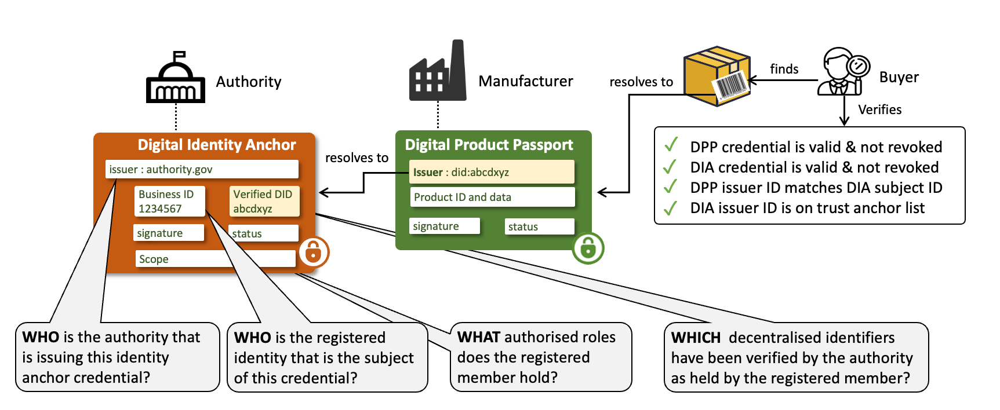
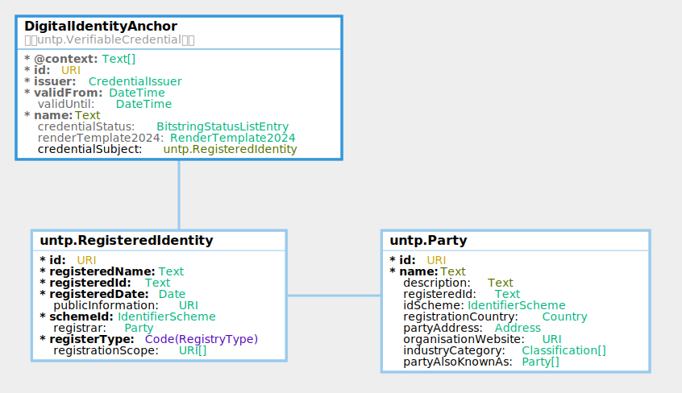

import Disclaimer from '../\_disclaimer.mdx';

<Disclaimer />

## Artifacts

### V0.7.0 Schema and Samples

The JSON schema and sample credential instance for the Digital Identity Anchor are maintained in this repository.

- **JSON Schema:**

| Schema                                                                                           | Description                                                                         |
| ------------------------------------------------------------------------------------------------ | ----------------------------------------------------------------------------------- |
| [DigitalIdentityAnchor.json](pathname:///artefacts/schema/v0.7.0/dia/DigitalIdentityAnchor.json) | Full credential schema including the W3C VC envelope and RegisteredIdentity subject |
| [RegisteredIdentity.json](pathname:///artefacts/schema/v0.7.0/dia/RegisteredIdentity.json)       | Standalone schema for the RegisteredIdentity credential subject                     |

- **Sample Instances:**

| Sample                                                                                                                              | Description                                                                       |
| ----------------------------------------------------------------------------------------------------------------------------------- | --------------------------------------------------------------------------------- |
| [DigitalIdentityAnchor_smelter_instance.json](pathname:///artefacts/samples/v0.7.0/dia/DigitalIdentityAnchor_smelter_instance.json) | Business register anchors the smelter owner DID to a corporate number             |
| [DigitalIdentityAnchor_mine_instance.json](pathname:///artefacts/samples/v0.7.0/dia/DigitalIdentityAnchor_mine_instance.json)       | Mining cadastre anchors the mine operator DID to a facility registration          |
| [DigitalIdentityAnchor_battery_instance.json](pathname:///artefacts/samples/v0.7.0/dia/DigitalIdentityAnchor_battery_instance.json) | Trademark register anchors the battery manufacturer DID to a registered trademark |

The three samples illustrate different register types — business, facility, and trademark — each anchoring a DID from the copper-to-battery supply chain to an authoritative registered identity.

### Vocabulary and Context

The DIA is built on the [UNTP Core Vocabulary](CoreVocabulary.md), which defines the shared classes and properties used across all UNTP credential types. The machine-readable vocabulary and JSON-LD context files are published at [https://vocabulary.uncefact.org/untp/](https://vocabulary.uncefact.org/untp/).

## Overview

The Digital Identity Anchor (DIA) credential provides a means to verify the real-world identity of UNTP credential issuers. The `issuer.id` property of all UNTP credentials is a W3C decentralized identifier (DID), which allows credentials such as Digital Product Passports (DPPs) to be cryptographically verified as genuinely issued by the entity that controls that DID. However, as a self-issued identity, the DID alone does not provide confidence that the issuer is really who they claim to be.

Authoritative identity registers — national business registers, trademark registers, mining cadastres, and similar institutions — exist in most countries and have well-established registration and verification processes. Unfortunately, most of these registers only issue paper or PDF registration certificates that are easily faked and cannot be used for digitally verifiable proof of identity.

The UNTP DIA bridges this gap. It is essentially a digitally verifiable version of a registration certificate, issued by the authoritative register to authenticated members after the member proves ownership of their DID. When a DIA accompanies a UNTP credential such as a DPP, a verifier can confirm not only that the DPP was issued by the holder of the DID, but also that the controller of the DID is the holder of an authoritative registered identity.

## Conceptual Model

The Digital Identity Anchor (DIA) is a verifiable credential that is issued by a trusted authority and asserts an equivalence between a member identity as known to the authority (eg a VAT number) and one or more decentralised identifiers (DIDs) held by the member. Before issuing the DIA, the authority MUST verify DID ownership (eg using [DID Auth](https://w3c-ccg.github.io/vp-request-spec/#did-authentication)).



The outcome is that the subject of the DIA (eg the VAT registered business) can prove that they are the registered identity to any other party. In the UNTP context the DIA provides assurance that a DPP (or DCC/DFR/DTE) issuer really is who they say they are. The verification workflow is as follows

- A verifier (eg buyer of an identified product) discovers a DPP for the product and verifies the credential - confirming that the DPP has not been tampered-with, is genuinely issued by party identified by the issuer DID.
- The DID is resolvable to the DID document which contains a link to the DIA in the DID document `service` endpoint.
- The verifier verifies the DIA credential and confirms that the DPP issuer DID matches the `credentialSubject.id` of the DIA.
- The verifier confirms that the DID of the issuing authority (the authoritative registrar for the jurisdiction) is on the trusted register list.

The DIA can also be used for similar trust anchoring purposes such as:

- Accreditation authorities issue DIA to assert that a conformity assessment body is accredited against a given scheme.
- IP Offices issue DIA to assert that a registered party is the genuine owner of a trademark.
- Land registers issue DIA to assert that a regulated party is the owner of a geo-located property.

## Requirements

The digital identity anchor is designed to meet the following detailed requirements as well as the more general [UNTP Requirements](https://untp.unece.org/docs/about/Requirements)

| ID     | Name                | Requirement Statement                                                                                                                                                                                                                                                    | Solution Mapping                                                                                                                                          |
| ------ | ------------------- | ------------------------------------------------------------------------------------------------------------------------------------------------------------------------------------------------------------------------------------------------------------------------ | --------------------------------------------------------------------------------------------------------------------------------------------------------- |
| DIA-01 | DID Verification    | The DIA issuer (registrar) MUST confirm that the registered member (subject) is the legitimate controller of a DID before issuing a DIA credential so that the registrar is protected against members falsely claiming ownership of well known DIDs                      | SHOULD use the [DID Auth](https://w3c-ccg.github.io/vp-request-spec/#did-authentication) protocol for this purpose.                                       |
| DIA-02 | DIA Issuer DID      | The DIA issuer MUST use a supported DID method (see [DID Methods](VerifiableCredentials.md#did-methods)) as the DIA issuer and the domain MUST match the well known domain of the issuing authority so that verifiers can confirm authority identity via public records. | `CredentialIssuer.id` — the issuer DID in the [Credential Envelope](#credential-envelope)                                                                 |
| DIA-03 | Scheme registration | The DIA issuing authority SHOULD register the identity scheme (including the trusted issuer DIDs) with the UN/CEFACT identifier scheme registry so that verifiers can leverage UN maintained scheme metadata to simplify DIA discovery and verification.                 | [UN GRID](#authoritative-registers-and-the-un-grid) for authoritative registers; UNTP [implementation registers](#non-authoritative-registers) for others |
| DIA-04 | Multiple DIDs       | A registered member may need to link multiple DIDs to one registered ID, either because there is a need to transition between DID service providers or because an organisation may choose to use different DIDs for different purposes.                                  | Issue multiple DIAs                                                                                                                                       |
| DIA-05 | Scope List          | The DIA MUST include a list of scope URIs that unambiguously define the authorised role(s) of the member in the register so that verifiers can confirm the scope of the membership.                                                                                      | `RegisteredIdentity.registrationScope`                                                                                                                    |
| DIA-06 | Register Type       | The DIA MUST specify the register type so that verifiers can understand the context of the `registrationScope`                                                                                                                                                           | `RegisteredIdentity.registerType`                                                                                                                         |
| DIA-07 | DIA Discovery       | The DIA SHOULD be discoverable given either the DID or the registeredID                                                                                                                                                                                                  | [DIA Discovery](#dia-discovery)                                                                                                                           |
| DIA-08 | White list          | The DIA should include a mechanism to avoid malicious actors who are not the registrar from issuing DIAs that claim links to authoritative registered IDs                                                                                                                | [UN GRID](#authoritative-registers-and-the-un-grid) and UNTP [implementation registers](#non-authoritative-registers) maintain trusted issuer lists       |

The examples below help to clarify the application of DIA-05 and DIA-06.

## Logical Model

The Digital Identity Anchor is a simple credential that binds a DID to a registered identity in an authoritative register.



For detailed class and property definitions, see the [Core Vocabulary](CoreVocabulary.md) reference. For implementation details, sample JSON-LD snippets, and register-specific use cases, see [The Components of a DIA](#the-components-of-a-dia) below.

## Implementation Guidance

### Who Issues DIAs?

DIAs are issued by authorities that already operate authoritative identity registers — national business registers, mining cadastres, trademark offices, accreditation bodies, and similar institutions. These authorities have well-established registration and verification processes. The DIA simply extends their existing function by issuing a digitally verifiable credential that binds a member's DID to their registered identity, rather than only issuing paper or PDF registration certificates.

The critical trust question for a verifier is: _how do I know that the DIA issuer is genuinely the authority it claims to be, and not a fraudulent actor masquerading as an authoritative register?_

### Authoritative Registers and the UN GRID

The UN/CEFACT [Global Registrar Information Directory (GRID)](https://un.opensource.unicc.org/unece/uncefact/gtr/) is designed to address this trust question for authoritative registers operated by regulatory authorities in UN member states. Registers listed on the GRID — such as national business registers, land registries, and government-operated accreditation bodies — are maintained by recognised sovereign authorities. When a DIA issuer DID appears on the GRID, a verifier can have high confidence that the issuer is the legitimate authority for that identity scheme.

Register operators that wish to issue DIAs should:

1. Register their identity scheme on the UN GRID, including their trusted issuer DID(s).
2. Implement [DID Auth](https://w3c-ccg.github.io/vp-request-spec/#did-authentication) or equivalent DID ownership verification before issuing DIAs to registered members.
3. Make DIAs [discoverable](#dia-discovery) from both the member's DID document and the register's identity resolver service.

### Non-Authoritative Registers

UNTP recognises that trust in the supply chain ecosystem is also supported by identity assertions from registers that are not operated by sovereign regulatory authorities. These include product registers (e.g. GS1 GTIN), industry association membership registers, facility registers operated by industry bodies, and similar non-governmental schemes. While these registers may not carry the same sovereign authority as government registers, they are nonetheless well-established and trusted within their respective domains.

Because the UN GRID is designed to list only registers operated by regulatory authorities in member states, these non-authoritative registers are not eligible for GRID listing. Instead, UNTP maintains lists of recognised non-authoritative registers in its [implementations register pages](../implementations/SchemeOwners.md), providing a similar level of register identity assurance. Verifiers can consult both the UN GRID (for authoritative registers) and the UNTP register pages (for non-authoritative registers) to determine whether a DIA issuer is a recognised register operator.

## The Components of a DIA

This section provides sample JSON-LD snippets for each DIA component, drawn from the [smelter identity anchor sample](pathname:///artefacts/samples/v0.7.0/dia/DigitalIdentityAnchor_smelter_instance.json).

### Credential Envelope

All DIAs are issued as [W3C Verifiable Credentials (VCDM 2.0)](https://www.w3.org/TR/vc-data-model-2.0/). The credential `type` includes both `VerifiableCredential` and `DigitalIdentityAnchor`, and the `@context` references both the W3C VCDM and UNTP context URIs. Critically, the issuer MUST be the authoritative register itself — not the entity whose identity is being anchored. The issuer `id` SHOULD be a DID using a supported [DID method](VerifiableCredentials.md#did-methods), and the domain MUST match the well-known domain of the issuing authority so that verifiers can confirm registry identity via public records. Please refer to [DPP VC Guidance](DigitalProductPassport.md#verifiable-credential) for further information about the use of the verifiable credentials data model for UNTP.

```json
{
  "type": ["DigitalIdentityAnchor", "VerifiableCredential"],
  "@context": [
    "https://www.w3.org/ns/credentials/v2",
    "https://vocabulary.uncefact.org/untp/"
  ],
  "id": "https://credentials.houjin-register.example.com/dia/ref-001",
  "issuer": {
    "type": ["CredentialIssuer"],
    "id": "did:web:houjin-register.example.com",
    "name": "Sample National Tax Agency — Corporate Number System",
    "issuerAlsoKnownAs": [
      {
        "id": "https://www.houjin-register.example.com",
        "name": "Sample National Tax Agency"
      }
    ]
  },
  "validFrom": "2025-04-01T00:00:00Z",
  "validUntil": "2027-03-31T00:00:00Z",
  "name": "Corporate Identity Anchor — Sample Copper Refinery Co. Ltd",
  "credentialSubject": {
    "type": ["RegisteredIdentity"],
    "...": "..."
  }
}
```

### Registered Identity

The `RegisteredIdentity` is the `credentialSubject` of the DIA. It establishes the binding between a DID controlled by the subject and a registered identity in the authoritative register.

- `id` MUST be the DID of the registered member. The registrar MUST verify DID ownership (e.g. using [DID Auth](https://w3c-ccg.github.io/vp-request-spec/#did-authentication)) before issuing the DIA.
- `registeredName` is the entity name as it appears in the authoritative register.
- `registeredId` is the identifier value that is unique within the register (but may not be globally unique), for example a corporate number, facility licence number, or trademark registration number.
- `registeredDate` is the date the entity was first registered.
- `publicInformation` links to the public record on the registrar's site.
- `schemeId` identifies the identifier scheme operated by the registrar. If the scheme is registered with UN/CEFACT then `schemeId.id` MUST match the `identityRegister.id` in the UN/CEFACT scheme register.
- `registrar` identifies the authority that operates the register.
- `registerType` classifies the register (one of `business`, `facility`, `product`, `trademark`, `land`, `accreditation`), allowing verifiers to distinguish between different DIA use cases.
- `registrationScope` is an array of URIs that define the scope of the registration. The values are specific to the register — for example, a business register might reference entity types, a mining register might reference licence categories.

```json
"credentialSubject": {
  "type": ["RegisteredIdentity"],
  "id": "did:web:sample-refinery.example.com",
  "registeredName": "Sample Copper Refinery Co. Ltd",
  "registeredId": "REF-001",
  "registeredDate": "1985-06-15",
  "publicInformation": "https://www.houjin-register.example.com/henkorireki-johoto.html?selHouzinNo=REF-001",
  "schemeId": {
    "type": ["IdentifierScheme"],
    "id": "https://www.houjin-register.example.com",
    "name": "Japan Corporate Number (Houjin Bangou)"
  },
  "registrar": {
    "id": "https://www.houjin-register.example.com",
    "name": "Sample National Tax Agency"
  },
  "registerType": "business",
  "registrationScope": [
    "https://www.houjin-register.example.com/EntityType?Id=kabushiki-kaisha"
  ]
}
```

### Use Case: Business Register

A national business register issues a DIA to anchor a company's DID to its registered corporate identity. This is the most common DIA use case — it allows a verifier who receives a DPP, DFR, or DCC issued by the company to confirm that the issuer DID is controlled by a legitimately registered business entity. In this example, the Japanese corporate number register anchors the copper refinery's DID to its corporate number.

```json
"credentialSubject": {
  "type": ["RegisteredIdentity"],
  "id": "did:web:sample-refinery.example.com",
  "registeredName": "Sample Copper Refinery Co. Ltd",
  "registeredId": "REF-001",
  "registeredDate": "1985-06-15",
  "publicInformation": "https://www.houjin-register.example.com/henkorireki-johoto.html?selHouzinNo=REF-001",
  "schemeId": {
    "type": ["IdentifierScheme"],
    "id": "https://www.houjin-register.example.com",
    "name": "Japan Corporate Number (Houjin Bangou)"
  },
  "registrar": {
    "id": "https://www.houjin-register.example.com",
    "name": "Sample National Tax Agency"
  },
  "registerType": "business",
  "registrationScope": [
    "https://www.houjin-register.example.com/EntityType?Id=kabushiki-kaisha"
  ]
}
```

### Use Case: Facility Register

A national mining cadastre or environmental register issues a DIA to anchor a facility operator's DID to a registered mine site or production facility. This allows verifiers to confirm that the operator of a facility — as identified by their DID in a Digital Facility Record — is the legitimate holder of the facility licence. In this example, the Zambia Mining Cadastre anchors the mine operator's DID to its large-scale mining licence.

```json
"credentialSubject": {
  "type": ["RegisteredIdentity"],
  "id": "did:web:sample-mine.example.com",
  "registeredName": "Sample Copper Mine",
  "registeredId": "ZM-NW-CU-0012",
  "registeredDate": "2003-09-22",
  "publicInformation": "https://mining-register.gov.zm/facilities/ZM-NW-CU-0012",
  "schemeId": {
    "type": ["IdentifierScheme"],
    "id": "https://mining-register.gov.zm",
    "name": "Zambia Mining Cadastre"
  },
  "registrar": {
    "id": "https://mining-register.gov.zm",
    "name": "Zambia Ministry of Mines"
  },
  "registerType": "facility",
  "registrationScope": [
    "https://mining-register.gov.zm/LicenceType?Id=large-scale-mining"
  ]
}
```

### Use Case: Trademark Register

A national intellectual property office issues a DIA to anchor a trademark owner's DID to a registered trademark. This allows verifiers to confirm that the entity using a brand name on product passports is the legitimate owner of that trademark. In this example, a national patent and trademark office anchors the battery manufacturer's DID to its registered "VoltCell" trademark under Nice Classification class 9 (batteries and electrical apparatus).

```json
"credentialSubject": {
  "type": ["RegisteredIdentity"],
  "id": "did:web:sample-battery.example.com",
  "registeredName": "VoltCell",
  "registeredId": "302024001234",
  "registeredDate": "2022-03-10",
  "publicInformation": "https://dpma.example.com/trademarks/302024001234",
  "schemeId": {
    "type": ["IdentifierScheme"],
    "id": "https://dpma.example.com",
    "name": "Sample National Trademark Register"
  },
  "registrar": {
    "id": "https://dpma.example.com",
    "name": "Sample Patent and Trademark Office"
  },
  "registerType": "trademark",
  "registrationScope": [
    "https://dpma.example.com/NiceClassification?Id=9"
  ]
}
```

## DIA Discovery

DIA credentials SHOULD be discoverable from either identifier:

- Given a DID (eg as the issuer of a DPP) via DID document `service` endpoint.
- Given a registered identifier (eg a VAT registration number) via the ID scheme resolver service.

### Via DID Service Endpoint

As described in the [W3C Decentralized Identifiers](https://www.w3.org/TR/did-core/) specification, DIDs are resolvable to a DID document. The `service` property of a DID document contains an array of typed `serviceEndpoint` which can point to services or credentials relevant to the DID. A DID document may also contain an "alsoKownAs" property which is typically used to reference other identifiers. Controllers of DIDs that are linked to authoritative register SHOULD

- Include the URI of registered identifier in the `alsoKnownAs` property of the DID document to establish a bidirectional link. In the snippet below `https://sample-register.gov/90664869327` has been added.
- Add proof that the relationship is reciprocal by adding a `service` object that references the DIA credential. In the example below, the DIA credential URL is `https://sample-credential-store.com/credentials/dia-90664869327.json`

```json
{
  "id": "did:method:sample-business.com:123456789",
  "authentication": [{..}],
  ..
  "alsoKnownAs": ["https://sample-register.gov/90664869327"],
  "service": [{
    "id":"did:method:sample-business.com:123456789#90664869327",
    "type":"untp:dia"
    "serviceEndpoint": {
        "href":"https://sample-credential-store.com/credentials/dia-90664869327.json",
        "title":"Digital Identity Anchor",
        "type": "application/vc+jwt"
    }
  }]
}
```

### Via Identity Resolver

As described in the UNTP [Identity Resolver](IdentityResolver.md) specification, existing identity registers are encouraged to make their registered identities _resolvable_ and _verifiable_.

- Identifiers are made _resolvable_ by implementing [ISO-18975](https://www.iso.org/standard/85540.html) to encode IDs as URLs and returning an IETF [rfc-9264](https://datatracker.ietf.org/doc/rfc9264/) link-set with links to relevant further data about the ID.
- Identifiers are made _verifiable_ by issuing DIAs per this specification.

This presents the opportunity to make the DIA discoverable by returning an appropriate link in the link-set. For example, given a VAT registration number `90664869327` issued under scheme `https://sample-register.gov` and applying the scheme resolver template may yield a resolver service URL of `https://resolver.sample-register.gov/vatNumber/90664869327`

The resolver service may be called with parameters that define which link-types to return. `https://resolver.sample-register.gov/vatNumber/90664869327?linkType=all` will return a linkset that SHOULD contain the DIA credential link (among other links such as the registration history) as follows.

```json
{
  "linkset": [
    {
      "anchor": "https://resolver.sample-register.gov/vatNumber/90664869327",
      "untp:dia": [
        {
          "href": "https://sample-credential-store.com/credentials/dia-90664869327.json",
          "title": "Digital Identity Anchor",
          "type": "application/vc+jwt"
        }
      ]
    },
    {
      "anchor": "https://resolver.sample-register.gov/vatNumber/90664869327",
      "about": [
        {
          "href": "https://sample-register.gov/registrationHistory?id=90664869327",
          "title": "Registration History",
          "type": "text/html"
        }
      ]
    }
  ]
}
```

Alternatively, invoking the resolver service with the DIA specific link type `https://resolver.sample-register.gov/vatNumber/90664869327?linkType=untp:digitalIdentityAnchor` would redirect directly to the matching link

```json
   https://sample-credential-store.com/credentials/dia-90664869327.json
```
