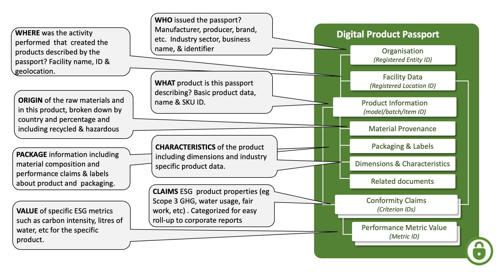
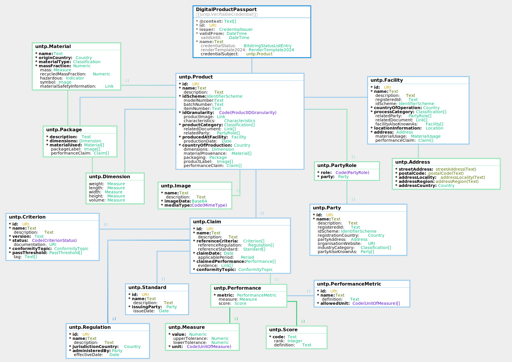

import Disclaimer from '../\_disclaimer.mdx';

<Disclaimer />

## Artifacts

### V0.7.0 Schema and Samples

The JSON schema and sample credential instances for the Digital Product Passport are maintained in this repository.

- **JSON Schema:**

| Schema                                                                                             | Description                                                              |
| -------------------------------------------------------------------------------------------------- | ------------------------------------------------------------------------ |
| [DigitalProductPassport.json](pathname:///artefacts/schema/v0.7.0/dpp/DigitalProductPassport.json) | Full credential schema including the W3C VC envelope and Product subject |
| [Product.json](pathname:///artefacts/schema/v0.7.0/dpp/Product.json)                               | Standalone schema for the Product credential subject                     |

- **Sample Instances:**

| Sample                                                                                                                                | Description                                            |
| ------------------------------------------------------------------------------------------------------------------------------------- | ------------------------------------------------------ |
| [DigitalProductPassport_instance.json](pathname:///artefacts/samples/v0.7.0/dpp/DigitalProductPassport_instance.json)                 | Copper concentrate from a sample mine in Zambia        |
| [DigitalProductPassport_cathode_instance.json](pathname:///artefacts/samples/v0.7.0/dpp/DigitalProductPassport_cathode_instance.json) | Refined copper cathode from a sample refinery in Japan |
| [DigitalProductPassport_battery_instance.json](pathname:///artefacts/samples/v0.7.0/dpp/DigitalProductPassport_battery_instance.json) | 75 kWh battery from a sample manufacturer in Germany   |

The three samples represent successive stages of a copper-to-battery supply chain.

### Vocabulary and Context

The DPP is built on the [UNTP Core Vocabulary](CoreVocabulary.md), which defines the shared classes and properties used across all UNTP credential types. The machine-readable vocabulary and JSON-LD context files are published at [https://vocabulary.uncefact.org/untp/](https://vocabulary.uncefact.org/untp/).

## Overview

The digital product passport (DPP) is issued by the shipper of goods and is the carrier of **product and sustainability information** for every serialised product item (or product batch) that is shipped between actors in the value chain. It is deliberately **simple and lightweight** and is designed to carry the minimum necessary data at the **granularity** needed by the receiver of goods - such as the scope 3 emissions in a product shipment. The passport contains links to **conformity credentials** which add trust to the ESG claims in the passport. The passport also contains links to **traceability events** which provide the "glue" to follow the linked-data trail (subject to confidentiality constraints) from finished product back to raw materials. The UNTP DPP does not conflict with national regulations such as the EU DPP. In fact, it can usefully be conceptualised as the **upstream B2B feedstock** that provides the data and evidence needed for the issuing of high quality national level product passports.

## Conceptual Model



## Requirements

The digital product passport is designed to meet the following detailed requirements as well as the more general [UNTP Requirements](https://untp.unece.org/docs/about/Requirements).

| ID     | Name                 | Requirement Statement                                                                                                                                                                                                                                    | Solution Mapping                                                                                                                                                                                                   |
| ------ | -------------------- | -------------------------------------------------------------------------------------------------------------------------------------------------------------------------------------------------------------------------------------------------------- | ------------------------------------------------------------------------------------------------------------------------------------------------------------------------------------------------------------------ |
| DPP-01 | Granularity          | The DPP should support use at either _model_ level or at _batch_ level or at serialised _item_ level.                                                                                                                                                    | The `idGranularity` property together with `modelNumber`, `batchNumber`, and `itemNumber`                                                                                                                          |
| DPP-02 | Classification       | The DPP should support any number of product classifications using codes from a defined classification scheme (eg UN-CPC).                                                                                                                               | The `productCategory` array of `Classification` objects                                                                                                                                                            |
| DPP-03 | Materials provenance | The DPP should provide a simple structure to allow issuers to break down the material composition of their products by mass fraction and origin country so that raw material provenance requirements are easily assessed and met.                        | The `materialProvenance` array of `Material` objects, each with `originCountry`, `massFraction`, `recycledMassFraction`, and `hazardous` indicator                                                                 |
| DPP-04 | Produced at          | The DPP should provide a simple structure to describe the manufacturing facility at which the product was made. The facility identifier SHOULD be resolvable and verifiable.                                                                             | The `producedAtFacility` property with `id`, `name`, and `registeredId`                                                                                                                                            |
| DPP-05 | Dimensions           | The DPP must support the definition of key product dimensions such as length, width, height, weight, volume so that conformity claims made at the unit level (eg CO2 intensity in Kg/Kg) can be used to calculate actual values for the shipped product. | The `dimensions` property using the `Dimension` class with `Measure` values                                                                                                                                        |
| DPP-06 | Traceability         | The DPP should provide a means to follow links to further DPPs and conformity credentials of constituent products so that (subject to confidentiality constraints), provenance claims can be verified to any arbitrary depth up to primary production.   | The `relatedDocument` array can link to upstream DPPs and DTE traceability event credentials using typed links                                                                                                     |
| DPP-07 | Characteristics      | The DPP should allow an issuer to provide industry-specific product attributes that are not covered by the core model, using an open and extensible structure.                                                                                           | The `characteristics` property accepts arbitrary key-value pairs (`additionalProperties: true`)                                                                                                                    |
| DPP-08 | Verifiable Party     | The DPP should provide DPP issuer, product manufacturer, and facility operator identification including a name, a resolvable and verifiable identifier, and proof of ownership of the identifier.                                                        | `CredentialIssuer` with `issuerAlsoKnownAs`, `Product.relatedParty` with defined roles, and `Product.producedAtFacility` — all SHOULD have related resolvable [Identity Resolver](IdentityResolver.md) credentials |
| DPP-09 | Claims               | The DPP MUST provide a means to include any number of performance claims within one DPP so that it can provide a single point to aggregate all claims about the product.                                                                                 | The `performanceClaim` array of `Claim` objects                                                                                                                                                                    |
| DPP-10 | Conformity Topic     | The DPP MUST provide a simple mechanism to express the sustainability/circularity/conformity topic for each claim so that similar claims can be grouped and the high-level scope easily understood.                                                      | The `Claim.conformityTopic` property referencing the [Conformity Topics](CoreTaxonomies.md) taxonomy                                                                                                               |
| DPP-11 | Metrics              | The DPP MUST provide a simple mechanism to quantify a conformity claim (eg carbon intensity, water consumption) using either a numeric measure with tolerance, or a categorical score, or both.                                                          | The `Performance` class with `metric` (from the [Performance Metrics](CoreTaxonomies.md) taxonomy), `measure` (value + unit + tolerance), and `score` (code + rank)                                                |
| DPP-12 | Criteria             | The DPP MUST provide a means to reference a standard or regulation as well as the specific criteria within that standard or regulation — so that claims can be understood in terms of the criteria against which they are made.                          | `Claim.referenceCriteria`, `Claim.referenceRegulation`, and `Claim.referenceStandard`                                                                                                                              |
| DPP-13 | Evidence             | The DPP MUST provide a means to reference independent conformity assessments that support and verify the claims being made. The related evidence SHOULD be digitally verifiable but MAY be a simple document or web page.                                | The `Claim.evidence` property links to a UNTP [Digital Conformity Credential](ConformityCredential.md) (DCC) or other supporting document                                                                          |
| DPP-14 | Packaging            | The DPP should provide a structure to describe the product's packaging including dimensions, materials used, and any packaging-specific labels or conformity claims.                                                                                     | The `packaging` property using the `Package` class with `dimensions`, `materialUsed`, `packageLabel`, and `performanceClaim`                                                                                       |
| DPP-15 | Labels               | The DPP should support the inclusion of certification marks, regulatory symbols, and other visual labels that appear on the product or its packaging.                                                                                                    | The `productLabel` array of `Image` objects (product-level) and `Package.packageLabel` (packaging-level)                                                                                                           |
| DPP-16 | Related documents    | The DPP should provide a means to link to supporting documents such as manuals, reports, declarations, studies, or guidance that are relevant to the product but are not structured data within the credential.                                          | The `relatedDocument` array of `Link` objects with `linkURL`, `linkName`, `mediaType`, and `linkType`                                                                                                              |
| DPP-17 | Lifecycle data       | The DPP should provide a means to link to dynamic in-use data that changes over the product's life (eg remaining capacity, charge cycles, temperature exposure, maintenance records) so that current product state can be discovered from the passport.  | Links in `relatedDocument` to UNTP [Digital Traceability Event](DigitalTraceabilityEvents.md) (`ModifyEvent`) credentials that carry updated state-of-health or usage data                                         |
| DPP-18 | Scoring              | The DPP should support expressing performance as a categorical score (eg a carbon footprint class A through E, or a compliance rating) in addition to numeric measures, so that regulatory grading schemes can be represented.                           | The `Performance.score` property with `code`, `rank`, and `definition`                                                                                                                                             |

## Logical Model

The Digital Product Passport is an assembly of re-usable components from the UNTP core vocabulary.



The DPP credential wraps a `Product` as its credential subject. The product carries identification (model, batch, or serialised item level), classification, and descriptive information alongside the following key structures:

- **Manufacturing context** — the `Facility` where the product was made, the country of production, and related parties in defined roles.
- **Material provenance** — a breakdown of `Material` composition by origin country, mass fraction, recycled content, and hazardous material indicators.
- **Dimensions and packaging** — physical `Dimension` (weight, length, width, height, volume) for the product and its `Package`, supporting unit-level calculations such as emissions intensity per kilogram.
- **Performance claims** — an array of `Claim` objects, each referencing a `Criterion` from a standard or regulation, classified by `ConformityTopic`, and carrying quantified `Performance` measures classified by `PerformanceMetric`. Claims link to supporting evidence such as conformity credentials.
- **Characteristics** — an open extension point for industry-specific product attributes not covered by the core model.

For detailed class and property definitions, see the [Core Vocabulary](CoreVocabulary.md) reference.

## Implementation Guidance

The core implementation question for any DPP issuer is: **how do I map my existing product data requirements to this standard?** Whether the requirements come from a national regulation (such as the EU Battery Regulation), an industry standard, or an internal product information system, the mapping follows the same approach. Every source data attribute falls into one of six categories:

| Mapping Type          | UNTP Pattern                                                                                                                                                                                                                    | When to use                                                                                                                                         |
| --------------------- | ------------------------------------------------------------------------------------------------------------------------------------------------------------------------------------------------------------------------------- | --------------------------------------------------------------------------------------------------------------------------------------------------- |
| **Direct property**   | Named properties on `Product` (e.g. `id`, `dimensions.weight`, `productCategory`, `producedAtFacility`, `materialProvenance`, `productLabel`)                                                                                   | The source attribute has a direct equivalent in the UNTP core vocabulary                                                                            |
| **Characteristic**    | `Product.characteristics` — an open object that accepts any key-value pairs                                                                                                                                                     | Industry-specific technical parameters with no generic UNTP equivalent (e.g. battery voltage, rated capacity, internal resistance)                  |
| **Performance claim** | `Product.performanceClaim` — a `Claim` referencing a `ConformityTopic`, a `PerformanceMetric`, and optionally a `Score`, with optional `evidence` linking to a Digital Conformity Credential (DCC) for independent verification | Quantified sustainability or conformity metrics (e.g. carbon footprint, recycled content, energy efficiency)                                        |
| **Lifecycle event**   | A UNTP Digital Traceability Event (`ModifyEvent`) linked from the DPP                                                                                                                                                           | Dynamic data that changes over the product's life (e.g. remaining capacity, charge cycles, temperature exposure, accident records)                  |
| **Related document**  | `Product.relatedDocument` — a `Link` to an external resource                                                                                                                                                                    | Supporting documents such as manuals, reports, studies, or declarations that are not structured data                                                |
| **No mapping**        | —                                                                                                                                                                                                                               | We aim to avoid any unmapped cases. If you find a data requirement that cannot be mapped, please contact our [mailing list](/) so we can address it |

The first three types carry **static data set at manufacture** and live inside the DPP credential. Lifecycle events capture **dynamic in-use data** in separate DTE credentials linked from the DPP. Related documents and conformity evidence provide **links to supporting resources**.

### Example: EU Battery Passport (DIN DKE SPEC 99100)

The [DIN DKE SPEC 99100](https://www.dinmedia.de/en/technical-rule/din-dke-spec-99100/385692321) is the German standard implementing the EU Battery Regulation (EU 2023/1542) battery passport data requirements. It defines 88 mandatory and recommended data attributes across seven clusters. Every attribute maps to the UNTP DPP model with no gaps:

| Mapping Type          | Count  | What it covers                                                                                   |
| --------------------- | ------ | ------------------------------------------------------------------------------------------------ |
| Direct property       | 14     | Identifiers, classification, facility, mass, labels                                              |
| Characteristic        | 22     | Battery-specific technical specifications (voltage, capacity, resistance, lifetime, temperature) |
| Performance claim     | 21     | Carbon footprint, recycled content, energy efficiency, durability metrics                        |
| Lifecycle event (DTE) | 19     | Dynamic in-use data (remaining capacity, charge cycles, temperature exposure, negative events)   |
| Related document      | 12     | Dismantling manuals, due diligence reports, safety measures, end-of-life guidance                |
| **Total**             | **88** |                                                                                                  |

The full attribute-by-attribute mapping is available as a [CSV download](../assets/files/din99100-untp-mapping.csv). The [battery sample credential](pathname:///artefacts/samples/v0.7.0/dpp/DigitalProductPassport_battery_instance.json) demonstrates the static mappings (direct properties, characteristics, performance claims, related documents, and labels) for a 75 kWh EV battery pack.

## The components of a DPP

This section provides sample JSON-LD snippets for each DPP component, drawn from the [battery sample credential](pathname:///artefacts/samples/v0.7.0/dpp/DigitalProductPassport_battery_instance.json).

### Credential Envelope

All DPPs are issued as [W3C Verifiable Credentials (VCDM 2.0)](https://www.w3.org/TR/vc-data-model-2.0/). The credential `type` includes both `VerifiableCredential` and `DigitalProductPassport`, and the `@context` references both the W3C VCDM and UNTP context URIs. The issuer `id` SHOULD be a DID using a supported [DID method](VerifiableCredentials.md#did-methods), with `issuerAlsoKnownAs` linking to authoritative business register identifiers.

```json
{
  "type": ["DigitalProductPassport", "VerifiableCredential"],
  "@context": [
    "https://www.w3.org/ns/credentials/v2",
    "https://vocabulary.uncefact.org/untp/"
  ],
  "id": "https://credentials.sample-battery.example.com/dpp/bat-75kwh-2025",
  "issuer": {
    "type": ["CredentialIssuer"],
    "id": "did:web:sample-battery.example.com",
    "name": "Sample Battery Mfg GmbH",
    "issuerAlsoKnownAs": [
      {
        "id": "https://sample-register.example.com/companies/BAT-001",
        "name": "Sample Battery Mfg GmbH",
        "registeredId": "BAT-001",
        "idScheme": {
          "id": "https://sample-register.example.com",
          "name": "Sample Commercial Register"
        }
      }
    ]
  },
  "validFrom": "2025-03-01T00:00:00Z",
  "validUntil": "2035-03-01T00:00:00Z",
  "credentialSubject": {"type": ["Product"], "...": "..."}
}
```

### Product Identification

The `Product` credential subject identifies the product via a resolvable URI (`id`), an identifier scheme (`idScheme`), and granularity indicators (`modelNumber`, `batchNumber`, `itemNumber`, `idGranularity`). The product `id` should match identifiers on the physical product so that scanning a QR code resolves to this DPP via an [Identity Resolver](IdentityResolver.md). Classification uses `productCategory` with schemes such as [UN CPC](https://unstats.un.org/unsd/classifications/Econ/cpc).

```json
"credentialSubject": {
  "type": ["Product"],
  "id": "https://id.sample-battery.example.com/product/bat-75kwh-2025",
  "name": "75 kWh Li-ion Battery Pack",
  "idScheme": {
    "id": "https://id.sample-battery.example.com",
    "name": "Sample Product Identifier Scheme"
  },
  "modelNumber": "BAT-NMC811-75",
  "batchNumber": "2025-SZG-0342",
  "itemNumber": "BAT-75-2025-00471",
  "idGranularity": "item",
  "productCategory": [
    {
      "code": "46410",
      "name": "Primary cells and primary batteries",
      "schemeId": "https://unstats.un.org/unsd/classifications/Econ/cpc/",
      "schemeName": "UN Central Product Classification (CPC)"
    }
  ]
}
```

### Manufacturing Context

The `producedAtFacility` identifies the manufacturing site, `countryOfProduction` carries the ISO 3166 country, and `relatedParty` lists organisations in defined roles. The `relatedDocument` array provides links to supporting documents such as conformity credentials for the facility.

```json
"producedAtFacility": {
  "id": "https://facility-register.example.com/fac-003",
  "name": "Sample Battery Factory",
  "registeredId": "fac-003"
},
"countryOfProduction": { "countryCode": "DE", "countryName": "Germany" },
"relatedParty": [
  {
    "role": "manufacturer",
    "party": {
      "type": ["Party"],
      "id": "did:web:sample-battery.example.com",
      "name": "Sample Battery Mfg GmbH",
      "registeredId": "BAT-001"
    }
  }
]
```

### Dimensions

Physical measurements of the product. Each dimension is a `Measure` with a value and unit drawn from [UNECE Recommendation 20](https://vocabulary.uncefact.org/UnitMeasureCode). Include only the dimensions relevant to the product.

```json
"dimensions": {
  "weight": { "value": 450, "unit": "KGM" },
  "length": { "value": 2100, "unit": "MMT" },
  "width":  { "value": 1500, "unit": "MMT" },
  "height": { "value": 150, "unit": "MMT" }
}
```

### Material Provenance

The `materialProvenance` array describes constituent materials by origin, mass fraction, recycled content, and hazard status. Each `Material` includes a `materialType` classification and an `originCountry`.

```json
"materialProvenance": [
  {
    "name": "Copper cathode",
    "originCountry": { "countryCode": "JP", "countryName": "Japan" },
    "materialType": {
      "code": "41521",
      "name": "Unwrought copper",
      "schemeId": "https://unstats.un.org/unsd/classifications/Econ/cpc/",
      "schemeName": "UN Central Product Classification (CPC)"
    },
    "massFraction": 0.08,
    "mass": { "value": 36, "unit": "KGM" },
    "recycledMassFraction": 0.12,
    "hazardous": false
  }
]
```

### Characteristics

The `characteristics` property is an open extension point for industry-specific product attributes not covered by the core model. The schema uses `additionalProperties: true`, so any key-value pairs can be added. For a battery passport, this is where technical specifications like chemistry, voltages, capacity, resistance, and lifetime parameters belong.

```json
"characteristics": {
  "type": ["Characteristics"],
  "batteryChemistry": "NMC 811 (LiNi0.8Mn0.1Co0.1O2)",
  "batteryCategory": "EV",
  "ratedCapacity": { "value": 150, "unit": "Ah" },
  "certifiedUsableEnergy": { "value": 75, "unit": "kWh" },
  "nominalVoltage": { "value": 400, "unit": "V" },
  "minimumVoltage": { "value": 280, "unit": "V" },
  "maximumVoltage": { "value": 450, "unit": "V" },
  "originalPowerCapability": { "value": 250000, "unit": "W" },
  "expectedLifetimeYears": 15,
  "expectedLifetimeCycles": 1500,
  "capacityThresholdForExhaustion": 80,
  "temperatureRangeIdleState": { "lower": -20, "upper": 50, "unit": "CEL" },
  "initialRoundTripEnergyEfficiency": 95,
  "warrantyPeriodMonths": 96
}
```

### Packaging and Labels

The `packaging` property describes the product’s packaging including its own dimensions, materials, and performance claims. The `productLabel` array carries images of certification marks or regulatory labels that appear on the product — such as the CE marking, separate collection symbol, and carbon footprint performance class label required by the EU Battery Regulation.

```json
"packaging": {
  "description": "Reinforced steel transit crate with foam inserts",
  "dimensions": {
    "weight": { "value": 35, "unit": "KGM" },
    "length": { "value": 2300, "unit": "MMT" },
    "width":  { "value": 1700, "unit": "MMT" },
    "height": { "value": 350, "unit": "MMT" }
  }
},
"productLabel": [
  { "name": "CE Marking", "description": "EU conformity marking for the battery pack" },
  { "name": "Separate Collection Symbol", "description": "Crossed-out wheeled bin per EU Battery Regulation Article 13" },
  { "name": "Carbon Footprint Performance Class", "description": "Battery carbon footprint class label (Class B)" }
]
```

### Performance Claims

The `performanceClaim` array carries the supplier’s self-declared claims. Each `Claim` references criteria classified by a `ConformityTopic` from the [Conformity Topics taxonomy](CoreTaxonomies.md) and carries quantified performance using a `PerformanceMetric` from the [Performance Metrics taxonomy](CoreTaxonomies.md). Claims can reference applicable regulations and standards, and SHOULD link to independent [conformity assessments](ConformityCredential.md) as `evidence`. Performance can be expressed as a numeric `measure`, a categorical `score`, or both.

```json
"performanceClaim": [
  {
    "type": ["Claim"],
    "id": "https://sample-battery.example.com/claims/battery-carbon-2025",
    "name": "Battery Carbon Footprint",
    "referenceRegulation": [
      {
        "id": "https://eur-lex.europa.eu/eli/reg/2023/1542/oj",
        "name": "EU Battery Regulation (EU) 2023/1542"
      }
    ],
    "referenceCriteria": [
      {
        "id": "https://sample-scheme.responsiblebusiness.org/criteria/ghg-reporting/v8",
        "name": "GHG Emissions Reporting (RBA Code of Conduct Section C.1)"
      }
    ],
    "claimedPerformance": [
      {
        "metric": {
          "id": "https://vocabulary.uncefact.org/performance-metric/battery-carbon-footprint",
          "name": "Battery Carbon Footprint"
        },
        "measure": { "value": 61, "unit": "KGM" },
        "score": { "code": "B", "rank": 2, "definition": "Carbon footprint performance class B" }
      }
    ],
    "evidence": [
      {
        "linkURL": "https://credentials.sample-cab.example.com/dcc/carbon-verification-bat-75kwh",
        "linkName": "Carbon Footprint Verification — Sample CAB",
        "linkType": "https://test.uncefact.org/vocabulary/linkTypes/dcc"
      }
    ],
    "conformityTopic": [
      {
        "type": ["ConformityTopic"],
        "id": "https://vocabulary.uncefact.org/conformity-topic/greenhouse-gas-emissions",
        "name": "Greenhouse Gas Emissions"
      }
    ]
  }
]
```

### Referencing Conformity Criteria

Claims SHOULD unambiguously reference a criterion from a recognised scheme, standard, or regulation using a URI. This shared reference is what allows independent conformity assessments to verify supplier claims — both reference the same criterion. Issuers can discover the right criterion URIs via the UNTP [Conformity Vocabulary Catalog](ConformityVocabularyCatalog.md).
