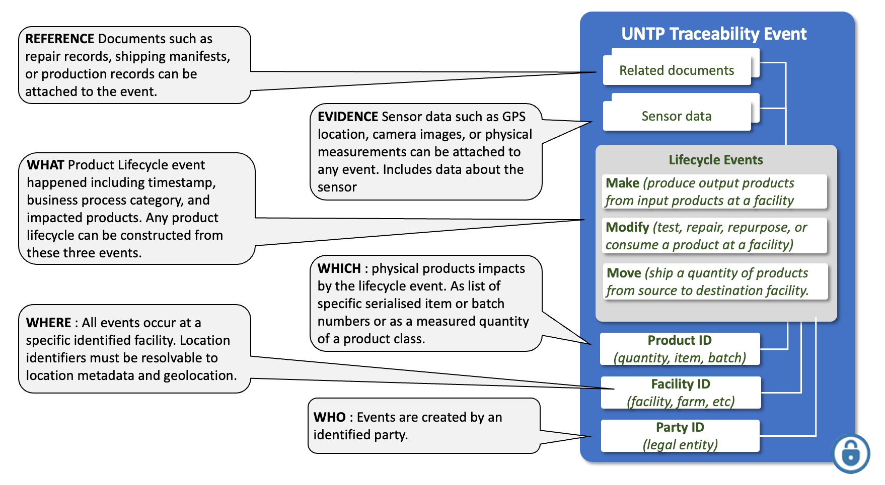
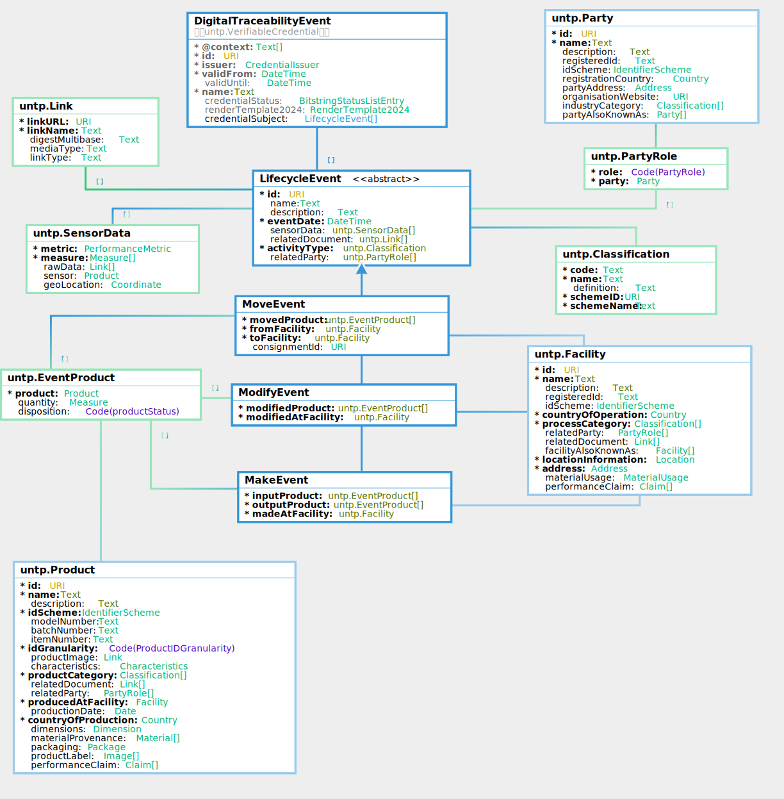

import Disclaimer from '../\_disclaimer.mdx';

<Disclaimer />

## Artifacts

### V0.7.0 Schema and Samples

The JSON schema and sample credential instances for Digital Traceability Events are maintained in this repository.

- **JSON Schema:**

| Schema                                                                                                 | Description                                                                         |
| ------------------------------------------------------------------------------------------------------ | ----------------------------------------------------------------------------------- |
| [DigitalTraceabilityEvent.json](pathname:///artefacts/schema/v0.7.0/dte/DigitalTraceabilityEvent.json) | Full credential schema including the W3C VC envelope and event subjects             |
| [MakeEvent.json](pathname:///artefacts/schema/v0.7.0/dte/MakeEvent.json)                               | Schema for manufacturing events (input products consumed to create output products) |
| [ModifyEvent.json](pathname:///artefacts/schema/v0.7.0/dte/ModifyEvent.json)                           | Schema for modification events (test, repair, repurpose, or consume a product)      |
| [MoveEvent.json](pathname:///artefacts/schema/v0.7.0/dte/MoveEvent.json)                               | Schema for movement events (ship products between facilities)                       |

- **Sample Instances:**

| Sample                                                                                                                                              | Description                                              |
| --------------------------------------------------------------------------------------------------------------------------------------------------- | -------------------------------------------------------- |
| [DigitalTraceabilityEvent_instance.json](pathname:///artefacts/samples/v0.7.0/dte/DigitalTraceabilityEvent_instance.json)                           | Copper concentrate production at a sample mine in Zambia |
| [DigitalTraceabilityEvent_smelter_make_instance.json](pathname:///artefacts/samples/v0.7.0/dte/DigitalTraceabilityEvent_smelter_make_instance.json) | Copper cathode smelting at a sample refinery in Japan    |
| [DigitalTraceabilityEvent_cathode_move_instance.json](pathname:///artefacts/samples/v0.7.0/dte/DigitalTraceabilityEvent_cathode_move_instance.json) | Copper cathode shipment from refinery to battery factory |
| [DigitalTraceabilityEvent_battery_make_instance.json](pathname:///artefacts/samples/v0.7.0/dte/DigitalTraceabilityEvent_battery_make_instance.json) | Battery pack assembly at a sample factory in Germany     |

The samples trace the copper-to-battery supply chain through make and move events.

### Vocabulary and Context

The DTE is built on the [UNTP Core Vocabulary](CoreVocabulary.md), which defines the shared classes and properties used across all UNTP credential types. The machine-readable vocabulary and JSON-LD context files are published at [https://vocabulary.uncefact.org/untp/](https://vocabulary.uncefact.org/untp/).

## Overview

Digital Traceability Events (DTEs) are lightweight verifiable credentials that record the “what, when, where, who, and how” of product lifecycle activities across a value chain. Any supply chain, regardless of complexity, can be accurately modelled using a combination of three event types. A **make** event records a manufacturing or processing step that consumes input products to create output products at a facility. A **move** event records the shipment of products from one facility to another. A **modify** event records a post-market action on an existing product such as inspection, repair, refurbishment, or recycling. Together, make and move events model the stocks and flows through each facility, enabling facility-level [mass-balance assessment](../design-patterns/MassBalance.md) of sustainability claims. Each DTE is issued as a [W3C Verifiable Credential](https://www.w3.org/TR/vc-data-model-2.0/) so that it can be independently verified and linked to other credentials such as [Digital Product Passports](DigitalProductPassport.md) and [Digital Conformity Credentials](ConformityCredential.md). DTEs are discoverable from [identity resolvers](IdentityResolver.md) using the product identifier, subject to [access control](DecentralisedAccessControl.md) where commercially sensitive data needs protection. Implementers that have already invested in [GS1 EPCIS 2.0](https://www.gs1.org/standards/epcis) may use EPCIS events to represent UNTP lifecycle events; see [Implementation Guidance](#implementation-guidance) for details.

## Conceptual Model



The conceptual model answers six key questions about every lifecycle event:

- **WHAT** — what product lifecycle event happened, including a timestamp and business process category. Any product lifecycle can be constructed from three event types: **Make** (produce output products from input products at a facility), **Modify** (test, repair, repurpose, or consume a product at a facility), and **Move** (ship a quantity of products from source to destination facility).
- **WHICH** — which physical products are impacted by the event, expressed as a list of specific serialised item or batch identifiers, or as a measured quantity of a product class.
- **WHERE** — all events occur at a specific identified facility whose location identifiers must be resolvable to location metadata and geolocation.
- **WHO** — events are created by an identified party, establishing accountability for the recorded information.
- **EVIDENCE** — sensor data such as GPS location, camera images, or physical measurements can be attached to any event, including metadata about the sensor device itself.
- **REFERENCE** — supporting documents such as repair records, shipping manifests, or production records can be attached to the event.

## Requirements

The traceability event is designed to meet the following detailed requirements as well as the more general [UNTP Requirements](https://untp.unece.org/docs/about/Requirements)

| ID     | Name                    | Requirement Statement                                                                                                                                                                                                                                      | Solution Mapping                                                                                                                                                                                             |
| ------ | ----------------------- | ---------------------------------------------------------------------------------------------------------------------------------------------------------------------------------------------------------------------------------------------------------- | ------------------------------------------------------------------------------------------------------------------------------------------------------------------------------------------------------------ |
| TEV-01 | Sub-components          | The traceability event MUST provide a mechanism to trace from a DPP representing a product assembly to the individual DPPs of each sub-assembly component part.                                                                                            | [MakeEvent](#make-event) — component parts are `inputProduct` items, the assembled product is the `outputProduct`.                                                                                           |
| TEV-02 | Consumed materials      | The traceability event MUST provide a mechanism to trace a manufactured product DPP back to the DPPs representing batches of input materials that are consumed in manufacturing one or more output products.                                               | [MakeEvent](#make-event) — `inputProduct` and `outputProduct` arrays with product identifiers and quantities.                                                                                                |
| TEV-03 | Aggregated bundles      | When a DPP represents an aggregated bundle of similar items (e.g. a pallet of cotton bales) then the traceability event MUST provide a means to allocate the aggregate measures to each individual item (i.e. each bale).                                  | [MakeEvent](#make-event) — individual items are `inputProduct` entries, the aggregated bundle is the `outputProduct` (or vice versa for disaggregation).                                                     |
| TEV-04 | Transportation          | When a product (or consolidated consignment) is shipped from one physical location to another, the traceability event MUST provide a means to record the movement and associate sustainability measures such as transport emissions to the shipped bundle. | [MoveEvent](#move-event) — `movedProduct`, `fromFacility`, `toFacility`, and `consignmentId`. Sensor data can capture transport emissions.                                                                   |
| TEV-05 | Items or quantities     | Traceability events MUST work equally well whether the input or output items are individually serialised items or measured quantities (mass or volume) of a product class.                                                                                 | [EventProduct](#event-products) — `product.idGranularity` distinguishes `item`, `batch`, and `model` level identification; `quantity` provides the measured amount.                                          |
| TEV-06 | IoT sensor data         | Traceability events will often be generated by or associated with physical sensor readings. In such cases, the traceability event SHOULD support the association of sensor data with the event.                                                            | [SensorData](#sensor-data) — `sensorData` array on `LifecycleEvent` with metric, measure, sensor device, and geo-location.                                                                                   |
| TEV-07 | Time and location       | Traceability events MUST always record the timestamp and physical location of the event so that multiple events can be connected in time and space.                                                                                                        | [LifecycleEvent](#lifecycle-event) — `eventDate` timestamp; facility references (`madeAtFacility`, `fromFacility`/`toFacility`, `modifiedAtFacility`) provide location.                                      |
| TEV-08 | Product disposition     | The traceability event MUST record the state of each product after the event has occurred (e.g. new, consumed, repaired, recycled, disposed) so that product status can be tracked through its lifecycle.                                                  | [EventProduct](#event-products) — `disposition` property using the `productStatus` code list.                                                                                                                |
| TEV-09 | Activity classification | The traceability event MUST support industry-specific classification of the business activity (e.g. ginning, spinning, weaving in textiles) so that generic event types can carry domain-specific context.                                                 | [LifecycleEvent](#lifecycle-event) — `activityType` as a [Classification](CoreVocabulary.md) drawn from a recognised scheme such as the [GS1 CBV Business Step](https://ref.gs1.org/cbv/BizStep) vocabulary. |
| TEV-10 | Related documents       | The traceability event SHOULD support links to related credentials and documents such as Digital Product Passports, Digital Conformity Credentials, test results, or shipping manifests.                                                                   | [Related Documents](#related-documents) — `relatedDocument` array of [Link](CoreVocabulary.md) entries with URL, name, media type, and link type.                                                            |
| TEV-11 | Related parties         | The traceability event MUST identify the parties involved in the event and their roles (e.g. manufacturer, shipper, receiver) to establish accountability.                                                                                                 | [Related Parties](#related-parties) — `relatedParty` array of [PartyRole](CoreVocabulary.md) entries with role and party identification.                                                                     |
| TEV-12 | Confidentiality         | The traceability event SHOULD support access control mechanisms so that commercially sensitive data (particularly input supply sources in make events) can be selectively shared.                                                                          | [Decentralised Access Control](DecentralisedAccessControl.md) — credentials may be access-restricted using decentralised access control patterns.                                                            |
| TEV-13 | Mass-balance support    | The traceability event model MUST support facility-level mass-balance accounting so that a facility's claimed outputs can be verified against its documented inputs and inventory.                                                                         | [MakeEvent](#make-event) and [MoveEvent](#move-event) — together they model stocks and flows through a facility as described in the [Chain of Custody](../design-patterns/MassBalance.md) design pattern.    |

## Logical Model



The `DigitalTraceabilityEvent` is a W3C Verifiable Credential whose `credentialSubject` contains one or more `LifecycleEvent` instances. The abstract [LifecycleEvent](CoreVocabulary.md) base class defines the common properties shared by all event types: an identifier, event date, activity type classification, related parties, sensor data, and related documents. Three concrete event types extend `LifecycleEvent`:

- **[MakeEvent](CoreVocabulary.md)** — represents a manufacturing or processing step that consumes `inputProduct` items to create `outputProduct` items at a `madeAtFacility`. This is the most important event type for supply chain traceability because it links output product DPPs back to their input material DPPs.
- **[MoveEvent](CoreVocabulary.md)** — represents the shipment of `movedProduct` items from a `fromFacility` to a `toFacility`, optionally referencing a `consignmentId`. Move events connect the physical locations along a supply chain.
- **[ModifyEvent](CoreVocabulary.md)** — represents an action on a `modifiedProduct` at a `modifiedAtFacility`, such as testing, repair, repurposing, or consumption.

Each event references products via [EventProduct](CoreVocabulary.md) (linking a [Product](CoreVocabulary.md) with an optional quantity and disposition), facilities via [Facility](CoreVocabulary.md), and parties via [PartyRole](CoreVocabulary.md). IoT sensor readings are captured as [SensorData](CoreVocabulary.md) and supporting documents as [Link](CoreVocabulary.md). Activity types are classified using [Classification](CoreVocabulary.md).

## Implementation Guidance

### Implementation Models

There are two implementation paths for UNTP lifecycle events:

1. **UNTP Lifecycle Events** — use the UNTP-native `MakeEvent`, `MoveEvent`, and `ModifyEvent` schemas. This approach is natively aligned with the rest of the UNTP credential suite (DPP, DCC, DFR, DIA) and is recommended for implementers who are not already invested in GS1 EPCIS.
2. **GS1 EPCIS/CBV** — implementers who have already invested in [GS1 EPCIS 2.0](https://ref.gs1.org/epcis/) or plan to do so may continue to use EPCIS event types and the [Core Business Vocabulary](https://ref.gs1.org/cbv/) to represent UNTP lifecycle events. Informative mapping guidance is provided in the [EPCIS Mapping Guide](../assets/files/epcis-mapping.pdf).

### Simplified Event Model

The UNTP make, move, and modify lifecycle events are a deliberately simplified set of event types intended to be sufficient for product lifecycle needs across any industry:

- **Make** and **Move** events are primarily targeted at facility-level mass-balance assessment as described in the [Chain of Custody](../design-patterns/MassBalance.md) design pattern. They work by modelling stocks and flows through a facility — make events record inputs consumed and outputs produced, while move events record products entering or leaving a facility. Together, they enable verifiable material accounting: confirming that a facility's claimed outputs are consistent with its documented inputs and inventory.
- **Modify** events are largely targeted at post-market-entry actions such as repair, refurbishment, observation, testing, and recycling — actions that change a product's state but retain its identity.

### Activity Type Classification

The event-level `activityType` classification is designed to provide industry-specific context to the event. While the UNTP event model is generic (make, move, modify), the `activityType` drawn from a recognised classification scheme allows implementers to express domain-specific processes. For example, a textile supply chain might use activity types such as ginning, spinning, weaving, and dyeing to distinguish different manufacturing steps, all of which are structurally `MakeEvent` instances.

### Discoverability

Like all UNTP credential types, DTEs are discoverable from link resolvers using the product identifier — subject to confidentiality constraints. When a product's DPP is resolved via its identifier, the associated traceability events can also be discovered, enabling downstream actors to traverse the supply chain graph.

### Supporting Evidence

Sensor data and related documents associated with any lifecycle event provide additional information and evidence to support the event. For example, a move event might include GPS tracking data from a transport sensor, or a modify event might link to a test result document. These attachments strengthen the evidentiary basis of the event without changing its core structure.

### Confidentiality

The data in lifecycle events — particularly make events, which reveal input supply sources for output products — may be considered commercially sensitive. Implementers may choose to restrict access to these credentials following the [Decentralised Access Control](DecentralisedAccessControl.md) guidance, which allows credential holders to grant selective access to specific parties rather than publishing events openly.

## The components of a DTE

This section walks through each component of a Digital Traceability Event credential using snippets from the [sample instances](pathname:///artefacts/samples/v0.7.0/dte). The samples trace the copper-to-battery supply chain: copper concentrate is shipped from a mine in Zambia to a refinery in Japan, smelted into copper cathode, shipped to a battery factory in Germany, and assembled into a battery pack.

### Credential Envelope

A DTE is issued as a W3C Verifiable Credential. The outer envelope identifies the credential, its issuer, and its validity period. The `credentialSubject` array contains one or more lifecycle events. This example is from the [smelter make event](pathname:///artefacts/samples/v0.7.0/dte/DigitalTraceabilityEvent_smelter_make_instance.json).

```json
{
  "type": ["DigitalTraceabilityEvent", "VerifiableCredential"],
  "@context": [
    "https://www.w3.org/ns/credentials/v2",
    "https://vocabulary.uncefact.org/untp/"
  ],
  "id": "https://credentials.sample-refinery.example.com/dte/make-cathode-2025-0305",
  "issuer": {
    "type": ["CredentialIssuer"],
    "id": "did:web:sample-refinery.example.com",
    "name": "Sample Copper Refinery Co. Ltd",
    "issuerAlsoKnownAs": [...]
  },
  "validFrom": "2025-03-05T00:00:00Z",
  "validUntil": "2026-03-05T00:00:00Z",
  "name": "Smelting of Copper Concentrate into Copper Cathode — Sample",
  "credentialSubject": [...]
}
```

Please refer to [DPP VC Guidance](DigitalProductPassport.md#verifiable-credential) for more detail about the use of the W3C verifiable credentials data model for UNTP.

### Lifecycle Event

All three event types extend the abstract `LifecycleEvent` and share a common set of properties that record what happened, when, and who was involved. This example shows the common properties from the smelter make event.

```json
{
  "type": ["MakeEvent", "LifecycleEvent"],
  "id": "https://sample-refinery.example.com/events/make-cathode-2025-0305",
  "name": "Copper smelting and electrolytic refining batch",
  "description": "Processing of 30 tonnes of copper concentrate ...",
  "eventDate": "2025-03-05T06:00:00Z",
  "activityType": {
    "code": "commissioning",
    "name": "Commissioning",
    "definition": "The process of manufacturing or assembling a product ...",
    "schemeId": "https://ref.gs1.org/cbv/BizStep",
    "schemeName": "GS1 CBV Business Step"
  },
  "relatedParty": [...],
  "relatedDocument": [...]
}
```

- **`id`** — a unique URI for this specific event instance.
- **`eventDate`** — the timestamp when the event occurred.
- **`activityType`** — a [Classification](CoreVocabulary.md) drawn from a recognised scheme such as the [GS1 CBV Business Step](https://ref.gs1.org/cbv/BizStep) vocabulary.
- **`relatedParty`** — the parties involved in the event and their roles (see [Related Parties](#related-parties) below).
- **`relatedDocument`** — links to supporting credentials or documents (see [Related Documents](#related-documents) below).

### Sensor Data

The optional `sensorData` array on any lifecycle event captures IoT sensor readings associated with the event — for example temperature during transport, GPS coordinates of a shipment, or camera images at an inspection point. Each [SensorData](CoreVocabulary.md) entry identifies the metric being measured, the sensor device, and one or more readings.

```json
"sensorData": [
  {
    "type": ["SensorData"],
    "metric": {
      "id": "https://vocabulary.uncefact.org/untp/metrics#temperature",
      "name": "Ambient Temperature"
    },
    "measure": [
      { "value": 22.5, "unit": "CEL" },
      { "value": 23.1, "unit": "CEL" }
    ],
    "sensor": {
      "id": "https://sensors.sample-refinery.example.com/temp-401",
      "name": "Furnace outlet thermocouple T-401"
    },
    "geoLocation": {
      "latitude": 35.6762,
      "longitude": 139.6503
    }
  }
]
```

- **`metric`** — identifies the type of measurement (e.g. temperature, humidity, weight) using a [PerformanceMetric](CoreVocabulary.md) reference.
- **`measure`** — one or more [Measure](CoreVocabulary.md) values with a numeric value and UN/CEFACT unit code.
- **`sensor`** — the device that captured the reading, identified by URI and name.
- **`geoLocation`** — optional GPS coordinates of the sensor at the time of the reading.
- **`rawData`** — optional links to raw data files such as images or instrument output.

### Make Event

A `MakeEvent` represents a manufacturing or processing step that consumes input products to create output products at a facility. This is the most important event type for supply chain traceability because it links output product DPPs back to their input material DPPs. This example shows the smelting of copper concentrate into copper cathode at the [Sample Copper Refinery](pathname:///artefacts/samples/v0.7.0/dte/DigitalTraceabilityEvent_smelter_make_instance.json).

```json
{
  "type": ["MakeEvent", "LifecycleEvent"],
  "id": "https://sample-refinery.example.com/events/make-cathode-2025-0305",
  "eventDate": "2025-03-05T06:00:00Z",
  "inputProduct": [
    {
      "product": {
        "id": "https://id.sample-mine.example.com/product/cu-conc-2025",
        "name": "Copper Concentrate (Cu 30%)",
        "batchNumber": "2025-Q1-4501",
        "idGranularity": "model"
      },
      "quantity": {"value": 30000, "unit": "KGM"},
      "disposition": "consumed"
    }
  ],
  "outputProduct": [
    {
      "product": {
        "id": "https://id.sample-refinery.example.com/product/cu-cathode-2025",
        "name": "LME Grade A Copper Cathode",
        "batchNumber": "2025-Q1-0812",
        "idGranularity": "model"
      },
      "quantity": {"value": 10000, "unit": "KGM"},
      "disposition": "new"
    }
  ],
  "madeAtFacility": {
    "id": "https://facility-register.example.com/fac-002",
    "name": "Sample Copper Refinery",
    "registeredId": "fac-002"
  }
}
```

- **`inputProduct`** — the products consumed in this manufacturing step, each as an [EventProduct](CoreVocabulary.md) with a product identifier, quantity, and disposition (typically `consumed`).
- **`outputProduct`** — the products created, with disposition typically `new`.
- **`madeAtFacility`** — the [Facility](CoreVocabulary.md) where manufacturing took place.

### Move Event

A `MoveEvent` represents the shipment of products from one facility to another. This example shows the shipment of copper cathode from the refinery in Japan to the [battery factory in Germany](pathname:///artefacts/samples/v0.7.0/dte/DigitalTraceabilityEvent_cathode_move_instance.json).

```json
{
  "type": ["MoveEvent", "LifecycleEvent"],
  "id": "https://sample-refinery.example.com/events/move-cathode-2025-0310",
  "eventDate": "2025-03-10T14:00:00Z",
  "movedProduct": [
    {
      "product": {
        "id": "https://id.sample-refinery.example.com/product/cu-cathode-2025",
        "name": "LME Grade A Copper Cathode",
        "batchNumber": "2025-Q1-0812",
        "idGranularity": "model"
      },
      "quantity": {"value": 2000, "unit": "KGM"},
      "disposition": "in_transit"
    }
  ],
  "fromFacility": {
    "id": "https://facility-register.example.com/fac-002",
    "name": "Sample Copper Refinery",
    "registeredId": "fac-002"
  },
  "toFacility": {
    "id": "https://facility-register.example.com/fac-003",
    "name": "Sample Battery Factory",
    "registeredId": "fac-003"
  },
  "consignmentId": "urn:carrier:sea-freight:BL-2025-SG-BG-0310"
}
```

- **`movedProduct`** — the products being shipped, with disposition typically `in_transit`.
- **`fromFacility`** and **`toFacility`** — the origin and destination [Facility](CoreVocabulary.md) for the shipment.
- **`consignmentId`** — an optional URI identifying the transport consignment (e.g. a bill of lading number).

### Modify Event

A `ModifyEvent` represents an action performed on a product at a facility — such as testing, repair, repurposing, or consumption — where the product identity is retained but its state changes. The current sample supply chain does not include a modify event, but a typical example would be a quality inspection of a battery pack.

```json
{
  "type": ["ModifyEvent", "LifecycleEvent"],
  "id": "https://sample-battery.example.com/events/inspect-battery-2025-0402",
  "eventDate": "2025-04-02T10:00:00Z",
  "activityType": {
    "code": "inspecting",
    "name": "Inspecting",
    "schemeId": "https://ref.gs1.org/cbv/BizStep",
    "schemeName": "GS1 CBV Business Step"
  },
  "modifiedProduct": [
    {
      "product": {
        "id": "https://id.sample-battery.example.com/product/bat-75kwh-2025",
        "name": "75 kWh Li-ion Battery Pack",
        "itemNumber": "BAT-75-2025-00471",
        "idGranularity": "item"
      },
      "disposition": "active"
    }
  ],
  "modifiedAtFacility": {
    "id": "https://facility-register.example.com/fac-003",
    "name": "Sample Battery Factory",
    "registeredId": "fac-003"
  }
}
```

- **`modifiedProduct`** — the products acted upon, with disposition reflecting the outcome (e.g. `active` after a successful inspection).
- **`modifiedAtFacility`** — the [Facility](CoreVocabulary.md) where the action took place.

### Event Products

Each event references products via the [EventProduct](CoreVocabulary.md) structure, which pairs a [Product](CoreVocabulary.md) identifier with an optional quantity and a disposition code indicating the product's status. Products can be identified at different levels of granularity — by `modelNumber` (product class), `batchNumber` (production batch), or `itemNumber` (individual serialised item).

```json
{
  "product": {
    "id": "https://id.sample-battery.example.com/product/bat-75kwh-2025",
    "name": "75 kWh Li-ion Battery Pack",
    "modelNumber": "BAT-NMC811-75",
    "batchNumber": "2025-SZG-0342",
    "itemNumber": "BAT-75-2025-00471",
    "idGranularity": "item"
  },
  "quantity": {"value": 450, "unit": "KGM"},
  "disposition": "new"
}
```

### Related Parties

The `relatedParty` array identifies the parties involved in an event and their roles. Move events typically have `shipper` and `receiver` roles; make events typically have a `manufacturer` role.

```json
"relatedParty": [
  {
    "role": "shipper",
    "party": {
      "type": ["Party"],
      "id": "did:web:sample-refinery.example.com",
      "name": "Sample Copper Refinery Co. Ltd",
      "registeredId": "REF-001",
      "idScheme": {
        "id": "https://www.sample-register.example.com",
        "name": "Japan Corporate Number (Houjin Bangou)"
      }
    }
  },
  {
    "role": "receiver",
    "party": {
      "type": ["Party"],
      "id": "did:web:sample-battery.example.com",
      "name": "Sample Battery Mfg GmbH",
      "registeredId": "BAT-001"
    }
  }
]
```

### Related Documents

The `relatedDocument` array links the event to supporting credentials or documents. Typical links include the Digital Product Passport for the output product and any relevant Digital Conformity Credentials.

```json
"relatedDocument": [
  {
    "linkURL": "https://credentials.sample-refinery.example.com/dpp/cu-cathode-2025",
    "linkName": "Digital Product Passport — LME Grade A Copper Cathode",
    "mediaType": "application/ld+json",
    "linkType": "https://test.uncefact.org/vocabulary/linkTypes/dpp"
  },
  {
    "linkURL": "https://credentials.sample-cab.example.com/dcc/smelter-002",
    "linkName": "Coppermark Certification — Sample Copper Refinery",
    "mediaType": "application/ld+json",
    "linkType": "https://test.uncefact.org/vocabulary/linkTypes/dcc"
  }
]
```
