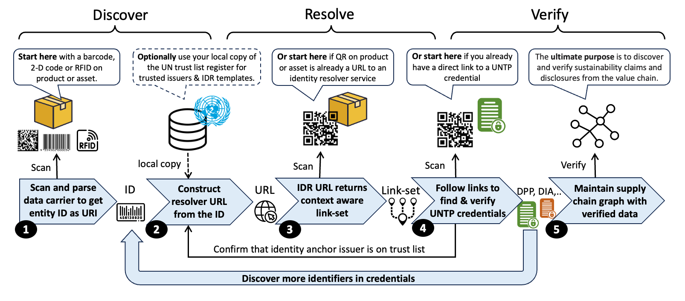
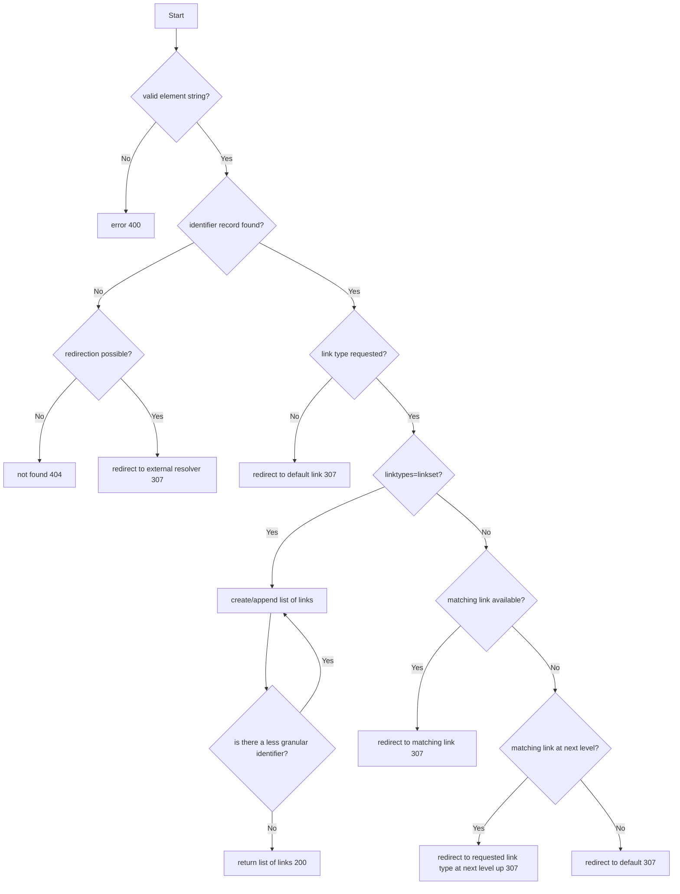
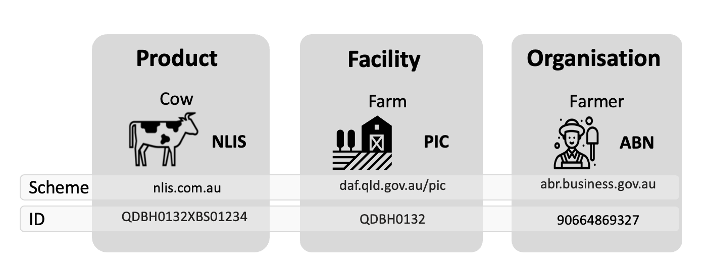
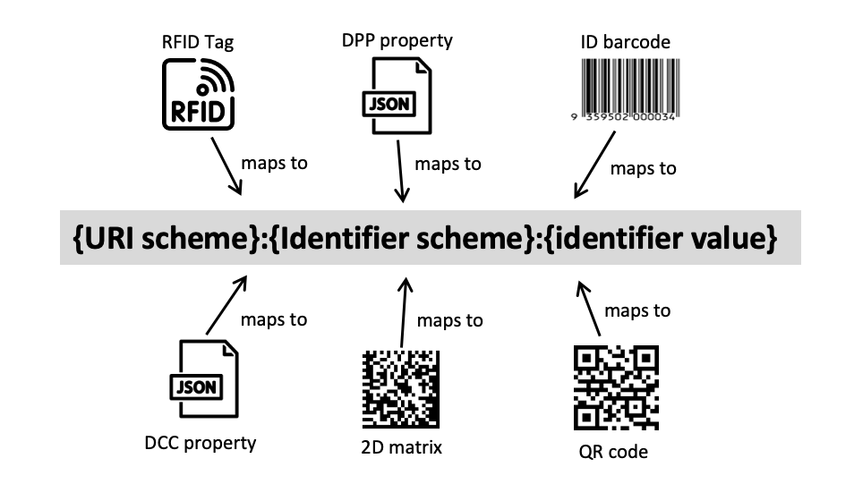
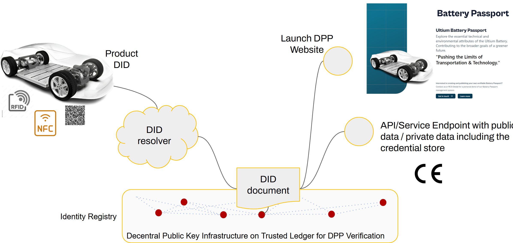

import Disclaimer from '../\_disclaimer.mdx';

<Disclaimer />

## Artifacts

### Linkset Schema

The UNTP linkset schema defines the structure of linkset responses returned by identity resolvers. It is aligned with and extends the [GS1 resolver linkset schema](https://ref.gs1.org/standards/resolver/1.2.0/linkset-schema) which implements [RFC 9264](https://datatracker.ietf.org/doc/rfc9264/). A UNTP linkset that omits the UNTP extension properties (`rel`, `method`, `encryptionMethod`, `accessRole`) will also validate against the GS1 schema.

| Artifact            | Link                                                                                 | See also                                                                          |
| ------------------- | ------------------------------------------------------------------------------------ | --------------------------------------------------------------------------------- |
| Linkset JSON Schema | [LinksetSchema.json](https://untp.unece.org/artefacts/schema/idr/LinksetSchema.json) | [GS1 linkset-schema](https://ref.gs1.org/standards/resolver/1.2.0/linkset-schema) |

### Link Relations

The following link relation types are submitted to IANA for review, approval, and inclusion in the IANA Link Relations registry [[RFC8288](https://datatracker.ietf.org/doc/html/rfc8288)].

| Relation | Description                                                                                                                       | Reference                                                                                    | See also                               |
| -------- | --------------------------------------------------------------------------------------------------------------------------------- | -------------------------------------------------------------------------------------------- | -------------------------------------- |
| `dpp`    | A link from a context URI that identifies a product to its **digital product passport**                                           | [IdentityResolver#lr-dpp](https://untp.unece.org/docs/specification/IdentityResolver#lr-dpp) | [GS1 dpp](https://ref.gs1.org/voc/dpp) |
| `dcc`    | A link from a context URI that identifies a product, manufacturer or facility to an applicable **digital conformance credential** | [IdentityResolver#lr-dcc](https://untp.unece.org/docs/specification/IdentityResolver#lr-dcc) |                                        |
| `dfr`    | A link from a context URI that identifies a facility to an applicable **digital facility record**                                 | [IdentityResolver#lr-dfr](https://untp.unece.org/docs/specification/IdentityResolver#lr-dfr) |                                        |

## Overview

Supply chains rely on many types of identifiers for **businesses**, **locations**, and **products** of which each are governed by distinct schemas. These identifiers are essential for maintaining integrity and trust by enabling systems to trace, verify, and link data about physical or digital entities.

UNTP does not attempt to replace these existing identifier systems. Instead, it builds upon them by allowing high-integrity registries and sector-specific schemas to be reused while also supporting self-issued identifiers under the control of the entity itself.

To accommodate this variety, UNTP implementations work with two broad **classes of identifiers**

- **Registry-managed identifiers** are issued or recognized by an authoritative register (e.g., national business registry, product catalogue, or sector-specific scheme). The register defines the rules for identifier issuance and for authorizing identifier usage and management. Implementations can therefore rely on the register as the authoritative source for discovery and verification.

- **Self-assigned identifiers** created and controlled by the entity itself. In UNTP this is achieved with [Decentralized Identifiers](https://www.w3.org/TR/did-core/) (DIDs), where the controller publishes the resolver information directly via DID Documents. The [DID method](VerifiableCredentials.md#did-methods) specifies how identifiers are created, updated, and revoked. The DID Document exposes service endpoints that behave like link-sets and contains cryptographic material that supports proof of control.

| Characteristic   | Registry-managed                                                                              | Self-assigned identifiers                                    |
| ---------------- | --------------------------------------------------------------------------------------------- | ------------------------------------------------------------ |
| **Issuance**     | Assigned by an authority or registry                                                          | Created and controlled by the entity                         |
| **Governance**   | Central registry or scheme operator                                                           | Decentralized, method-specific rules                         |
| **Discovery**    | Resolver templates from the registry                                                          | DID resolution via DID methods                               |
| **Resolution**   | Scanner/system maps ID to resolver URL using scheme rules (registry templates, ISO/IEC 18975) | DID string is resolved per DID method, returns DID Document  |
| **Verification** | Trust anchored in the registry (issuance + authorization rules)                               | Trust anchored in cryptographic keys inside the DID Document |
| **Use cases**    | Leverages existing schemes, interoperability                                                  | Autonomy, no reliance on central registry                    |

The Identity Resolver (IDR) defines how both classes can participate in a consistent discovery and verification workflow.

## Conceptual Model

Regardless of identifier class, the UNTP applies a shared workflow:

> _"Given an ID of a thing, I can find verifiable data about that thing."_



This workflow is described in terms of **Discover-Resolve-Verify (D-R-V)**

- Registry-managed identifiers delegate resolution rules to the registry, which may be governed or audited by a third party.
- Self-issued identifiers (DIDs) embed resolution logic within the DID method and DID Document, giving the controller direct control but also the responsibility to ensure availability.

Implementors should select the approach that best fits their governance model, subject to existing identification schemas and identity resolver capabilities for their sector or geography.

To fulfill the D–R–V workflow, all identifiers in UNTP MUST support four essential features. Where an existing scheme lacks one or more, UNTP provides a framework to uplift it:

- **Unique** - no risk of collision across schemas. See [Identifier Representation](#identifier-representation) for identifier representation conventions.
- **Discoverable** — retrievable as structured data in documents, or machine-readable (barcode, QR, RFID). See the implementation guidance for [Registry-Managed](#implementation-guidance-registry-managed-identifiers) and [Self-Issued](#implementation-guidance-self-issued-identifiers-dids) identifiers.
- **Resolvable** — dereferencing an identifier to obtain structured data. See [Resolution and Linksets](#resolution-and-linksets) for the shared resolution model.
- **Verifiable** — claims made by the identifier's controller can be distinguished from third-party statements. See [Verification](#verification) for verification processes.

## Requirements

This section defines the formal requirement statements for Identity Resolver implementations.

- **Scheme** means an identifier scheme such as a national business identifier scheme.
- **Carrier** means a machine readable device such as a barcode, QR code, RAIN or NFC tag that encodes an identifier issued under a scheme.
- **Link** means a URL that points to a page or document or credential that contains further information related to the identifier.
- **Target** means the document or credential that the link references.
- **link-set** means a collection of links with meta-data that describe each link.
- **Resolver** means an implementation of this specification that returns a link-set about a given identifier.

| ID     | Short name                      | Requirement                                                                                                                                                                                                                                                                                                                                                                                                                                                                                                                                                       | Solution Mapping                                                                                                                                   |
| ------ | ------------------------------- | ----------------------------------------------------------------------------------------------------------------------------------------------------------------------------------------------------------------------------------------------------------------------------------------------------------------------------------------------------------------------------------------------------------------------------------------------------------------------------------------------------------------------------------------------------------------- | -------------------------------------------------------------------------------------------------------------------------------------------------- |
| IDR-01 | Global uniqueness               | All identifiers, whether for products, assets, facilities, or businesses used in UNTP credentials MUST be globally unique so that they can be unambiguously referenced and resolved.                                                                                                                                                                                                                                                                                                                                                                              | [Identifier Representation](#identifier-representation)                                                                                            |
| IDR-02 | One carrier, many links         | One data carrier on a physical product or asset MUST be able to reference any amount of linked data or documents so that user or system confusion from multiple carriers on products can be avoided                                                                                                                                                                                                                                                                                                                                                               | [Linkset Format](#linkset-format)                                                                                                                  |
| IDR-03 | Leverage existing schemes       | Existing identifier schemes MUST be usable for UNTP IDR functions so that existing investments can be leveraged and UNTP rollout can be accelerated because there is no need to re-tool existing identifier infrastructure.                                                                                                                                                                                                                                                                                                                                       | This specification supports any identifier scheme.                                                                                                 |
| IDR-04 | Leverage existing carriers      | Existing data carriers, whether 1D barcodes on products or RFID tags on livestock are entrenched and unlikely to change quickly. Therefore identity resolvers MUST be able to work with existing carriers so that digitalisation can proceed at pace without the need to re-tool existing physical scanning infrastructure.                                                                                                                                                                                                                                       | [Data Carriers](#data-carriers)                                                                                                                    |
| IDR-05 | Seamless transition to 2D       | As industry transitions from 1D barcodes to 2D/QR codes, the UNTP identity resolver process MUST work equally well with either so that implementers can transition at their own pace                                                                                                                                                                                                                                                                                                                                                                              | [Mapping Carriers to URIs](#mapping-carriers-to-uris) - either create a resolver query from a 1D barcode / 2D matrix or embed the query into a QR. |
| IDR-06 | Understanding link-sets         | When a link-set is returned by a resolver, each link MUST include sufficient meta-data so that user systems can understand the purpose and usage of each link as well as the relationship between links                                                                                                                                                                                                                                                                                                                                                           | [Linkset Format](#linkset-format)                                                                                                                  |
| IDR-07 | Filtering link-sets             | Resolvers MUST allow users to request specific links, all links, or (if unspecified) then receive a default link - so that user experience can be optimised.                                                                                                                                                                                                                                                                                                                                                                                                      | [IDR Query URL](#idr-query-url)                                                                                                                    |
| IDR-08 | Responsive links                | Resolvers SHOULD leverage available user information such as language preferences to return tailored link-sets and default links - so that user experience is optimised.                                                                                                                                                                                                                                                                                                                                                                                          | [Defaults](#defaults) and [Automatically returning the right language](#automatically-returning-the-right-language)                                |
| IDR-09 | Logical grouping of links       | Link-set meta-data SHOULD provide an ability to group related link targets such as a product passport and related traceability events - so that user experience can be optimised.                                                                                                                                                                                                                                                                                                                                                                                 |                                                                                                                                                    |
| IDR-10 | Versioning of link targets      | When multiple version of link targets exist (eg multiple version of a product passport) then resolvers MUST include version information in link metadata and MUST ensure that any defaults reference the latest version - so that users receive current information and can audit historical data                                                                                                                                                                                                                                                                 | [Versioned targets](#versioned-targets)                                                                                                            |
| IDR-11 | Resolver redirection            | Resolvers SHOULD, where available, include links that reference secondary resolvers so that product/facility owners can maintain additional document and credential links in their own resolvers. A typical example is the case where a global scheme maintains identifiers only at product class level but the manufacturer manages identifiers and related data at serialised item level. In such cases the primary resolver would say "here's what I know about the product and here's a link to another resolver that can tell you about the serialised item" | [Secondary resolvers](#secondary-resolvers)                                                                                                        |
| IDR-12 | Self-issued product identifiers | This specification MUST support self-issued identifiers so long as they are equally discoverable, resolvable, and verifiable - so that each value chain actor is free to make their own choice between third party product registers and self-managed product registers without any lock-in.                                                                                                                                                                                                                                                                      | [DID Documents as Resolvers](#did-documents-as-resolvers) and [DID Discovery](#did-discovery)                                                      |
| IDR-13 | Existing standards              | This specification SHOULD use existing standards such as [ISO/IEC 18975](https://www.iso.org/standard/85540.html) and [IETF RFC 9264](https://www.rfc-editor.org/rfc/rfc9264.html) so that implementers can maximise re-use of existing infrastructure and maintain interoperability.                                                                                                                                                                                                                                                                             | ISO/IEC 18975 is the basis for mapping an ID to a query. IETF RFC 9264 is the bases for the structure of the linkset response.                     |
| IDR-14 | Domain sovereignty awareness    | Implementers MUST recognize that domain owners have complete authority over their URI space (IETF BCP 190). Clients MUST validate actual content after dereferencing and MUST NOT assume URL patterns guarantee specific services or content types. Resolver operators SHOULD declare services via `/.well-known/resolver` per ISO/IEC 18975.                                                                                                                                                                                                                     | [Domain Sovereignty](#domain-sovereignty)                                                                                                          |

## Identifier Representation

Linked data architectures, of which UNTP is an example, depend on unique and consistent identifiers of entities such as products and facilities so that they can be matched across different credentials. For this reason [URIs](https://en.wikipedia.org/wiki/Uniform_Resource_Identifier) are heavily used as identifiers of entities throughout UNTP credential types. But without consistency in the way globally unique identifiers are constructed, there is a high risk that valuable links are not made. For example, consider the same product identified in two credentials:

- A digital product passport issued by a manufacturer with a sustainability claim about product `http://product.sample-register.example/123456789`
- A digital conformity credential with a third party sustainability assessment about product `urn:example:sample-register:product:123456789`

Although these are the same product, the construction of the ID is different and so a validation that attempts to confirm that a product passport claim is genuinely supported by third party assessment may fail.

There are thousands of identifier schemes in active use around the world and only a few have well defined conventions for consistent representation of their identifiers as globally unique URIs. To address these challenges, in this section, we define conventions for the consistent representation of identifiers that can be leveraged by any existing or new identifier scheme, whether the identifiers are managed by an issuing authority or self-managed.

These conventions support the [D-R-V workflow](#conceptual-model) by ensuring identifiers can be consistently discovered, resolved, and verified across different schemes.

### Uniform Resource Name (URN)

[URNs](https://en.wikipedia.org/wiki/Uniform_Resource_Name) are a type of URI that are designed to be used as globally unique and persistent identifiers that remain available long after a specific resource that they identify ceases to exist or becomes unavailable. URNs MAY be used for any identifier and SHOULD be used as persistent identifiers for long lived entities such as organisations, facilities and long-lived products.

In patterns below:

- `{identifier-scheme}` is any string of characters permitted in URN Namespace Specific Scheme (alphanumeric characters, hyphen, period, underscore, colon).
- `{identifier-value}` is the string of characters after the last colon (limited to alphanumeric characters, hyphen, period, underscore).

#### For existing IANA registered URN namespaces

Use your IANA registered [URN namespace](https://www.iana.org/assignments/urn-namespaces/urn-namespaces.xhtml).

- pattern: `urn:{ns}:{identifier-scheme}:{identifier-value}`

#### For all other schemes

Either register your own scheme with IANA or use the UN global trust register `gtr` URN namespace (IANA registration pending).

- pattern: `urn:gtr:{identifier-scheme}:{identifier-value}` where `gtr` represents the UN global trust register namespace.
- examples:
  - `urn:gtr:register.business.gov.xx:90664869327` - representing any typical national business registration number
  - `urn:gtr:nlis.com.au:QDBH0132XBS01234` - representing an Australian livestock identifier

The `gtr` namespace represents identifier schemes that are listed in the UN global trust register (GTR). When the `gtr` namespace is used, the `{identifier-scheme}` MUST be a DNS domain name comprising URN allowed or percent-encoded characters (i.e. no `/` unless encoded as `%2F`).

### Uniform Resource Locator (URL)

[URLs](https://en.wikipedia.org/wiki/URL) are a type of URI that represent addressable web locations. URLs as identifiers have the advantage that they are immediately resolvable but the disadvantage that they may become dead/broken links whenever a document is moved or a web site is restructured or a domain name changes.

#### IDR URLs as identifiers

When URLs are used as identifiers in UNTP credentials they SHOULD be Identity Resolver URLs that conform to the ISO/IEC 18975 _structured path syntax_ without parameters.

- pattern: `https://{identifier-scheme}/{identifier-value}` where `{identifier-scheme}` is a DNS domain name (without `/` characters unless `%2F` encoded) and `{identifier-value}` is a valid ISO/IEC 18975 path (which can include `/` characters to separate class, sub-class, and instance id as defined in ISO-18975)
- examples:
  - `https://products.sample-company.example/1234567`
  - `https://facilities-register.example/ABC123456`
  - `https://example.com/01/733240226591`
  - `https://example.com/01/733240226591/21/1234`

When a given identifier scheme uses both URN and URL mechanisms to represent identifiers as URIs then the `{identifier-scheme}` part SHOULD be the same for both. If the identifier scheme is registered in the UN global trust register then the `{identifier-scheme}` MUST match the corresponding scheme ID in the trust register.

### Universally Unique Identifier (UUID)

As an alternative to being issued by an issuing agency, identifiers can be algorithm-generated. The best-known example of this is the Universally-Unique Identifier (UUID). This relies on it being _extremely_ unlikely, but not impossible, that the same identifier will be generated twice. For many practical applications, that can be "good enough" although there are some instances where duplicates have arisen (known as "collisions").

#### UUIDs as the complete identifier

When using a UUID as the identifier for an entity, the syntax would be

- pattern: `uuid:{UUID}`
- example: `uuid:709f3df6-4cdf-4bda-94d9-ce0ec9428616`

Such identifiers have no scheme information which could be used for resolvability and verifiability. Therefore usage SHOULD be limited to cases where there is no need for discovery of further data.

#### UUIDs as the scheme specific identifier value

UUIDs can be useful as scheme specific identifiers, particularly when there is value in the identifier being un-guessable. For example as a means to limit visibility of item specific data to the genuine holder of the goods - as described in the [UNTP Decentralised Access Control](DecentralisedAccessControl#shared-secrets) specification.

- pattern: `{uri-scheme}:{identifier-scheme}[:or/]{UUID}`
- examples:
  - `urn:gtr:products.sample-register.example:709f3df6-4cdf-4bda-94d9-ce0ec9428616`
  - `https://products.sample-register.example/709f3df6-4cdf-4bda-94d9-ce0ec9428616`

### Decentralised Identifiers (DID)

[Decentralised Identifiers (DIDs)](https://www.w3.org/TR/did-core/) are a type of URI that are resolvable and verifiable by design. They are self-issued by any party and do not depend on any central register or issuing authority. The general structure of a DID is defined by the [W3C Decentralised Identifiers recommendation](https://www.w3.org/TR/did-core/).

DIDs are particularly suited for self-issued identifiers and provide a different approach to global uniqueness compared to URNs and URLs. They achieve uniqueness through cryptographic methods and decentralized resolution rather than centralized registry management.

**Important:** DIDs do not require any specific path structure or hierarchical organization. While examples in this specification may show organizational path components (such as `:products:` or `:facilities:`), these are purely illustrative. Organizations are free to structure their DIDs in any way that ensures global uniqueness and complies with their chosen DID method specification. Simple flat structures (e.g., `did:web:example.com:ABCD1234`) are equally valid as hierarchical structures (e.g., `did:web:example.com:products:123456789`).

For DID-specific resolution processes and implementation examples, see [Implementation Guidance: Self-Issued Identifiers (DIDs)](#implementation-guidance-self-issued-identifiers-dids).

## Resolution and Linksets

Once an identifier has been normalized to a URI, the next step is **resolution**: dereferencing the URI to obtain structured data describing the identified entity and related resources. This section covers the shared resolution model that applies to both registry-managed and self-issued identifiers.

### IDR Query URL

IDR queries are URLs that take the general form:

`https://{domain}/{path}?{query}` where

- `domain` is the web domain of the resolver service, usually operated by the identifier scheme register (e.g., `resolver.sample-register.example`)
- `path` carries the specific ID of the product or facility being queried and may include qualifiers (e.g., `products/ABCD9876/items/1234`)
- `query` contains a list of URL parameters that are used to filter the response (e.g., `linkType=dpp&language=en` to override the HTTP client's Accept-Language header)

A typical IDR query might be:

`https://resolver.sample-register.example/products/ABCD9876/items/1234?linkType=linkset`

which is requesting:

- the complete link-set
- about a product class `ABCD9876`
- issued using an identifier scheme supported by `sample-register.example`
- with specific serial number `1234`

To get a different response, the query might be modified as follows:

- `https://resolver.sample-register.example/products/ABCD9876?linkType=linkset` → get data about the product class only, not a specific serialized item
- `https://resolver.sample-register.example/products/ABCD9876/items/1234?linkType=dpp` → get only the DPP for the item
- `https://resolver.sample-register.example/products/ABCD9876/items/1234?linkType=all&language=de` → get all links to German language targets
- `https://resolver.sample-register.example/products/ABCD9876/items/1234` → get a redirect to the target of the default link

### Linkset Format

The response to an IDR query is an [IETF linkset](https://datatracker.ietf.org/doc/rfc9264/) which contains one or more `contexts`, each of which contain one or more `targets`.

- A **context** describes what the links are about using the `anchor` property. Often there is only one anchor that represents the requested identifier. But as described in the resolver workflow, a resolver may return links about related entities. For example, a query about a specific serialized item may return some links about the item, and some links about the product class, and even some links about the manufacturer or brand that sells the product.
- A **target** describes a specific link identified with the `href` property together with other properties that provide useful meta-data about the link.

A typical response to the sample query `https://resolver.sample-register.example/products/ABCD9876/items/1234?linkType=linkset` might be as shown below:

- There are two contexts: one at serialized item level `"anchor": "https://resolver.sample-register.example/products/ABCD9876/items/1234"` and one at product class level `"anchor": "https://resolver.sample-register.example/products/ABCD9876"`
- The first context has two targets, both of which have a linkType `"dpp"` (UNTP digital product passports) and MIME type `application/vc+jwt` but one is rendered in German and the other in English
- The second context is at product level and has one target which points to the manufacturer's product information web page. This highlights that link resolvers can return all kinds of relevant links, only some of which point to UNTP credentials

```json
{
  "linkset": [
    {
      "anchor": "https://resolver.sample-register.example/products/ABCD9876/items/1234",
      "dpp": [
        {
          "href": "https://sample-credential-store.example/credentials/dpp/90664869327.json",
          "type": "application/vc+jwt",
          "title": "Digital Product Passport",
          "hreflang": ["en"]
        },
        {
          "href": "https://sample-credential-store.example/credentials/dpp/90664869311.json",
          "title": "Digitaler Produktpass",
          "hreflang": ["de"],
          "type": "application/vc+jwt"
        }
      ]
    },
    {
      "anchor": "https://resolver.sample-register.example/products/ABCD9876",
      "pip": [
        {
          "href": "https://sample-company.example/productInformation/ABCD9876",
          "type": "text/html",
          "title": "Product Information"
        }
      ]
    }
  ]
}
```

Linksets MUST use [IANA-registered link relation types](https://www.iana.org/assignments/link-relations/link-relations.xhtml), UNTP-defined link relation types, or link types that, as defined in [RFC 8288](https://www.rfc-editor.org/rfc/rfc8288.html), can be expressed as URLs; and [IANA Media Types](https://www.iana.org/assignments/media-types/media-types.xhtml) to describe the semantics and formats of linked resources.

Link type (e.g., `dpp`) and media type (e.g., `application/vc+jwt`) indicate the _intended_ content. However, due to [domain sovereignty](#domain-sovereignty) principles, actual content can only be verified by dereferencing and validating.

### Linkset Response Patterns

This section covers specific linkset use cases that SHOULD be supported by conforming link resolvers. The general approach to solving linkset specific needs is:

- Where possible, always use IETF linkset standard properties and IANA standard link types.
- Where necessary, use custom link types and linkset properties but always define them in a public vocabulary and reference them using a profile link type.

#### Defaults

Default link types allow a resolver to return just the target URL of the default link - which means that client applications (including just a camera on a mobile phone) need not have any knowledge of link resolvers and how they work.

Link resolver services SHOULD define DEFAULT link type for each anchor which defines the href target to which a client will be redirected when no linkType is specified in the matching query URL. In the previous IDR example, calling the resolver URL without a linkType parameter:

`https://resolver.sample-register.example/products/ABCD9876/items/1234?linkType=linkset`

Would redirect the client directly to the target href of the default link type:

`https://sample-credential-store.example/credentials/dpp-90664869327.json`

#### Automatically Returning The Right Language

HTTP headers often contain accept header properties that can be useful hints for link resolver behaviour. For example browsers will normally include a language accept header that matches the users configured preference. This can be used to return only those links that match the users language even if the IDR query string does not specify a preference. For example, consider an IDR that:

- defines a default link type as `dpp`
- maintains DPP links in a dozen languages
- and receives the following HTTP query URL

```
GET /products/123456789 HTTP/1.1
Host: resolver.sample-company.example
Accept-Language: de
```

Even though there are a dozen DPP links maintained by the IDR service, only one of them is in German and so the IDR can again redirect the client to the specific target URL of the German language DPP:

`https://sample-credential-store.example/credentials/dpp-90664869311.json`

#### Secondary Resolvers

There are some cases where an identifier scheme owner manages identifiers at a coarse granularity by issuing globally unique prefixes but allows the subject to manage more fine grained identifiers themselves. For example:

- A product register maintains product identifiers in a single global register but management of serialised items is left to the owner of the GTIN.
- IATA issues 3 character carrier identifiers but allows each carrier to add the 7 digit suffix for each cargo consignment to make a globally unique 11 digit consignment number.
- Australian government manages 8 alpha-numeric character farm identifications codes such as `QDBH0132` and allows each farmer to add a unique suffix to identify each unique livestock animal born on the farm.

and many more examples exist.

The result is that a client may construct an IDR query to the genuine scheme operator's IDR service but that service may not hold information at the requested granularity. In such cases, a conformant IDR SHOULD return links relevant to the more coarse grained item and, if available, a link to a secondary resolver service (eg hosted by the serialised product manufacturer) that can return more fine grained information. For example the following query to a link resolver about a serialised item:

`https://resolver.sample-register.example/products/ABCD9876/items/1234`

May return a link to a secondary resolver that maintains data at serialised item level as well as a link to a DPP at product class level.

```json
{
  "linkset": [
    {
      "anchor": "https://resolver.sample-register.example/products/ABCD9876/items/1234",
      "idr": [
        {
          "href": "https://resolver.sample-company.example/products/ABCD9876/items/1234",
          "title": "Secondary Identity Resolver",
          "hreflang": ["en"],
          "type": "application/linkset+json"
        }
      ]
    },
    {
      "anchor": "https://resolver.sample-register.example/products/ABCD9876",
      "dpp": [
        {
          "href": "https://sample-credential-store.example/credentials/dpp/90664869327.json",
          "title": "Digital Product Passport",
          "hreflang": ["en"],
          "type": "application/vc+jwt"
        }
      ]
    }
  ]
}
```

#### Versioned Targets

In some cases, a publisher may wish to maintain multiple versions of a credential as available links in a linkset. The recommended method is to add the relevant IANA version link relation to the rel value array as shown in the example below. In this case there are two links for the same anchor, both include `dpp` as a link relation value but one also has the IANA link relation `predecessor-version`:

```json
{
  "linkset": [
    {
      "anchor": "https://resolver.sample-register.example/products/ABCD9876",
      "dpp": [
        {
          "href": "https://sample-credential-store.example/credentials/dpp/90664869327.json",
          "title": "Digital Product Passport",
          "hreflang": ["en"],
          "type": "application/vc+jwt"
        },
        {
          "href": "https://sample-credential-store.example/credentials/dpp/90664869111.json",
          "rel": ["predecessor-version"],
          "title": "Digital Product Passport",
          "hreflang": ["en"],
          "type": "application/vc+jwt"
        }
      ]
    }
  ]
}
```

#### Creating New Links

In some cases, an identity resolver service may wish to accept updates such as creation of new links from appropriately authorised users. For example, adding a maintenance event to a battery passport record after the battery has been sold into the market. An identity resolver SHOULD accommodate this possibility by including a link in the linkset for the given product that specifies how to POST an event to the resolver. In the example below, an anchor representing product `https://resolver.sample-register.example/products/ABCD9876` has two links. The first is a simple link to a DPP describing the product. The second describes a method to create a new maintenance event.

- The standard IANA link relation `edit` indicates that the target resource is used to edit the link's context.
- The custom link relation `dte` indicates that the target expects a digital traceability event.
- The custom property `method` indicates that the HTTP header requires a POST method and a secret key in the X-API-Key HTTP header property.

```json
{
  "linkset": [
    {
      "anchor": "https://resolver.sample-register.example/products/ABCD9876",
      "dpp": [
        {
          "href": "https://sample-credential-store.example/credentials/dpp/90664869327.json",
          "title": "Digital Product Passport",
          "hreflang": ["en"],
          "type": "application/vc+jwt"
        }
      ],
      "dte": [
        {
          "href": "https://sample-credential-store.example/credentials/dte",
          "rel": ["edit"],
          "title": "Create Maintenance Event",
          "method": ["POST", "X-API-Key"],
          "type": "application/vc+jwt"
        }
      ]
    }
  ]
}
```

#### Secure Targets

In some cases the target of a link contains sensitive data that is not generally accessible to the public. In such cases, as described by the decentralised access control specification, the target of the link is encrypted and requires a decryption key or proof of authorised role to decrypt. The corresponding link in the resolver linkset SHOULD specify the encryption method and allowed list of access roles.

```json
{
  "linkset": [
    {
      "anchor": "https://resolver.sample-register.example/products/ABCD9876",
      "dte": [
        {
          "href": "https://sample-credential-store.example/credentials/dpp/90664869327.json",
          "title": "Product Traceability",
          "encryptionMethod": "AES-128",
          "accessRole": ["untp:accessRole#Owner"],
          "hreflang": ["en"],
          "type": "application/vc+jwt"
        }
      ]
    }
  ]
}
```

### Resolver Workflow

The internal workflow of an identity resolver service is not defined by this specification. However, there are some common conditions that a link resolver service SHOULD manage consistently. For example

- When a query URL is not valid
- When there is no data for the requested entity ID.
- When there is no data for an item level ID but there are available links for product class level ID
- When a requested link type does not exist.

These cases are shown in the example resolver workflow diagram below.



### Creating the IDR Query URL

There are several forms in which an identifier might be discovered (e.g., as a data carrier on a physical product or as a URI in a structured document). The identifier representation format is often not an IDR query URL and so may need to be translated into an IDR URL query format. The generalized process to derive an IDR query URL has two steps:

1. **Map the native format** found in a data carrier to a consistent global URI as described in the [Identifier Representation](#identifier-representation) section
2. **Map the global URI** to an IDR query string as described in the following paragraphs

This mapping architecture is designed to ensure that UNTP can accommodate any new or existing identifier scheme and any data carrier and still maintain linked data consistency (i.e., consistent URI representation) as well as resolvability and verifiability of identifiers.

**From a URN to IDR linkset:**

The UN global trust register will include resolver templates for each scheme and so the UNTP requirement that identifiers be resolvable is met by substituting the URN `{identifier-value}` into the `{id}` placeholder in the resolver template related to the matching `{identifier-scheme}`. For example:

- Given a URN ID of `urn:gtr:example.com:ABC123`, the `{identifier-scheme}` is `example.com`
- And a resolver template of `https://resolver.example/{id}` is registered for scheme `example.com`
- Then the resolver URL would be `https://resolver.example.com/ABC123` which would return an IDR LinkSet

**From a URL to IDR linkset:**

As described in [IDR URLs as identifiers](#idr-urls-as-identifiers), URL identifiers SHOULD already be Identity Resolver URLs that conform to the ISO/IEC 18975 structured path syntax without parameters. Client applications may of course add parameters to the URL before calling the resolver service to get more specific link sets.

## Verification

Once an identifier has been discovered and resolved to a linkset, the next step is **verifying the information linked from that identifier**. This stage is common to both registry-managed and self-issued identifiers.

The Identity Resolver itself does **not** perform verification of credentials or content. Its role is to:

- Provide a consistent, machine-readable **linkset** for any supported identifier.
- Use **typed links** (e.g. `dpp`, `dcc`) and **media type declarations** (e.g. `application/vc+ld+json`) to clearly signal when a linked resource is expected to be a verifiable credential.
- Enable client systems and verifiers to **retrieve and independently verify** the linked resources.

### Trust Models

Although the verification step is external to the resolver, the underlying trust anchors differ:

- **Registry-managed identifiers**: verifiers may rely on the registry's governance (identifier issuance rules, who is authorised to publish linksets) as part of their trust decision.
- **Self-issued identifiers (DIDs)**: verifiers rely on cryptographic proof of control (DID method rules, signatures) to ensure the identifier holder really controls the linked resources.

### Relationship to UNTP Credential Verification

Linked resources such as Digital Product Passports (DPPs) or Digital Conformity Credentials (DCCs) are expected to be expressed as [W3C Verifiable Credentials](https://www.w3.org/TR/vc-data-model-2.0/). These credentials can be validated independently using the mechanisms defined in the [UNTP Verifiable Credential Profile](../specification/VerifiableCredentials.md).

By separating **resolution** from **verification**, the Identity Resolver stays lightweight and interoperable, while implementers remain free to apply the appropriate trust model and verification rules for their sector or geography.

## Domain Sovereignty

This specification acknowledges the fundamental principle of **domain sovereignty** as codified in [IETF Best Current Practice 190 (BCP 190)](https://www.rfc-editor.org/info/bcp190): domain owners have complete authority over their URI space and can define any URL structure they choose.

:::warning Important: Domain Sovereignty

While this specification describes how identifiers _should_ resolve and what link types _should_ indicate, domain owners have complete authority over their URI space (IETF BCP 190). URL patterns, link types, and media types are hints about intended content—not guarantees. Clients must always validate actual content after dereferencing.

:::

**Critical implications for implementers:**

- A URL that _appears_ to conform to ISO/IEC 18975 structure does **not** guarantee it resolves to an Identity Resolver service
- A link with type `dpp` does **not** guarantee it points to a UNTP-conformant Digital Product Passport
- A link with media type `application/vc+jwt` does **not** guarantee the content is a UNTP credential—it could be any verifiable credential format
- Even when link type, media type, and URL structure all match expectations, **the actual content can only be determined by dereferencing the URL** (performing an HTTP GET request)
- Different DPP implementations, standards, or formats may use the same link types and media types

**Real-world scenarios:**

**Scenario 1: Same link type, different DPP standards**

```json
{
  "linkset": [
    {
      "anchor": "https://resolver.example.com/products/ABC123",
      "dpp": [
        {
          "href": "https://manufacturer-a.example/dpp/ABC123",
          "type": "application/vc+jwt",
          "title": "Digital Product Passport"
        },
        {
          "href": "https://manufacturer-b.example/dpp/XYZ789",
          "type": "application/vc+jwt",
          "title": "Digital Product Passport"
        }
      ]
    }
  ]
}
```

Both links use `dpp` and `application/vc+jwt`, but one could be UNTP-conformant while the other implements a different DPP standard entirely. Only dereferencing and validating reveals the truth.

**Scenario 2: ISO/IEC 18975-like URL without IDR service**

The URL `https://example.com/01/1234567890` _appears_ to follow ISO/IEC 18975 Digital Link structure, but:

- Without a Resolver Description File at `https://example.com/.well-known/resolver`, there's no declaration this is an IDR
- The domain owner (per IETF BCP 190) could use this URL pattern for any purpose: a product catalog, an internal tracking system, or even unrelated content

**Scenario 3: Link rot and URL reuse**

Even if a URL _currently_ points to a UNTP DPP, domains may:

- Restructure their website, breaking the link
- Repurpose the URL for different content
- Change ownership, with new owners using the same URL structure differently

**Verification approach for clients:**

1. ISO/IEC 18975 provides the **[/.well-known/ method (RFC 8615)](https://www.rfc-editor.org/rfc/rfc8615.html)** for domains to declare resolver services
2. Before assuming a domain hosts an IDR service, clients **SHOULD** verify that `{domain}/.well-known/resolver` exists and contains a valid Resolver Description File
3. Services expecting specific URL patterns SHOULD process them optimistically while being prepared for:
   - Non-conformant responses
   - Different standards using similar link types
   - URLs that appear conformant but return unexpected content
4. Always validate the actual content after dereferencing—do not rely solely on URL patterns, link types, or media types
5. Implement robust error handling for cases where responses do not match expectations

**Best practices:**

- **For resolver operators**: Publish a Resolver Description File at `/.well-known/resolver` to declare your service per ISO/IEC 18975
- **For clients**: Treat link type and media type as _hints_ about intended content, not guarantees. Validation occurs after retrieval.

## Implementation Guidance: Registry-Managed Identifiers

This section is for operators of centralised identifier registries (e.g., GS1, national business registers, sector schemes). Registry-managed identifiers are issued or recognized by an authoritative register, which defines the rules for **identifier issuance** and for **authorizing who may add links** against the identifier.

The diagram below illustrates identifier schemas across three entity types: businesses, locations, and products. It demonstrates how existing identification systems can be made interoperable through the UNTP Identity Resolver.



### Data Carriers

UNTP supports any standard data carrier. Recommended are those defined in [ISO/IEC JTC 1/SC 31](https://www.iso.org/committee/45332.html), such as linear barcodes, [Data Matrix](https://www.iso.org/standard/80926.html), [QR Codes](https://www.iso.org/standard/83389.html), and RFID.

- Carriers differ in scanning needs: RFID requires specialist readers; barcodes require optical scanners with software able to interpret identifiers.
- Smartphones can read most barcodes and NFC tags, with QR Codes carrying URLs the most broadly accessible. Risks (e.g. link rot) are mitigated by encoding identifiers that are globally unique online and offline within URLs as defined in [ISO/IEC 18975](https://www.iso.org/standard/83389.html) Information technology — Automatic identification and data capture techniques — Encoding and resolving identifiers over HTTP.

:::info Offline use cases
Some use cases require identifiers to work offline. A common example is retail, where QR codes (or other data carriers) encode GS1 application identifiers such as expiration dates; scanning may happen without network access. Implementers should consider both online resolution and offline interpretation of encoded data where applicable.
:::

:::tip QR Code Size Optimization
QR code physical size is determined by the number of **modules** (cells), which depends on
both data length and the **character set** used. QR encoders use Numeric mode (digits only),
Alphanumeric mode (uppercase + digits + 9 symbols), or Byte mode (any character, least
efficient). Because the URL scheme (`https`) and host are case-insensitive (RFC 3986 §3.1,
RFC 4343), implementers encoding resolver URLs in QR codes **SHOULD** use uppercase for the
scheme and host components (e.g., `HTTPS://ID.EXAMPLE.COM/...`) to allow the QR encoder to
use the more compact Alphanumeric mode, resulting in a smaller QR code at no cost to
interoperability.

Where identifier path and query values are also uppercase (e.g., GS1 Application Identifier
syntax), the entire URL can be encoded in Alphanumeric mode. Scheme-specific compression
algorithms (such as GS1 Digital Link compression) may provide further size reductions when
many query parameters are present, but are outside the scope of this specification;
implementers should follow the relevant scheme standard.
:::

In **Automatic Identification and Data Capture (AIDC)**, the ISO/IEC 15459 series establishes a registry for short codes in data carriers. Organizations issuing barcode and RFID identifiers receive a unique **Issuing Agency Code** to prevent conflicts. ISO/IEC 15418 defines **Data Identifiers (DIs)** and **Application Identifiers (AIs)**, which qualify identifiers, ensuring globally unique encoding in optical and RFID data carriers.

For example:

- **DI `2B`** identifies gas cylinders per U.S. D.O.T. standards.
- **AI `01`** represents a **Global Trade Item Number (GTIN)**.

#### Examples of carrier encodings

The same identifier may appear in multiple carrier forms but must normalize to a consistent URI:

- **2D Matrix barcode**: `0107332402265910211234567890…`
- **RFID (EPC tag URI)**: `urn:epc:tag:sgtin-96:1.7332402.026591.1234567890`
- **QR Code (with ISO/IEC 18975-compliant payload)**: `https://id.resolver.example/01/733240226591/21/1234567890`

Scanners are expected to apply scheme-specific logic to normalize these carrier data forms into UNTP URNs/URIs that align with identifiers used in credentials (e.g., DPPs). For detailed identifier representation conventions, see [Identifier Representation](#identifier-representation).

### Mapping Carriers to URIs

A key challenge is to ensure that all these different data carrier representations are mapped to a consistent globally unique identifier when building value chain transparency graphs.

- A **2D Matrix code** might yield the string `0107332402265910211234567890240+A01=442.001-UP001T91456498765498765465432132168753` where `733240226591` is the product ID (with company prefix) and `1234567890` is the serial number
- An **RFID Tag** for the same product might yield a string like `urn:epc:tag:sgtin-96:1.7332402.026591.1234567890` where `7332402.026591` is the product ID and `1234567890` is the serial number.
- A **QR code** may yield `https://id.resolver.example/01/733240226591/21/1234567890` where `733240226591` is the product ID (with company prefix) and `1234567890` is the serial number.



Existing data carrier schemes are very varied but usually well documented. Therefore it is reasonable to expect that scanners will be aware of the context and will include scheme specific logic to read the data carriers and construct UNTP standard URNs or URIs to match against identifiers used in credentials such as digital product passports.

For new identifier schemes or existing schemes that have not already defined data carrier specifications, UNTP implementers SHOULD

- directly encode the UNTP URN structure into 2D matrix codes and RFID tags.
- directly encode the UNTP URL structure into QR codes.

### Registry Resolver Configuration

Resolution for registry-managed identifiers is typically achieved by dereferencing a URI template defined by the identifier scheme (which SHOULD be conformant with ISO/IEC 18975).

- Domains **SHOULD** declare their resolver service via a Resolver Description File at `{domain}/.well-known/resolver` per ISO/IEC 18975 and [RFC 8615](https://www.rfc-editor.org/rfc/rfc8615.html).
- When available and conformant, the resolver returns an [IETF linkset](https://datatracker.ietf.org/doc/rfc9264/) as a JSON document containing typed links from the identifier to other resources.

### End-to-End Example

1. Items in an inbound shipment are barcoded using an existing, well-known scheme (no UNTP-specific barcode).
2. A scanner captures an item ID (e.g., 1234567) and either constructs a URL directly (per ISO/IEC 18975) or looks up the scheme in the UN global register of schemes.
   - Example template: `https://resolver.example/{id}` → `https://resolver.example/1234567`.
3. Calling the URL `https://resolver.example/1234567` returns an [IETF link-set](https://datatracker.ietf.org/doc/rfc9264/) listing typed links to resources.
   - Link types might include a safety data sheet, instruction manual, brand homepage, Digital Product Passport (DPP), or Digital Conformity Credential (DCC).
   - Each link declares both its type and media format (e.g., HTML, PDF, JSON), using [IANA-registed Media Types](https://www.iana.org/assignments/media-types/media-types.xhtml).
4. A link typed of `dpp` with a format declaration of [`application/vc`](https://www.w3.org/TR/vc-data-model-2.0/#vc-ld-media-type) indicates a verifiable DPP credential.
   - The DPP may include sustainability claims (e.g., product emissions footprint).
   - Following a `dcc` link yields a credential from a third-party certifier (e.g., carbon intensity attestation).

In this model, the scheme register defines how IDs resolve and who is authorized to add links.

## Implementation Guidance: Self-Issued Identifiers (DIDs)

This section is for organisations using [W3C Decentralized Identifiers](https://www.w3.org/TR/did-core/). Self-issued identifiers are created and controlled directly by an entity, without relying on a central registry. For details on which DID methods are acknowledged for use in UNTP implementations, see the [DID Methods](VerifiableCredentials.md#did-methods) specification.

:::info
**Note on DID Method Examples**: Throughout this section, `did:method` is used as a placeholder in examples to represent any acknowledged DID method. The specific syntax, resolution mechanisms, and implementation requirements vary by method. For details on which DID methods are acknowledged by UNTP and their specific characteristics, see the [DID Methods](VerifiableCredentials.md#did-methods) specification.
:::

### DID Discovery

- A DID string (e.g., `did:method:123456789abcdefghi`) can be carried in QR codes, RFID tags, or embedded in structured documents.
- Unlike registry-managed identifiers, there is no external register to provide discovery templates. Instead, the DID itself is the discovery key.
- Scanning a carrier or parsing a document yields the DID, which can then be resolved via its [DID method](VerifiableCredentials.md#did-methods).

**Examples of carriers**:

- **QR Code** containing a DID string: `did:method:mycompany.example` (see [DID Methods](VerifiableCredentials.md#did-methods) for acknowledged methods).
- **NFC tag** with an embedded DID.
- **Invoice document** with a DID for the issuing organization in its metadata.

### DID Documents as Resolvers

Resolution is performed according to the DID method specification (see [DID Methods](VerifiableCredentials.md#did-methods) for acknowledged methods and implementation requirements). The result of resolution is a **DID Document**, which describes:

- Public keys and verification methods.
- Service endpoints, including resolvers for linksets.
- Supported key material and cryptographic suites.

From DID service endpoints, clients may retrieve linksets in the same IETF format used for registry-managed identifiers.

By design, all DIDs resolve to a URL that addresses a DID document. The way in which a DID resolves to a DID document is specific to the DID method (see [DID Methods](VerifiableCredentials.md#did-methods) for acknowledged methods and implementation details).

:::info Important Note on DID Path Structure

The path components shown in these examples (such as `:products:123456789`) are illustrative and demonstrate one possible organizational approach. DID-based identifiers do **NOT** require any specific path structure. Organizations are free to structure their DIDs in any way that suits their needs, or use simple flat structures without paths (e.g., `did:method:sample-company.example:ABCD1234`). The critical requirement is that each DID must be globally unique and resolvable according to its DID method specification (see [DID Methods](VerifiableCredentials.md#did-methods)).

:::

- **DID with path structure**: `did:method:sample-company.example:products:123456789` is an example of a product identifier using an acknowledged DID method (see [DID Methods](VerifiableCredentials.md#did-methods)) with an organizational path component
  - **URL**: `https://sample-company.example/products/123456789/did.json` would be the URL of the DID document according to the DID method specification (see [DID Methods](VerifiableCredentials.md#did-methods) for resolution endpoints)
- **DID without path structure**: `did:method:sample-company.example:ABCD1234` is an alternative example using a flat structure
  - **URL**: `https://sample-company.example/ABCD1234/did.json` would be the corresponding DID document URL according to the DID method specification

The DID document `did.json` has a standard data model defined by the [W3C DID recommendation core properties](https://www.w3.org/TR/did-core/#core-properties). It is primarily designed to define the cryptographic methods by which control of a DID can be verified, including associated public keys. The DID [service](https://www.w3.org/TR/did-core/#services) property can be used to reference further information such as UNTP credentials like a digital product passport. The UNTP approach to using a DID document as a resolver service combines conformant use of DID `service` properties with maximum alignment with IETF linksets.

- The DID document `service.id` property is the same as the linkset `anchor` property with the optional `#fragment` suffix to ensure that `service.id` is unique
- The DID document `service.type` property is the same as the linkset linkType value
- The DID document `service.serviceEndpoint` property is exactly the same as the linkset `target` object

```json
{
  "id": "did:method:sample-company.example:products:123456789",
  "..other did document properties ..",
  "service": [{
    "id":"did:method:sample-company.example:products:123456789#untp:dpp",
    "type": "dpp",
    "serviceEndpoint": {
          "href": "https://sample-credential-store.example/credentials/dpp/90664869327.json",
          "title": "Digital Product Passport",
          "hreflang":["en"],
          "type": "application/vc+jwt"
     }
  }, {
    "id":"did:method:sample-company.example:products:123456789#untp:idr",
    "type": "linkset",
    "serviceEndpoint": {
          "href": "https://resolver.sample-company.example/products/123456789",
          "title": "Identity Resolver Service",
          "type": "application/linkset+json"
     }
  }]
}
```

**Note:** The DID in this example uses a path structure (`:products:123456789`), but organizations may choose any structure that ensures global uniqueness. For example, `did:web:sample-company.example:ABCD1234` would be equally valid.

The example above shows two ways of using the DID document `serviceEndpoint` as an identity resolver service:

- The first target references a UNTP DPP credential directly
- The second target references a resolver service endpoint which itself would return a linkset

In this way, simple scenarios can be achieved simply by placing link targets directly in the DID document whilst richer and more dynamic link resolver services can also be delivered by including a DID document service which is itself a link resolver.

### DID Deep Link Example

[Decentralised Identifiers (DIDs)](https://www.w3.org/TR/did-core/) are a type of URI that are resolvable and verifiable by design. They are self-issued by any party and do not depend on any central register or issuing authority. The general structure of a DID is defined by the [W3C Decentralised Identifiers recommendation](https://www.w3.org/TR/did-core/).

This section shows how [acknowledged DID methods](VerifiableCredentials.md#acknowledged-did-methods) can be used to define a globally unique product, company or facility DID and a discoverable deep link to the data associated with that DID. Every DID is associated with a DID Document. The digital product passport use case is used to show how to resolve from the globally unique product DID to the digital product passport data.

The DID method defines how the DID document is located, resolved, and how CRUD (create, read, update, delete) operations are performed. For details on acknowledged methods and their resolution mechanisms, see [DID Methods](VerifiableCredentials.md#did-methods).

To resolve the DID to the digital product passport, it needs to be combined with a DID resolver domain, the globally unique product DID, and optionally a service endpoint:

- **resolver domain**: The DID resolver implements the DID method and returns the DID document to the requestor. A free DID resolver is e.g. the [Universal Resolver](https://dev.uniresolver.io). The DID resolver can be freely chosen by the economic operator or can be built in-house.
- **product DID**: The product DID - when using [acknowledged DID methods](VerifiableCredentials.md#acknowledged-did-methods) - is constructed according to the method's identifier syntax (see [DID Methods](VerifiableCredentials.md#did-methods) for specific syntax details). It typically combines: 1. The DID method (e.g., `did:web`), 2. the Economic Operator domain that places the product on the market and where the DID document can be found, 3. the product identifier unique to that domain. The identifier portion may include organizational path components (e.g., `:products:123456789`) or use a flat structure (e.g., `:ABCD1234`) - the choice is entirely up to the organization, as long as the DID remains globally unique.
- **service endpoint**: The service endpoint can lead to different information e.g. a human readable DPP, a service API, or a DPP credential store.

The resulting URL including the resolver domain combined with product DID and service endpoint leads to the deep link of the digital product passport.

The table below shows the ingredients of a DID based DPP deep link URL:

| Component                | Description                                                                                | Value                             |
| :----------------------- | :----------------------------------------------------------------------------------------- | :-------------------------------- |
| Resolver                 | DID resolver domain used to resolve the DID                                                | `https://resolver.example`        |
| DID Method               | Method part of the DID – defined CRUD rules                                                | `did:method`                      |
| Economic Operator domain | Domain that is under the control of the economic operator and that hosts the DID document  | `example.com`                     |
| ID                       | Identifier that is unique to the product in the economic operator domain                   | `model4TR`                        |
| Product DID              | This is the globally unique product identifier in form of a decentralised identifier (DID) | `did:method:example.com:model4TR` |
| Service Endpoint         | Optional service endpoint parameter specifying what information to retrieve from the DID   | `?service=item-dpp`               |

The deep link URL to the digital product passport is accordingly:
`https://resolver.example/did:method:example.com:model4TR/?service=item-dpp`

It can be then put to different data carriers, such as QR codes, RAIN tags, or NFC tags. Below please find a QR code example carrying the DPP deep link (not resolvable!):


The figure below shows the information flow of accessing a digital product passport:

- The DPP deep link is scanned from the QR code, then
- the DID resolver is called and finds the DID document of the product DID.
- The DID document includes the human readable Battery Passport website URL under the provided service endpoint which is given back to the user who scanned the QR code.
- The user can explore the battery passport website.



### End-to-End Example

1. A facility issues a DID for a machine it operates:
   - Example: `did:method:abc123` (see [DID Methods](VerifiableCredentials.md#did-methods) for acknowledged methods).
2. The DID string is resolved using the method's resolution rules (as specified in the [DID Core specification](https://www.w3.org/TR/did-core/)).
   - Resolution yields a **DID Document** that describes key material, service endpoints, and supported link types.
3. The DID Document may include service endpoints that point to linksets or resources.
   - For example, a service endpoint could advertise a resolver URL returning an [IETF linkset](https://datatracker.ietf.org/doc/rfc9264/).
   - These linksets are structured identically to those in the registry-managed example, declaring typed links (DPP, DCC, manuals, etc.) and media formats using [IANA Media Types](https://www.iana.org/assignments/media-types/media-types.xhtml).
4. A link of type `dpp` with format [`application/vc`](https://www.w3.org/TR/vc-data-model-2.0/#vc-ld-media-type) signals a verifiable credential.
   - The holder of the DID signs and publishes the DPP, which can be verified against keys in the DID Document.
   - A `dcc` link type may point to an attestation issued by an independent certifier, also verifiable via signatures.

In this model, the **DID controller** has direct responsibility for defining resolution endpoints and ensuring data availability. Governance is enforced cryptographically through key control rather than by a central register.
