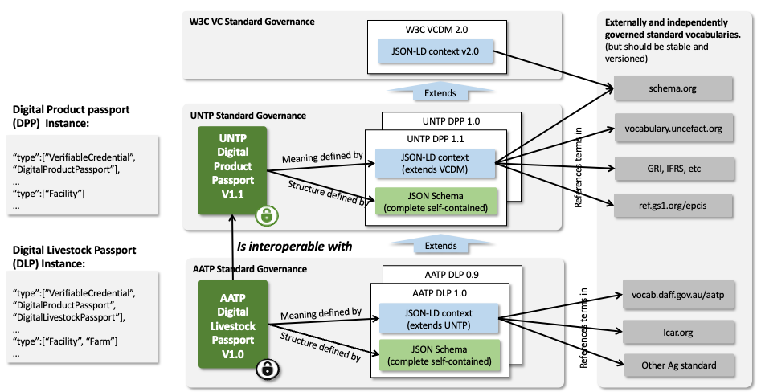

import Disclaimer from '../\_disclaimer.mdx';

<Disclaimer />

## Overview

The World-Wide-Web Consortium (W3C) has defined a [data model for Verifiable Credentials](https://www.w3.org/TR/vc-data-model-2.0/) (VCs). A VC is a portable digital version of everyday credentials like education certificates, permits, licenses, registrations, and so on. VCs are digitally signed by the issuing party and are tamper evident, privacy preserving, revocable, and digitally verifiable. The UN has previously assessed this standard and has recommended its use for a variety of cross border trade use cases in a recent [white paper](https://unece.org/trade/documents/2023/10/white-paper-edata-verifiable-credentials-cross-border-trade). VCs are inherently decentralized and so are an excellent fit for UNTP which recommends that passports, credentials, and traceability events are all issued as W3C VCs. A related W3C standard called [Decentralized Identifiers (DIDs)](https://www.w3.org/TR/did-core/) provides a mechanism to manage the cryptographic keys used by verifiable credentials and also to link multiple credentials into verifiable trust graphs. DIDs are not the same as the business / product / location identifiers maintained by authoritative agencies - but can be linked to them.

## Business requirements for UNTP application of VCs

Verifiable Credentials technology is one of the key tools in the UNTP anti-green-washing toolbox. But there are many different technical implementation options which presents an interoperability risk - namely that credentials issued by one party will not be understandable or verifiable by another party. UNTP will not design new technical standards as that is the role of technology standards bodies such as W3C or IETF. However, be recommending the use of the narrowest practical set of technical options for a given business requirement, the UNTP can enhance interoperability.

A key design principle that is applicable to decentralized ecosystems such as UNTP recommends is [Postel's robustness principle](https://en.wikipedia.org/wiki/Robustness_principle) which, for UNTP, means that **an implementation should be conservative in its sending (issuing) behavior, and liberal in its receiving (verifying) behavior.** That is because the sustainability evidence that is discovered in any given value chain may be presented as many different versions of W3C VCs, or ISO mDL credentials, or Hyperledger Anoncreds, or as human readable PDF documents. Being as open as possible in what is received and verified will allow sustainability assessments to be made over a wide set of evidence. Conversely, choosing a narrow set of ubiquitous technology options when issuing UNTP credentials such as digital product passports will simplify the task of verifiers and minimise costs for the entire ecosystem.

| ID    | Name           | Requirement Statement                                                                                                                                                                                                                             | Solution Mapping                        |
| ----- | -------------- | ------------------------------------------------------------------------------------------------------------------------------------------------------------------------------------------------------------------------------------------------- | --------------------------------------- |
| VC-01 | Integrity      | VC technology recommendations must support tamper detection, issuer identity verification, and credential revocation so that verifiers can be confident of the integrity of UNTP credentials.                                                     | All VC options support this requirement |
| VC-02 | Compatibility  | VC technology recommendations for issuing UNTP credentials should be as narrow as practical and should align with the most ubiquitous global technology choices so that technical interoperability is achieved with minimal cost                  | [Basic profile](#vcdm-profile)          |
| VC-03 | Human readable | VC technology recommendations must support both human readable and machine readable credentials so that uptake in the supply chain is not blocked by actors with lower technical maturity.                                                        | [Render method](#render-method)         |
| VC-04 | Discovery      | VC technology recommendations must support the discovery and verification of credentials from product identifiers so that verifiers need not have any a-priori knowledge of or relationship to either the issuers or the subjects of credentials. | Presentations                           |
| VC-05 | Semantics      | VC technology recommendations must support the use of standard web vocabularies so that data from multiple independent credentials can be meaningfully aggregated.                                                                                | Vocabularies                            |
| VC-06 | Performance    | VC technology recommendations should value performance so that graphs containing hundreds of credentials of any size can be traversed and verified efficiently.                                                                                   | [Basic profile](#vcdm-profile)          |
| VC-07 | Compliance     | VC technology recommendations must meet any technology based regulatory requirements that apply in the countries in which credentials are issued or verified.                                                                                     | [Basic profile](#vcdm-profile)          |
| VC-08 | Openness       | VC DID method recommendations must not drive users towards closed ecosystems or proprietary ledgers so that there is no network effect coercion towards proprietary ledgers.                                                                      | [DID methods](#did-methods)             |
| VC-09 | Portability    | VC DID method recommendations must allow users (issuers) to move their DID documents between different service providers so that long duration credentials can remain verifiable even when issuers change service providers.                      | [DID methods](#did-methods)             |
| VC-10 | Evolution      | VC technology is evolving and UNTP recommendations must evolve as newer tools and versions become ubiquitous                                                                                                                                      | Roadmap                                 |

## Verifiable Credential Profile

### VCDM profile

The VC basic profile is designed to be as simple, lightweight, and interoperable as possible. A conformant implementation

- MUST implement the [W3C VC Data Model v2.0](https://www.w3.org/TR/vc-data-model-2.0/) using the JSON-LD Compacted Document Form
- MUST implement [W3C VC Bitstring Status List](https://www.w3.org/TR/vc-bitstring-status-list/) for credential status management including revocation
- MUST implement [W3C-DID-CORE](https://www.w3.org/TR/did-core/) using DID methods defined in [DID methods](#did-methods)
- MUST implement the enveloping proof mechanism defined in [W3C VC JOSE / COSE](https://www.w3.org/TR/vc-jose-cose/) with JOSE (Section 3.1.1)

### Render Method

To support uptake across supply supply chain actors with varying levels of technical maturity, human rendering of digital credentials is essential. A conformant implementation

- SHOULD use the `renderMethod` property as defined in the [VC data model](https://www.w3.org/TR/vc-data-model-2.0/).

### Presentations

Verifiable Presentations (VP) are widely used in the verifiable credentials ecosystem to support holders to combine one or more credentials in a digital wallet and then present them for in-person or online verification purposes. The VP is signed by the holder did and so provides a holder binding mechanism. In UNTP supply chain implementations, the subject of most claims is an inanimate object (eg bar-coded goods) and digital credentials about the goods are discovered by any party that has access to the goods. The box of goods does not create verifiable presentations on demand and the binding is to the identity of the goods. A conformant UNTP implementation

- MUST issue and publish product passports, product conformity credentials, and traceability events as verifiable credentials and MUST include the identifier of the goods within the VC subject.
- MAY exchange these and any other credentials as verifiable presentations in wallet-to-wallet transfers or any other method.

## Vocabularies

A shared understanding of the meaning of claims made in verifiable credentials is essential to interoperability. To this end, conformant UNTP implementations

- MUST use the [JSON-LD](https://www.w3.org/TR/vc-data-model/#json-ld) syntax for the representation of data in all issued credentials.
- MUST reference the relevant [UNTP @context](https://test.uncefact.org/vocabulary/untp/home) file for the given credential type. These context files are themselves extensions of the W3C VC Data Model 2.0 context.
- MAY extend credentials with additional properties but, if so, MUST include additional @context file reference that defines the extended properties. The @vocab "catch-all" mechanism MUST NOT be used.
- SHOULD implement widely used industry vocabularies such as [schema.org](https://schema.org/) as a first choice for UNTP extensions requiring terms not in the UN vocabulary.
- MAY use any other published JSON-LD vocabulary for any other industry or country specific extensions.
- MUST maintain @context files at the same granularity and version as the corresponding credential type. This prevents the risk of verification failures when context files change after credentials are issued.
- SHOULD provide a complete and versioned JSON schema for each credential type. This is to facility simple and robust implementations by developers without detailed knowledge of JSON-LD.

The data governance architecture for UNTP credentials is shown below. the key points to note are

- That credential instances contain Verifiable Credential Data Model (VCDM) type references for each uniquely identified linked-data object. Each extension builds upon parent types and is enumerated in the type array (eg `["Facility", "Farm"]`).
- UNTP @context types are `protected` and so MUST not be duplicated in extensions. Similarly UNTP @context does not duplicate `protected` terms in WCDM @context.
- Unlike @context files, the JSON schema for each credential MUST be a complete schema that defines the entire credential including terms from VCDM and UNTP.

## DID methods

The UNTP supports the use of decentralized identifiers (DIDs) to uniquely and verifiably represent organizations, facilities, products, and other actors across global supply chains. These identifiers form the foundation for establishing [Digital Identity Anchors (DIAs)](/docs/specification/DigitalIdentityAnchor), resolving linksets via an [Identity Resolver](/docs/specification/IdentityResolver), and verifying credential issuers and holders.

The [W3C DID Core specification](https://www.w3.org/TR/did-core/) allows for a broad range of DID methods, many of which are registered in the [W3C DID Extensions - DID Methods](https://www.w3.org/TR/did-extensions/#did-methods) registry. However, not all methods offer equivalent levels of verifiability, governance assurance, or operational fit for the UNTP's trust model. It is reasonable to expect that this proliferation of DID methods will consolidate to a much smaller number of methods, each designed to meet specific business needs.

This specification defines guidance on the use of different DID methods within UNTP implementations and extensions. Different DID methods introduce different assumptions about trust anchors, resolution mechanisms, and control guarantees. Some methods rely solely on DNS and HTTPS infrastructure; others incorporate explicit proofs, registries, or governance contracts to strengthen control verification. In UNTP, the choice of DID method directly impacts the integrity of identity resolution and the downstream reliability of linked credentials and services.

This guidance supports implementers in selecting DID methods that align with the UNTP's goals of transparency, decentralization, and verifiability while also providing a foundation for consistent resolver behavior across the ecosystem. As the specification evolves, additional methods may be assessed and incorporated through working group consensus, taking into account the ongoing evolution of the DID method landscape reflected in the [W3C DID Extensions - DID Methods](https://www.w3.org/TR/did-extensions/#did-methods) registry.

### Acknowledged DID methods

The following DID methods are acknowledged by the UNTP specification as having been assessed for their suitability, governance characteristics, and alignment with UNTP requirements. A method is "acknowledged" when it has been evaluated by the UNTP working group and determined to offer appropriate levels of verifiability, governance assurance, or operational fit for specific UNTP use cases.

The list of acknowledged methods, their implementation requirements, and status recommendations are subject to ongoing evaluation and revision as the UNTP specification evolves. As new DID methods emerge, mature, or demonstrate enhanced capabilities, they may be added to this list through working group consensus. Similarly, requirements and guidance for existing methods may be updated based on implementation experience and ecosystem developments.

### `did:web`

The `did:web` method enables identifiers to be derived from domain names and resolved via well-known HTTPS endpoints. It is widely supported and simple to implement, relying on the existing DNS and TLS infrastructure to bind identifiers to hosting environments.

Within the UNTP framework, `did:web` offers a pragmatic entry point for identity publication and resolution. Its structure is compatible with the Digital Identity Anchor model, and can be used to expose service endpoints, credential metadata, and other linkable assets.

However, `did:web` relies on implicit trust in domain ownership and HTTPS hosting. It does not, by itself, provide strong or auditable guarantees of control — particularly in shared hosting environments, federated platforms, or supply chains involving resellers and intermediaries. Its use is sensitive to domain expiration, certificate mismanagement, and untracked delegation.

UNTP implementations MAY use `did:web` where simplicity and broad interoperability are prioritized, and where trust in domain ownership is independently verified.

#### Implementation requirements for `did:web`

A conformant UNTP implementation:

- MUST implement the [`did:web` method](https://w3c-ccg.github.io/did-method-web/) as an Organizational Identifier
- SHOULD implement the `did:web` method using the web domain of the issuer to avoid portability challenges

| Field                                | Description                                                                                                                                                                                                                                                                                                                                 |
| ------------------------------------ | ------------------------------------------------------------------------------------------------------------------------------------------------------------------------------------------------------------------------------------------------------------------------------------------------------------------------------------------- |
| Method Name                          | `did:web`                                                                                                                                                                                                                                                                                                                                   |
| Identifier Syntax                    | `did:web:<domain>` or `did:web:<domain>:<path>`.                                                                                                                                                                                                                                                                                            |
| Status                               | ✅ Recommended — widely interoperable and suitable for institutional and organizational identifiers.                                                                                                                                                                                                                                        |
| Governance / Issuing Organisation    | W3C-registered DID method maintained by the Decentralized Identity Foundation (DIF) and the W3C community.                                                                                                                                                                                                                                  |
| Resolver(s) / Resolution Endpoint(s) | Well-known HTTPS endpoints (typically `/.well-known/did.json` or `/did.json`), resolved via DNS and TLS infrastructure.                                                                                                                                                                                                                     |
| Use Case(s) in UNTP                  | Organizational identifiers, Digital Identity Anchors, identity publication and resolution. Compatible with exposing service endpoints, credential metadata, and other linkable assets. Suitable where simplicity and broad interoperability are prioritized.                                                                                |
| Advantages / Key Features            | Widely supported and simple to implement. Relies on existing DNS and TLS infrastructure, making it accessible and easy to adopt. Compatible with the Digital Identity Anchor model. Provides a pragmatic entry point for identity publication and resolution.                                                                               |
| Known limitations or considerations  | Relies on implicit trust in domain ownership and HTTPS hosting. Does not provide strong or auditable guarantees of control, particularly in shared hosting environments, federated platforms, or supply chains involving resellers and intermediaries. Sensitive to domain expiration, certificate mismanagement, and untracked delegation. |
| Implementation Notes                 | MUST be implemented as an Organizational Identifier. SHOULD be implemented using the web domain of the issuer to avoid portability challenges. Requires independent verification of domain ownership.                                                                                                                                       |
| Remarks                              | Entry point for identity publication and resolution within the UNTP framework. Suitable for institutional and organizational identifiers where trust in domain ownership is independently verified.                                                                                                                                         |

### `did:webvh`

The `did:webvh` method extends the widely used `did:web` approach by introducing verifiable history, enabling tamper-evident tracking of identifier updates over time. It allows organizations to maintain a cryptographically linked log of key rotations, control changes, and migrations across domains, providing strong assurances of authenticity and continuity.

Within the UNTP, `did:webvh` is recommended for institutional and organizational identifiers where auditability, long-term trust, and accountability are required, such as [Digital Identity Anchors](/docs/specification/DigitalIdentityAnchor), credential issuers, or registry maintainers. While it retains the accessibility of web-based publishing via HTTPS, it adds a transparent, verifiable chain of control that aligns with UNTP's principles of traceability, integrity, and transparency.

| Field                                    | Description                                                                                                                                                                                                                                                                                                                                                                                                                |
| ---------------------------------------- | -------------------------------------------------------------------------------------------------------------------------------------------------------------------------------------------------------------------------------------------------------------------------------------------------------------------------------------------------------------------------------------------------------------------------- |
| **Method Name**                          | `did:webvh`                                                                                                                                                                                                                                                                                                                                                                                                                |
| **Identifier Syntax**                    | `did:webvh:<domain>` or `did:webvh:<domain>:<path>`. Resolved via HTTPS to a `did.jsonl` (JSON Lines) file containing a verifiable chain of DID document versions.                                                                                                                                                                                                                                                         |
| **Status**                               | ✅ **Recommended (Advanced)** — suitable for institutional, organizational, and delegated identifiers requiring verifiable history, key rotation, and auditability.                                                                                                                                                                                                                                                        |
| **Governance / Issuing Organisation**    | Maintained by the **Decentralized Identity Foundation (DIF)** as an extension of the W3C-registered `did:web` method. Defined in the [DIF DID Web Verifiable History specification](https://identity.foundation/didwebvh).                                                                                                                                                                                                 |
| **Resolver(s) / Resolution Endpoint(s)** | HTTPS endpoints hosting a `did.jsonl` log file, typically located at `/.well-known/did.jsonl` or a specified path under the domain. Resolution involves verifying a chain of cryptographically linked versions (`previousVersionHash` + proof) to produce a tamper-evident DID Document history.                                                                                                                           |
| **Use Case(s) in UNTP**                  | Recommended for **Digital Identity Anchors** and **institutional identifiers** requiring auditability, traceability, and long-term trust. Enables transparent verification of key rotations, ownership transfers, and historical control of identities within supply chains. Supports continuity of identity even when domains change, ensuring transparent migration records for verifiable data sources.                 |
| **Advantages / Key Features**            | Extends `did:web` with **verifiable, append-only history** of updates. Enables tamper-evident key rotation, continuity of trust, and portability between domains. Provides an immutable audit trail of identifier control, supporting UNTP principles of transparency and accountability. Backward compatible with existing `did:web` resolvers when version history is ignored.                                           |
| **Known Limitations or Considerations**  | Still relies on HTTPS hosting and DNS domain ownership; subject to availability and correct domain management. Implementation is more complex due to the requirement to maintain and publish a valid `did.jsonl` chain. Requires careful management of key rotation and chain integrity. Historical transparency may expose metadata about operational changes — privacy implications should be assessed per use case.     |
| **Implementation Notes**                 | MUST be implemented where **auditability of identity control** is required (e.g., accredited data publishers, credential issuers). SHOULD maintain the `did.jsonl` file with proper version linking and proofs (`previousVersionHash` and `proof`). Implementers SHOULD plan for **domain portability** using the `alsoKnownAs` and `newDomain` parameters. Supports pre-rotation and witness confirmation for resilience. |
| **Remarks**                              | Provides a **tamper-evident, verifiable history** of identity updates aligned with UNTP's principles of transparency and accountability. Recommended where traceability and provenance of identity control are important — for example, in managing registries, conformance issuers, or long-lived supply chain identifiers. Offers a bridge between web-based and verifiable, history-aware identity ecosystems.          |

### Registry template

| Field                                | Description |
| ------------------------------------ | ----------- |
| Method Name                          | ...         |
| Identifier Syntax                    | ...         |
| Status                               | ...         |
| Governance / Issuing Organisation    | ...         |
| Resolver(s) / Resolution Endpoint(s) | ...         |
| Use Case(s) in UNTP                  | ...         |
| Advantages / Key Features            | ...         |
| Known limitations or considerations  | ...         |
| Implementation Notes                 | ...         |
| Remarks                              | ...         |

## Roadmap

Future versions of this specification will

- Provide richer guidance on DID methods via a decision tree that helps to select the right method for the right purpose
- Address the proliferation of DID methods and their consolidation to meet specific business needs
- Provide guidance for different use cases (e.g., legal entities vs products)
- Provide guidance on selective redaction methods to better support confidentiality goals
- Provide timelines for transition between versions of technical specifications
