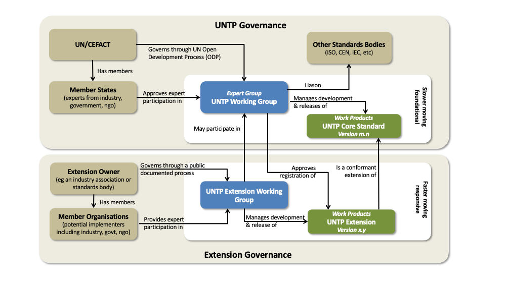
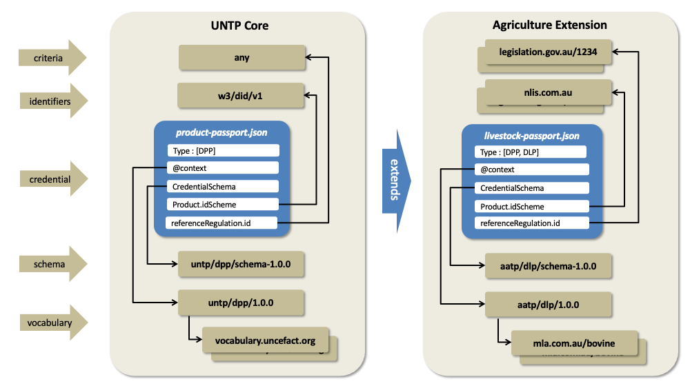

import Disclaimer from '../\_disclaimer.mdx';

<Disclaimer />

**_Normative_**

## Overview

UNTP is designed as a common core that is usable by any industry sector or in any regulatory jurisdiction. This extensions methodology describes how to extend UNTP to meet the specific needs of any industry sector or regulated market in such a way that the extension maintains core interoperability with any other extension. This cross-industry and cross-border interoperability is a core value of UNTP because almost every value chain will cross industry and/or national borders.


In some cases, UNTP extensions are themselves UN projects - such as the extensions defined by the [UN critical raw materials traceability and transparency project](https://uncefact.github.io/project-crm/). In most cases however, industry sectors and/or national projects will govern their own extensions.

Anyone can take UNTP and extend it for any purpose. But for the extension to be registered as UNTP conformant, an extension MUST remain interoperable with UNTP. This is achieved by following the governance, methodology, and testing processes described below.

## Extension Governance

As shown in the diagram below, UNTP development follows the UN/CEFACT Open Development Process (ODP) and is maintained by a group of experts that are approved by their member state delegate. UNTP Intellectual Property is owned by the UN and the standard is available free for anyone to use. There are formal liaisons with other standards bodies including ISO so that UNTP remains aligned with similar initiatives.



Registered UNTP extensions

- MUST follow an open and transparent development process that is open to participation from representative persons and organisations.
- MUST be freely available under a permissive or creative commons license.
- MUST be version managed (major.minor) and each extension version MUST state which UNTP major version from which it is derived.
- MUST be documented as a public website with reference-able URI for each specification component.

Since registered extensions have a clear vested interest in the ongoing development of UNTP, extension groups SHOULD nominate at least one member as a participant in the UNTP Technical Working Group.

## Extension Methodology

UNTP extensions must be interoperable with UNTP core. This means that a credential that conforms to a UNTP extension is also conformant with UNTP core. This requirement ensures that credentials issued in a specific industry or geographical context are still understandable across industry or geographic boundaries.



### Schema Extensions

UNTP credential JSON schema allow additional properties in most objects to provide flexibility to accommodate industry extensions.

**Core Principles:**

1. **Additive, Not Redefining**

   - Extensions MAY add new properties
   - Extensions MUST NOT change existing UNTP core properties
   - Extensions MUST NOT remove core properties

2. **Dual Validation**

   - Extension instances MUST validate against extension schema
   - Extension instances MUST validate against UNTP core schema
   - Both validations must pass

3. **Multiple Variants**
   - Extensions MAY define multiple credential variants
   - Example: Agriculture extension defines both livestock passport AND horticulture passport
   - Each variant extends the same UNTP core credential type

**Example: Adding Battery-Specific Properties**

**UNTP Core Digital Product Passport** (simplified):

```json
{
  "@context": ["https://www.w3.org/ns/credentials/v2",
               "https://test.uncefact.org/vocabulary/untp/dpp/0.6.0/"],
  "type": ["VerifiableCredential", "DigitalProductPassport"],
  "credentialSubject": {
    "product": {
      "name": "Product Name",
      "description": "Product description",
      "category": {...}
    }
  }
}
```

**Battery Extension Adds Specific Properties**:

```json
{
  "@context": [
    "https://www.w3.org/ns/credentials/v2",
    "https://test.uncefact.org/vocabulary/untp/dpp/0.6.0/",
    "https://battery-extension.org/context/1.0/"
  ],
  "type": ["VerifiableCredential", "DigitalProductPassport", "BatteryPassport"],
  "credentialSubject": {
    "product": {
      "name": "Lithium-ion Battery Cell",
      "description": "High-density battery cell for EVs",
      "category": {...},
      "batterySpecifications": {
        "capacity": {"value": 75, "unit": "kWh"},
        "chemistry": "NMC811",
        "voltage": {"value": 400, "unit": "V"}
      }
    }
  }
}
```

### Vocabulary Extensions

Industry extensions will often leverage existing industry specific vocabularies. For example an agriculture extension may reference terms from [Codex Alimentarius](https://www.fao.org/fao-who-codexalimentarius/en/). This is achieved through JSON-LD @context files.

- Each credential defined by a UNTP extension MUST reference a JSON-LD @context file that defines all additional terms.
- JSON-LD @context files defined by a UNTP extension MUST NOT redefine terms in the corresponding UNTP @context file.
- External vocabularies referenced by UNTP extensions SHOULD be stable, version managed, and should not delete terms.

### Identifier Schemes

UNTP and it's extensions have a dependency on resolvable and verifiable identifiers. Industry extension will typically define specific identifier schemes (for products, facilities, and organisations) that are relevant for the specific industry and/or geography. For example, Australian livestock are identified by a [National Livestock Identifier](https://www.nlis.com.au/) that is carried as an RFID tag in the animal's ear.

- All identifier schemes used by registered UNTP extensions MUST be registered in the UNTP identifier scheme register.
- Identifiers used by UNTP extensions SHOULD be resolvable and verifiable as defined by the UNTP Identity Resolver specification.

### Conformity Criteria

UNTP is deliberately agnostic of specific standards and regulations. The generic `Declaration` object that is used by DPP, DFR, and DCC credentials is designed to support any conformity criteria defined by any standard or regulation. UNTP extensions, however, will normally agree a specific set of standards and regulations that are applicable in the extension context.

- UNTP extensions MUST list all relevant standards and regulations on the extension specification website.
- The specific conformity criteria within Standards and Regulations referenced by UNTP extensions SHOULD be reference-able as stable URIs.

## Extension Conformity Testing

Extension conformity testing ensures that:

- Extension credentials validate against both extension schema AND UNTP core schema
- Extension maintains interoperability with UNTP core
- Extension credentials are readable by other extensions
- Extension follows all methodology requirements

**Level 1: Schema Validation**

- Extension schema files MUST validate as proper JSON Schema
- Extension instances MUST validate against extension schema
- Extension instances MUST validate against corresponding UNTP core schema
- No validation errors allowed

**Tools**: Use UNTP Schema Validator at https://test.uncefact.org/test-untp-playground

**Level 2: Interoperability Testing**

- Extension credentials MUST be processable by UNTP core-compliant systems
- Extension-specific properties MUST NOT break core processing
- Extension credentials MUST render using UNTP generic rendering templates
- Credentials MUST be verifiable using standard VC verification libraries

**Tools**: Use UNTP Interoperability Test Suite at https://test.uncefact.org/

**Level 3: Cross-Extension Testing** (Recommended, not required)

- Test credential exchange with other registered extensions
- Verify supply chain data flows across extension boundaries

**Conformance Criteria**

To achieve UNTP conformance registration, extensions must:

- ✓ Pass all Level 1 schema validation tests
- ✓ Pass all Level 2 interoperability tests
- ✓ Provide test report documenting results
- ✓ Include minimum 2 example credentials for each extension type
- ✓ Publish test cases on extension website

---

## Key Terms and Concepts

**JSON Schema**: A standard format for describing the structure and validation rules for JSON data.

**JSON-LD (JSON Linked Data)**: A method of encoding linked data using JSON. The @context file maps terms to URLs.

**@context file**: A JSON-LD file that defines the meaning of terms used in credentials.

**Verifiable Credential (VC)**: A tamper-evident credential with authorship that can be cryptographically verified.

**Schema Validation**: The process of checking whether a data instance conforms to schema rules.

**Interoperability**: The ability of different systems to exchange and use information.

**Identity Resolver**: A system that translates an identifier into a URL where information can be found.

**Conformity Criteria**: Specific requirements from standards or regulations that products/facilities must meet.

**Namespace**: A way to group related properties together to avoid naming conflicts.

**Extension Instance**: An actual credential (data) that follows an extension schema.

---
